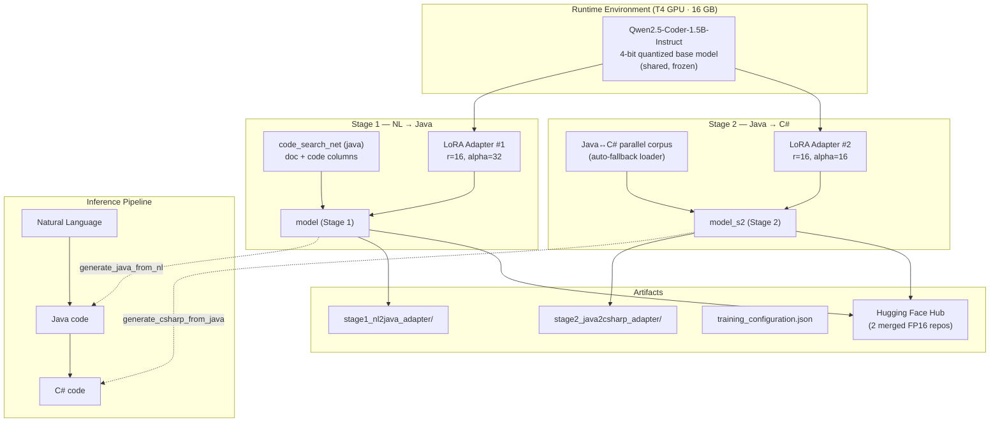
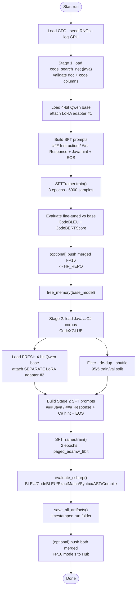
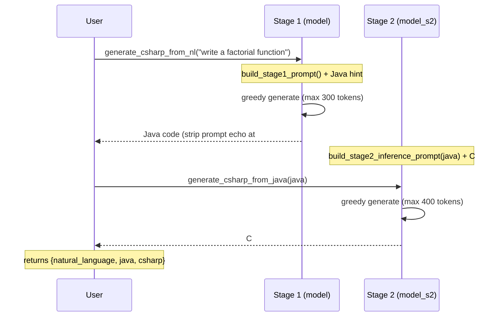
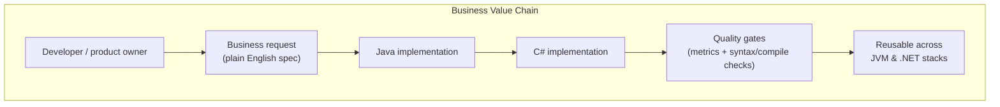
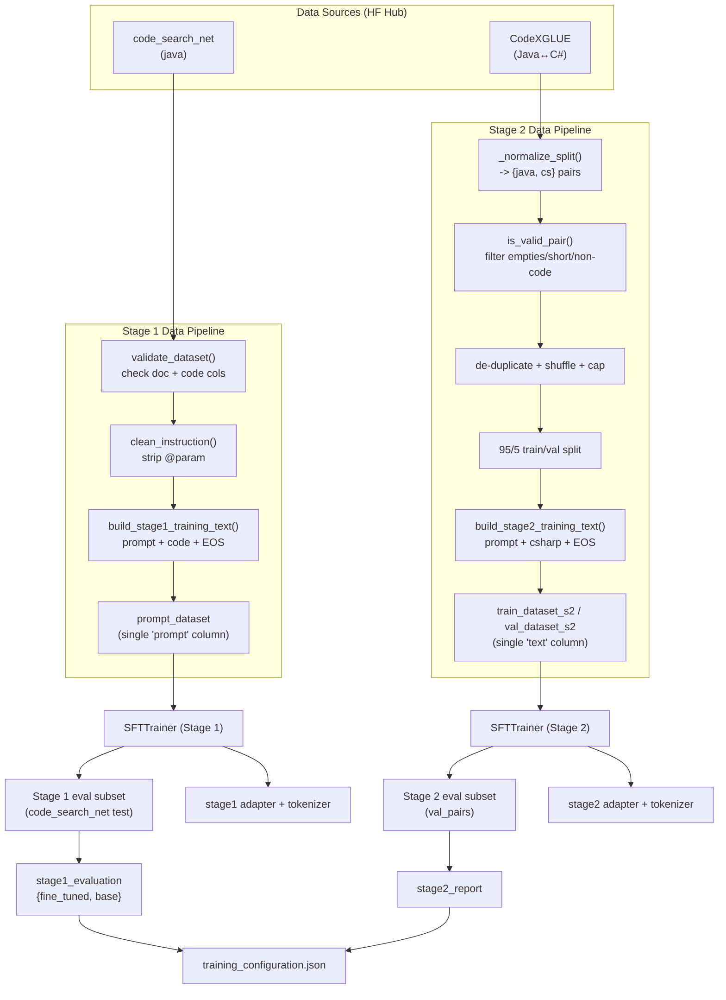
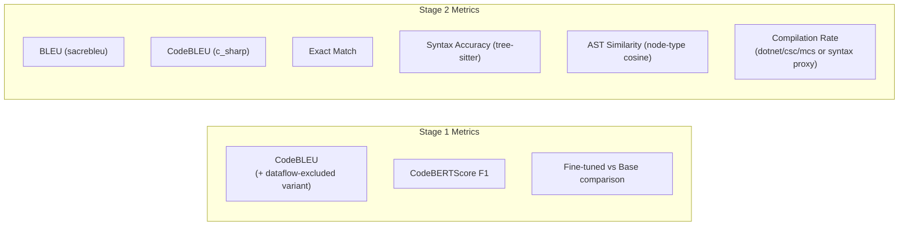

# Architecture & Data Flow — NL → Java → C# Code Generation

**Source notebook:** [nl-java-c-final-working.ipynb](nl-java-c-final-working.ipynb)
**Reference package:** [codegen_pipeline/](codegen_pipeline/) (modular Python reimplementation; see Section 11)
**Base model:** `unsloth/Qwen2.5-Coder-1.5B-Instruct-bnb-4bit` (4-bit quantized)
**Technique:** Two-stage parameter-efficient fine-tuning (PEFT / LoRA)
**Target hardware:** Single NVIDIA T4 GPU (~16 GB VRAM) — Kaggle / Google Colab

---

## 1. Executive Summary

This project turns `Qwen2.5-Coder-1.5B` into a **two-stage code generator** that converts a
plain-English request first into **Java** and then into **C#**. Each stage is an independent
LoRA adapter trained on top of the *same* frozen 4-bit base model, so the two adapters never
interfere with each other.

```
Natural Language --(Stage 1 adapter)--> Java --(Stage 2 adapter)--> C#
```

| Stage | Task | Dataset | Adapter target |
|-------|------|---------|----------------|
| 1 | Natural Language → Java | `code_search_net` (java) | LoRA adapter on `model` |
| 2 | Java → C# | CodeXGLUE (auto-fallback) | separate LoRA adapter on `model_s2` |

---

## 2. High-Level Architecture



### Key architectural decisions

- **Shared frozen base, separate adapters.** Both stages load the same 4-bit Qwen base model but
  each attaches its *own* LoRA adapter. Stage 2 loads a **fresh** copy (`model_s2`) so the Stage 1
  adapter (`model`) is never modified.
- **Sequential, not fused.** Because the two adapters solve different tasks and run one after the
  other, they cannot be merged into a single set of weights — they are published to **two separate
  Hub repos**.
- **Memory-first design.** 4-bit quantization, FP16, gradient checkpointing (`unsloth`), and 8-bit
  paged optimizers keep the whole pipeline inside a single T4's ~16 GB VRAM.
- **Format parity.** The exact same prompt template is used for both training *and* inference in
  each stage, eliminating train/inference drift.
- **Graceful degradation.** Every major stage is wrapped in structured logging + exception handling;
  optional dependencies (CodeBLEU, CodeBERTScore, C# compiler) are imported lazily and fall back to
  proxies when missing.

---

## 3. Notebook Section → Component Map

| Section | Component | Purpose |
|---------|-----------|---------|
| 1–2 | Dependencies & Imports | Unsloth, HF stack, PEFT, bitsandbytes, evaluation metrics |
| 3 | `Config` (`CFG`) | Immutable single source of truth for all tunable values |
| 4 | Logging / seeding / utilities | `configure_logging`, `set_global_seed`, `log_gpu_info`, `free_memory` |
| 5 | Stage 1 dataset | `load_code_dataset`, `validate_dataset` |
| 6 | Stage 1 model | `load_base_model` (4-bit via Unsloth) |
| 7 | Stage 1 LoRA | `configure_lora` |
| 8 | Stage 1 prompts | `build_stage1_prompt`, `build_stage1_training_text` |
| 9 | Stage 1 training | `SFTTrainer` (`create_stage1_trainer`, `train_stage1`) |
| 10 | Stage 1 inference | `generate_java_from_nl`, `_run_generation` |
| 11 | Stage 1 evaluation | `compute_code_metrics` (CodeBLEU + CodeBERTScore, fine-tuned vs base) |
| 12 | Stage 1 publish | `get_hf_token`, `push_to_hub_merged` |
| 13 | Stage 2 dependencies | sacrebleu, nltk, evaluate, tree-sitter-c-sharp |
| 14 | Stage 2 dataset | `load_java_csharp_dataset` (auto-fallback) |
| 15 | Stage 2 prompts | `build_stage2_inference_prompt`, `build_stage2_training_text`, cleaning/split |
| 16 | Stage 2 model + LoRA | fresh `model_s2` + separate adapter |
| 17 | Stage 2 training | version-tolerant `build_sft_config` / `build_sft_trainer` |
| 18 | Chained inference | `generate_csharp_from_java`, `generate_csharp_from_nl` |
| 19 | Stage 2 evaluation | `evaluate_csharp` (BLEU, CodeBLEU, ExactMatch, Syntax, AST, Compilation) |
| 20 | Save artifacts | `save_all_artifacts` (timestamped run folder) |
| 21 | Publish both stages | merge FP16 + push to two Hub repos |

---

## 4. Training Flow (Build-Time)



### Stage 1 training details
- **Dataset:** `code_search_net` java split, first `STAGE1_TRAIN_SAMPLES = 5000` examples.
- **Input columns:** `func_documentation_string` (instruction) → `func_code_string` (target).
- **Prompt:** `### Instruction:\n\n{doc + " Write the solution in Java."}\n\n### Response:\n\n{code}{EOS}`
- **Hyperparameters:** 3 epochs, batch 4 × grad-accum 4 (eff. 16), LR 2e-5, FP16, seed 3407.
- **LoRA:** r=16, alpha=32, dropout=0, targets q/k/v/o + gate/up/down projections.

### Stage 2 training details
- **Dataset:** first successful of CodeXGLUE, normalized to `{java, cs}`.
- **Cleaning:** drop empty/short/non-code pairs, de-duplicate, cap at `STAGE2_MAX_SAMPLES = 6000`.
- **Prompt:** `### Instruction ... ### Java\n{java}\n\n### Response\n{csharp}{EOS}`
- **Hyperparameters:** 2 epochs, batch 2 × grad-accum 4 (eff. 8), LR 2e-4, cosine schedule,
  warmup 0.03, weight-decay 0.01, `paged_adamw_8bit`, gradient checkpointing, FP16.
- **LoRA:** r=16, alpha=16 (separate adapter).

---

## 5. Inference Flow (Run-Time)



### Public inference API

| Function | Signature | Description |
|----------|-----------|-------------|
| `generate_java_from_nl(prompt)` | NL → Java | Stage 1 only |
| `generate_csharp_from_java(java)` | Java → C# | Stage 2 only |
| `generate_csharp_from_nl(prompt)` | NL → Java → C# | Full chained pipeline; returns both intermediates |

All three reuse the shared greedy `_run_generation` primitive and the same prompt builders used at
training time, guaranteeing format parity.

---

## 6. Business Flow



**Problem addressed:** Teams that maintain parallel JVM (Java) and .NET (C#) codebases repeatedly
re-implement the same logic in two languages, which is slow and error-prone.

**Solution delivered by this notebook:**
1. A **domain expert describes intent in natural language** — no need to hand-write Java first.
2. **Stage 1** produces an idiomatic Java implementation.
3. **Stage 2** translates that Java into equivalent C#, covering both target ecosystems from one request.
4. **Automated quality gates** (CodeBLEU, CodeBERTScore, BLEU, exact-match, syntax accuracy, AST
   similarity, compilation rate) provide objective confidence before the output is trusted.
5. **Publishable, versioned artifacts** (adapters + merged models on the Hub) make the capability
   reusable and reproducible across teams.

**Business benefits**
- Faster cross-language delivery (one NL request → two languages).
- Consistency between Java and C# implementations of the same logic.
- Cheap to run/host — a 1.5B 4-bit model fits on a single commodity T4 GPU.
- Reproducible and auditable via seeded runs, structured logs, and saved configuration/metrics.

---

## 7. Data Flow (End-to-End)



### Data transformations by stage

**Stage 1 (NL → Java)**
1. Load `code_search_net` java split.
2. Validate presence & non-emptiness of `func_documentation_string` and `func_code_string`.
3. `clean_instruction()` — take javadoc text up to the first `@param`.
4. `add_java_hint()` — append "Write the solution in Java." unless already present.
5. Assemble `### Instruction / ### Response` text + EOS (batched map, drop all other columns).

**Stage 2 (Java → C#)**
1. Try dataset candidates in order; `_normalize_split()` auto-detects `java`/`cs` columns.
2. `is_valid_pair()` — keep non-empty, ≥10-char, brace/semicolon-containing pairs.
3. De-duplicate on `(java, cs)`, shuffle (seeded), cap at 6000.
4. 95/5 train/validation split (validation bounded to ≤20% of pool).
5. Assemble `### Java / ### Response` text + EOS into a single `text` column.

---

## 8. Evaluation & Quality Gates



- **Stage 1** compares the fine-tuned adapter against the untuned base model. A **dataflow-excluded
  CodeBLEU** is also reported because the dataflow component can be spuriously inflated on short/
  degenerate base-model output.
- **Stage 2** reports six metrics. **Compilation Rate** uses a real C# compiler when available,
  otherwise transparently falls back to a **tree-sitter syntax-validity proxy** (clearly labelled).

---

## 9. Output Artifacts

Saved into a **timestamped** run folder `CFG.SAVE_DIR/run_<timestamp>/`:

| Artifact | Contents |
|----------|----------|
| `stage1_nl2java_adapter/` | Stage 1 LoRA adapter + tokenizer |
| `stage2_java2csharp_adapter/` | Stage 2 LoRA adapter + tokenizer |
| `training_configuration.json` | Hyperparameters + Stage 1 & Stage 2 evaluation metrics |

Published to the Hugging Face Hub as two **merged FP16** repos:
- Stage 1 → `CFG.HF_REPO` (`shibsankardhara2/Qwen2.5-Coder-1.5B-NL-Java_V5`)
- Stage 2 → `CFG.HF_REPO_STAGE2` (`shibsankardhara2/Qwen2.5-Coder-1.5B-Java-CSharp_V5`)

---

## 10. Cross-Cutting Concerns

| Concern | Implementation |
|---------|----------------|
| **Reproducibility** | All RNGs (Python, NumPy, Torch, HF) seeded from `CFG.SEED = 3407`; timestamped runs |
| **Observability** | Structured logger (`timestamp \| LEVEL \| name \| message`); GPU memory logged at every stage |
| **Robustness** | Every stage wrapped in try/except with logged, re-raised errors; dataset/config validation guards |
| **Memory management** | `free_memory()` between stages; 4-bit + FP16 + gradient checkpointing + paged optimizer |
| **Version tolerance** | `build_sft_config` filters unknown kwargs; handles `tokenizer`→`processing_class` and `eval_strategy` renames |
| **Config centralization** | Single immutable `CFG` dataclass; no scattered literals |
| **Secret handling** | `get_hf_token()` resolves token from Kaggle secret → env var → Colab → interactive prompt |

---

## 11. Reference Implementation Package (`codegen_pipeline/`)

A modular, production-style Python reimplementation of this same architecture lives in
[codegen_pipeline/](codegen_pipeline/) (see its own [README](codegen_pipeline/README.md)). It
mirrors every notebook component 1:1 as an importable module, orchestrated by a `main.py` CLI
with `train` / `infer` / `evaluate` subcommands, instead of one linear notebook.

| Package module | Notebook equivalent | Responsibility |
|---|---|---|
| `config/config.py` | Section 3 (`CFG`) | Single frozen `Config` dataclass — all hyperparameters/paths |
| `utils/logger.py`, `utils/helpers.py` | Section 4 | Structured logging, seeding, GPU/memory helpers |
| `utils/io_utils.py` | Sections 12, 20 | `get_hf_token`, JSON save/load |
| `data/dataset.py` | Sections 5, 14 | `load_code_dataset`, `load_java_csharp_dataset`, `validate_dataset` |
| `data/prompt_templates.py` | Sections 8, 15 | Shared training/inference prompt builders for both stages |
| `data/preprocessing.py` | Sections 8, 15 | Cleaning/dedup/splitting + prompt-column construction |
| `models/model_loader.py` | Sections 6–7, 16 | `load_base_model`, `configure_lora` (Unsloth 4-bit) |
| `models/train_java_model.py` | Section 9 | Stage 1 `SFTTrainer` pipeline (`train_stage1`) |
| `models/train_translation_model.py` | Section 17 | Stage 2 `SFTTrainer` pipeline (`train_stage2`) |
| `inference/pipeline.py` | Sections 10, 18 | `CodeGenPipeline` — loads fine-tuned models only, exposes chained NL→Java→C# generation |
| `evaluation/metrics.py`, `codebleu.py`, `compile_validation.py` | Section 11, 19 | BLEU/Exact Match, CodeBLEU/CodeBERTScore, Syntax/AST/Compilation Rate |
| `evaluation/evaluate.py` | Sections 11, 19 | Orchestrates predictions + full metric report (`run_full_evaluation`) |
| `main.py` | — (new) | CLI entry point: `python main.py train\|infer\|evaluate` |

### CLI usage

```bash
cd codegen_pipeline
python main.py train --stage both
python main.py infer "write a function to check if a number is prime"
python main.py evaluate
```

### Deliberate divergences from the notebook

- **Single-dataset Stage 2 loading.** `data/dataset.py`'s `load_java_csharp_dataset()` no longer
  tries CodeXGLUE; it loads only
  `google/code_x_glue_cc_code_to_code_trans` (CodeXGLUE-Java-CS) directly and raises on failure —
  no silent fallback.
- **Fully decoupled inference.** `inference/pipeline.py` only imports `models.model_loader` (never
  `models.train_*`), so running `main.py infer` never pulls in training-only dependencies.
- **Dual adapter persistence per stage.** Each stage's `SFTConfig.output_dir`
  (`CFG.STAGE1_OUTPUT_DIR` / `CFG.STAGE2_OUTPUT_DIR`, under `./checkpoints/`) holds the raw Trainer
  checkpoint, while `train_stage1()` / `train_stage2()` additionally save the final adapter +
  tokenizer under `CFG.SAVE_DIR` (`./saved_models/stage1_nl2java_adapter`,
  `./saved_models/stage2_java2csharp_adapter`) — there is no notebook-style timestamped
  `training_configuration.json`; `evaluate.py` returns its report as a plain dict for the CLI to
  print/redirect to a file.
- **Evaluation sample sizes are explicit config fields**: `CFG.EVAL_SAMPLES = 100` (Stage 1),
  `CFG.STAGE2_EVAL_SAMPLES = 50` (Stage 2), vs. inline literals in the notebook.
- **CodeBLEU dataflow-excluded variant is Stage-1-only** (`compute_code_metrics` in
  `evaluation/codebleu.py`); Stage 2's `evaluate_stage2_predictions` reports plain `CodeBLEU` only,
  matching the notebook's six-metric Stage 2 report.
