# RepoCoder Studio
# Unified Multimodal Code Intelligence Framework  
## Engineering Design Specification

**Project:** RepoCoder Studio – Combined Stage  
**Document Type:** Engineering Design Specification  
**Version:** 1.0  
**Author:** Anupa Viswanath  
**Status:** Frozen design baseline for implementation  

---

## Revision History

| Version | Status | Description |
|---|---|---|
| 0.1 | Draft | Initial combined-stage architecture exploration |
| 0.5 | Draft | Added XLCoST + TransCoder corpus strategy, validation, repair, and multi-task training |
| 0.8 | Draft | Replaced raw AST comparison with CSR and added Trusted Test Suite |
| 1.0 | Frozen | Publication-ready implementation specification (editorially finalized) |

---

## Table of Contents

1. [Project Scope](#1-project-scope)  
2. [System Overview](#2-system-overview)  
3. [Architecture](#3-architecture)  
4. [Engineering Decisions](#4-engineering-decisions)  
5. [Corpus Construction](#5-corpus-construction)  
6. [Corpus Validation](#6-corpus-validation)  
7. [Validation-Oriented Repair](#7-validation-oriented-repair)  
8. [Unified Training Framework](#8-unified-training-framework)  
9. [Evaluation Framework](#9-evaluation-framework)  
10. [Software Architecture](#10-software-architecture)  
11. [Future Extensions](#11-future-extensions)  
12. [Appendices](#12-appendices)

---

## Glossary

| Term | Meaning |
|---|---|
| Candidate Row | Imported corpus row before validation. |
| Candidate Corpus | Unified corpus produced after dataset loading, schema mapping, and deduplication, but before validation. |
| Approved Corpus | Validated corpus used for task generation and training. |
| Rejected Corpus | Rows excluded from training with recorded failure reasons. |
| Trusted Test Suite | Validated logical tests used for execution equivalence checks. |
| CSR | Canonical Structural Representation used for language-independent structural comparison. |
| Teacher Model | Model used for corpus enrichment, NL generation, test generation, and repair. |
| Student Model | Model fine-tuned on the approved corpus. |
| Task Registry | Registry mapping source-target modalities to training prompts. |
| Metric Registry | Registry mapping source-target modalities to applicable evaluation metrics. |
| Demo Mode | Reduced-size run that executes the full pipeline on a smaller sample. |
| Full Mode | Complete run using full configured datasets and production training settings. |

---

# 1. Project Scope

## 1.1 Objective

RepoCoder Studio was initially implemented as three separate stages:

| Stage | Capability |
|---|---|
| Stage 1 | Source Code → Natural Language Documentation |
| Stage 2 | Natural Language → Python Generation |
| Stage 3 | Python → Java Translation |

The separate-stage approach worked for experimentation, but it created separate datasets, separate model adapters, separate preprocessing logic, and separate evaluation pipelines. The Combined Stage replaces that structure with one framework built around a validated multilingual corpus.

The objective of this design is to define a framework that can:

- construct a validated Natural Language–Python–Java corpus,
- generate multiple supervised tasks from the same approved corpus,
- train one multi-task student model,
- evaluate each modality using task-appropriate metrics,
- remain executable in one Colab notebook while preserving a modular production-oriented architecture.

The main design principle is:

> **Corpus quality controls model quality.**

Therefore, the framework prioritizes corpus construction, validation, repair, and auditability before training.

---

## 1.2 Supported Modalities

The first implementation supports three modalities.

| Modality | Description |
|---|---|
| Natural Language | Problem description or code explanation |
| Python | Python source implementation |
| Java | Java source implementation |

The supported tasks generated from these modalities are:

| Task ID | Source | Target |
|---|---|---|
| T1 | Natural Language | Python |
| T2 | Natural Language | Java |
| T3 | Python | Java |
| T4 | Java | Python |
| T5 | Python | Natural Language |
| T6 | Java | Natural Language |

The design does not assume these are the only tasks. New languages and task types should be added through adapters, registries, and validators rather than by redesigning the system.

---

## 1.3 Datasets

The corpus is created from two datasets.

| Dataset | Role | Reason |
|---|---|---|
| XLCoST | Primary corpus | Provides Natural Language, Python, and Java alignment |
| TransCoder | Translation augmentation | Provides additional Python–Java translation diversity |

MBPP and HumanEval are intentionally excluded from corpus construction in this version. They remain useful future evaluation benchmarks, but they are Python-centric and do not naturally provide the multilingual NL–Python–Java structure required for this combined corpus.

---

## 1.4 Deliverables

The Combined Stage produces four categories of artifacts.

### Corpus Artifacts

| Artifact | Description |
|---|---|
| Candidate Corpus | Unified corpus before validation |
| Approved Corpus | Validated corpus used for training |
| Rejected Corpus | Rows excluded from training |
| Duplicate Report | Rows removed during deduplication |
| Corpus Statistics | Dataset size, retention, failure reasons |

### Validation Artifacts

| Artifact | Description |
|---|---|
| Trusted Test Repository | Test suites used for execution validation |
| Validation Report | Per-row validation outcomes |
| Repair History | Per-component repair attempts |
| CSR Records | Canonical structural forms used for comparison |

### Training Artifacts

| Artifact | Description |
|---|---|
| Task-Expanded Dataset | Multi-task instruction dataset |
| LoRA Adapter | Fine-tuned student adapter |
| Training Metrics | Loss, checkpoints, run metadata |
| Training Configuration | Saved config for reproducibility |

### Evaluation Artifacts

| Artifact | Description |
|---|---|
| Prediction Logs | Model generations by task |
| Task Reports | Per-modality metric summaries |
| Overall Report | Combined evaluation view |
| Metric Summary | Aggregated results |

---

## 1.5 Assumptions

| ID | Assumption |
|---|---|
| A1 | XLCoST and TransCoder provide useful but imperfect supervision. |
| A2 | Dataset artifacts may contain incorrect code, wrong alignment, missing NL, duplicate rows, or invalid tests. |
| A3 | Teacher-generated artifacts are also untrusted until validated. |
| A4 | Execution equivalence and CSR similarity provide complementary evidence. |
| A5 | A smaller validated corpus is preferable to a larger noisy corpus. |
| A6 | The framework will later be extended to additional modalities and repository-level tasks. |

---

## 1.6 Constraints

| Constraint | Impact |
|---|---|
| Google Colab execution | Requires demo mode, LoRA, checkpointing, and reduced-memory training |
| Limited GPU resources | Full fine-tuning is not the default approach |
| Cross-language syntax differences | Raw AST comparison is not suitable |
| Dataset quality uncertainty | Validation is mandatory before training |
| Runtime cost of validation and repair | Demo mode must apply to corpus construction, not only training |

---

## 1.7 Non-Goals

The following are not part of the current implementation:

- repository-level RAG,
- IDE integration,
- production inference API,
- distributed training,
- cloud deployment,
- languages beyond Python and Java,
- agentic workflow orchestration.

The design allows these later, but they are not required for the Combined Stage implementation.

---

## 1.8 Success Criteria

The Combined Stage is successful when:

1. XLCoST and TransCoder are converted into a unified Candidate Corpus.
2. Duplicate rows are removed before expensive validation.
3. Missing Natural Language for TransCoder is generated and validated.
4. Python and Java artifacts pass the configured validation pipeline.
5. Failed but recoverable rows are repaired using component-level repair.
6. Only approved rows are used for training.
7. One multi-task student model is fine-tuned using LoRA.
8. Each supported modality is evaluated using registered metrics.
9. All artifacts are saved with configuration and provenance.

---

# 2. System Overview

## 2.1 Pipeline Summary

The framework has three primary phases.

**Figure 2-1. High-Level Pipeline**

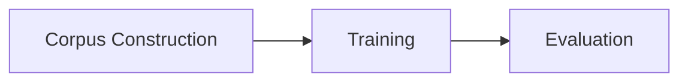

| Phase | Input | Output |
|---|---|---|
| Corpus Construction + Validation | XLCoST, TransCoder | Approved Corpus |
| Training | Approved Corpus | Fine-tuned Model |
| Evaluation | Fine-tuned Model, Approved Test Corpus | Evaluation Reports |

Raw datasets are never used directly during training or evaluation.

---

## 2.2 End-to-End Workflow

**Figure 2-2. End-to-End Framework Flow**

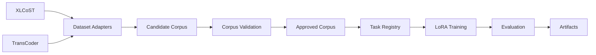

The Approved Corpus is the boundary between data engineering and model training. Every training sample is generated from that corpus only.

---

## 2.3 Core Artifacts by Phase

| Phase | Primary Artifact | Notes |
|---|---|---|
| Dataset loading | Raw records | Dataset-specific |
| Corpus construction | Candidate Corpus | Unified schema |
| Corpus validation | Approved Corpus | Training-ready rows |
| Repair | Repair History | Component-level audit |
| Task generation | Multi-task dataset | One row generates multiple tasks |
| Training | LoRA Adapter | Student model adaptation |
| Evaluation | Reports | Task-specific metrics |

---

# 3. Architecture

## 3.1 Layered Architecture

The system is organized into six layers.

**Figure 3-1. Layered Architecture**

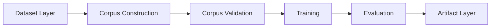

| Layer | Responsibility |
|---|---|
| Dataset Layer | Load XLCoST and TransCoder |
| Corpus Construction | Normalize datasets into Candidate Corpus |
| Corpus Validation | Validate, repair, approve, or reject rows |
| Training | Generate tasks and fine-tune the student model |
| Evaluation | Evaluate model outputs per modality |
| Artifact Layer | Persist data, logs, models, and reports |

---

## 3.2 Layer Interfaces

| Producer | Consumer | Interface |
|---|---|---|
| Dataset Layer | Corpus Construction | Raw dataset records |
| Corpus Construction | Corpus Validation | Candidate Corpus |
| Corpus Validation | Training | Approved Corpus |
| Training | Evaluation | Fine-tuned model |
| Evaluation | Artifact Layer | Evaluation results |
| All layers | Artifact Layer | Logs and outputs |

No layer should bypass the layer before it. Training must not access raw XLCoST or TransCoder rows directly.

---

## 3.3 Data Representations

| Representation | Description |
|---|---|
| Raw Dataset | Original dataset-specific records |
| Candidate Corpus | Unified rows before validation |
| Approved Corpus | Rows accepted for training |
| Task Dataset | Instruction-tuned examples generated from Approved Corpus |
| Evaluation Records | Predictions and metrics |

---

## 3.4 Row Lifecycle

**Figure 3-2. Corpus Row Lifecycle**

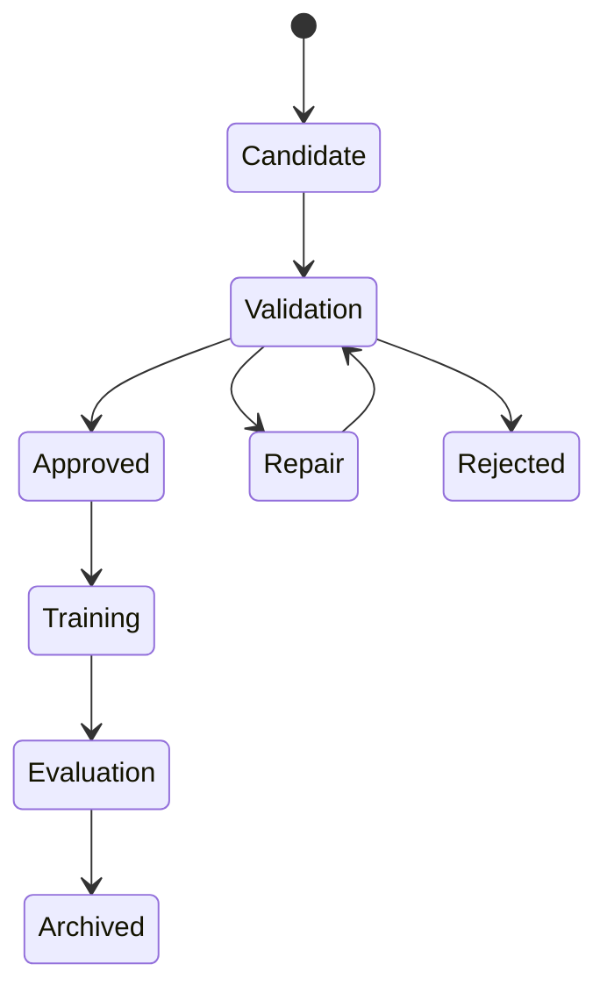

A row cannot enter training unless it reaches `Approved`.

---

## 3.5 Architectural Rules

| Rule | Description |
|---|---|
| R1 | Raw datasets are never used directly for training. |
| R2 | Every training sample originates from the Approved Corpus. |
| R3 | Validation precedes task generation. |
| R4 | Evaluation never modifies the corpus. |
| R5 | Every execution produces a new artifact directory. |
| R6 | Runtime configuration is immutable after execution begins. |
| R7 | Repair modifies only the failed component. |

---

## 3.6 Technology Baseline

| Component | Baseline |
|---|---|
| Development runtime | Google Colab |
| Dataset loading | Hugging Face Datasets or local adapters |
| Student model | Qwen2.5-Coder family |
| Teacher model | Qwen3-Coder or DeepSeek-Coder where available |
| Fine-tuning | LoRA using PEFT |
| Training framework | Transformers |
| Java validation | `javac` |
| Python validation | `ast` and controlled execution |
| Structural comparison | CSR built from language parsers |

Model names remain configuration-driven. The architecture does not depend on a single fixed model.

---

# 4. Engineering Decisions

## 4.1 Decision Summary

| ID | Decision |
|---|---|
| D1 | Build one validated multilingual corpus instead of stage-specific datasets. |
| D2 | Use XLCoST as primary corpus and TransCoder as augmentation. |
| D3 | Treat all imported artifacts as untrusted until validated. |
| D4 | Separate Corpus Construction from Corpus Validation. |
| D5 | Preserve existing Natural Language; generate only missing NL. |
| D6 | Build a Trusted Test Suite before execution validation. |
| D7 | Compare Canonical Structural Representations instead of raw ASTs. |
| D8 | Repair only failed components. |
| D9 | Maintain independent repair budgets per modality. |
| D10 | Train one multi-task student model. |
| D11 | Use registries for datasets, tasks, and metrics. |
| D12 | Select evaluation metrics by source-target modality. |

---

## 4.2 Decision Records

### D1 — Unified Multilingual Corpus

| Field | Description |
|---|---|
| Problem | Previous stages used separate datasets and pipelines. |
| Selected Approach | Build one approved corpus and generate all supported tasks from it. |
| Alternatives | Keep stage-specific datasets; merge all available raw datasets. |
| Reason | Reduces duplicate preprocessing and creates a reusable training asset. |
| Trade-off | Higher upfront corpus construction work. |
| Impact | Approved Corpus becomes the central framework artifact. |

### D2 — XLCoST + TransCoder

| Field | Description |
|---|---|
| Problem | No single dataset gives complete high-quality coverage for every target task. |
| Selected Approach | Use XLCoST as primary, TransCoder as translation augmentation. |
| Alternatives | MBPP, HumanEval, CodeNet. |
| Reason | XLCoST provides NL–Python–Java; TransCoder adds Python–Java diversity. |
| Trade-off | TransCoder requires generated NL. |
| Impact | Corpus Construction must support dataset adapters and missing NL. |

### D3 — All Artifacts Are Candidate Artifacts

| Field | Description |
|---|---|
| Problem | Public datasets can include noisy code, wrong alignment, duplicates, and bad tests. |
| Selected Approach | Validate NL, Python, Java, and tests before acceptance. |
| Alternative | Trust dataset references. |
| Reason | Incorrect supervision harms every downstream task. |
| Trade-off | Validation increases preprocessing time. |
| Impact | Corpus Validation becomes mandatory. |

### D4 — Construction and Validation Separation

| Field | Description |
|---|---|
| Problem | Loading and quality assurance are different responsibilities. |
| Selected Approach | Corpus Construction produces Candidate Corpus; Corpus Validation approves or rejects rows. |
| Alternative | Validate inline during loading. |
| Reason | Cleaner interfaces and easier changes to validation logic. |
| Impact | Candidate Corpus becomes a reusable intermediate artifact. |

### D5 — Generate Only Missing Natural Language

| Field | Description |
|---|---|
| Problem | TransCoder lacks NL; XLCoST already has NL. |
| Selected Approach | Preserve XLCoST NL; generate TransCoder NL. |
| Alternative | Regenerate all NL descriptions. |
| Reason | Avoids replacing useful existing descriptions and reduces runtime. |
| Impact | NL generation is conditional. |

### D6 — Trusted Test Suite

| Field | Description |
|---|---|
| Problem | Execution validation depends on test quality, but dataset tests may be wrong or incomplete. |
| Selected Approach | Build tests from validated dataset tests, rule-based tests, and teacher-generated tests. |
| Alternative | Use dataset tests only or teacher tests only. |
| Reason | Multiple sources reduce single-source test risk. |
| Impact | Execution validation depends on the Trusted Test Builder. |

### D7 — Canonical Structural Representation

| Field | Description |
|---|---|
| Problem | Python and Java raw ASTs are not directly comparable. |
| Selected Approach | Convert both to language-neutral CSR and compare CSR. |
| Alternative | Raw AST similarity. |
| Reason | CSR compares implementation structure rather than syntax. |
| Impact | Structural validation becomes language-independent. |

### D8 — Component-Level Repair

| Field | Description |
|---|---|
| Problem | Whole-row regeneration can discard valid components. |
| Selected Approach | Repair only the failed component: NL, Python, or Java. |
| Alternative | Regenerate entire row after any failure. |
| Reason | Preserves validated information and reduces regeneration cost. |
| Impact | Validation must identify the failed component where possible. |

### D9 — Independent Repair Budgets

| Field | Description |
|---|---|
| Problem | A single row-level retry count can be consumed by one component. |
| Selected Approach | Track repair attempts separately for NL, Python, and Java. |
| Default | Three attempts per component. |
| Reason | Keeps failures isolated by modality. |
| Impact | Repair logs store per-component attempts. |

### D10 — Unified Multi-Task Student Model

| Field | Description |
|---|---|
| Problem | Separate models increase maintenance and deployment complexity. |
| Selected Approach | Train one student model on all registered tasks. |
| Alternative | One model per task. |
| Reason | Shared model supports multi-modal workflows and simpler deployment. |
| Trade-off | Prompt formatting must be consistent. |
| Impact | Task Registry drives dataset expansion. |

### D11 — Registry-Based Architecture

| Field | Description |
|---|---|
| Problem | Hard-coded datasets, tasks, and metrics slow future extension. |
| Selected Approach | Use Dataset, Task, and Metric registries. |
| Reason | New capabilities require registration rather than pipeline redesign. |
| Impact | Framework remains extensible. |

### D12 — Modality-Driven Evaluation

| Field | Description |
|---|---|
| Problem | Different tasks require different correctness criteria. |
| Selected Approach | Choose metrics by source-target pair. |
| Example | Python→Java uses compile/execution/CSR; Python→NL uses semantic text metrics. |
| Impact | Evaluation Matrix becomes the source of truth for metrics. |

---

# 5. Corpus Construction

## 5.1 Responsibility

Corpus Construction converts supported datasets into one common Candidate Corpus.

It does not validate correctness, repair rows, generate missing NL, or create training tasks.

---

## 5.2 Inputs and Outputs

| Input | Source |
|---|---|
| XLCoST | Dataset Layer |
| TransCoder | Dataset Layer |
| Corpus configuration | Configuration Manager |

| Output | Consumer |
|---|---|
| Candidate Corpus | Corpus Validation |
| Duplicate Report | Artifact Manager |
| Corpus Statistics | Artifact Manager |
| Corpus Version | Artifact Manager |

---

## 5.3 Workflow

**Figure 5-1. Corpus Construction Workflow**

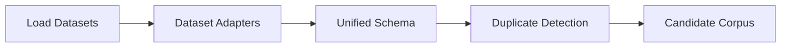

---

## 5.4 Dataset Adapters

Adapters convert dataset-specific rows into the internal schema.

| Dataset | Natural Language | Python | Java | Adapter Action |
|---|---:|---:|---:|---|
| XLCoST | Yes | Yes | Yes | Map all fields |
| TransCoder | No | Yes | Yes | Set `natural_language = null` |

Natural Language for TransCoder is not generated during construction. It is generated during validation after the row passes earlier checks.

---

## 5.5 Candidate Row Contract

| Field | Type | Required | Description |
|---|---|---:|---|
| `corpus_id` | string | Yes | Internal deterministic ID |
| `dataset` | string | Yes | Source dataset name |
| `dataset_record_id` | string | Yes | Original dataset row ID |
| `split` | string | Yes | Source split |
| `natural_language` | string/null | Yes | Existing NL or null |
| `python_code` | string | Yes | Python implementation |
| `java_code` | string | Yes | Java implementation |
| `metadata` | object | Yes | Dataset-specific metadata |
| `provenance` | object | Yes | Processing history |

---

## 5.6 Provenance

Minimum provenance fields:

| Field | Description |
|---|---|
| Dataset | XLCoST or TransCoder |
| Dataset version | Source version |
| Original record ID | Source row |
| Adapter version | Adapter code version |
| Corpus version | Generated corpus version |

Provenance is preserved even if a row is later repaired.

---

## 5.7 Deduplication

Duplicate detection runs before expensive validation.

| Duplicate Type | Action |
|---|---|
| Exact duplicate | Remove duplicate |
| Structural duplicate | Keep one representative |
| Semantic duplicate | Keep |

Semantic duplicates are retained because different implementations of the same algorithm can improve training diversity.

**Figure 5-2. Deduplication Flow**

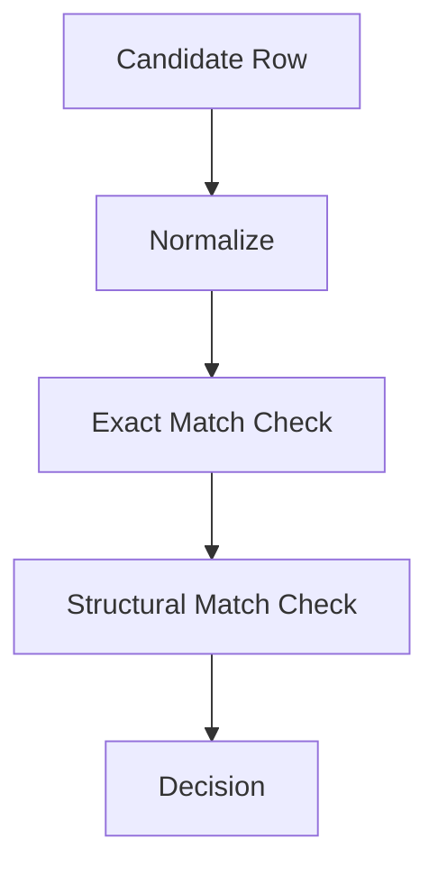

Normalization removes comments, whitespace, formatting, identifiers, and literals depending on the duplicate stage.

---

## 5.8 Execution Modes

| Mode | Corpus Construction |
|---|---|
| Demo | Limit XLCoST and TransCoder row counts |
| Full | Load all configured rows |

Demo mode limits corpus creation, validation, training, and evaluation. It does not skip validation logic.

---

## 5.9 Failure Handling

| Failure | Action |
|---|---|
| Dataset unavailable | Stop execution |
| Unsupported schema | Reject dataset version |
| Missing optional field | Store null |
| Missing required field | Reject record |
| Duplicate found | Remove duplicate and log |

Corpus Construction does not repair rows.

---

## 5.10 Worked Example

| Source | NL | Python | Java | Candidate Row |
|---|---|---|---|---|
| XLCoST | Present | Present | Present | All fields mapped |
| TransCoder | Missing | Present | Present | NL set to null |

After adapter mapping, both rows share the same internal contract. Downstream layers use provenance only when source-specific handling is needed.

---

# 6. Corpus Validation

## 6.1 Responsibility

Corpus Validation decides whether a Candidate Row is suitable for the Approved Corpus.

It validates NL, Python, Java, tests, execution behavior, and structural consistency. It does not train models or generate task datasets.

---

## 6.2 Inputs and Outputs

| Input | Source |
|---|---|
| Candidate Corpus | Corpus Construction |
| Validation configuration | Configuration Manager |
| Teacher Model | Model Manager |

| Output | Consumer |
|---|---|
| Approved Corpus | Training |
| Rejected Corpus | Artifact Manager |
| Trusted Test Repository | Artifact Manager |
| Validation Report | Artifact Manager |
| Repair Requests | Repair Engine |

---

## 6.3 Validation Workflow

**Figure 6-1. Corpus Validation Workflow**

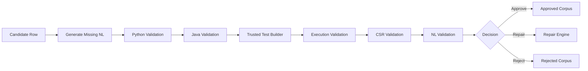

---

## 6.4 Validation Order

| Stage | Purpose | Cost |
|---|---|---|
| Missing NL generation | Complete missing modality | Medium |
| Python validation | Ensure parseable/executable Python | Low |
| Java validation | Ensure compilable Java | Medium |
| Trusted Test Builder | Construct logical tests | Medium |
| Execution validation | Check behavioral equivalence | High |
| CSR validation | Check structural similarity | Medium |
| NL validation | Check description consistency | Medium |

Expensive stages are skipped if prerequisite stages fail.

---

## 6.5 Missing Natural Language

| Dataset | Action |
|---|---|
| XLCoST | Preserve existing NL |
| TransCoder | Generate NL using Teacher Model |

Generated NL is not automatically accepted. It must pass NL validation.

NL generation prompt intent:

```text
Explain what this program does as one concise problem statement.
Do not mention implementation details.
Do not mention Python or Java.
Return only the problem statement.
```

---

## 6.6 Python Validation

| Check | Purpose |
|---|---|
| Syntax parsing | Detect invalid Python |
| Function discovery | Find executable entry point |
| Unsupported construct detection | Avoid unsafe or unsupported execution |

Output:

- `PASS`
- `FAIL`

Failed rows generate a Python repair request.

---

## 6.7 Java Validation

| Check | Purpose |
|---|---|
| Compilation | Verify valid Java |
| Class detection | Ensure executable class structure |
| Method discovery | Locate callable method |
| Wrapper validation | Confirm runnable structure |

Output:

- `PASS`
- `FAIL`

Execution validation is skipped until Java compiles.

---

## 6.8 Trusted Test Builder

Execution equivalence uses logical tests, not language-specific test code.

**Figure 6-2. Trusted Test Construction**

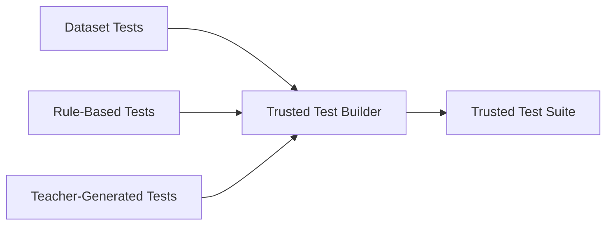

| Test Source | Role |
|---|---|
| Dataset tests | Preserve available examples, if valid |
| Rule-based tests | Add common edge cases |
| Teacher-generated tests | Add semantic coverage |

Dataset tests are validated before use. If dataset tests disagree with stronger evidence, the test is rejected rather than the row.

Trusted Test Suite statuses:

- `trusted`
- `rejected`
- `conflicting`
- `insufficient`

---

## 6.9 Execution Validation

Python and Java are executed against the same logical test specification.

| Logical Test | Python Harness | Java Harness |
|---|---|---|
| Input: `[1,2,3]` | `solve([1,2,3])` | `solve(new int[]{1,2,3})` |

Possible outcomes:

| Outcome | Meaning |
|---|---|
| `PASS` | Equivalent behavior observed |
| `FAIL` | Outputs differ |
| `NOT_FEASIBLE` | Safe automated execution unavailable |

`NOT_FEASIBLE` does not automatically reject a row if other validations pass.

---

## 6.10 Canonical Structural Representation

Raw Python and Java ASTs are not compared directly.

Each implementation is parsed into a language-specific AST and transformed into CSR.

**Figure 6-3. CSR Comparison**

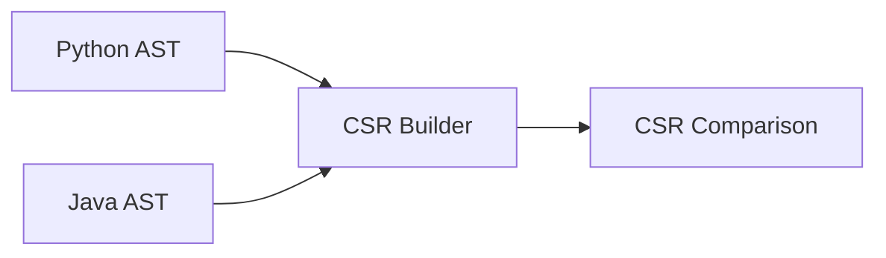

CSR preserves:

- control flow,
- loops,
- branching,
- recursion,
- operators,
- method/function calls,
- return behavior,
- data structure usage.

CSR ignores:

- formatting,
- identifiers,
- literal values,
- imports,
- class wrappers,
- access modifiers,
- language-specific boilerplate.

CSR is supporting structural evidence. It complements execution validation.

---

## 6.11 Natural Language Validation

NL validation checks whether the description matches both implementations.

| Check | Purpose |
|---|---|
| Task consistency | Describes the implemented task |
| Input consistency | Matches parameters/input behavior |
| Output consistency | Matches return/output behavior |
| Algorithm consistency | Avoids describing a different algorithm |
| Code leakage | Avoids source-code-like text in NL |

Failed NL validation generates an NL repair request.

---

## 6.12 Approval Rules

| Validation | Required |
|---|---:|
| Python validation | Yes |
| Java validation | Yes |
| Trusted Test Suite | Yes |
| CSR validation | Yes |
| NL validation | Yes |
| Execution validation | Yes or `NOT_FEASIBLE` |

Execution failure triggers repair. Execution not feasible does not automatically block approval.

---

## 6.13 Failure Handling

| Failure | Action |
|---|---|
| Missing NL | Generate NL |
| Python invalid | Request Python repair |
| Java invalid | Request Java repair |
| Test conflict | Reject bad test or request repair |
| Execution mismatch | Localize failure and repair |
| CSR mismatch | Localize failure and repair |
| NL mismatch | Request NL repair |
| Repair budget exhausted | Reject row |

---

## 6.14 Worked Example

```text
Candidate Row
→ TransCoder row has null NL
→ Generate NL
→ Python parses
→ Java compiles
→ Trusted tests constructed
→ Python and Java outputs match
→ CSR passes threshold
→ NL matches code behavior
→ Row added to Approved Corpus
```

---

# 7. Validation-Oriented Repair

## 7.1 Responsibility

The Repair Engine recovers rows that fail validation. It modifies only the failed component and returns the row to Corpus Validation.

It never approves rows. Approval remains the responsibility of Corpus Validation.

---

## 7.2 Inputs and Outputs

| Input | Source |
|---|---|
| Repair request | Corpus Validation |
| Candidate row | Corpus Validation |
| Teacher model | Model Manager |
| Repair configuration | Configuration Manager |

| Output | Consumer |
|---|---|
| Updated Candidate Row | Corpus Validation |
| Repair History | Artifact Manager |
| Repair Statistics | Artifact Manager |
| Rejected Row | Artifact Manager |

---

## 7.3 Repair Workflow

**Figure 7-1. Repair Workflow**

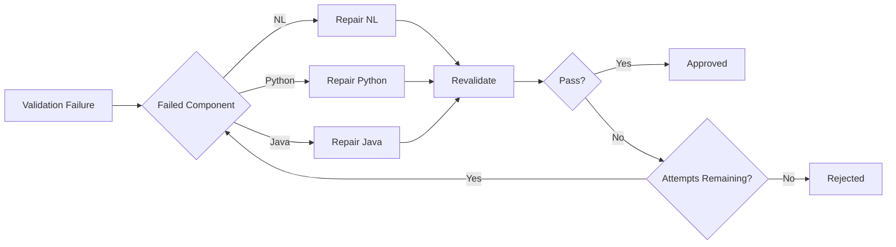

---

## 7.4 Repair Matrix

| Validation Failure | Repair Target |
|---|---|
| Missing NL | Natural Language |
| NL mismatch | Natural Language |
| Python syntax/runtime failure | Python |
| Java compilation/runtime failure | Java |
| Execution mismatch | Localized component |
| CSR mismatch | Localized component |

For execution and CSR mismatches, validation evidence is used to identify the likely failed component.

---

## 7.5 Component Repair Inputs

| Target | Inputs |
|---|---|
| NL | Python, Java, existing NL if available |
| Python | NL, Java |
| Java | NL, Python |

The Teacher Model generates repair candidates. The validation pipeline decides acceptance.

---

## 7.6 Repair Budgets

| Component | Default Attempts |
|---|---:|
| Natural Language | 3 |
| Python | 3 |
| Java | 3 |

Budgets are independent. Exhausting Java attempts does not consume Python or NL attempts.

---

## 7.7 Repair History Contract

| Field | Description |
|---|---|
| `corpus_id` | Row identifier |
| `component` | NL / Python / Java |
| `attempt_number` | Repair attempt |
| `failure_reason` | Triggering validation failure |
| `teacher_model` | Model used |
| `prompt_version` | Repair prompt version |
| `outcome` | Pass / Fail |

---

## 7.8 Failure Handling

| Condition | Action |
|---|---|
| Repair succeeds | Re-enter validation |
| Repair fails | Retry if attempts remain |
| Repair budget exhausted | Reject row |
| Teacher unavailable | Stop repair process |
| Invalid generated artifact | Return validation failure |

---

# 8. Unified Training Framework

## 8.1 Responsibility

The Training Framework converts Approved Corpus rows into instruction-following examples and fine-tunes one student model across all registered tasks.

It does not validate or repair data.

---

## 8.2 Inputs and Outputs

| Input | Source |
|---|---|
| Approved Corpus | Corpus Validation |
| Student Model | Model Manager |
| Training Configuration | Configuration Manager |
| Task Registry | Training Framework |

| Output | Consumer |
|---|---|
| LoRA Adapter | Evaluation |
| Training Metrics | Artifact Manager |
| Checkpoints | Artifact Manager |
| Training Config Snapshot | Artifact Manager |

---

## 8.3 Training Workflow

**Figure 8-1. Training Workflow**

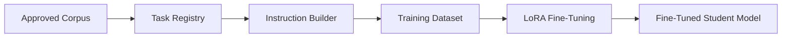

---

## 8.4 Teacher and Student Roles

| Model | Responsibility |
|---|---|
| Teacher Model | NL generation, test generation, repair |
| Student Model | Multi-task learning and inference |

The student does not generate its own training data.

---

## 8.5 Model Selection

| Role | Recommended Configuration |
|---|---|
| Demo Student | Qwen2.5-Coder small variant suitable for Colab |
| Full Student | Qwen2.5-Coder 7B or larger if resources permit |
| Teacher | Qwen3-Coder or DeepSeek-Coder if available |

Model names are configuration values, not architecture constants.

---

## 8.6 Task Registry

| Task ID | Source | Target |
|---|---|---|
| T1 | Natural Language | Python |
| T2 | Natural Language | Java |
| T3 | Python | Java |
| T4 | Java | Python |
| T5 | Python | Natural Language |
| T6 | Java | Natural Language |

One Approved Corpus row can generate all six tasks.

---

## 8.7 Instruction Format

Template structure:

```text
Instruction

Context (optional)

Input

Expected Output
```

Example task expansion:

```text
Task: Python → Java

Instruction:
Translate the following Python implementation into equivalent Java code.

Input:
<python_code>

Expected Output:
<java_code>
```

---

## 8.8 LoRA Training

LoRA is selected because it supports fine-tuning within Colab constraints.

| Parameter | Description |
|---|---|
| `lora_rank` | Adapter rank |
| `lora_alpha` | Scaling factor |
| `learning_rate` | Optimizer setting |
| `batch_size` | Per-device batch size |
| `gradient_accumulation` | Effective batch control |
| `max_seq_length` | Token length limit |
| `epochs` | Number of passes |

---

## 8.9 Demo and Full Mode

| Setting | Demo Mode | Full Mode |
|---|---|---|
| Corpus size | Limited | Complete |
| Task expansion | Limited by corpus | Complete |
| Epochs | Reduced | Production setting |
| Validation logic | Full | Full |
| Training code | Same | Same |

---

## 8.10 Failure Handling

| Failure | Action |
|---|---|
| Invalid training sample | Skip and log |
| GPU OOM | Reduce batch/effective batch or stop according to config |
| Checkpoint failure | Retry save |
| Model unavailable | Stop training |
| Interrupted session | Resume if checkpoint exists |

---

# 9. Evaluation Framework

## 9.1 Responsibility

The Evaluation Framework evaluates model outputs per source-target modality. It is driven by the Metric Registry, not by a single universal metric.

---

## 9.2 Inputs and Outputs

| Input | Source |
|---|---|
| Fine-tuned Student Model | Training |
| Approved Test Corpus | Corpus Validation |
| Task Registry | Training |
| Metric Registry | Evaluation |
| Evaluation Configuration | Configuration Manager |

| Output | Consumer |
|---|---|
| Task Reports | Artifact Manager |
| Overall Evaluation Report | Artifact Manager |
| Prediction Logs | Artifact Manager |
| Metric Summary | Artifact Manager |

---

## 9.3 Evaluation Workflow

**Figure 9-1. Evaluation Workflow**

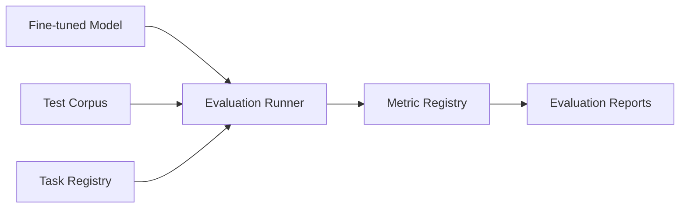

---

## 9.4 Evaluation Matrix

| Source | Target | Compile | Execute | CSR | CodeBLEU | BLEU | ROUGE | Semantic |
|---|---|:---:|:---:|:---:|:---:|:---:|:---:|:---:|
| NL | Python | — | ✓ | ✓ | ✓ | — | — | — |
| NL | Java | ✓ | ✓ | ✓ | ✓ | — | — | — |
| Python | Java | ✓ | ✓ | ✓ | ✓ | — | — | — |
| Java | Python | — | ✓ | ✓ | ✓ | — | — | — |
| Python | NL | — | — | — | — | ✓ | ✓ | ✓ |
| Java | NL | — | — | — | — | ✓ | ✓ | ✓ |

---

## 9.5 Metric Definitions

| Metric | Applies To | Purpose |
|---|---|---|
| Compilation Success | Java targets | Checks generated Java compiles |
| Execution Equivalence | Code targets | Checks behavior using Trusted Test Suite |
| CSR Similarity | Code targets | Checks language-neutral structure |
| CodeBLEU | Code targets | Supporting lexical/syntax similarity |
| BLEU | NL targets | Token overlap |
| ROUGE | NL targets | Recall-oriented text overlap |
| Semantic Similarity | NL targets | Meaning-level similarity |

No single metric is considered sufficient for code tasks.

---

## 9.6 Failure Handling

| Failure | Action |
|---|---|
| Prediction fails | Record and continue |
| Metric unavailable | Skip and log |
| Execution not feasible | Record status |
| Invalid sample | Skip and log |
| Run interrupted | Resume if task checkpoint exists |

Evaluation never modifies the Approved Corpus or trained model.

---

# 10. Software Architecture

## 10.1 Module Architecture

**Figure 10-1. Logical Module Architecture**

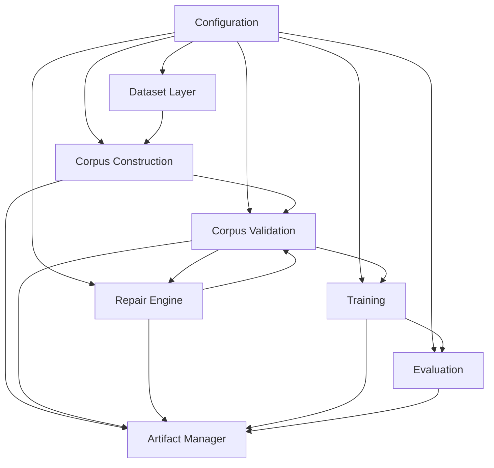

---

## 10.2 Target Package Layout

```text
repocoder_studio/

├── config/
│   ├── settings.py
│   ├── models.py
│   └── runtime.py
│
├── datasets/
│   ├── xlcost.py
│   ├── transcoder.py
│   ├── registry.py
│   └── adapters.py
│
├── corpus/
│   ├── builder.py
│   ├── schema.py
│   ├── deduplication.py
│   ├── provenance.py
│   └── versioning.py
│
├── validation/
│   ├── python_validator.py
│   ├── java_validator.py
│   ├── trusted_tests.py
│   ├── execution.py
│   ├── csr.py
│   ├── nl_validator.py
│   └── validator.py
│
├── repair/
│   └── repair_engine.py
│
├── training/
│   ├── task_registry.py
│   ├── prompt_builder.py
│   ├── dataset_builder.py
│   └── trainer.py
│
├── evaluation/
│   ├── metric_registry.py
│   ├── evaluator.py
│   └── reports.py
│
├── artifacts/
│   ├── storage.py
│   ├── logging.py
│   └── reports.py
│
└── main.py
```

The first implementation may exist as one Colab notebook, but notebook sections should follow this logical structure.

---

## 10.3 Configuration Groups

| Group | Purpose |
|---|---|
| Dataset | Dataset selection and row limits |
| Corpus | Construction and deduplication |
| Validation | Thresholds and validation behavior |
| Repair | Attempts and repair prompts |
| Models | Teacher and student models |
| Training | LoRA and optimizer settings |
| Evaluation | Metrics and sample limits |
| Runtime | Demo / Full mode |
| Artifacts | Output directory and persistence |

Configuration remains immutable during execution.

---

## 10.4 Artifact Directory

```text
Run_YYYYMMDD_HHMMSS/

├── corpus/
│   ├── candidate/
│   ├── approved/
│   └── rejected/
│
├── validation/
├── trusted_tests/
├── repair/
├── training/
├── evaluation/
├── configuration/
└── logs/
```

---

## 10.5 Error Classification

| Error Type | Examples | Action |
|---|---|---|
| Recoverable | Missing optional metadata | Log and continue |
| Validation | Compilation failure, execution mismatch | Trigger repair |
| Fatal | Dataset unavailable, model load failure | Stop execution |

---

## 10.6 Reproducibility

Each run stores:

- corpus version,
- dataset versions,
- config snapshot,
- random seed,
- teacher model,
- student model,
- validation thresholds,
- run timestamp.

---

# 11. Future Extensions

## 11.1 New Programming Languages

Adding a new language requires:

| Component | Required |
|---|---:|
| Dataset Adapter | ✓ |
| Language Validator | ✓ |
| Execution Harness | ✓ |
| CSR Converter | ✓ |
| Task Registration | ✓ |
| Evaluation Profile | ✓ |

No change should be required to Corpus Construction, Training, or Artifact Management.

---

## 11.2 New Datasets

A new dataset requires:

- dataset loader,
- dataset adapter,
- registry entry,
- provenance mapping.

Downstream layers remain unchanged if the adapter maps into the Candidate Row contract.

---

## 11.3 New Tasks

Future tasks can be added through the Task Registry.

Examples:

| Source | Target |
|---|---|
| Python | Unit Tests |
| Java | Unit Tests |
| Bug Report | Patch |
| Code | Code Review |
| Code | Security Analysis |
| Code | Optimized Code |

---

## 11.4 Repository-Level Extensions

Future versions may support:

- cross-file translation,
- repository summarization,
- dependency analysis,
- API discovery,
- bug localization,
- repository-aware documentation.

These extensions mainly affect corpus representation and retrieval. The registry-based architecture remains applicable.

---

## 11.5 Production Roadmap

**Figure 11-1. Production Roadmap**

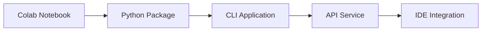

---

# 12. Appendices

## Appendix A — Candidate Row Contract

| Field | Type | Required |
|---|---|:---:|
| `corpus_id` | string | ✓ |
| `dataset` | string | ✓ |
| `dataset_record_id` | string | ✓ |
| `split` | string | ✓ |
| `natural_language` | string/null | ✓ |
| `python_code` | string | ✓ |
| `java_code` | string | ✓ |
| `metadata` | object | ✓ |
| `provenance` | object | ✓ |

---

## Appendix B — Approved Corpus Contract

| Field | Type | Required |
|---|---|:---:|
| `corpus_id` | string | ✓ |
| `natural_language` | string | ✓ |
| `python_code` | string | ✓ |
| `java_code` | string | ✓ |
| `trusted_tests` | object | ✓ |
| `csr_python` | object | ✓ |
| `csr_java` | object | ✓ |
| `validation_status` | string | ✓ |
| `repair_history` | object | ✓ |
| `corpus_version` | string | ✓ |

---

## Appendix C — Validation Outcomes

| Status | Meaning |
|---|---|
| `PASS` | Validation succeeded |
| `FAIL` | Validation failed |
| `NOT_FEASIBLE` | Validation could not be safely executed |
| `REPAIR_REQUESTED` | Repair required |
| `REJECTED` | Row excluded from training |
| `APPROVED` | Row accepted into Approved Corpus |

---

## Appendix D — End-to-End Worked Example

**Figure D-1. Full Row Lifecycle**

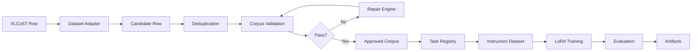

| Stage | Output |
|---|---|
| Dataset import | Raw XLCoST or TransCoder row |
| Adapter | Candidate Row |
| Deduplication | Duplicate-free Candidate Corpus |
| Validation | Approved or rejected row |
| Repair | Updated row if recoverable |
| Task Registry | Multi-task examples |
| Training | LoRA adapter |
| Evaluation | Task reports |
| Artifact export | Saved run directory |

---

# End of Engineering Design Specification

**Frozen Version:** 1.0  
**Project:** RepoCoder Studio – Unified Multimodal Code Intelligence Framework  
**Next Phase:** Implementation
