> **Document Status**
>
> This document defines the complete engineering architecture, implementation strategy, software design, data contracts, validation framework, and execution workflow for the RepoCoder Studio Combined Stage implementation. The specification represents the frozen architecture against which all future implementation and evaluation activities are performed.

---

# Revision History

| Version | Date | Description |
|----------|------|-------------|
| 1.0 | Initial Design | Initial Combined Stage Design Specification |
| 2.0 | Architecture Freeze | Complete architectural redesign introducing semantic alignment, teacher-assisted corpus completion, parser-derived semantic artifacts, bounded repair loops, approved corpus architecture, trusted test repository and unified multitask pipeline |

---

# Document Classification

**Project**

RepoCoder Studio

**Document Type**

Engineering Design Specification

**Implementation Status**

Architecture Frozen

**Programming Languages**

Python

Java

Natural Language

**Target Environment**

Google Colab

Python 3.12+

CUDA GPU

Google Drive

Hugging Face

---

# Intended Audience

This document serves as the primary engineering specification for the implementation of RepoCoder Studio.

It defines the complete architecture of the system, the responsibilities of every software component, the interaction between individual modules, the contracts governing data movement throughout the pipeline, and the implementation strategy adopted during development.

The document is intended to remain the single source of truth throughout implementation and future project extensions.

---

# Scope

The specification covers the complete implementation of the Combined Stage architecture, including

- multilingual corpus construction
- dataset acquisition
- dataset caching
- normalization
- record validation
- semantic alignment
- teacher-assisted corpus completion
- bounded repair
- candidate corpus generation
- corpus validation
- approved corpus construction
- trusted test repository
- task generation
- student model training
- evaluation
- artifact management
- software architecture
- notebook execution architecture
- future extensibility

---

# Table of Contents

# Part I — System Overview

1. Introduction

2. System Vision

3. Architectural Principles

4. Overall System Architecture

# Part II — Corpus Engineering

5. Dataset Layer

6. Dataset Cache

7. Normalization Engine

8. Record Validation Engine

9. Semantic Alignment Engine

10. Teacher Completion Engine

11. Repair Engine

12. Candidate Corpus

13. Corpus Validation Engine

14. Approved Corpus

15. Trusted Test Repository

# Part III — Model Pipeline

16. Task Registry

17. Training Pipeline

18. Evaluation Framework

19. Metric Registry

20. Prediction Inspector

21. Failure Analysis

# Part IV — Software Architecture

22. Package Architecture

23. Notebook Architecture

24. Configuration

25. Storage

26. Logging

27. Versioning

# Part V — Future Roadmap

28. Semantic Retrieval

29. Repository Intelligence

30. Future Stages

Appendices

---

# List of Figures

Figure 1 Overall System Architecture

Figure 2 Corpus Construction Pipeline

Figure 3 Semantic Alignment Pipeline

Figure 4 Teacher Completion Pipeline

Figure 5 Repair Loop

Figure 6 Corpus Validation Pipeline

Figure 7 Training Pipeline

Figure 8 Evaluation Pipeline

Figure 9 Software Architecture

Figure 10 Notebook Execution Flow

---

# List of Tables

Table 1 Dataset Summary

Table 2 Approved Corpus Schema

Table 3 Task Registry

Table 4 Metric Registry

Table 5 Software Modules

Table 6 Configuration Parameters

Table 7 Stored Artifacts

---

# Part I

# System Overview

---

# Chapter 1

# Introduction

## 1.1 Background

Large Language Models have demonstrated significant improvements in software engineering tasks such as code generation, source code translation, program summarization and automated documentation. Despite these advances, high-quality multilingual training corpora remain limited. Public datasets frequently contain syntactic inconsistencies, incomplete modality coverage, noisy natural language descriptions and incorrectly aligned cross-language implementations. Directly training on these datasets propagates structural errors into downstream models and reduces the reliability of generated software artifacts.

RepoCoder Studio addresses this challenge through the construction of a validated multilingual programming corpus that serves as the foundation for all subsequent model training and evaluation activities. Rather than treating publicly available datasets as trusted sources, every dataset record is regarded as candidate evidence requiring normalization, validation and semantic verification before inclusion in the final corpus.

The architecture separates evidence acquisition from corpus construction. Dataset records are collected from multiple repositories, transformed into a common representation, semantically aligned across programming languages and subjected to deterministic validation before they become eligible for downstream learning tasks. Missing modalities are synthesized through a teacher-assisted generation pipeline and accepted only after satisfying the same validation requirements imposed on dataset-derived artifacts.

The resulting approved corpus forms the central knowledge asset of the system. All training datasets, evaluation tasks and future repository intelligence capabilities are derived exclusively from this validated corpus.

---

## 1.2 Motivation

Existing multilingual programming datasets exhibit several recurring limitations.

Individual datasets often focus on a single programming language, provide incomplete modality coverage or rely upon weak assumptions regarding cross-language alignment. Several repositories align implementations using record indices or dataset ordering rather than semantic equivalence. Others contain tokenized source code, inconsistent formatting or natural language descriptions that only partially describe the associated implementation.

Training directly on these datasets introduces three significant risks.

The first is syntactic corruption, where invalid source programs are incorporated into the training corpus.

The second is semantic misalignment, where implementations solving different programming problems are incorrectly paired.

The third is incomplete supervision, where only subsets of the required modalities are available, limiting the range of downstream learning tasks.

The implementation addresses these challenges by replacing implicit trust with deterministic validation and explicit semantic verification.

---

## 1.3 Problem Statement

The implementation addresses the following engineering problem.

> Construct a high-quality multilingual programming corpus containing semantically consistent Natural Language, Python and Java representations suitable for multitask code intelligence applications while maintaining complete provenance, reproducibility and validation history.

Achieving this objective requires significantly more than simply downloading existing datasets.

The implementation must

- acquire heterogeneous datasets
- normalize heterogeneous representations
- validate individual language artifacts
- identify semantically equivalent implementations
- complete missing modalities
- validate generated artifacts
- preserve structural metadata
- construct reusable training tasks
- provide reproducible evaluation

These activities collectively form the corpus engineering pipeline described throughout this specification.

---

## 1.4 Objectives

The implementation satisfies the following primary objectives.

### Objective O1

Construct a unified multilingual corpus containing complete Natural Language, Python and Java representations for every approved programming problem.

### Objective O2

Ensure that every approved corpus entry satisfies deterministic validation requirements before participating in downstream learning tasks.

### Objective O3

Preserve structural program representations through parser-derived Abstract Syntax Trees rather than lightweight lexical approximations.

### Objective O4

Maintain complete provenance for every corpus artifact, including dataset origin, validation evidence, generation history and repair history.

### Objective O5

Support multiple downstream learning tasks through a single approved corpus rather than maintaining independent task-specific datasets.

### Objective O6

Provide a reproducible engineering framework capable of supporting future repository intelligence and retrieval-augmented software engineering workflows.

---

## 1.5 Design Philosophy

The implementation adopts a corpus-first design philosophy.

Datasets are considered evidence sources rather than authoritative knowledge repositories.

The approved corpus represents the authoritative knowledge base of the system.

Every downstream activity, including task generation, student model training, evaluation and future retrieval capabilities, consumes information exclusively from the approved corpus.

This separation between evidence acquisition and knowledge construction forms the foundation of the overall architecture.

---

## 1.6 System Overview

At a high level, the implementation consists of four major architectural layers.

1. Evidence Acquisition

2. Corpus Construction

3. Model Pipeline

4. Evaluation Framework

Each layer performs a distinct responsibility while exposing well-defined interfaces to adjacent components.

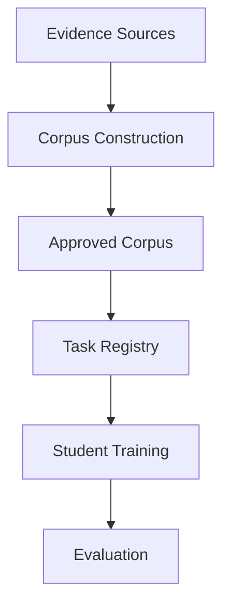

The architecture deliberately isolates corpus construction from model training. Improvements to the corpus automatically benefit every downstream learning task without requiring architectural modifications to the training or evaluation pipelines.

---

## 1.7 Document Organization

The remainder of this specification progressively expands the architecture from the highest system level to individual implementation modules.

Part I introduces the architectural principles governing the system.

Part II describes the complete corpus engineering workflow.

Part III documents the multitask model pipeline.

Part IV specifies the software implementation architecture.

Part V discusses future extensibility beyond the current implementation.

No implementation chapter is presented before the corresponding architectural component has been introduced at the system level.

This top-down organization ensures that every implementation decision can be traced directly to an architectural requirement established earlier in the specification.

---

# Chapter 2

# System Vision

## 2.1 Vision Statement

RepoCoder Studio is designed as a unified code intelligence framework centered around a validated multilingual programming corpus. The implementation transforms heterogeneous public datasets into a semantically consistent, structurally validated knowledge base that supports code generation, language translation, program summarization and future repository intelligence capabilities through a common architectural foundation.

Unlike conventional machine learning pipelines that treat datasets as training inputs, the implementation treats datasets as evidence contributing to a continuously validated corpus. This distinction fundamentally changes the role of data engineering within the overall system.

The approved corpus is not merely an intermediate artifact produced before model training. It is the primary product of the engineering pipeline and the central asset from which all downstream capabilities are derived.

## 2.2 Architectural Vision

The implementation adopts a layered architecture in which each layer performs a single well-defined responsibility while exposing deterministic interfaces to adjacent layers. The architecture intentionally separates corpus engineering from model engineering, ensuring that improvements in corpus quality directly benefit every downstream capability without requiring modifications to the training or evaluation pipelines.

Unlike traditional machine learning workflows that begin with dataset preparation and immediately transition into model training, the implementation introduces an intermediate knowledge engineering layer responsible for constructing a validated multilingual programming corpus. This corpus becomes the authoritative representation of all programming knowledge used throughout the system.

The architecture is governed by three fundamental observations.

First, publicly available datasets should not be considered trusted sources of training data. Every dataset record represents evidence that requires validation.

Second, individual programming artifacts should be validated independently before any cross-language relationships are established.

Third, semantic equivalence must be demonstrated rather than assumed. Cross-language implementations are accepted only after satisfying deterministic validation and semantic consistency requirements.

These observations fundamentally change the role of datasets within the implementation. Instead of serving as training corpora, datasets become evidence repositories from which trusted multilingual knowledge is constructed.

---

## 2.3 High-Level System Architecture

The implementation consists of nine primary architectural layers.

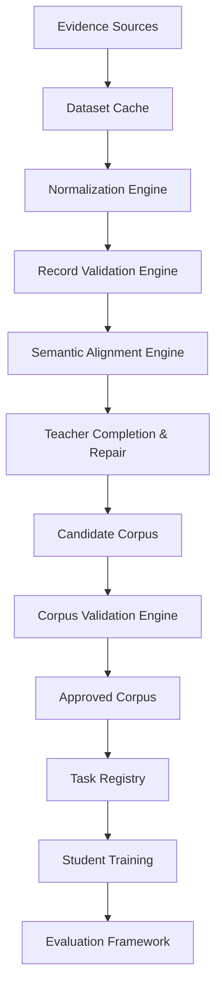

Each architectural layer produces a clearly defined artifact that becomes the input for the subsequent stage. No downstream component directly accesses raw datasets. This constraint ensures that every model, metric and evaluation result can be traced back to a validated corpus entry.

---

## 2.4 Architectural Layers

### Layer 1 — Evidence Acquisition

The Evidence Acquisition Layer is responsible for collecting heterogeneous programming artifacts from publicly available repositories. These repositories provide the raw evidence required for multilingual corpus construction but are not assumed to be syntactically or semantically correct.

The current implementation incorporates the following evidence sources.

| Dataset | Purpose | Available Modalities |
|----------|---------|----------------------|
| XLCoST | Multilingual programming corpus | Natural Language, Python, Java |
| Google CodeXGLUE Code-to-Text | Code summarization corpus | Natural Language, Python or Java |

Every downloaded dataset is versioned and cached locally before processing.

---

### Layer 2 — Dataset Cache

The Dataset Cache Layer provides persistent storage for downloaded datasets within the project workspace.

Its responsibilities include:

- eliminating repeated downloads
- preserving dataset versions
- enabling reproducible experiments
- supporting offline execution
- reducing initialization time

The cache represents the immutable copy of each dataset used throughout the implementation.

---

### Layer 3 — Normalization Engine

Raw datasets exhibit significant inconsistencies arising from tokenization strategies, formatting conventions, whitespace usage, language-specific syntax representation and textual encoding.

The Normalization Engine transforms every evidence record into a canonical representation suitable for deterministic validation.

Normalization never attempts to alter the semantics of a program. Its purpose is limited to removing representation-level inconsistencies while preserving executable behavior.

---

### Layer 4 — Record Validation Engine

The Record Validation Engine performs deterministic validation of individual programming artifacts before semantic relationships are considered.

Each language modality is validated independently.

Python artifacts undergo syntactic parsing using Python's Abstract Syntax Tree parser.

Java artifacts undergo compilation and structural parsing using the Java compiler together with Tree-sitter.

Natural language artifacts undergo linguistic validation and semantic preprocessing.

Only validated artifacts are promoted to evidence pools.

---

### Layer 5 — Semantic Alignment Engine

The Semantic Alignment Engine constructs multilingual relationships between validated evidence records.

Rather than relying upon dataset ordering or record indices, alignment is established through semantic similarity between programming tasks.

Each candidate alignment receives a confidence score derived from multiple sources of evidence, including normalized textual similarity, teacher-generated semantic embeddings, structural program characteristics and dataset provenance.

Only alignments exceeding the configured confidence threshold are considered eligible for corpus construction.

---

### Layer 6 — Teacher Completion and Repair

Semantic alignment does not guarantee that every candidate contains all required modalities.

Whenever one or more modalities are absent, the Teacher Model generates the missing representation.

Generated artifacts are treated as candidate evidence rather than trusted output.

Every generated artifact enters a bounded repair workflow consisting of validation, structured feedback generation and iterative regeneration.

The repair process terminates immediately after successful validation or after exhausting the configured repair budget.

---

### Layer 7 — Candidate Corpus

The Candidate Corpus contains semantically aligned multilingual triples awaiting final validation.

Every CandidateRow contains

- Natural Language
- Python implementation
- Java implementation

regardless of whether individual modalities originated from public datasets or were generated by the Teacher Model.

Candidate rows remain provisional until relationship-level validation has completed successfully.

---

### Layer 8 — Corpus Validation Engine

The Corpus Validation Engine represents the final quality gate of the entire architecture.

Unlike Record Validation, which validates individual artifacts, Corpus Validation evaluates relationships between modalities.

Validation verifies that

- Natural Language accurately describes both implementations
- Python and Java implementations are semantically consistent
- parser-derived structural similarity exceeds the configured threshold
- execution results agree whenever trusted tests are available
- provenance remains internally consistent

Only fully validated rows become permanent members of the approved corpus.

---

### Layer 9 — Approved Corpus

The Approved Corpus represents the authoritative knowledge repository of the implementation.

Every downstream activity consumes information exclusively from this corpus.

No training or evaluation component directly accesses public datasets.

The Approved Corpus preserves

- validated multilingual implementations
- parser-derived structural artifacts
- semantic validation evidence
- trusted test references
- repair history
- provenance
- version metadata

This repository forms the permanent foundation of the entire system.

---

## 2.5 Information Flow

The architecture enforces a strictly unidirectional information flow.


This design prevents downstream components from bypassing validation stages and guarantees that every model prediction can be traced to validated corpus evidence.

---

## 2.6 Core Architectural Decisions

The architecture is guided by a small number of non-negotiable engineering decisions.

### Decision A1 — Corpus-Centric Design

The Approved Corpus is the primary system artifact. Public datasets are temporary evidence sources used exclusively during corpus construction.

---

### Decision A2 — Validation Before Trust

No programming artifact is considered trustworthy until it has satisfied deterministic validation requirements.

Dataset origin alone does not imply correctness.

---

### Decision A3 — Complete Multimodal Representation

Every approved corpus entry contains all three required modalities.

- Natural Language
- Python
- Java

Incomplete rows are completed through the Teacher Model before entering corpus validation.

---

### Decision A4 — Deterministic Processing Before Generation

Every deterministic operation is executed before invoking generative models.

Normalization, parsing, compilation and semantic alignment always precede Teacher-assisted completion.

---

### Decision A5 — Bounded Repair

Teacher-generated artifacts are refined through a bounded feedback loop consisting of a maximum of three validation-guided repair attempts.

Artifacts failing all repair attempts are rejected.

---

### Decision A6 — Parser-Derived Structural Representation

Structural information is derived exclusively from language parsers.

Python structural analysis adopts the built-in `ast` parser.

Java structural analysis adopts the Tree-sitter Java grammar.

Regex-based structural analysis is intentionally excluded from the implementation.

---

### Decision A7 — Persistent Provenance

Every approved artifact preserves complete provenance, including

- originating dataset
- dataset version
- alignment strategy
- generation history
- repair history
- validation evidence
- corpus version

This guarantees complete reproducibility of the corpus.

---

### Decision A8 — Task Independence

Training tasks are generated exclusively from the Approved Corpus.

Datasets never define tasks directly.

This separation ensures that improvements to corpus quality automatically propagate to every downstream learning objective.

---

## 2.7 Architectural Principles

The architectural decisions described above are formalized through a set of engineering principles that govern every implementation module.

These principles define the invariant properties of the system and provide the foundation for all subsequent design decisions.

The following chapter establishes these principles and demonstrates how each subsystem derives its responsibilities from them.

---

# Chapter 3

# Architectural Principles

## 3.1 Introduction

The implementation is governed by a small set of architectural principles that remain invariant across all software modules. These principles define the expected behavior of every component and establish the criteria used to evaluate architectural correctness.

Unlike implementation details, which may evolve over time, these principles represent the stable design philosophy of the system and serve as the basis for future extensions.
### Principle P1 — Corpus First Principle

The Approved Corpus constitutes the central knowledge asset of the implementation.

Public datasets are regarded solely as evidence sources used during corpus construction and are never consumed directly by downstream components. Every training example, evaluation task, prediction benchmark and future retrieval mechanism is derived exclusively from the Approved Corpus.

This principle isolates external data quality issues from the remainder of the architecture and provides a stable, versioned knowledge repository independent of individual dataset characteristics.

---

### Principle P2 — Validation Before Trust Principle

No programming artifact is trusted based on its origin.

Every dataset record, irrespective of its source, undergoes deterministic validation before participating in any semantic alignment or corpus construction activity.

Similarly, every artifact generated by the Teacher Model is subjected to exactly the same validation requirements imposed on dataset-derived evidence.

Trust is therefore established through validation rather than provenance.

---

### Principle P3 — Complete Triple Principle

Every Approved Corpus entry contains the complete multimodal representation of a programming task.

Each approved record consists of

- Natural Language
- Python implementation
- Java implementation

No partial records exist within the Approved Corpus.

Whenever one or more modalities are unavailable from public datasets, the missing representation is synthesized through the Teacher Completion Engine and validated prior to approval.

This invariant guarantees that every downstream task can be generated from every approved corpus entry without requiring dataset-specific logic.

---

### Principle P4 — Deterministic Before Generative Principle

The implementation prioritizes deterministic processing over generative processing.

Whenever deterministic algorithms are capable of performing a required operation, they are executed before invoking the Teacher Model.

Examples include

- normalization
- parsing
- compilation
- semantic alignment
- structural analysis
- metadata extraction

The Teacher Model is invoked only when deterministic processing cannot construct a complete multilingual representation.

This approach minimizes unnecessary generation while improving reproducibility and reducing computational cost.

---

### Principle P5 — Bounded Repair Principle

Generation is treated as an iterative engineering process rather than a one-time operation.

Every generated artifact participates in a bounded repair workflow consisting of validation, structured feedback generation and regeneration.

The repair workflow terminates immediately after successful validation or after exhausting the configured repair budget.

The implementation adopts a maximum of three repair attempts.

This constraint guarantees deterministic runtime while preserving opportunities for automatic correction.

---

### Principle P6 — Parser-Derived Structural Principle

Structural program information is derived exclusively from language parsers.

Python programs are represented through Abstract Syntax Trees generated using the Python Standard Library.

Java programs are represented through parse trees generated using the Tree-sitter Java grammar.

Parser-derived representations provide deterministic structural information that remains independent of lexical formatting.

Regex-based structural analysis is intentionally excluded from the implementation because it cannot reliably represent hierarchical program structure.

---

### Principle P7 — Semantic Alignment Principle

Cross-language relationships are established through semantic equivalence rather than positional correspondence.

Programming artifacts originating from different datasets are aligned only after sufficient semantic evidence has been collected.

Semantic alignment combines multiple sources of evidence, including

- normalized natural language similarity
- semantic embeddings
- function signature compatibility
- parser-derived structural characteristics
- provenance consistency

No individual evidence source is considered sufficient in isolation.

---

### Principle P8 — Reproducibility Principle

Every engineering artifact produced throughout corpus construction preserves sufficient metadata to enable complete reconstruction of the Approved Corpus.

This includes

- originating dataset
- dataset version
- cached dataset revision
- normalization version
- alignment strategy
- validation evidence
- generation history
- repair history
- corpus version

The implementation therefore supports deterministic regeneration of every approved corpus entry.

---

### Principle P9 — Separation of Responsibilities Principle

Each architectural component performs exactly one primary responsibility.

For example

| Component | Primary Responsibility |
|-----------|------------------------|
| Dataset Cache | Persistent storage of external datasets |
| Normalization Engine | Canonical representation of raw evidence |
| Record Validation Engine | Validation of individual artifacts |
| Semantic Alignment Engine | Construction of multilingual relationships |
| Teacher Completion Engine | Generation of missing modalities |
| Repair Engine | Iterative correction of generated artifacts |
| Corpus Validation Engine | Validation of cross-modal relationships |
| Task Registry | Construction of multitask learning examples |
| Student Training Pipeline | Model optimization |
| Evaluation Framework | Performance measurement |

This separation minimizes coupling between software modules while simplifying maintenance and future extensions.

---

### Principle P10 — Provenance Preservation Principle

Every engineering decision affecting an Approved Corpus entry is permanently recorded.

The implementation preserves

- dataset origin
- validation decisions
- repair attempts
- generated modalities
- parser outputs
- trusted test associations
- alignment evidence
- corpus version

This information enables complete auditability of every multilingual programming example.

---

## 3.2 Architectural Invariants

The architectural principles defined above establish a number of invariants that remain true throughout execution.

The implementation never permits a downstream component to violate these invariants.

### Invariant I1

Every Approved Corpus entry contains validated Natural Language, Python and Java representations.

---

### Invariant I2

Every structural representation stored within the Approved Corpus originates from a language parser.

---

### Invariant I3

Every generated artifact has successfully completed deterministic validation.

---

### Invariant I4

Every approved relationship has satisfied semantic alignment requirements.

---

### Invariant I5

Every downstream task originates from the Approved Corpus.

---

### Invariant I6

Every engineering artifact preserves complete provenance.

---

## 3.3 Architecture Layers and Responsibility Boundaries

The implementation is partitioned into distinct responsibility layers.

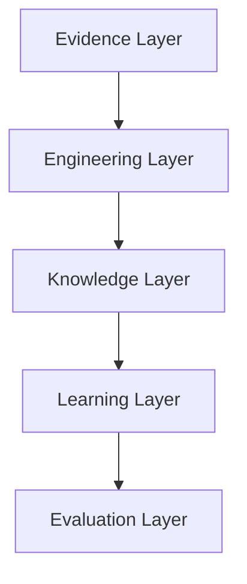

### Evidence Layer

Responsible for acquiring heterogeneous programming evidence from external repositories.

Primary artifacts include

- raw datasets
- cached datasets

---

### Engineering Layer

Responsible for transforming evidence into validated multilingual knowledge.

Primary components include

- Normalization Engine
- Record Validation Engine
- Semantic Alignment Engine
- Teacher Completion Engine
- Repair Engine
- Corpus Validation Engine

---

### Knowledge Layer

Responsible for maintaining the Approved Corpus and Trusted Test Repository.

This layer forms the permanent knowledge base of the implementation.

---

### Learning Layer

Responsible for generating multitask learning examples and optimizing the Student Model.

This layer has no direct dependency on external datasets.

---

### Evaluation Layer

Responsible for measuring system performance using standardized metrics defined within the Metric Registry.

Evaluation consumes only Approved Corpus–derived tasks.

---

## 3.4 Architectural Traceability

Every major subsystem can be traced directly to one or more architectural principles.

| Subsystem | Governing Principles |
|-----------|----------------------|
| Dataset Cache | P8 |
| Normalization Engine | P4 |
| Record Validation Engine | P2, P4 |
| Semantic Alignment Engine | P7 |
| Teacher Completion Engine | P3, P4 |
| Repair Engine | P5 |
| Corpus Validation Engine | P1, P2, P3 |
| Approved Corpus | P1, P6, P8, P10 |
| Task Registry | P1, P3 |
| Student Training Pipeline | P1, P9 |
| Evaluation Framework | P1, P9 |

This traceability ensures that every implementation module exists to satisfy one or more explicit architectural principles rather than evolving independently over time.

---

# Chapter 4

# Overall System Architecture

## 4.1 Overview

The overall architecture defines the end-to-end transformation of heterogeneous programming evidence into a validated multilingual corpus and subsequently into multitask learning artifacts suitable for model optimization and evaluation.

The architecture is intentionally organized as a sequence of deterministic engineering stages, each producing a well-defined artifact that becomes the exclusive input to the subsequent stage.

This design minimizes cross-component dependencies, simplifies debugging and enables independent validation of every intermediate artifact.

The complete execution flow is illustrated below.

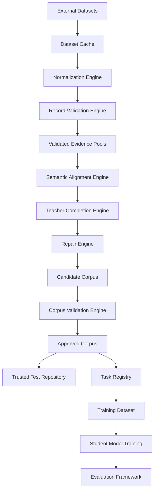

The architecture deliberately enforces a one-way progression of information. Once an artifact has progressed to a subsequent stage, upstream components are never modified directly. Any correction requires regeneration through the appropriate validation and repair workflow, ensuring complete traceability and reproducibility.

---

## 4.2 Architectural Phases

The complete workflow is divided into five high-level phases:

1. Evidence Acquisition
2. Corpus Engineering
3. Knowledge Construction
4. Model Optimization
5. Evaluation and Analysis

The following sections describe the purpose and responsibilities of each phase before expanding the individual components in subsequent chapters.
### Phase 1 — Evidence Acquisition

The Evidence Acquisition phase is responsible for obtaining heterogeneous programming artifacts from external repositories and transforming them into reproducible local resources suitable for subsequent corpus engineering.

This phase intentionally performs **no semantic processing**. Its sole responsibility is to ensure that external evidence is available locally, versioned, reproducible and independent of external network availability.

The Evidence Acquisition phase consists of the following components:

- Dataset Registry
- Dataset Download Manager
- Dataset Cache
- Dataset Metadata Manager

The output of this phase is a persistent local dataset repository that serves as the immutable evidence source for all downstream processing.

---

### Phase 2 — Corpus Engineering

Corpus Engineering represents the largest architectural layer within the implementation.

Its objective is to transform heterogeneous evidence into validated multilingual programming knowledge.

Unlike conventional machine learning pipelines that treat datasets as training corpora, this implementation treats datasets merely as evidence. Corpus Engineering constructs a completely new knowledge repository whose quality is independent of the quality of the originating datasets.

Corpus Engineering consists of

- Normalization Engine
- Record Validation Engine
- Semantic Alignment Engine
- Teacher Completion Engine
- Repair Engine
- Candidate Corpus Builder
- Corpus Validation Engine

The output of this phase is the Candidate Corpus together with all validation evidence required for final approval.

---

### Phase 3 — Knowledge Construction

Knowledge Construction converts validated candidate rows into permanent corpus artifacts.

This phase performs the highest level of semantic verification within the entire implementation.

Responsibilities include

- relationship validation
- parser-derived structural verification
- execution validation
- trusted test association
- provenance preservation
- corpus versioning

Rows satisfying every validation criterion become members of the Approved Corpus.

Rejected rows remain available for auditing but never participate in downstream learning.

---

### Phase 4 — Model Optimization

Model Optimization constructs multitask learning datasets directly from the Approved Corpus.

This phase has no dependency on public datasets.

Instead, it derives all training examples from validated multilingual corpus entries.

Responsibilities include

- task generation
- task balancing
- tokenizer preparation
- LoRA training
- checkpoint management
- adapter versioning

The Student Model is optimized exclusively on corpus-derived examples.

---

### Phase 5 — Evaluation and Analysis

The Evaluation phase measures model performance using standardized metrics defined by the Metric Registry.

Evaluation is performed independently for each supported task.

Responsibilities include

- prediction generation
- prediction inspection
- parser validation
- execution validation
- metric computation
- per-task comparison
- failure categorization
- artifact generation

Evaluation artifacts become permanent project outputs and provide complete traceability for every reported performance metric.

---

## 4.3 End-to-End Data Flow

The implementation follows a deterministic transformation pipeline in which every artifact is derived from the previous stage.


Each transformation produces a new immutable artifact. Existing artifacts are never modified in place. This approach guarantees reproducibility, simplifies debugging and enables intermediate inspection throughout corpus construction.

---

## 4.4 Component Interaction

Although each subsystem performs an independent responsibility, the architecture requires controlled communication between neighboring components.

The interaction model follows a producer–consumer architecture.

Each subsystem produces a well-defined artifact and exposes no internal implementation details to downstream consumers.

For example, the Semantic Alignment Engine does not interact directly with the Student Model, nor does the Training Pipeline access raw datasets.

Instead, communication occurs only through explicitly defined artifacts.

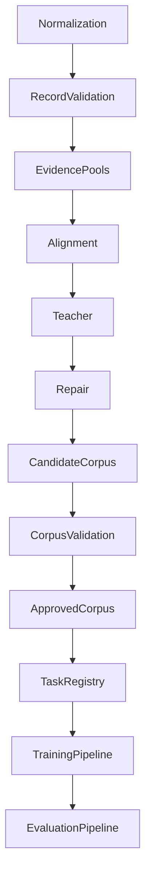

This architectural isolation enables individual components to evolve independently while preserving stable interfaces.

---

## 4.5 Information Contracts

Every subsystem exchanges information through formally defined contracts.

No component accesses internal state maintained by another component.

The primary architectural contracts are summarized below.

| Producer | Consumer | Contract |
|-----------|----------|----------|
| Dataset Cache | Normalization Engine | Raw dataset records |
| Normalization Engine | Record Validation Engine | Normalized records |
| Record Validation Engine | Alignment Engine | Validated evidence records |
| Alignment Engine | Teacher Engine | Candidate multilingual alignments |
| Teacher Engine | Repair Engine | Generated modalities |
| Repair Engine | Candidate Corpus Builder | Completed multilingual triples |
| Candidate Corpus Builder | Corpus Validation Engine | Candidate corpus rows |
| Corpus Validation Engine | Approved Corpus | Approved multilingual entries |
| Approved Corpus | Task Registry | Complete multilingual knowledge |
| Task Registry | Training Pipeline | Multitask training examples |
| Student Model | Evaluation Framework | Generated predictions |

The use of explicit contracts eliminates hidden dependencies and provides clear ownership of every engineering artifact.

---

## 4.6 Central Architectural Artifact

The implementation revolves around a single authoritative artifact: the **Approved Corpus**.

Unlike traditional training pipelines where datasets serve as the central resource, RepoCoder Studio treats the Approved Corpus as the permanent repository of validated multilingual programming knowledge.

Every subsystem either contributes to the construction of the Approved Corpus or consumes it.

The architecture therefore resembles a hub-and-spoke model.

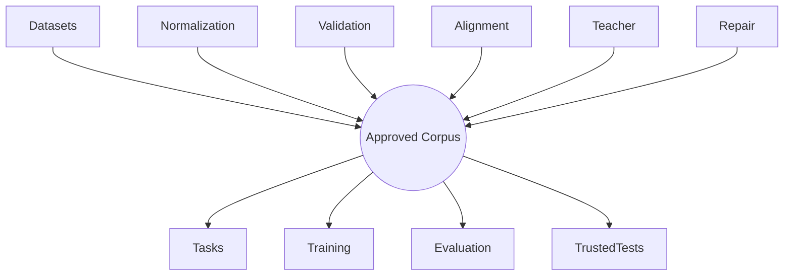

This architectural decision significantly simplifies future extensions.

Additional datasets, programming languages, downstream tasks and retrieval systems can be integrated by extending the corpus construction pipeline without modifying existing training or evaluation logic.

---

## 4.7 System Lifecycle

The complete lifecycle of an engineering artifact consists of the following stages.

1. Acquisition
2. Normalization
3. Validation
4. Alignment
5. Completion
6. Repair
7. Candidate Construction
8. Corpus Validation
9. Approval
10. Task Generation
11. Training
12. Evaluation

Every approved multilingual programming problem traverses this lifecycle exactly once.

Rejected artifacts exit the lifecycle immediately after validation failure and remain available only for audit purposes.

---

## 4.8 Technology Stack Overview

The implementation combines deterministic software engineering techniques with modern generative AI components.

Deterministic technologies perform parsing, validation, compilation and structural analysis, while generative models are invoked only for semantic completion tasks that cannot be solved algorithmically.

The primary technology stack is summarized below.

| Layer | Primary Technologies |
|--------|----------------------|
| Dataset Management | Hugging Face `datasets`, `huggingface_hub` |
| Persistent Storage | Google Drive, JSONL, Parquet |
| Python Parsing | `ast`, `inspect`, `tokenize` |
| Java Parsing | `tree_sitter`, Java grammar |
| Java Compilation | `javac`, `subprocess` |
| Semantic Matching | `sentence-transformers`, `numpy` |
| Teacher Model | Hugging Face `transformers` |
| Student Model | `transformers`, `peft`, `trl`, `accelerate`, `bitsandbytes` |
| Evaluation | Official `CodeBLEU`, `sacrebleu`, `rouge-score` |
| Experiment Tracking | `pandas`, JSONL, CSV |

The rationale for selecting each technology is presented within the corresponding subsystem chapters.

---

## 4.9 Architectural Expansion

The remaining chapters expand the architecture in the same order presented in the overall system diagram.

Each chapter introduces a single subsystem, beginning with its purpose within the overall architecture before progressively refining its workflow, implementation logic, software modules, technology selection and engineering artifacts.

The next part of this specification therefore transitions from the overall architectural perspective to the detailed design of the corpus engineering pipeline.

---

# Part II

# Corpus Engineering

The Corpus Engineering layer transforms heterogeneous public datasets into a validated multilingual knowledge repository.

This layer represents the core intellectual contribution of RepoCoder Studio.

Unlike conventional data preprocessing pipelines, Corpus Engineering performs semantic reasoning, structural validation, teacher-assisted completion and relationship verification before constructing the Approved Corpus.

Every downstream capability implemented within the project depends upon the quality of the corpus engineering process.

For this reason, the remainder of Part II progressively expands each subsystem responsible for corpus construction, beginning with the Dataset Layer, which establishes the evidence sources used throughout the implementation.

---

# Chapter 5

# Dataset Layer

## 5.1 Purpose

The Dataset Layer provides the external programming evidence required for corpus construction.

Rather than serving as direct training corpora, external datasets contribute individual programming artifacts that are subsequently normalized, validated, semantically aligned and transformed into complete multilingual corpus entries.

The architecture intentionally decouples dataset acquisition from knowledge construction.

As a result, the Approved Corpus remains independent of the structure, quality and limitations of any individual dataset.

---

## 5.2 Design Objectives

The Dataset Layer satisfies the following objectives.

- Acquire high-quality multilingual programming evidence.
- Preserve original dataset provenance.
- Support reproducible experiments through local versioned caching.
- Enable integration of multiple datasets without altering downstream architecture.
- Maintain a uniform internal representation independent of external dataset schemas.

These objectives ensure that downstream components operate on a consistent evidence model regardless of the originating repository.

---

## 5.3 Evidence Sources

The current implementation adopts two complementary evidence sources.

### XLCoST

XLCoST serves as the primary multilingual programming dataset.

It provides programming tasks implemented across multiple programming languages together with accompanying natural language descriptions.

Within the current implementation, the Python and Java subsets are utilized as primary evidence pools for multilingual corpus construction.

XLCoST contributes the majority of multilingual programming implementations used during semantic alignment.

### Google CodeXGLUE Code-to-Text

The Google CodeXGLUE Code-to-Text dataset complements XLCoST by providing high-quality natural language descriptions paired with source code implementations.

Although individual language subsets are independent, the natural language descriptions provide valuable semantic evidence during cross-language alignment.

CodeXGLUE therefore strengthens multilingual coverage while reducing dependence on any single dataset.

---
## 5.4 Dataset Selection Rationale

The dataset selection strategy is driven by the architectural objective of constructing a complete multilingual corpus rather than maximizing the number of available training examples.

Each selected dataset contributes unique evidence that strengthens one or more stages of corpus construction.

XLCoST was selected as the primary multilingual evidence source because it provides programming tasks across multiple implementation languages together with associated natural language descriptions. The multilingual nature of the dataset significantly reduces the amount of synthetic generation required during corpus construction and provides valuable evidence for semantic alignment.

Google CodeXGLUE Code-to-Text was selected as the complementary evidence source because of the quality and consistency of its natural language descriptions. Although individual language subsets are independent, the accompanying documentation provides reliable semantic evidence that strengthens cross-language alignment and teacher-guided corpus completion.

The implementation intentionally avoids constructing independent training pipelines for individual datasets.

Instead, every dataset contributes evidence toward construction of a unified multilingual corpus.

---

## 5.5 Evidence-Centric Architecture

Traditional machine learning pipelines typically follow the workflow

```text
Dataset
    ↓
Training
```

The current implementation adopts a fundamentally different architecture.

```text
Datasets
      ↓
Evidence
      ↓
Corpus Construction
      ↓
Approved Corpus
      ↓
Task Generation
      ↓
Training
```

This architectural distinction has several important implications.

First, dataset quality no longer directly determines model quality.

Second, additional datasets can be incorporated without modifying downstream learning pipelines.

Third, improvements to corpus engineering automatically improve every downstream learning task.

Finally, every generated model prediction can be traced back to validated multilingual evidence.

---

## 5.6 Dataset Independence

No dataset-specific assumptions are propagated beyond the Dataset Layer.

Every dataset is transformed into a common internal representation before entering subsequent processing stages.

The remainder of the architecture therefore operates independently of

- original dataset schema
- column names
- storage format
- tokenization strategy
- programming language ordering
- dataset version

This abstraction significantly simplifies future expansion of the system.

Supporting additional multilingual datasets requires modifications only within the Dataset Layer while preserving the remainder of the architecture unchanged.

---

## 5.7 Unified Internal Representation

Immediately after acquisition, every dataset record is converted into a unified evidence representation.

The unified representation captures only information required during corpus construction.

Conceptually, every evidence record consists of

```text
Dataset Identity

+

Programming Language

+

Natural Language Evidence

+

Source Code

+

Metadata

+

Provenance
```

Dataset-specific fields remain available through provenance metadata but are intentionally isolated from downstream engineering components.

This design prevents subsequent modules from developing dependencies on external dataset schemas.

---

## 5.8 Dataset Provenance

Complete provenance is preserved for every evidence record.

The implementation records

- dataset name
- dataset version
- dataset split
- original record identifier
- language
- acquisition timestamp
- cache version
- normalization version

This information accompanies every record throughout corpus construction and is ultimately preserved within the Approved Corpus.

Maintaining complete provenance enables

- reproducibility
- auditing
- regression analysis
- dataset version comparison
- future corpus regeneration

without requiring repeated dataset acquisition.

---

## 5.9 Dataset Registry

The Dataset Registry provides a centralized description of every supported evidence source.

Each registered dataset defines

- dataset identifier
- acquisition method
- supported languages
- available modalities
- expected schema
- cache location
- parser configuration
- adapter implementation

The registry enables new datasets to be incorporated through configuration rather than architectural modification.

Future evidence sources therefore integrate naturally into the existing pipeline.

---

## 5.10 Dataset Adapters

Although datasets are unified internally, acquisition requires dataset-specific adapters.

Each adapter is responsible for

- downloading data
- validating schema
- extracting required fields
- converting external representations into internal evidence records
- recording provenance

Adapters deliberately perform no semantic reasoning.

Responsibilities such as normalization, validation and semantic alignment belong to later architectural stages.

Maintaining this separation prevents duplication of validation logic across multiple datasets.

---

## 5.11 Technology Selection

The Dataset Layer adopts mature, widely supported libraries for dataset acquisition and persistent storage.

### Hugging Face Datasets

The implementation adopts the Hugging Face `datasets` library as the primary acquisition interface.

The library provides

- versioned datasets
- streaming support
- deterministic dataset loading
- split management
- Arrow-backed storage
- efficient serialization

These capabilities significantly simplify reproducible corpus construction.

---

### Hugging Face Hub

The Hugging Face Hub API provides version-aware access to publicly hosted datasets.

The implementation records dataset revisions whenever available to preserve reproducibility across future executions.

---

### Persistent Serialization

Downloaded datasets are serialized locally using the native `datasets` storage format.

Persistent serialization eliminates repeated downloads while preserving complete dataset metadata.

---

## 5.12 Dataset Layer Outputs

The Dataset Layer produces two permanent engineering artifacts.

### Dataset Cache

A persistent local copy of every acquired dataset.

### Raw Evidence Repository

A language-independent collection of raw evidence records awaiting normalization.

These artifacts become the exclusive inputs to the Normalization Engine.

No downstream subsystem accesses external datasets directly.

---

## 5.13 Failure Handling

Dataset acquisition may fail for several reasons, including

- unavailable network connectivity
- dataset schema changes
- repository removal
- corrupted downloads
- unsupported dataset revisions

The Dataset Layer treats these failures independently from downstream engineering logic.

Whenever possible, previously cached datasets are used as authoritative evidence.

Execution proceeds without external connectivity provided the required cache already exists.

This strategy improves reproducibility while reducing dependence on external services.

---

## 5.14 Chapter Summary

The Dataset Layer establishes the evidence foundation of the implementation.

Its responsibilities are intentionally limited to acquisition, caching, provenance preservation and schema abstraction.

No semantic reasoning, validation or corpus construction occurs within this layer.

By separating evidence acquisition from corpus engineering, the architecture isolates downstream processing from external dataset variability while enabling reproducible multilingual corpus construction.

The next chapter expands the Dataset Cache subsystem responsible for persistent evidence management and experiment reproducibility.

---

# Chapter 6

# Dataset Cache

## 6.1 Purpose

The Dataset Cache provides a persistent, version-controlled local repository for every external dataset used during corpus construction.

Caching eliminates repeated dataset downloads, enables reproducible experimentation and isolates the implementation from changes in externally hosted repositories.

Unlike temporary runtime caches maintained by third-party libraries, the Dataset Cache forms a permanent project artifact and therefore becomes part of the engineering workflow itself.

---

## 6.2 Design Objectives

The Dataset Cache satisfies the following objectives.

- Eliminate repeated downloads across notebook executions.
- Preserve dataset versions used during corpus construction.
- Support offline execution whenever cached datasets are available.
- Reduce initialization time for subsequent experiments.
- Maintain reproducible evidence independent of external repositories.
- Provide deterministic dataset loading across project versions.

These objectives ensure that corpus construction depends only on locally managed evidence once acquisition has completed successfully.

---

## 6.3 Architectural Position

Within the overall architecture, the Dataset Cache represents the boundary between external repositories and internal engineering components.

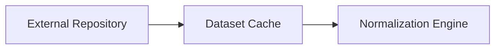

Every downstream subsystem operates exclusively on cached datasets.

This architectural decision prevents later stages from becoming dependent on network availability or remote repository changes.

---

## 6.4 Cache Organization

The implementation organizes cached datasets by source and programming language.

```text
datasets/

├── xlcost/
│   ├── python/
│   └── java/
│
├── codexglue/
│   ├── python/
│   └── java/
│
└── metadata/
```

Each dataset directory stores

- serialized dataset
- schema metadata
- acquisition metadata
- dataset revision
- cache version

This organization allows individual language subsets to be updated independently while preserving complete provenance.

---

## 6.5 Cache Lifecycle

The Dataset Cache follows a deterministic lifecycle.

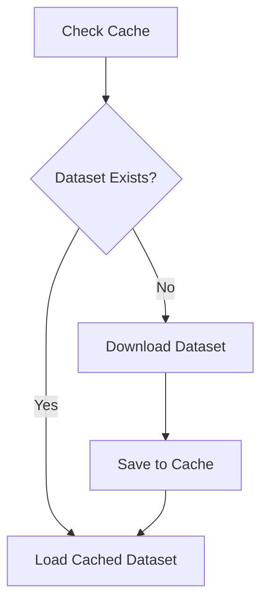

The implementation always prefers cached datasets whenever compatible versions are available.

Only absent or outdated datasets trigger external downloads.

---

## 6.6 Cache Management Strategy

The Dataset Cache is treated as immutable during a single corpus construction run.

Downloaded datasets are never modified directly.

Instead, every downstream engineering stage produces new derived artifacts while preserving the cached dataset unchanged.

This strategy guarantees that the original evidence remains available for future validation, auditing and corpus reconstruction.

---
## 6.7 Dataset Versioning

Dataset versioning is essential for ensuring experimental reproducibility throughout the lifetime of the project.

Public datasets continue to evolve after publication. Records may be corrected, removed or reorganized, potentially producing different corpus construction results despite identical implementation logic.

The Dataset Cache therefore records sufficient metadata to uniquely identify every dataset revision used during corpus construction.

Version metadata includes

- dataset identifier
- dataset revision
- acquisition timestamp
- cache version
- serialization format
- supported languages
- schema version

This information accompanies every cached dataset and is subsequently propagated into corpus provenance records.

---

## 6.8 Cache Metadata

Each cached dataset maintains an associated metadata description.

Conceptually, the metadata contains

```text
Dataset

↓

Dataset Revision

↓

Schema Version

↓

Acquisition Time

↓

Cache Version

↓

Programming Languages

↓

Record Counts

↓

Integrity Status
```

This metadata enables the implementation to verify cache integrity before initiating downstream corpus engineering activities.

---

## 6.9 Cache Validation

Loading a cached dataset is preceded by deterministic cache validation.

The Dataset Cache verifies

- directory structure
- serialization integrity
- metadata availability
- schema compatibility
- language availability

Only validated caches become eligible for subsequent processing.

If validation fails, the cache is discarded and regenerated through the Dataset Acquisition workflow.

---

## 6.10 Cache Update Strategy

The implementation intentionally avoids automatic cache replacement.

Once a dataset version has been incorporated into an experiment, that cached version remains immutable.

Updated dataset revisions are stored independently rather than overwriting previous versions.

This strategy preserves the ability to reproduce historical corpus versions while enabling future experiments to adopt newer evidence.

---

## 6.11 Cache Responsibilities

The Dataset Cache performs the following responsibilities.

- Persistent dataset storage.
- Dataset version preservation.
- Schema verification.
- Integrity validation.
- Offline execution support.
- Provenance initialization.

The cache deliberately performs no semantic preprocessing.

Normalization, validation and corpus construction remain responsibilities of later architectural layers.

---

## 6.12 Technology Selection

The Dataset Cache adopts the native serialization facilities provided by the Hugging Face `datasets` library.

### Hugging Face Dataset Serialization

Native serialization preserves

- Arrow storage
- dataset features
- split definitions
- metadata
- efficient loading

without requiring custom serialization logic.

---

### Google Drive

Persistent storage is maintained within the project workspace hosted on Google Drive.

Google Drive provides

- persistent storage across notebook sessions
- version visibility
- portability
- backup
- collaborative access

These characteristics make it suitable for long-running corpus engineering experiments.

---

### JSON

Supplementary metadata is stored using JSON.

JSON provides

- human readability
- language independence
- schema flexibility
- lightweight serialization

and integrates naturally with provenance management throughout the project.

---

## 6.13 Failure Handling

Cache-related failures include

- incomplete serialization
- missing metadata
- incompatible schema
- corrupted storage
- unsupported dataset revision

Whenever possible, corrupted cache entries are discarded and reconstructed through the acquisition workflow.

Because cached datasets remain immutable after successful creation, corruption is expected to occur infrequently.

---

## 6.14 Outputs

The Dataset Cache produces two engineering artifacts.

### Cached Dataset Repository

Persistent serialized datasets.

### Cache Metadata Repository

Versioned metadata describing every cached dataset.

Together these artifacts become the exclusive evidence source consumed by the Normalization Engine.

---

## 6.15 Chapter Summary

The Dataset Cache transforms externally hosted repositories into stable engineering assets.

By introducing persistent version-controlled storage, the implementation becomes reproducible, independent of network connectivity and resilient to future changes in publicly hosted datasets.

With persistent evidence now available locally, the architecture proceeds to the first true corpus engineering stage: normalization.

---

# Chapter 7

# Normalization Engine

## 7.1 Purpose

The Normalization Engine transforms heterogeneous programming evidence into a canonical internal representation suitable for deterministic validation.

Public datasets frequently differ in

- formatting conventions
- tokenization strategies
- whitespace representation
- punctuation spacing
- identifier formatting
- textual encoding
- line delimiters

These differences represent presentation-level inconsistencies rather than semantic differences.

Normalization removes these inconsistencies while preserving the executable behavior of the original artifact.

The resulting normalized representation becomes the foundation upon which all subsequent validation and semantic reasoning operate.

---

## 7.2 Design Objectives

The Normalization Engine satisfies the following objectives.

- Establish a canonical representation for every modality.
- Remove formatting inconsistencies.
- Preserve program semantics.
- Simplify deterministic validation.
- Improve semantic alignment quality.
- Enable parser-based structural analysis.

Normalization intentionally avoids altering algorithms or repairing invalid source code.

Any transformation capable of changing program semantics is explicitly excluded from normalization.

---

## 7.3 Architectural Position

Normalization represents the first transformation performed after dataset acquisition.

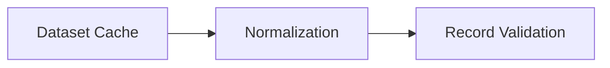

Every subsequent subsystem assumes that normalization has already completed successfully.

---

## 7.4 Normalization Philosophy

Normalization is representation-preserving rather than behavior-modifying.

For example,

```text
def  add ( a , b ) :

return a+b
```

and

```text
def add(a,b):
    return a + b
```

represent identical programs despite their lexical differences.

Normalization transforms both programs into the same canonical representation without altering executable behavior.

Conversely,

changing identifiers,

rewriting algorithms,

optimizing control flow,

or modifying expressions

are not considered normalization.

Such transformations would alter program semantics and therefore belong to later engineering stages, if performed at all.

---

## 7.5 Modality-Specific Normalization

The implementation performs normalization independently for each supported modality.

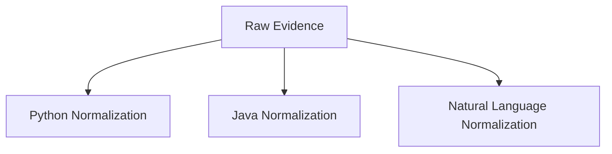

Each modality employs language-specific normalization rules while producing a common internal evidence representation.

---

## 7.6 Python Normalization

Python normalization converts heterogeneous source code into a consistent syntactic representation.

Normalization includes

- newline normalization
- indentation normalization
- whitespace normalization
- token spacing
- quotation consistency where lossless
- removal of dataset token placeholders
- restoration of executable formatting

Programs remain behaviorally identical after normalization.

### Technology Selection

Python normalization primarily adopts components from the Python Standard Library.

The implementation utilizes

- `tokenize`
- `token`
- `io`
- `re`
- `textwrap`

These libraries provide deterministic lexical processing while avoiding modifications to executable behavior.

Parser validation is intentionally deferred to the Record Validation Engine.

---

## 7.7 Java Normalization

Java normalization performs equivalent canonicalization for Java source programs.

Normalization includes

- whitespace normalization
- import formatting
- brace formatting
- spacing around operators
- restoration of executable formatting
- removal of dataset placeholder tokens

Normalization deliberately avoids modifying

- package hierarchy
- method signatures
- class organization
- control flow

These remain part of the original implementation.

Java normalization prepares source code for compilation and parser-based structural analysis performed during Record Validation.

---

## 7.8 Natural Language Normalization

Natural language descriptions frequently contain inconsistencies arising from dataset formatting.

Normalization includes

- whitespace normalization
- Unicode normalization
- punctuation normalization
- duplicated separator removal
- placeholder removal
- sentence reconstruction where lossless

Natural language normalization intentionally preserves semantic meaning while improving subsequent semantic comparison.

---

## 7.9 Dataset Token Recovery

Several public datasets tokenize programming languages using placeholder symbols.

Typical placeholders include

```text
NEW_LINE

INDENT

DEDENT
```

These placeholders prevent successful parsing and compilation.

The Normalization Engine reconstructs executable formatting by replacing placeholder tokens with their canonical lexical representation.

Recovery is performed deterministically using language-specific formatting rules.

This functionality is particularly important for XLCoST, whose tokenized source representations must be reconstructed before parser validation.

---

## 7.10 Canonical Representation

Following normalization, every evidence record satisfies the following properties.

- consistent whitespace
- executable formatting
- normalized textual representation
- deterministic lexical structure
- language-independent metadata

This canonical representation serves as the exclusive input to the Record Validation Engine.

---

## 7.11 Normalization Metadata

Normalization records supplementary metadata describing every transformation performed.

Examples include

- normalization version
- reconstructed formatting
- placeholder recovery
- transformation count
- warnings
- original record reference

Normalization metadata becomes part of the provenance associated with every approved corpus entry.

---

## 7.12 Technology Selection

The Normalization Engine prioritizes deterministic language tooling over custom text processing.

### Python

Primary libraries

- `tokenize`
- `token`
- `io`
- `re`
- `unicodedata`

These components provide deterministic lexical normalization while preserving executable semantics.

---

### Java

Primary libraries

- `re`
- formatting utilities
- Tree-sitter grammar preparation

Structural parsing remains outside the scope of normalization and is performed during Record Validation.

---

### Natural Language

Primary libraries

- `re`
- `unicodedata`
- `string`

These libraries provide lightweight deterministic normalization without altering semantic content.

---

## 7.13 Outputs

The Normalization Engine produces

### Normalized Evidence Repository

Canonical language representations.

### Normalization Metadata

Transformation history for every evidence record.

These artifacts become the exclusive input to the Record Validation Engine.

---

## 7.14 Failure Handling

Normalization failures are uncommon because the stage performs representation-level transformations rather than semantic reasoning.

Typical failures include

- unrecoverable encoding
- malformed placeholder sequences
- unsupported language encoding

Such records remain available for auditing but do not proceed to Record Validation until normalization succeeds.

---

## 7.15 Chapter Summary

The Normalization Engine establishes a canonical representation for every evidence record while preserving original program semantics.

By removing representation-level inconsistencies before validation begins, the implementation ensures that parser failures arise from genuine syntactic errors rather than dataset formatting artifacts.

With normalized evidence now available, the architecture proceeds to deterministic validation of individual programming artifacts through the Record Validation Engine.

---

# Chapter 8

# Record Validation Engine

## 8.1 Purpose

The Record Validation Engine performs deterministic validation of individual evidence records before any cross-language semantic relationships are considered.

Unlike Corpus Validation, which evaluates relationships between modalities, Record Validation treats each artifact independently and determines whether it is suitable for participation in multilingual alignment.

This distinction is fundamental to the architecture.

A syntactically invalid program should never enter semantic alignment, regardless of the quality of its accompanying natural language description.

## 8.2 Design Objectives

The Record Validation Engine satisfies the following objectives.

- Validate individual programming artifacts independently of other modalities.
- Eliminate syntactically invalid evidence before semantic alignment.
- Produce parser-derived structural artifacts for downstream semantic analysis.
- Preserve deterministic validation evidence.
- Prevent invalid records from entering the multilingual evidence pools.
- Maintain complete validation provenance.

Unlike later validation stages, Record Validation does not determine whether two implementations solve the same programming problem. It determines only whether an individual artifact is structurally suitable for subsequent processing.

---

## 8.3 Architectural Position

The Record Validation Engine represents the first semantic quality gate within the implementation.

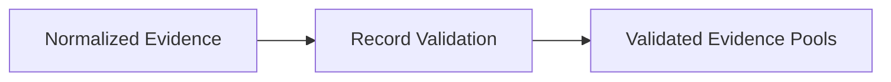

Only validated artifacts are promoted to language-specific evidence pools.

Rejected artifacts are retained within the rejection repository together with complete validation evidence for auditing purposes.

---

## 8.4 Validation Philosophy

The implementation distinguishes between two fundamentally different forms of validation.

### Record Validation

Evaluates an individual artifact.

Questions answered include

- Is this Python program syntactically valid?
- Does this Java program compile?
- Can an Abstract Syntax Tree be constructed?
- Is this natural language description structurally acceptable?

---

### Corpus Validation

Evaluates relationships between multiple artifacts.

Questions answered include

- Does this Natural Language description correspond to the supplied Python implementation?
- Does the Java implementation preserve the semantics of the Python implementation?
- Does the completed multilingual triple satisfy semantic consistency requirements?

This separation simplifies the architecture by ensuring that individual correctness is established before cross-modal reasoning begins.

---

## 8.5 Validation Workflow

Every evidence record follows the same high-level validation workflow regardless of programming language.

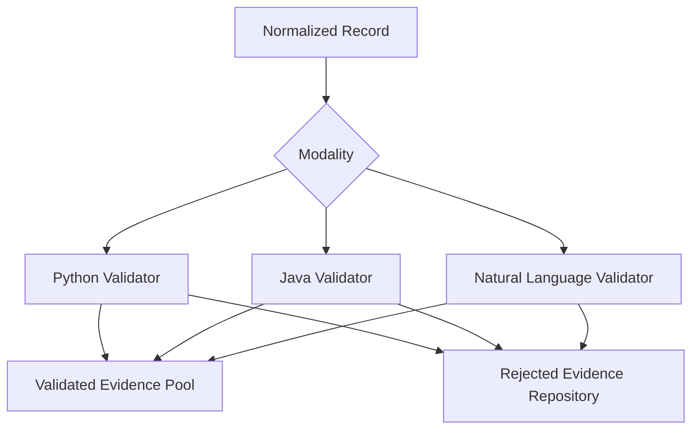

Each validator produces both a validation decision and supplementary structural metadata consumed by later stages of corpus construction.

---

# Python Record Validation

## 8.6 Purpose

Python Record Validation verifies that every normalized Python implementation satisfies the syntactic requirements of the Python language.

Successful validation produces both executable confirmation and a parser-derived Abstract Syntax Tree suitable for structural analysis.

The resulting AST becomes a permanent artifact reused throughout subsequent corpus engineering stages.

---

## 8.7 Validation Workflow

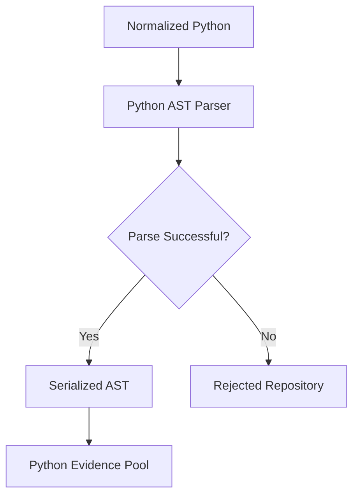

---

## 8.8 Parser Selection

The implementation adopts Python's built-in `ast` module as the canonical parser.

The standard library parser was selected because

- it is deterministic
- it is maintained as part of CPython
- it accurately represents Python language semantics
- it produces a complete hierarchical Abstract Syntax Tree
- it integrates naturally with downstream structural analysis

No custom parser is implemented.

Parser correctness is delegated entirely to the Python language implementation.

---

## 8.9 Structural Artifact Generation

Successful parsing produces a complete Abstract Syntax Tree.

Unlike previous implementation versions that stored simplified structural summaries, the architecture preserves the parser-derived representation itself.

The stored artifact enables

- repeated structural analysis
- semantic similarity computation
- function extraction
- class extraction
- future repository intelligence
- parser-independent downstream processing

Parser artifacts therefore become permanent members of the Approved Corpus.

---

## 8.10 Python Validation Metadata

Successful validation records

- parser version
- parse status
- parser implementation
- AST generation status
- serialized AST
- extracted functions
- extracted classes
- extracted imports
- validation timestamp
- validation version

This metadata accompanies the Python artifact throughout the remainder of corpus construction.

---

## 8.11 Python Validation Failure

Python validation may fail due to

- syntax errors
- incomplete source code
- malformed indentation
- unrecoverable tokenization
- unsupported encoding

Validation failures are deterministic.

No repair is attempted during Record Validation because the objective of this stage is to determine evidence quality rather than modify evidence.

Repair is performed only after the Teacher Completion Engine generates missing modalities.

---

# Java Record Validation

## 8.12 Purpose

Java Record Validation verifies that normalized Java implementations satisfy the syntactic and compilation requirements of the Java language.

Unlike Python, where parser construction alone provides strong syntactic guarantees, Java validation combines compilation with parser-derived structural analysis.

Successful validation produces both an executable compilation unit and a parser-derived syntax tree.

---

## 8.13 Validation Workflow

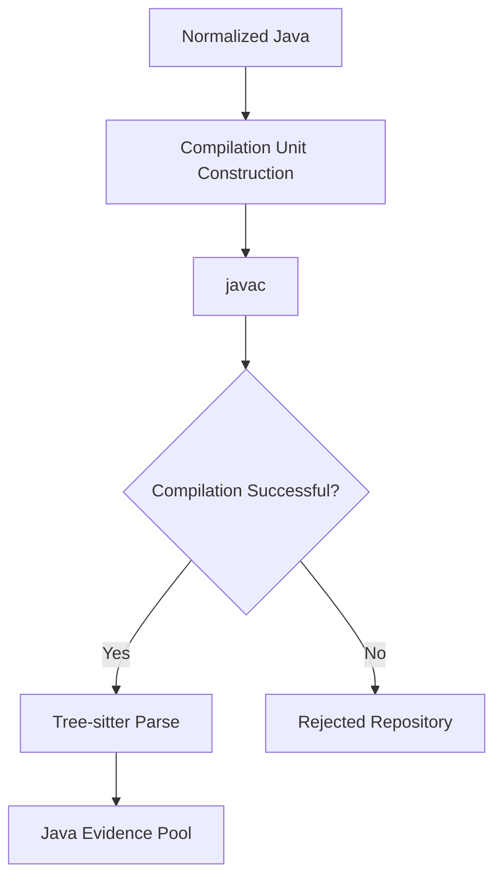

---

## 8.14 Compilation Strategy

The implementation adopts the Java compiler (`javac`) as the authoritative syntactic validator.

Compilation is intentionally performed before structural parsing.

Successful compilation provides strong evidence that the implementation satisfies Java language requirements.

Whenever necessary, the validation engine performs deterministic wrapper reconstruction, including

- compilation unit creation
- class wrapper insertion
- filename alignment
- public class verification

These transformations restore executable structure without modifying program semantics.

---

## 8.15 Parser Selection

Following successful compilation, structural information is extracted using the Tree-sitter Java grammar.

Tree-sitter was selected because it provides

- deterministic parsing
- complete hierarchical syntax trees
- incremental parsing support
- language-independent query capabilities
- future compatibility with repository intelligence workflows

Unlike lightweight token-based approaches, Tree-sitter preserves the complete structural organization of Java programs.

---

## 8.16 Java Structural Artifacts

Successful validation generates a parser-derived syntax tree together with supplementary metadata.

Stored artifacts include

- serialized parse tree
- class definitions
- method declarations
- constructors
- imports
- package declarations
- inheritance hierarchy
- interface implementations

These artifacts become permanent components of the Approved Corpus.

---

## 8.17 Java Validation Metadata

Each validated Java artifact records

- compilation status
- compiler version
- parser version
- parse status
- serialized syntax tree
- extracted classes
- extracted methods
- validation timestamp
- validation version

This information supports reproducibility, auditing and downstream semantic analysis.

---

## 8.18 Java Validation Failure

Java validation may fail because of

- compilation errors
- missing class declarations
- malformed syntax
- incompatible imports
- invalid language constructs

Failed records are preserved within the rejection repository together with compiler diagnostics.

These diagnostics become valuable inputs during later repair workflows when the Teacher Model attempts to regenerate invalid implementations.

---

# Natural Language Validation

## 8.19 Purpose

Natural Language Validation verifies that textual programming descriptions provide meaningful semantic evidence suitable for multilingual alignment.

Unlike programming language validation, natural language validation is not concerned with grammatical perfection.

Instead, it determines whether the description contains sufficient semantic information to support alignment and corpus construction.

---

## 8.20 Validation Workflow

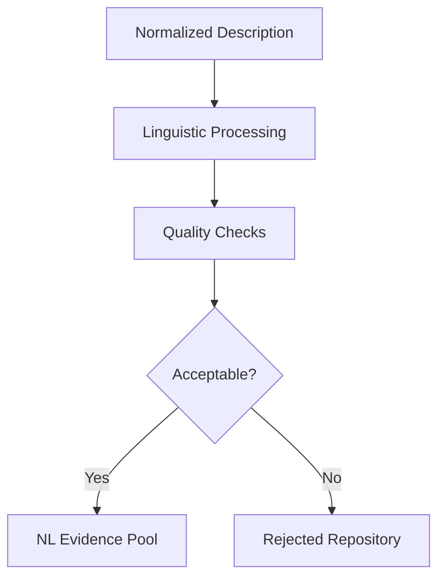

---

## 8.21 Validation Criteria

Natural language descriptions are evaluated according to several deterministic criteria.

These include

- minimum content length
- Unicode validity
- placeholder removal
- duplication detection
- structural completeness
- semantic embedding generation

Descriptions containing only trivial or incomplete information are rejected before semantic alignment begins.

---

## 8.22 Semantic Representation

Following successful validation, every natural language description is converted into a semantic embedding.

The embedding serves two independent purposes.

First, it enables semantic comparison during multilingual alignment.

Second, it provides reusable semantic representations for future retrieval and repository intelligence capabilities.

Embeddings are treated as derived artifacts and are therefore regenerated whenever the underlying embedding model changes.

The original natural language description remains the authoritative textual representation.

---

## 8.23 Technology Selection

The implementation adopts Sentence Transformers for semantic embedding generation.

Sentence Transformers were selected because they provide

- high-quality semantic embeddings
- multilingual support
- deterministic inference
- efficient batch processing
- compatibility with future FAISS indexing

Embedding generation is separated from semantic alignment, allowing alignment algorithms to evolve independently from embedding models.

---

# Validation Outputs

## 8.24 Validated Evidence Pools

Successful Record Validation produces three language-specific evidence repositories.

```text
Validated Evidence

├── Natural Language Pool

├── Python Pool

└── Java Pool
```

Each pool contains only artifacts that have satisfied deterministic validation.

These repositories become the exclusive inputs to the Semantic Alignment Engine.

---

## 8.25 Rejection Repository

Every rejected artifact is preserved together with complete validation evidence.

The rejection repository records

- original evidence
- validation stage
- failure reason
- parser diagnostics
- compiler diagnostics
- validation metadata
- provenance

Maintaining rejected artifacts enables

- debugging
- validation improvement
- regression testing
- corpus quality analysis

without contaminating the validated evidence pools.

---

## 8.26 Technology Summary

The Record Validation Engine deliberately relies on mature language tooling rather than custom parsers.

| Modality | Primary Technology |
|----------|--------------------|
| Python | Python Standard Library `ast` |
| Java Compilation | `javac` |
| Java Parsing | `tree-sitter-java` |
| Natural Language | Sentence Transformers |
| Metadata | JSON |
| Diagnostics | Standard compiler and parser outputs |

Delegating language correctness to established tooling improves robustness while minimizing maintenance complexity.

---

## 8.27 Chapter Summary

The Record Validation Engine establishes the syntactic correctness and structural integrity of individual programming artifacts before any semantic relationships are considered.

Parser-derived Abstract Syntax Trees and syntax trees produced during this stage become permanent engineering artifacts reused throughout the remainder of the architecture.

By validating individual evidence independently, the implementation prevents syntactically invalid artifacts from influencing semantic alignment and subsequent corpus construction.

With validated evidence pools now available for each supported modality, the architecture proceeds to the Semantic Alignment Engine, where independent language artifacts are combined into candidate multilingual programming triples based on semantic equivalence rather than positional correspondence.

---

# Chapter 9

# Semantic Alignment Engine

## 9.1 Purpose

The Semantic Alignment Engine is responsible for constructing multilingual programming relationships from independently validated evidence records.

Unlike earlier implementation approaches that relied on dataset ordering or split-index correspondence, the Semantic Alignment Engine establishes relationships through semantic equivalence.

Its objective is to determine whether independently validated Natural Language, Python and Java artifacts describe the same underlying programming problem.

Only relationships supported by sufficient semantic evidence become eligible for Candidate Corpus construction.

---
## 9.2 Design Objectives

The Semantic Alignment Engine satisfies the following objectives.

- Construct multilingual programming relationships from validated evidence.
- Eliminate dependence on dataset ordering or split indices.
- Support evidence originating from multiple datasets simultaneously.
- Quantify alignment confidence using multiple independent evidence sources.
- Preserve complete alignment provenance.
- Produce complete multilingual candidate triples suitable for teacher-assisted completion.

The Semantic Alignment Engine performs no code generation. Its responsibility is limited to identifying semantically equivalent evidence that can be combined into candidate multilingual programming problems.

---

## 9.3 Architectural Position

The Semantic Alignment Engine operates immediately after Record Validation.

Only validated evidence participates in semantic alignment.

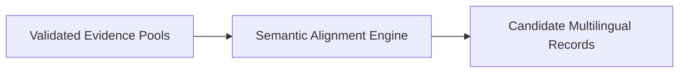

By placing semantic alignment after deterministic validation, the implementation avoids constructing relationships involving syntactically invalid evidence.

---

## 9.4 Alignment Philosophy

The implementation deliberately avoids positional correspondence.

Two records appearing at the same dataset index are **not** assumed to represent the same programming problem.

Similarly, identical problem titles are considered insufficient evidence on their own because textual similarity does not necessarily imply semantic equivalence.

Instead, alignment is treated as an evidence aggregation problem.

Multiple independent observations collectively determine whether two artifacts describe the same underlying task.

This philosophy significantly improves robustness when integrating heterogeneous datasets.

---

## 9.5 Alignment Inputs

The Semantic Alignment Engine consumes validated evidence pools produced by the Record Validation Engine.

```text
Validated Natural Language Pool

+

Validated Python Pool

+

Validated Java Pool

↓

Semantic Alignment
```

Each evidence record already contains

- normalized representation
- parser-derived structural artifact
- provenance
- validation metadata

Consequently, the alignment process can focus entirely on semantic reasoning rather than syntactic correctness.

---

## 9.6 Alignment Workflow

The overall alignment workflow consists of six deterministic stages.

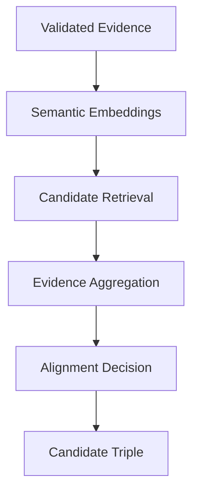

Each stage contributes additional evidence supporting or rejecting a potential multilingual relationship.

---

## 9.7 Semantic Embeddings

Natural language descriptions provide the primary semantic representation used during alignment.

Each validated description is converted into a dense embedding using the configured sentence embedding model.

Embeddings are generated once and cached for reuse throughout corpus construction.

This approach avoids repeated inference while ensuring deterministic alignment behaviour.

The embedding model itself is treated as configurable infrastructure rather than part of the alignment algorithm.

Changing the embedding model therefore requires only regeneration of semantic artifacts without modifying downstream alignment logic.

---

## 9.8 Candidate Retrieval

Semantic embeddings enable efficient retrieval of potentially related evidence.

For every validated evidence record, the implementation retrieves a limited set of semantically similar candidates.

Candidate retrieval intentionally favours recall over precision.

Later evidence aggregation stages eliminate incorrect relationships through additional structural verification.

Future implementations may replace exhaustive search with FAISS indexing without requiring architectural modification.

---

## 9.9 Evidence Aggregation

Candidate relationships are evaluated using multiple independent evidence sources.

Rather than relying upon any single similarity measure, the implementation aggregates complementary observations describing the relationship between artifacts.

Current evidence sources include

- semantic similarity of natural language descriptions
- function signature compatibility
- parser-derived structural characteristics
- language-specific metadata
- dataset provenance
- implementation characteristics

Each evidence source contributes independently to the overall alignment confidence.

---

## 9.10 Alignment Confidence

The implementation computes an alignment confidence score representing the overall strength of semantic evidence.

Conceptually,

```text
Semantic Evidence

+

Structural Evidence

+

Implementation Evidence

+

Provenance Evidence

↓

Alignment Confidence
```

The confidence score is interpreted only within the context of alignment.

It does not represent program correctness or implementation quality.

Only relationships exceeding the configured confidence threshold proceed to Candidate Corpus construction.

---

## 9.11 Parser-Derived Structural Evidence

Structural evidence complements semantic similarity by comparing parser-derived program representations.

Unlike previous implementation versions that stored simplified structural summaries, the current architecture derives structural information directly from parser outputs.

Examples include

Python

- function definitions
- class definitions
- recursion
- loop structures
- conditional structures
- call hierarchy

Java

- class hierarchy
- method declarations
- constructors
- interface implementation
- inheritance
- control-flow structure

These parser-derived characteristics provide significantly stronger semantic evidence than lexical token overlap.

---

## 9.12 Provenance Consistency

Provenance contributes supplementary evidence during alignment.

Although provenance alone never determines semantic equivalence, it provides useful contextual information.

Examples include

- originating dataset
- programming language
- dataset split
- publication version
- adapter implementation

Provenance improves alignment confidence when consistent with stronger semantic observations.

---

## 9.13 Alignment Decision

Every candidate relationship produces one of three outcomes.

### Accepted

Sufficient semantic evidence exists to construct a multilingual relationship.

---

### Ambiguous

Available evidence is inconclusive.

Ambiguous relationships remain available for future investigation but do not participate in corpus construction.

---

### Rejected

Available evidence indicates that the artifacts describe different programming tasks.

Rejected candidates are discarded before Candidate Corpus construction.

---

## 9.14 Technology Selection

The Semantic Alignment Engine combines deterministic software engineering techniques with modern semantic representations.

### Sentence Transformers

Sentence Transformers provide dense semantic embeddings for natural language descriptions.

They were selected because they offer

- high semantic quality
- multilingual capability
- efficient inference
- deterministic batch processing
- compatibility with future vector search infrastructure

---

### NumPy

NumPy performs vector manipulation and similarity computation during evidence aggregation.

The implementation intentionally avoids introducing heavyweight dependencies for relatively simple numerical operations.

---

### RapidFuzz

RapidFuzz provides lightweight lexical similarity measurements.

Lexical similarity contributes supplementary evidence but never determines alignment independently.

---

### FAISS (Future Extension)

The current implementation performs semantic retrieval directly using embedding similarity.

Future versions may adopt FAISS for scalable approximate nearest neighbour search.

The architecture deliberately isolates retrieval from evidence aggregation so that FAISS can be incorporated without affecting downstream corpus engineering.

---

## 9.15 Alignment Outputs

Successful alignment produces Candidate Alignment Records.

Each record contains

- Natural Language evidence
- Python evidence
- Java evidence
- alignment confidence
- supporting evidence
- provenance
- alignment metadata

Candidate Alignment Records are intentionally incomplete with respect to modality coverage.

Missing modalities are resolved by the Teacher Completion Engine described in the following chapter.

---

## 9.16 Failure Handling

Alignment failures generally arise from insufficient semantic evidence rather than implementation errors.

Typical failure conditions include

- inadequate semantic similarity
- conflicting structural evidence
- inconsistent provenance
- missing supporting modalities

Failed candidates are discarded before corpus construction.

No generative processing occurs during semantic alignment.

---

## 9.17 Chapter Summary

The Semantic Alignment Engine transforms independently validated programming artifacts into semantically related multilingual candidate groups.

Unlike earlier alignment strategies based on positional correspondence, the implementation establishes relationships through aggregated semantic evidence derived from embeddings, parser-based structural analysis and provenance.

The resulting Candidate Alignment Records represent partially completed multilingual programming problems.

The following chapter introduces the Teacher Completion Engine, responsible for completing these candidate relationships whenever one or more modalities remain unavailable.

---

# Chapter 10

# Teacher Completion Engine

## 10.1 Purpose

The Teacher Completion Engine constructs complete multilingual programming triples by generating missing modalities that cannot be obtained directly from validated evidence.

The Teacher Model is **not** used to improve existing dataset artifacts.

Instead, it functions as a controlled knowledge completion component operating only after deterministic corpus engineering has been exhausted.

Every generated artifact is regarded as provisional evidence and must subsequently satisfy the same validation requirements imposed on dataset-derived records.

---

## 10.2 Design Objectives

The Teacher Completion Engine satisfies the following objectives.

- Construct complete multilingual triples.
- Generate only missing modalities.
- Preserve validated evidence without modification.
- Produce structured generation metadata.
- Enable deterministic repair through validation feedback.
- Maintain complete provenance distinguishing generated artifacts from dataset-derived evidence.

The Teacher Model therefore extends validated evidence rather than replacing it.

---
## 10.3 Architectural Position

The Teacher Completion Engine is positioned immediately after the Semantic Alignment Engine.

Its purpose is not to construct semantic relationships, but to complete them.

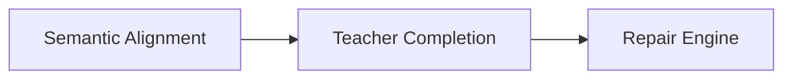

By placing generation after semantic alignment, the implementation ensures that the Teacher Model operates within a well-defined semantic context rather than generating entirely new programming tasks.

---

## 10.4 Completion Philosophy

The implementation adopts an evidence-preserving generation strategy.

Validated evidence is never regenerated.

Instead, the Teacher Model receives all available validated modalities together with explicit instructions identifying the missing representation.

For example,

```text
Natural Language ✓

Python ✓

Java ✗

↓

Generate Java only
```

or

```text
Natural Language ✓

Python ✗

Java ✓

↓

Generate Python only
```

This approach minimizes unnecessary generation while preserving the integrity of validated evidence.

---

## 10.5 Complete Triple Requirement

The Approved Corpus requires every programming problem to contain all three supported modalities.

```text
Natural Language

↓

Python

↓

Java
```

Whenever one or more modalities are unavailable after semantic alignment, the Teacher Completion Engine becomes responsible for producing the missing representation.

No partial records are permitted beyond this stage of the architecture.

---

## 10.6 Completion Workflow

```mermaid
flowchart TD

ALIGN[Candidate Alignment]

CHECK{Complete Triple?}

PASS[Candidate Triple]

PROMPT[Prompt Construction]

MODEL[Teacher Model]

GENERATED[Generated Artifact]

ALIGN --> CHECK

CHECK -->|Yes| PASS

CHECK -->|No| PROMPT

PROMPT --> MODEL

MODEL --> GENERATED

GENERATED --> PASS
```

Generation therefore occurs only when deterministic corpus engineering cannot produce a complete multilingual representation.

---

## 10.7 Prompt Construction

Prompt construction is deterministic.

The implementation assembles prompts using all validated evidence currently available for the programming problem.

The prompt always specifies

- available modalities
- missing modality
- programming language
- generation objective
- output constraints

Examples include

### Missing Python

Input

- Natural Language
- Java

Output

- Python

---

### Missing Java

Input

- Natural Language
- Python

Output

- Java

---

### Missing Natural Language

Input

- Python
- Java

Output

- Natural Language

Prompt templates remain version-controlled to ensure reproducibility of corpus construction.

---

## 10.8 Teacher Model Responsibilities

The Teacher Model performs only three responsibilities.

### Natural Language Generation

Construct a high-quality programming task description consistent with validated implementations.

---

### Python Generation

Generate a Python implementation consistent with validated Natural Language and Java evidence.

---

### Java Generation

Generate a Java implementation consistent with validated Natural Language and Python evidence.

The Teacher Model deliberately avoids

- correcting validated evidence
- optimizing algorithms
- rewriting implementations
- modifying dataset-derived modalities

Such modifications would violate the evidence-preserving philosophy adopted throughout the architecture.

---

## 10.9 Generation Metadata

Every generated artifact records complete generation metadata.

Metadata includes

- teacher model identifier
- model version
- prompt template version
- generation timestamp
- decoding configuration
- generation parameters
- generated modality
- source modalities

Generation metadata becomes part of the permanent provenance stored within the Approved Corpus.

---

## 10.10 Provenance Preservation

Generated artifacts remain distinguishable from dataset-derived evidence throughout the lifetime of the project.

Each modality records

- dataset-derived

or

- teacher-generated

together with complete provenance describing how the artifact entered the corpus.

This distinction enables future corpus auditing while preserving transparency regarding generated evidence.

---

## 10.11 Technology Selection

The Teacher Completion Engine adopts a modern instruction-tuned code generation model capable of multilingual reasoning.

Selection criteria include

- strong code generation capability
- multilingual support
- deterministic inference
- compatibility with Hugging Face Transformers
- efficient execution within Google Colab

The architecture intentionally abstracts the Teacher Model behind a stable interface.

Replacing the underlying model therefore requires no modifications to downstream engineering components.

---

## 10.12 Generation Constraints

Teacher-generated artifacts must satisfy several constraints before entering the Repair Engine.

Generated implementations must

- target the requested language exclusively
- preserve the semantics of validated evidence
- avoid explanatory prose
- produce executable source code
- satisfy parser requirements

Natural language generation must

- accurately describe the programming problem
- remain implementation-independent
- avoid solution leakage
- preserve semantic consistency with validated code

These constraints simplify downstream validation while improving corpus consistency.

---

## 10.13 Teacher Outputs

The Teacher Completion Engine produces Completed Candidate Records.

Each completed record contains

- Natural Language
- Python
- Java

together with

- generation metadata
- provenance
- completion status

Completed records remain provisional.

They have **not** yet been accepted into the Approved Corpus.

Instead, they immediately enter the Repair Engine.

---

## 10.14 Chapter Summary

The Teacher Completion Engine completes multilingual programming triples without modifying validated evidence.

Generation occurs only when deterministic corpus engineering cannot produce a complete multilingual representation.

Every generated artifact is treated as provisional evidence and therefore proceeds directly into the Repair Engine, where deterministic validation governs acceptance or regeneration.

---

# Chapter 11

# Repair Engine

## 11.1 Purpose

The Repair Engine validates every teacher-generated artifact and automatically attempts correction whenever validation fails.

Unlike conventional generation pipelines that accept model output directly, the implementation introduces a bounded validation-guided repair workflow.

Generation therefore becomes an iterative engineering process rather than a one-time inference step.

The Repair Engine represents one of the primary quality assurance mechanisms within the architecture.

---

## 11.2 Design Objectives

The Repair Engine satisfies the following objectives.

- Validate generated artifacts immediately.
- Produce structured validation feedback.
- Automatically regenerate invalid outputs.
- Preserve deterministic execution bounds.
- Record complete repair history.
- Prevent invalid generated artifacts from entering the Candidate Corpus.

---

## 11.3 Repair Philosophy

The Teacher Model is not assumed to generate correct artifacts on the first attempt.

Instead,

```
Generation

↓

Validation

↓

Feedback

↓

Generation

↓

Validation

↓

Feedback

↓

Generation

↓

Validation
```

continues until

- validation succeeds

or

- the repair budget is exhausted.

This philosophy substantially improves corpus quality while preserving deterministic runtime.

---

## 11.4 Repair Workflow

```mermaid
flowchart TD

GEN[Generated Artifact]

VALIDATE[Validation]

PASS{Valid?}

SUCCESS[Completed Candidate]

FEEDBACK[Structured Feedback]

REGENERATE[Teacher Regeneration]

FAILURE[Reject Candidate]

GEN --> VALIDATE

VALIDATE --> PASS

PASS -->|Yes| SUCCESS

PASS -->|No| FEEDBACK

FEEDBACK --> REGENERATE

REGENERATE --> VALIDATE

VALIDATE --> FAILURE
```

The workflow is intentionally bounded.

Infinite repair cycles are impossible.

---

## 11.5 Validation Feedback

Validation failures produce structured feedback rather than free-form error messages.

Examples include

Python

- syntax error
- indentation error
- parser failure

Java

- compilation error
- missing class wrapper
- missing method
- parser failure

Natural Language

- insufficient semantic content
- malformed description
- unsupported formatting

Structured feedback enables deterministic regeneration while simplifying future analysis.

---

## 11.6 Three-Attempt Repair Budget

The implementation adopts a maximum of three repair attempts.

```
Attempt 1

↓

Validation

↓

Attempt 2

↓

Validation

↓

Attempt 3

↓

Validation

↓

Reject
```

The repair budget represents a fixed architectural constraint.

Increasing or decreasing the budget requires explicit modification of the system configuration and therefore becomes traceable through version control.

The bounded repair strategy balances corpus quality against computational efficiency while preventing unbounded generation loops.

---
## 11.7 Validation Feedback Model

Validation feedback is represented as structured engineering data rather than natural language explanations.

Each validation event records

- validation stage
- validation component
- validation outcome
- failure category
- diagnostic information
- repair recommendation

This representation allows the Teacher Model to receive precise regeneration instructions while simultaneously enabling statistical analysis of recurring failure patterns.

A conceptual validation feedback record consists of

```text
Validation Stage

↓

Failure Category

↓

Diagnostic Information

↓

Recommended Repair

↓

Attempt Number
```

The feedback model therefore serves two independent purposes.

First, it guides regeneration during the current repair cycle.

Second, it provides engineering evidence for future improvements to prompt templates and corpus construction strategies.

---

## 11.8 Repair History

Every repair attempt is permanently recorded.

Repair history includes

- attempt number
- generated modality
- validation result
- failure reason
- validation diagnostics
- regeneration timestamp
- prompt template version
- teacher model version

Repair history remains associated with the multilingual corpus entry even after successful validation.

This information enables

- corpus auditing
- regeneration analysis
- teacher model comparison
- prompt engineering evaluation
- future architectural refinement

without requiring repeated experimentation.

---

## 11.9 Successful Repair

A repair cycle terminates immediately after successful validation.

Successful completion records

- successful attempt number
- total repair iterations
- final validation evidence
- completion timestamp

The validated artifact is then promoted into the Candidate Corpus.

No additional regeneration occurs once deterministic validation has succeeded.

---

## 11.10 Repair Failure

A repair cycle terminates unsuccessfully when

- three repair attempts have been exhausted
- deterministic validation continues to fail
- unrecoverable generation errors occur

Rejected artifacts remain available for engineering analysis but never become members of the Candidate Corpus.

The rejection repository therefore provides valuable information regarding

- difficult programming tasks
- recurring teacher model limitations
- prompt engineering weaknesses
- validation bottlenecks

This information supports future improvements without compromising corpus quality.

---

## 11.11 Technology Selection

The Repair Engine deliberately reuses existing validation infrastructure rather than implementing separate repair-specific validators.

Validation responsibilities remain delegated to

Python

- Python Standard Library `ast`

Java

- `javac`
- Tree-sitter Java grammar

Natural Language

- semantic quality validation

This architectural decision guarantees identical acceptance criteria for both dataset-derived and teacher-generated evidence.

---

## 11.12 Repair Outputs

The Repair Engine produces one of two outcomes.

### Successfully Repaired Candidate

A completed multilingual programming triple satisfying all deterministic validation requirements.

---

### Rejected Candidate

A permanently rejected multilingual candidate together with complete repair history and validation diagnostics.

Only successfully repaired candidates proceed to Candidate Corpus construction.

---

## 11.13 Chapter Summary

The Repair Engine transforms generative inference into a deterministic engineering workflow by introducing validation-guided regeneration bounded by a fixed repair budget.

Every generated modality either satisfies deterministic validation or is rejected.

Consequently, the Candidate Corpus never contains unvalidated teacher-generated artifacts.

With complete multilingual programming triples now available, the architecture proceeds to Candidate Corpus construction.

---

# Chapter 12

# Candidate Corpus

## 12.1 Purpose

The Candidate Corpus represents the first complete multilingual representation produced during corpus engineering.

Each Candidate Corpus entry contains

- Natural Language
- Python
- Java

regardless of whether individual modalities originated from external datasets or the Teacher Completion Engine.

Unlike the Approved Corpus, Candidate Corpus entries remain provisional.

Every candidate must still satisfy relationship-level validation before becoming permanent corpus knowledge.

---

## 12.2 Design Objectives

The Candidate Corpus satisfies the following objectives.

- Consolidate complete multilingual triples.
- Preserve complete provenance.
- Maintain parser-derived structural artifacts.
- Record generation history.
- Record repair history.
- Provide a stable input for Corpus Validation.

The Candidate Corpus therefore represents the final staging area before multilingual knowledge becomes part of the Approved Corpus.

---

## 12.3 Architectural Position

```mermaid
flowchart LR

RepairEngine

CandidateCorpus

CorpusValidation

RepairEngine --> CandidateCorpus

CandidateCorpus --> CorpusValidation
```

Every Candidate Corpus entry has already satisfied

- normalization
- record validation
- semantic alignment
- teacher completion (where required)
- repair validation

Only cross-modal semantic validation remains.

---

## 12.4 Candidate Corpus Philosophy

The Candidate Corpus intentionally separates multilingual construction from multilingual approval.

This distinction enables

- independent auditing
- validation experimentation
- future validation strategies
- regression testing

without modifying the permanent Approved Corpus.

Candidate Corpus entries therefore function as engineering work products awaiting formal acceptance.

---

## 12.5 Candidate Corpus Schema

Conceptually, every Candidate Corpus entry consists of

```text
Corpus Identifier

↓

Natural Language

↓

Python

↓

Java

↓

Python AST

↓

Java Parse Tree

↓

Generation Metadata

↓

Repair History

↓

Provenance

↓

Validation Status
```

Unlike earlier implementation versions, parser-derived structural artifacts are stored directly.

Simplified structural summaries are intentionally excluded from the corpus representation.

---

## 12.6 Candidate Metadata

Each candidate records

### Identity

- corpus identifier
- candidate identifier

---

### Language Artifacts

- Natural Language
- Python
- Java

---

### Structural Artifacts

- Python AST
- Java parse tree

---

### Semantic Artifacts

- embedding reference
- alignment confidence

---

### Provenance

- originating datasets
- alignment strategy
- generation history
- repair history

---

### Engineering Metadata

- corpus version
- construction timestamp
- normalization version
- parser versions

This metadata ensures complete traceability throughout corpus construction.

---

## 12.7 Candidate Construction Workflow

```mermaid
flowchart TD

ValidatedEvidence

Alignment

Teacher

Repair

CandidateRow

ValidatedEvidence --> Alignment

Alignment --> Teacher

Teacher --> Repair

Repair --> CandidateRow
```

Candidate construction performs no additional validation.

Its sole responsibility is consolidating validated multilingual evidence into a single engineering artifact.

---

## 12.8 Candidate Integrity

Every Candidate Corpus entry satisfies several deterministic integrity constraints.

Each entry contains

- one Natural Language description
- one Python implementation
- one Java implementation
- one Python AST
- one Java parse tree

Generation history and repair history may be empty when all modalities originate directly from validated datasets.

Otherwise they provide complete documentation of the completion process.

---

## 12.9 Candidate Repository

Candidate Corpus entries are maintained separately from the Approved Corpus.

```text
candidate_corpus/

├── candidate_corpus.jsonl

├── metadata/

├── validation/

└── provenance/
```

Maintaining an independent repository enables

- intermediate inspection
- validation benchmarking
- engineering analysis
- corpus quality improvement

without affecting approved knowledge.

---

## 12.10 Candidate Outputs

The Candidate Corpus produces

### Candidate Repository

Complete multilingual candidate records.

---

### Candidate Metadata Repository

Engineering metadata associated with every candidate.

---

### Validation Queue

Candidate records awaiting relationship-level validation.

These artifacts become the exclusive inputs to the Corpus Validation Engine.

---

## 12.11 Chapter Summary

The Candidate Corpus consolidates validated multilingual programming triples into a unified engineering artifact while preserving complete structural, semantic and provenance information.

Although every candidate already satisfies deterministic artifact validation, semantic consistency across modalities has not yet been established.

The following chapter introduces the Corpus Validation Engine, the final quality assurance stage responsible for determining whether a Candidate Corpus entry becomes permanent multilingual knowledge within the Approved Corpus.

---

# Chapter 13

# Corpus Validation Engine

## 13.1 Purpose

The Corpus Validation Engine performs the highest level of quality assurance within the implementation.

Unlike the Record Validation Engine, which evaluates individual artifacts independently, the Corpus Validation Engine evaluates relationships between modalities.

Its responsibility is to determine whether the Natural Language description, Python implementation and Java implementation collectively represent the same programming task.

Only candidates satisfying every relationship-level validation requirement become members of the Approved Corpus.

---

## 13.2 Design Objectives

The Corpus Validation Engine satisfies the following objectives.

- Verify multilingual semantic consistency.
- Validate relationships between modalities.
- Compute parser-derived structural similarity.
- Execute trusted tests whenever available.
- Produce approval decisions.
- Preserve complete validation evidence.

The Approved Corpus therefore contains only multilingual programming problems that satisfy both individual validation and cross-modal validation.

---

## 13.3 Architectural Position

```mermaid
flowchart LR

CandidateCorpus

CorpusValidation

ApprovedCorpus

CandidateCorpus --> CorpusValidation

CorpusValidation --> ApprovedCorpus
```

The Corpus Validation Engine represents the final engineering gate before permanent corpus approval.

No downstream subsystem can bypass this stage.

---
## 13.4 Corpus Validation Philosophy

The architecture distinguishes between **artifact correctness** and **relationship correctness**.

Artifact correctness is established during Record Validation through deterministic parsing, compilation and language-specific validation.

Relationship correctness is established during Corpus Validation by determining whether independently validated modalities describe the same programming problem.

This distinction is fundamental to the architecture.

A syntactically valid Python implementation and a syntactically valid Java implementation may still represent different algorithms or solve unrelated problems.

Similarly, a high-quality natural language description may not accurately describe either implementation.

Corpus Validation therefore focuses exclusively on semantic consistency across modalities.

---

## 13.5 Validation Workflow

The Corpus Validation Engine evaluates every Candidate Corpus entry using a deterministic multi-stage workflow.

```mermaid
flowchart TD

Candidate[Candidate Corpus Entry]

NL[NL ↔ Python Validation]

PYJAVA[Python ↔ Java Validation]

NLJAVA[NL ↔ Java Validation]

STRUCT[Structural Similarity]

TESTS[Trusted Test Execution]

DECISION{Approval Decision}

Approved[Approved Corpus]

Rejected[Rejected Repository]

Candidate --> NL

NL --> PYJAVA

PYJAVA --> NLJAVA

NLJAVA --> STRUCT

STRUCT --> TESTS

TESTS --> DECISION

DECISION -->|Approved| Approved

DECISION -->|Rejected| Rejected
```

Every stage contributes independent evidence toward the final approval decision.

---

## 13.6 Relationship Validation

Corpus Validation performs three primary relationship checks.

### Natural Language ↔ Python

Determines whether the programming task described by the natural language specification is consistent with the validated Python implementation.

Evidence includes

- semantic similarity
- function intent
- parser-derived structure
- implementation characteristics

---

### Natural Language ↔ Java

Determines whether the natural language description accurately represents the validated Java implementation.

Validation follows the same methodology adopted for Python.

---

### Python ↔ Java

Determines whether both implementations solve the same programming problem.

Unlike lexical translation comparison, the implementation evaluates semantic consistency using parser-derived program structure and execution behaviour whenever trusted tests are available.

---

## 13.7 Parser-Derived Structural Similarity

Earlier implementation versions relied upon simplified structural representations.

The current architecture adopts parser-derived structural analysis.

Python structural information originates directly from the Abstract Syntax Tree.

Java structural information originates directly from the Tree-sitter parse tree.

Structural similarity is therefore computed using parser-derived program representations rather than lexical token sequences.

Conceptually,

```text
Python AST

↓

Structural Features

↓

CSR Similarity

↑

Structural Features

↑

Java Parse Tree
```

Only the resulting structural similarity score is stored permanently within the Approved Corpus.

Parser-derived structural artifacts remain available for future analyses.

---

## 13.8 Cross-Language Structural Representation (CSR)

The implementation adopts a parser-derived Cross-Language Structural Representation (CSR).

Unlike previous implementations that stored simplified CSR objects directly, the Approved Corpus stores

- Python AST
- Java parse tree
- computed CSR similarity score

The CSR itself is generated dynamically from parser outputs whenever structural comparison is required.

This design provides two important advantages.

First, improvements to CSR computation automatically benefit existing corpus entries without requiring corpus reconstruction.

Second, future structural comparison algorithms can reuse the stored parser artifacts without modification.

---

## 13.9 Trusted Test Execution

Whenever trusted executable test cases are available, Corpus Validation performs execution-based semantic verification.

Execution validation provides the strongest available evidence regarding behavioural equivalence.

Execution consists of

Python

↓

Execute trusted tests

↓

Capture outputs

↓

Java

↓

Execute trusted tests

↓

Capture outputs

↓

Compare behaviour

Execution validation complements structural similarity rather than replacing it.

Programs satisfying structural similarity but producing different outputs are rejected.

---

## 13.10 Approval Criteria

A Candidate Corpus entry is approved only when all required validation stages succeed.

Minimum approval requirements include

- validated Natural Language
- validated Python
- validated Java
- semantic consistency
- parser-derived structural similarity above threshold
- successful trusted test execution when available
- complete provenance

Failure of any mandatory validation stage results in rejection.

---

## 13.11 Validation Outcomes

Every candidate produces one of two outcomes.

### Approved

The multilingual programming problem satisfies all validation requirements.

The candidate becomes a permanent member of the Approved Corpus.

---

### Rejected

One or more relationship-level validation requirements were not satisfied.

Rejected candidates remain available for engineering analysis together with complete validation evidence.

---

## 13.12 Validation Metadata

Every approval decision records

- validation timestamp
- corpus validator version
- structural similarity score
- semantic similarity evidence
- execution validation status
- trusted test status
- approval decision
- rejection reason (if applicable)

Validation metadata provides complete auditability of every Approved Corpus entry.

---

## 13.13 Technology Selection

Corpus Validation combines deterministic language tooling with semantic analysis.

| Validation Activity | Primary Technology |
|---------------------|--------------------|
| Python Parsing | Python `ast` |
| Java Parsing | Tree-sitter Java |
| Java Compilation | `javac` |
| Semantic Embeddings | Sentence Transformers |
| CSR Computation | Parser-derived structural comparison |
| Execution Validation | Python interpreter, JVM |
| Result Storage | JSONL |

The implementation intentionally avoids heuristic validation whenever deterministic alternatives exist.

---

## 13.14 Failure Handling

Typical rejection reasons include

- semantic inconsistency
- insufficient structural similarity
- execution mismatch
- missing trusted evidence
- inconsistent provenance

Rejected candidates never participate in task generation or model training.

Instead, they remain archived for future engineering analysis and regression testing.

---

## 13.15 Chapter Summary

The Corpus Validation Engine represents the final quality assurance stage of corpus engineering.

Unlike Record Validation, which establishes individual artifact correctness, Corpus Validation establishes multilingual semantic consistency.

Successful validation produces the central architectural artifact of the implementation: the Approved Corpus.

---

# Chapter 14

# Approved Corpus

## 14.1 Purpose

The Approved Corpus represents the authoritative multilingual knowledge repository of RepoCoder Studio.

Every downstream activity—including task generation, student model training, evaluation and future repository intelligence—is derived exclusively from the Approved Corpus.

No downstream subsystem accesses public datasets directly.

The Approved Corpus therefore forms the architectural centre of the entire implementation.

---

## 14.2 Design Objectives

The Approved Corpus satisfies the following objectives.

- Maintain validated multilingual programming knowledge.
- Preserve parser-derived structural artifacts.
- Preserve complete provenance.
- Preserve validation history.
- Preserve generation history.
- Support reproducible task generation.
- Enable future repository intelligence.

Unlike transient engineering artifacts produced during corpus construction, the Approved Corpus is permanent and versioned.

---

## 14.3 Architectural Position

```mermaid
flowchart TD

CorpusValidation

ApprovedCorpus

TaskRegistry

Training

Evaluation

CorpusValidation --> ApprovedCorpus

ApprovedCorpus --> TaskRegistry

ApprovedCorpus --> Training

ApprovedCorpus --> Evaluation
```

Every downstream subsystem consumes the Approved Corpus.

No downstream subsystem depends upon external datasets.

---

## 14.4 Corpus Philosophy

The Approved Corpus represents validated knowledge rather than collected data.

Every entry satisfies

- deterministic artifact validation
- semantic alignment
- complete modality coverage
- parser-derived structural verification
- corpus validation
- provenance preservation

Consequently, the Approved Corpus serves as the single source of truth throughout the implementation.

---

## 14.5 Approved Corpus Schema

Each Approved Corpus entry contains the following conceptual structure.

```text
Corpus Identifier

↓

Natural Language

↓

Python

↓

Java

↓

Python AST

↓

Java Parse Tree

↓

CSR Similarity Score

↓

Trusted Tests

↓

Generation Metadata

↓

Repair History

↓

Validation Metadata

↓

Provenance

↓

Corpus Version
```

The architecture deliberately stores parser-derived structural artifacts rather than derived CSR objects.

CSR values are computed dynamically whenever structural comparison is required.

---

## 14.6 Multimodal Knowledge Representation

Each Approved Corpus entry represents a single programming problem through three complementary perspectives.

### Natural Language

Human-readable task specification.

---

### Python

Reference executable implementation.

---

### Java

Semantically equivalent executable implementation.

Together these modalities provide a complete multilingual representation suitable for multiple downstream learning objectives.

---

## 14.7 Structural Knowledge

Structural program knowledge is preserved through parser-derived artifacts.

Python

- Abstract Syntax Tree

Java

- Tree-sitter parse tree

Parser artifacts remain language-specific.

Cross-language structural similarity is represented only through the computed CSR similarity score.

This design maximizes flexibility for future structural comparison algorithms.

---

## 14.8 Provenance Preservation

Every Approved Corpus entry records complete provenance.

This includes

- originating datasets
- dataset versions
- alignment evidence
- teacher generation history
- repair history
- validation versions
- parser versions
- corpus version

Complete provenance enables deterministic regeneration of every corpus entry and supports long-term reproducibility of the project.

---
## 14.9 Corpus Versioning

The Approved Corpus is maintained as a versioned engineering artifact.

A new corpus version is created whenever one or more of the following conditions occur.

- Evidence sources are updated.
- Normalization rules change.
- Validation algorithms change.
- Alignment strategy changes.
- Teacher model changes.
- Repair strategy changes.
- Parser versions change.
- Trusted Test Repository changes.

Each corpus version remains immutable after publication.

This immutability guarantees that historical experiments remain reproducible even as corpus engineering continues to evolve.

---

## 14.10 Corpus Storage

The Approved Corpus is persisted using a structured repository layout.

```text
approved_corpus/

├── approved_corpus.jsonl
│
├── metadata/
│   ├── corpus_metadata.json
│   ├── statistics.json
│   └── version.json
│
├── provenance/
│
├── ast/
│   ├── python/
│   └── java/
│
├── validation/
│
└── trusted_tests/
```

The repository intentionally separates corpus content from engineering metadata.

This organization simplifies corpus inspection while supporting future extensions.

---

## 14.11 Corpus Integrity

Every Approved Corpus entry satisfies the following integrity constraints.

- Exactly one Natural Language description.
- Exactly one Python implementation.
- Exactly one Java implementation.
- Valid parser-derived Python AST.
- Valid parser-derived Java parse tree.
- One computed CSR similarity score.
- Complete provenance.
- Complete validation metadata.
- Corpus version identifier.

Violation of any integrity constraint results in rejection during Corpus Validation.

---

## 14.12 Corpus Statistics

The implementation maintains aggregate corpus statistics for every published corpus version.

Statistics include

- approved entry count
- rejected entry count
- dataset contributions
- language distribution
- teacher-generated modality counts
- repair frequency
- structural similarity distribution
- trusted test coverage
- approval rate

Corpus statistics support engineering analysis while providing a concise summary of corpus quality.

---

## 14.13 Corpus APIs

The Approved Corpus exposes a stable interface to downstream components.

Primary operations include

- retrieve entry
- retrieve provenance
- retrieve parser artifacts
- retrieve trusted tests
- retrieve validation metadata
- enumerate corpus entries
- generate task views

No downstream component is permitted to modify corpus entries directly.

All modifications require reconstruction through the corpus engineering pipeline.

---

## 14.14 Technology Selection

The Approved Corpus adopts lightweight, language-independent storage technologies.

### JSONL

JSON Lines is adopted for primary corpus storage because it provides

- streaming support
- append-friendly storage
- language independence
- human readability
- compatibility with machine learning workflows

---

### Structured Metadata

Engineering metadata is stored separately using JSON.

Separating metadata from corpus entries simplifies analysis while preserving extensibility.

---

### Parser Artifacts

Parser-derived ASTs and syntax trees are stored using serialized parser-native representations.

Parser artifacts remain independent of CSR computation.

Future structural comparison algorithms therefore operate directly on authoritative parser outputs.

---

## 14.15 Chapter Summary

The Approved Corpus represents the authoritative multilingual knowledge repository of RepoCoder Studio.

It contains only fully validated programming problems together with parser-derived structural artifacts, provenance, validation evidence and trusted tests.

Every downstream learning task originates from this repository, making the Approved Corpus the central engineering asset of the entire implementation.

The following chapter introduces the Trusted Test Repository, which provides executable behavioural evidence used during corpus validation and future model evaluation.

---

# Chapter 15

# Trusted Test Repository

## 15.1 Purpose

The Trusted Test Repository maintains executable test suites used to verify behavioural correctness during corpus validation and model evaluation.

Unlike parser-based validation, which verifies structural correctness, trusted tests evaluate observable program behaviour.

Whenever executable tests are available, they provide the strongest evidence that two multilingual implementations are semantically equivalent.

The Trusted Test Repository therefore complements structural validation rather than replacing it.

---

## 15.2 Design Objectives

The Trusted Test Repository satisfies the following objectives.

- Preserve trustworthy executable tests.
- Support multilingual behavioural validation.
- Separate trusted tests from generated tests.
- Enable execution-based corpus validation.
- Provide reusable evaluation benchmarks.
- Preserve test provenance.

The repository is intentionally independent of both the Approved Corpus and the evaluation framework.

It serves both subsystems through a shared interface.

---

## 15.3 Architectural Position

```mermaid
flowchart TD

ApprovedCorpus

TrustedTests

CorpusValidation

Evaluation

ApprovedCorpus --> TrustedTests

TrustedTests --> CorpusValidation

TrustedTests --> Evaluation
```

Trusted tests are associated with Approved Corpus entries but remain independently managed.

This separation enables future improvements to testing without requiring reconstruction of the Approved Corpus.

---

## 15.4 Test Philosophy

The implementation distinguishes between several categories of executable tests.

### Dataset-Derived Tests

Tests obtained directly from trusted public datasets.

These represent the highest-confidence executable evidence.

---

### Teacher-Generated Tests

When trusted tests are unavailable, the Teacher Model may propose candidate tests.

Teacher-generated tests are **never** trusted automatically.

They undergo independent validation before entering the repository.

---

### Curated Tests

Tests manually introduced during engineering or benchmarking.

Curated tests undergo the same validation and provenance recording as every other repository artifact.

---

## 15.5 Test Validation

Every candidate test undergoes deterministic validation before becoming part of the Trusted Test Repository.

Validation includes

- syntax validation
- execution validation
- determinism verification
- duplicate detection
- provenance recording

Only validated tests become trusted assets.

---

## 15.6 Test Association

Trusted tests are associated with Approved Corpus entries through the corpus identifier.

Conceptually,

```text
Approved Corpus Entry

↓

Corpus Identifier

↓

Trusted Test Suite
```

Multiple test suites may be associated with the same multilingual programming problem.

This architecture enables progressive improvement of behavioural coverage without modifying corpus content.

---

## 15.7 Test Metadata

Each trusted test records

- test identifier
- associated corpus identifier
- originating source
- validation status
- execution environment
- language
- timestamp
- repository version

Complete metadata enables reproducible execution and future repository auditing.

---

## 15.8 Repository Organization

The Trusted Test Repository is organized independently from the Approved Corpus.

```text
trusted_tests/

├── python/
│
├── java/
│
├── metadata/
│
├── validation/
│
└── provenance/
```

The repository layout intentionally mirrors the modular organization adopted throughout the implementation.

---

## 15.9 Technology Selection

Trusted tests adopt lightweight language-native execution environments.

Python tests execute using the configured Python interpreter.

Java tests execute through the Java Virtual Machine after successful compilation.

Execution results are recorded using structured JSON metadata to facilitate reproducible behavioural comparison.

---

## 15.10 Repository Outputs

The Trusted Test Repository provides

- validated executable tests
- execution metadata
- behavioural validation evidence
- reusable evaluation benchmarks

These artifacts are consumed by both Corpus Validation and the Evaluation Framework.

---

## 15.11 Future Expansion

Although the current implementation primarily utilizes dataset-derived trusted tests, the architecture supports future incorporation of

- property-based testing
- symbolic execution
- fuzz testing
- repository-derived regression tests

without requiring modification of downstream validation logic.

---

## 15.12 Chapter Summary

The Trusted Test Repository extends parser-derived validation through executable behavioural evidence.

By maintaining independently validated test suites together with complete provenance, the implementation strengthens both corpus validation and downstream evaluation while preserving architectural separation between knowledge construction and behavioural verification.

---

# Part III

# Model Pipeline

Unlike conventional machine learning workflows that construct task-specific datasets directly from external repositories, RepoCoder Studio derives every learning objective from the Approved Corpus.

The Model Pipeline therefore consumes validated multilingual knowledge rather than heterogeneous public datasets.

This architectural decision ensures that improvements in corpus quality automatically improve every downstream learning task without modifying the training pipeline itself.

The following chapters describe the construction of the Task Registry, the Student Model training workflow and the evaluation framework built upon the Approved Corpus.
# Chapter 16

# Task Registry

## 16.1 Purpose

The Task Registry transforms validated multilingual knowledge contained within the Approved Corpus into standardized learning tasks suitable for student model optimization and evaluation.

Unlike conventional machine learning pipelines where tasks are derived directly from individual datasets, the Task Registry derives every task from a single authoritative knowledge source.

Consequently, every learning objective benefits automatically from improvements made during corpus engineering.

The Task Registry therefore represents the interface between knowledge engineering and machine learning.

---

## 16.2 Design Objectives

The Task Registry satisfies the following objectives.

- Generate training tasks exclusively from the Approved Corpus.
- Maintain a consistent instruction format across all learning objectives.
- Preserve complete traceability between every task and its originating corpus entry.
- Support balanced multitask learning.
- Enable independent evaluation of each supported capability.
- Provide a stable interface to the Student Training Pipeline.

---

## 16.3 Architectural Position

```mermaid
flowchart LR

ApprovedCorpus

TaskRegistry

TrainingDataset

ApprovedCorpus --> TaskRegistry

TaskRegistry --> TrainingDataset
```

The Task Registry is the only subsystem permitted to transform Approved Corpus entries into model training examples.

No downstream component accesses the Approved Corpus directly.

---

## 16.4 Task Generation Philosophy

The implementation adopts a **knowledge-first** rather than **dataset-first** learning strategy.

Every Approved Corpus entry already contains

- Natural Language
- Python
- Java

Therefore, every programming problem naturally supports multiple learning objectives.

Instead of maintaining separate datasets for each capability, the Task Registry derives multiple tasks from the same validated multilingual knowledge.

This design ensures

- identical semantic grounding
- consistent supervision
- simplified maintenance
- complete traceability

across every learning objective.

---

## 16.5 Supported Learning Tasks

The current implementation defines six primary learning tasks.

### Task T1 — Natural Language → Python

**Objective**

Generate a correct Python implementation from a validated programming task description.

Input

```text
Natural Language
```

Output

```text
Python
```

---

### Task T2 — Natural Language → Java

**Objective**

Generate a correct Java implementation from a validated programming task description.

Input

```text
Natural Language
```

Output

```text
Java
```

---

### Task T3 — Python → Java

**Objective**

Translate a validated Python implementation into an equivalent Java implementation while preserving program behaviour.

Input

```text
Python
```

Output

```text
Java
```

---

### Task T4 — Java → Python

**Objective**

Translate a validated Java implementation into an equivalent Python implementation.

Input

```text
Java
```

Output

```text
Python
```

---

### Task T5 — Python → Natural Language

**Objective**

Generate a concise natural language description describing the validated Python implementation.

Input

```text
Python
```

Output

```text
Natural Language
```

---

### Task T6 — Java → Natural Language

**Objective**

Generate a concise natural language description describing the validated Java implementation.

Input

```text
Java
```

Output

```text
Natural Language
```

---

## 16.6 Task Expansion Workflow

Every Approved Corpus entry expands deterministically into six learning examples.

```mermaid
flowchart TD

Corpus[Approved Corpus Entry]

T1[NL → Python]

T2[NL → Java]

T3[Python → Java]

T4[Java → Python]

T5[Python → NL]

T6[Java → NL]

Corpus --> T1
Corpus --> T2
Corpus --> T3
Corpus --> T4
Corpus --> T5
Corpus --> T6
```

This expansion strategy maximizes supervision while maintaining semantic consistency across all tasks.

---

## 16.7 Unified Instruction Format

Every generated task adopts a common instruction format.

```text
### Instruction

...

### Input

...

### Response

...
```

The instruction format remains independent of task type.

Only the instruction text and expected response modality change.

Maintaining a common prompt structure simplifies tokenizer preparation and supports multitask optimization using a single student model.

---

## 16.8 Task Metadata

Each generated task records

- task identifier
- originating corpus identifier
- source modality
- target modality
- instruction
- input
- expected output
- dataset split
- corpus version

Task metadata ensures that every training example remains traceable to its Approved Corpus entry.

---

## 16.9 Split Preservation

The Task Registry preserves dataset partitioning inherited from the Approved Corpus.

Training, validation and evaluation splits are generated independently.

No task is permitted to migrate between splits during expansion.

This guarantees that corpus leakage cannot occur through task generation.

---

## 16.10 Task Repository

Generated tasks are maintained separately from the Approved Corpus.

```text
task_registry/

├── train/

├── validation/

├── test/

├── metadata/

└── statistics/
```

This separation enables multiple task-generation strategies to coexist while preserving a single authoritative corpus.

---

## 16.11 Technology Selection

Task generation relies primarily on deterministic engineering logic.

Primary technologies include

- Python dataclasses
- Hugging Face Datasets
- JSONL
- Pandas

No generative model participates in task generation.

Every task is derived directly from validated multilingual knowledge.

---

## 16.12 Task Outputs

The Task Registry produces

- multitask training datasets
- validation datasets
- evaluation datasets
- task metadata
- task statistics

These artifacts become the exclusive inputs to the Student Training Pipeline.

---

## 16.13 Chapter Summary

The Task Registry transforms the Approved Corpus into a unified multitask learning dataset while preserving complete traceability and semantic consistency.

By deriving every learning objective from validated multilingual knowledge, the implementation eliminates dataset-specific training logic and establishes a stable foundation for multitask optimization.

---

# Chapter 17

# Student Training Pipeline

## 17.1 Purpose

The Student Training Pipeline optimizes a lightweight instruction-tuned code model using the multitask datasets produced by the Task Registry.

Unlike the Teacher Model, which participates only during corpus construction, the Student Model represents the deployable model produced by the implementation.

Its objective is to learn generalized multilingual code intelligence capabilities from the validated Approved Corpus.

---

## 17.2 Design Objectives

The Student Training Pipeline satisfies the following objectives.

- Learn multiple programming tasks using a single model.
- Minimize trainable parameters through parameter-efficient fine-tuning.
- Preserve the pretrained capabilities of the foundation model.
- Support reproducible experiments.
- Enable efficient checkpointing and evaluation.
- Produce deployable LoRA adapters.

---

## 17.3 Architectural Position

```mermaid
flowchart LR

TaskRegistry

StudentTraining

StudentModel

TaskRegistry --> StudentTraining

StudentTraining --> StudentModel
```

The Student Training Pipeline consumes only Task Registry outputs.

No interaction with external datasets occurs during training.

---

## 17.4 Training Philosophy

The implementation adopts a unified multitask learning strategy.

Rather than training independent models for

- code generation
- translation
- summarization

a single Student Model learns every supported task simultaneously.

Because all tasks originate from the same Approved Corpus, semantic consistency is naturally preserved across learning objectives.

---

## 17.5 Teacher–Student Separation

The architecture deliberately separates corpus construction from student learning.

The Teacher Model performs

- missing modality generation
- corpus completion
- repair assistance

The Student Model performs

- code generation
- translation
- summarization
- downstream inference

The Teacher Model never participates in evaluation.

Likewise, the Student Model never participates in corpus construction.

This separation prevents circular supervision while preserving a clear distinction between knowledge construction and knowledge consumption.

---

## 17.6 Parameter-Efficient Fine-Tuning

The implementation adopts Low-Rank Adaptation (LoRA) for student optimization.

LoRA was selected because it

- minimizes trainable parameters
- reduces GPU memory requirements
- preserves pretrained knowledge
- enables efficient checkpoint storage
- simplifies model deployment

Only the adapter parameters are optimized during training.

The underlying foundation model remains frozen.

---

## 17.7 Training Workflow

```mermaid
flowchart TD

Tasks[Task Registry]

Tokenizer

StudentModel

LoRA

Training

Checkpoint

Tasks --> Tokenizer

Tokenizer --> StudentModel

StudentModel --> LoRA

LoRA --> Training

Training --> Checkpoint
```

Every training experiment records complete configuration metadata to support reproducibility.

---

## 17.8 Multitask Learning

Each optimization step may contain examples originating from different learning tasks.

For example

```text
Batch

↓

NL → Python

↓

Python → Java

↓

Java → Python

↓

Python → NL

↓

NL → Java
```

The unified instruction format enables all tasks to be learned simultaneously without task-specific model architectures.

---

## 17.9 Checkpoint Management

Training checkpoints preserve

- adapter weights
- tokenizer version
- optimizer state
- scheduler state
- epoch
- global step
- configuration
- experiment identifier

Checkpoint metadata enables interrupted training to resume deterministically.

---

## 17.10 Technology Selection

The Student Training Pipeline adopts mature open-source machine learning libraries.

| Responsibility | Technology |
|---------------|------------|
| Foundation Model | Hugging Face Transformers |
| Parameter-Efficient Training | PEFT |
| Supervised Fine-Tuning | TRL |
| Mixed Precision | Accelerate |
| Quantization | BitsAndBytes |
| Dataset Management | Hugging Face Datasets |

The rationale for each technology is to maximize reproducibility while minimizing implementation complexity.

---

## 17.11 Training Outputs

The Student Training Pipeline produces

- trained LoRA adapters
- training checkpoints
- optimizer state
- training metrics
- experiment metadata

These artifacts become the inputs to the Evaluation Framework described in the following chapter.

---

## 17.12 Chapter Summary

The Student Training Pipeline optimizes a unified multitask code model using validated corpus-derived learning tasks.

The strict separation between Teacher and Student responsibilities ensures that corpus construction and model optimization remain independent engineering processes while enabling efficient parameter-efficient fine-tuning.
# Chapter 18

# Evaluation Framework

## 18.1 Purpose

The Evaluation Framework provides a standardized methodology for measuring the capabilities of the trained Student Model across every supported learning task.

Unlike conventional evaluation pipelines that aggregate all capabilities into a single benchmark, the implementation evaluates each task independently using metrics specifically selected for that task.

This design provides significantly greater diagnostic value by identifying strengths and weaknesses at the capability level rather than reporting a single global score.

The Evaluation Framework therefore serves two complementary objectives.

First, it measures model performance.

Second, it provides engineering feedback that guides future improvements to corpus construction, task generation and model optimization.

---

## 18.2 Design Objectives

The Evaluation Framework satisfies the following objectives.

- Evaluate every learning task independently.
- Apply task-specific metrics defined by the Metric Registry.
- Compare baseline and fine-tuned models using identical evaluation protocols.
- Preserve complete prediction artifacts.
- Support deterministic and reproducible experiments.
- Enable detailed failure analysis.

Unlike the Student Training Pipeline, the Evaluation Framework performs no model optimization.

Its sole responsibility is measurement and analysis.

---

## 18.3 Architectural Position

```mermaid
flowchart LR

StudentModel

EvaluationFramework

EvaluationArtifacts

StudentModel --> EvaluationFramework

EvaluationFramework --> EvaluationArtifacts
```

Evaluation is performed only after training has completed successfully.

No evaluation results influence model parameters.

---

## 18.4 Evaluation Philosophy

The implementation deliberately avoids reporting a single "overall accuracy."

RepoCoder Studio supports fundamentally different programming capabilities.

Examples include

- code generation
- language translation
- program summarization

These capabilities require different evaluation methodologies.

Consequently, every supported task defines

- its own evaluation protocol
- its own metrics
- its own prediction logs
- its own comparison tables

This separation improves interpretability while eliminating ambiguity during model comparison.

---

## 18.5 Evaluation Workflow

The complete evaluation workflow is illustrated below.

```mermaid
flowchart TD

Model[Student Model]

Tasks[Evaluation Tasks]

Prediction[Prediction Generation]

Validation[Prediction Validation]

Metrics[Metric Computation]

Reports[Evaluation Reports]

Model --> Prediction

Tasks --> Prediction

Prediction --> Validation

Validation --> Metrics

Metrics --> Reports
```

Prediction validation occurs before metric computation whenever parser-based or execution-based validation is required.

---

## 18.6 Evaluation Inputs

The Evaluation Framework consumes

- trained Student Model
- evaluation datasets
- Approved Corpus
- Trusted Test Repository
- Metric Registry

These inputs remain immutable throughout evaluation.

Every reported metric can therefore be reproduced using the same model checkpoint and evaluation configuration.

---

## 18.7 Evaluation Outputs

The Evaluation Framework produces a comprehensive collection of engineering artifacts.

These include

- prediction logs
- metric tables
- evaluation summaries
- per-task comparisons
- parser validation reports
- execution validation reports
- failure analysis inputs

Unlike many benchmark implementations that retain only aggregate metrics, RepoCoder Studio preserves every prediction together with its evaluation evidence.

---

## 18.8 Baseline Evaluation

Evaluation begins by measuring the performance of the pretrained foundation model before any parameter-efficient fine-tuning.

The baseline establishes the reference point against which subsequent improvements are measured.

Baseline evaluation uses

- identical prompts
- identical datasets
- identical metrics
- identical execution environment

This ensures that improvements observed after fine-tuning originate from training rather than experimental variation.

---

## 18.9 Fine-Tuned Evaluation

Following completion of LoRA training, the fine-tuned Student Model is evaluated using exactly the same protocol adopted during baseline evaluation.

This enables direct comparison between

- pretrained model
- fine-tuned model

across every supported learning task.

No evaluation configuration changes between baseline and fine-tuned experiments.

---

## 18.10 Per-Task Evaluation

The implementation evaluates every learning task independently.

Instead of producing a single aggregated table, separate reports are generated for

### Task T1

Natural Language → Python

---

### Task T2

Natural Language → Java

---

### Task T3

Python → Java

---

### Task T4

Java → Python

---

### Task T5

Python → Natural Language

---

### Task T6

Java → Natural Language

Each report contains only the metrics relevant to that capability.

This design eliminates confusion introduced by mixing incompatible metrics within a single comparison table.

---

## 18.11 Prediction Validation

Model predictions undergo deterministic validation before metric computation whenever appropriate.

Examples include

Python

- parser validation
- execution validation
- trusted test execution

Java

- compilation
- parser validation
- trusted test execution

Natural Language

- semantic quality validation
- lexical evaluation

Prediction validation ensures that syntactically invalid outputs are identified before performance metrics are computed.

---

## 18.12 Evaluation Metadata

Every evaluation run records

- model identifier
- adapter version
- tokenizer version
- evaluation dataset
- task identifier
- timestamp
- evaluation configuration
- metric versions
- corpus version

Complete metadata guarantees reproducibility of every reported result.

---

## 18.13 Evaluation Repository

Evaluation artifacts are organized using the following repository structure.

```text
evaluation/

├── baseline/
│
├── finetuned/
│
├── predictions/
│
├── metrics/
│
├── reports/
│
└── failure_analysis/
```

The repository preserves both raw predictions and aggregate summaries.

---

## 18.14 Technology Selection

The Evaluation Framework adopts deterministic engineering tools wherever possible.

Primary technologies include

- Python Standard Library
- Pandas
- JSONL
- CSV
- Official CodeBLEU
- SacreBLEU
- ROUGE
- Tree-sitter
- Python AST

The selection of evaluation metrics is governed by the Metric Registry introduced in the following chapter.

---

## 18.15 Chapter Summary

The Evaluation Framework provides standardized, reproducible and task-specific measurement of Student Model performance.

By evaluating each learning objective independently and preserving complete prediction artifacts, the implementation produces significantly richer engineering evidence than conventional benchmark summaries.

The following chapter formalizes the Metric Registry, which defines the evaluation metrics associated with each supported task.

---

# Chapter 19

# Metric Registry

## 19.1 Purpose

The Metric Registry defines the official evaluation metrics adopted throughout RepoCoder Studio.

Every supported learning task is associated with a predefined collection of metrics selected according to the characteristics of the corresponding prediction problem.

The Metric Registry therefore serves as the authoritative specification governing evaluation.

No evaluation script introduces task-specific metrics independently.

---

## 19.2 Design Objectives

The Metric Registry satisfies the following objectives.

- Associate metrics with learning tasks.
- Promote standardized evaluation.
- Eliminate inconsistent reporting.
- Enable reproducible benchmarking.
- Simplify future metric extension.

The registry provides a declarative description of evaluation rather than embedding evaluation logic directly within notebook code.

---

## 19.3 Registry Philosophy

Different programming tasks require different evaluation methodologies.

For example,

a parser success rate is meaningful for code generation,

whereas BLEU is meaningful for summarization,

and compilation success is meaningful for language translation.

Consequently, the implementation intentionally avoids reporting irrelevant metrics for individual tasks.

Each task is evaluated using only those metrics capable of measuring the desired behaviour.

---

## 19.4 Task–Metric Mapping

The following registry defines the official evaluation metrics adopted by the current implementation.

| Task | Primary Metrics |
|------|-----------------|
| T1 — NL → Python | Python Parse Success, Execution Success, Official CodeBLEU |
| T2 — NL → Java | Java Compilation Success, Execution Success, Official CodeBLEU |
| T3 — Python → Java | Java Compilation Success, Execution Success, Official CodeBLEU, CSR Similarity |
| T4 — Java → Python | Python Parse Success, Execution Success, Official CodeBLEU, CSR Similarity |
| T5 — Python → NL | SacreBLEU, ROUGE-L |
| T6 — Java → NL | SacreBLEU, ROUGE-L |

This registry replaces the earlier evaluation approach in which heterogeneous metrics were combined into a single comparison table.

---

## 19.5 Parser-Based Metrics

Parser-based metrics determine whether generated programs satisfy the syntactic requirements of the target programming language.

Python predictions are evaluated using

- Abstract Syntax Tree construction

Java predictions are evaluated using

- successful compilation
- Tree-sitter parsing

Parser success represents a prerequisite for meaningful downstream execution.

---

## 19.6 Execution-Based Metrics

Whenever trusted tests are available, execution-based evaluation measures behavioural correctness.

Execution metrics determine whether generated implementations produce outputs consistent with validated reference implementations.

Execution success therefore provides stronger evidence than parser success alone.

---

## 19.7 Structural Metrics

Parser-derived structural representations enable computation of cross-language structural similarity.

The implementation records

- CSR similarity score

derived dynamically from

- Python AST
- Java parse tree

rather than storing static structural representations.

This design permits future improvements to CSR algorithms without reconstructing the Approved Corpus.

---

## 19.8 Lexical Metrics

Although structural and execution-based metrics provide the strongest evidence for code generation tasks, lexical similarity remains valuable for natural language generation.

The implementation adopts

### SacreBLEU

SacreBLEU provides a standardized implementation of the BLEU metric while eliminating inconsistencies caused by tokenizer differences.

It serves as the primary lexical similarity metric for summarization tasks.

---

### ROUGE-L

ROUGE-L measures longest common subsequence similarity and complements BLEU by evaluating sequence-level overlap.

ROUGE-L is particularly informative when multiple valid summaries exist.

---

## 19.9 Official CodeBLEU

Earlier implementation versions adopted a lightweight approximation of CodeBLEU.

The finalized architecture replaces this approximation with the official CodeBLEU implementation.

Official CodeBLEU combines multiple complementary dimensions of program similarity.

These include

- n-gram similarity
- weighted keyword matching
- syntax similarity
- data-flow similarity

Official CodeBLEU therefore provides significantly stronger evidence than lexical overlap alone.

It becomes the primary similarity metric for

- Natural Language → Python
- Natural Language → Java
- Python → Java
- Java → Python

---

## 19.10 Metric Interpretation

Individual metrics evaluate different aspects of prediction quality.

For example,

Parser Success answers

> Is the generated program syntactically valid?

Compilation Success answers

> Can the generated Java program be compiled?

Execution Success answers

> Does the generated implementation produce correct behaviour?

Official CodeBLEU answers

> How similar is the generated implementation to the validated reference implementation?

CSR Similarity answers

> Does the generated implementation preserve structural characteristics across programming languages?

SacreBLEU and ROUGE answer

> Does the generated natural language accurately describe the validated implementation?

Because each metric measures a different property, no individual metric is interpreted as a complete measure of model quality.

---

## 19.11 Per-Task Reporting

Evaluation reports are organized by task.

Each task receives an independent comparison table containing only the metrics relevant to that capability.

For example,

### T1 — Natural Language → Python

| Metric | Baseline | Fine-Tuned |
|---------|----------|------------|
| Python Parse Success | | |
| Execution Success | | |
| Official CodeBLEU | | |

---

### T3 — Python → Java

| Metric | Baseline | Fine-Tuned |
|---------|----------|------------|
| Java Compilation Success | | |
| Execution Success | | |
| Official CodeBLEU | | |
| CSR Similarity | | |

---

### T5 — Python → Natural Language

| Metric | Baseline | Fine-Tuned |
|---------|----------|------------|
| SacreBLEU | | |
| ROUGE-L | | |

This reporting structure avoids the ambiguity associated with combining unrelated metrics into a single summary table.

---

## 19.12 Metric Repository

The Metric Registry is maintained independently from evaluation scripts.

Conceptually,

```text
metric_registry/

├── metric_registry.yaml

├── task_metric_mapping.json

├── metric_versions.json

└── evaluation_defaults.json
```

Separating metric definitions from implementation logic simplifies maintenance while enabling future extension.

---

## 19.13 Future Metric Extensions

The architecture intentionally allows additional metrics to be incorporated without modifying the Evaluation Framework.

Potential future metrics include

- Pass@k
- CrystalBLEU
- BERTScore
- Exact Match
- Execution Coverage
- Property-Based Validation
- Mutation Score

New metrics require only updates to the Metric Registry rather than modifications to evaluation pipelines.

---

## 19.14 Chapter Summary

The Metric Registry establishes a standardized, task-aware evaluation specification.

By associating metrics explicitly with learning objectives, the implementation produces clearer engineering evidence while avoiding misleading aggregate performance summaries.

The next chapter expands the Failure Analysis subsystem, which transforms raw evaluation outputs into actionable engineering insights.

---

# Chapter 20

# Failure Analysis Framework

## 20.1 Purpose

The Failure Analysis Framework investigates unsuccessful model predictions in order to identify systematic weaknesses within

- corpus construction
- task generation
- model training
- evaluation

Rather than treating incorrect predictions as isolated errors, the framework categorizes failures according to their underlying causes.

The resulting analysis supports iterative improvement of both the corpus engineering pipeline and the Student Model.

---

## 20.2 Design Objectives

The Failure Analysis Framework satisfies the following objectives.

- Categorize prediction failures.
- Identify recurring error patterns.
- Separate syntax failures from semantic failures.
- Distinguish corpus errors from model errors.
- Produce engineering recommendations.
- Support regression analysis.

Failure analysis therefore complements quantitative evaluation with qualitative engineering insight.

---

## 20.3 Architectural Position

```mermaid
flowchart LR

Evaluation

FailureAnalysis

EngineeringFeedback

Evaluation --> FailureAnalysis

FailureAnalysis --> EngineeringFeedback
```

The framework consumes prediction artifacts generated during evaluation and produces structured engineering feedback.

---

## 20.4 Failure Classification

Prediction failures are classified into several categories.

### Parser Failure

The generated program cannot be parsed successfully.

Examples include

- invalid Python syntax
- malformed Java syntax

---

### Compilation Failure

Applicable only to Java.

Compilation fails due to

- missing declarations
- invalid syntax
- unresolved references

---

### Execution Failure

The generated implementation executes but produces incorrect behaviour when evaluated using trusted tests.

---

### Structural Failure

The generated implementation differs substantially from the validated reference according to parser-derived structural comparison.

---

### Semantic Failure

The generated implementation satisfies syntactic requirements but solves a different programming problem.

---

### Natural Language Failure

Generated summaries omit important semantic information or describe incorrect functionality.

---

## 20.5 Failure Analysis Workflow

```mermaid
flowchart TD

Prediction

Parser

Execution

Metrics

FailureCategory

Recommendations

Prediction --> Parser

Parser --> Execution

Execution --> Metrics

Metrics --> FailureCategory

FailureCategory --> Recommendations
```

Each prediction is assigned exactly one primary failure category.

Secondary observations remain available through engineering metadata.

---

## 20.6 Failure Repository

Every failed prediction is preserved together with

- generated output
- reference output
- evaluation metrics
- parser diagnostics
- execution diagnostics
- failure category
- task identifier
- corpus identifier

This repository enables reproducible debugging and regression analysis across successive model versions.

---

## 20.7 Error Statistics

Aggregate statistics summarize recurring failure patterns.

Examples include

- parser failure frequency
- compilation failure frequency
- execution failure frequency
- structural mismatch frequency
- semantic mismatch frequency

Engineering effort can therefore be prioritized according to observed bottlenecks.

---

## 20.8 Engineering Feedback

The framework converts categorized failures into engineering recommendations.

Examples include

| Failure Category | Engineering Recommendation |
|------------------|----------------------------|
| Parser Failures | Improve normalization or prompt constraints |
| Compilation Failures | Improve Java generation prompts and wrapper reconstruction |
| Structural Failures | Refine corpus alignment and CSR computation |
| Semantic Failures | Improve teacher completion and alignment evidence |
| Execution Failures | Increase trusted test coverage |
| NL Failures | Improve teacher-generated documentation quality |

The framework therefore provides actionable guidance rather than simply reporting incorrect predictions.

---

## 20.9 Technology Selection

Failure analysis adopts lightweight deterministic tooling.

Primary technologies include

- Pandas
- JSONL
- Python Standard Library
- Tree-sitter diagnostics
- Python AST diagnostics

Visualization remains intentionally separate from analysis.

Future dashboards can therefore consume the failure repository without modifying the evaluation pipeline.

---

## 20.10 Outputs

The Failure Analysis Framework produces

- categorized prediction logs
- failure summaries
- engineering recommendations
- regression statistics
- comparison reports

These artifacts become permanent engineering documentation accompanying every evaluation run.

---

## 20.11 Chapter Summary

The Failure Analysis Framework transforms evaluation results into structured engineering knowledge.

Rather than reporting only aggregate metrics, the framework identifies systematic weaknesses and provides actionable recommendations for improving future corpus versions, training configurations and evaluation methodologies.

---

# Part IV

# Implementation Considerations

The previous chapters described the functional architecture of RepoCoder Studio.

This final part documents the engineering considerations governing implementation, reproducibility, extensibility and future evolution of the system.

Rather than introducing new functionality, these chapters consolidate the design principles required to maintain the architecture as additional datasets, programming languages and downstream capabilities are incorporated.

The concluding chapters therefore establish RepoCoder Studio as a scalable multilingual corpus engineering platform rather than a task-specific research prototype.

# Chapter 21

# Implementation Architecture

## 21.1 Purpose

This chapter translates the conceptual architecture presented throughout the previous chapters into a concrete software architecture.

Where earlier chapters described *what* each subsystem is responsible for, this chapter describes *how* those responsibilities are realized within the implementation.

The implementation follows a layered architecture that separates

- engineering logic
- data models
- validation
- machine learning
- evaluation
- utilities

Each software component performs one clearly defined responsibility and communicates with neighbouring components only through well-defined interfaces.

---

## 21.2 Architectural Philosophy

The software implementation follows five engineering principles.

### Single Responsibility

Every module performs one primary responsibility.

For example

- normalization
- semantic alignment
- corpus validation
- task generation
- training

are implemented as independent modules.

---

### Explicit Interfaces

Subsystems communicate through well-defined data models rather than directly accessing internal implementation details.

---

### Deterministic Processing

Whenever deterministic software engineering techniques are available they are preferred over generative AI.

Examples include

- parsing
- compilation
- normalization
- AST generation
- structural comparison

---

### Immutable Artifacts

Engineering artifacts are never modified in place.

Every processing stage creates a new versioned artifact.

---

### Complete Traceability

Every artifact remains traceable to

- source dataset
- corpus version
- validation stage
- engineering component

throughout the lifetime of the implementation.

---

## 21.3 Software Layering

The implementation is organized into multiple architectural layers.

```mermaid
flowchart TD

UI[Notebook / CLI]

PIPELINE[Pipeline Layer]

SERVICES[Engineering Services]

MODELS[Data Models]

UTILITIES[Infrastructure]

PIPELINE --> SERVICES

SERVICES --> MODELS

SERVICES --> UTILITIES
```

The notebook orchestrates execution but contains almost no engineering logic.

Instead, engineering logic resides inside reusable software modules.

---

## 21.4 Recommended Project Structure

Unlike the current prototype implementation where most source files reside directly under `src/`, the finalized implementation adopts a modular package structure.

```text
src/

├── adapters/
│
├── cache/
│
├── corpus/
│
├── datasets/
│
├── evaluation/
│
├── metrics/
│
├── models/
│
├── normalization/
│
├── parsing/
│
├── pipelines/
│
├── prompts/
│
├── registry/
│
├── repair/
│
├── services/
│
├── tasks/
│
├── teacher/
│
├── training/
│
├── utils/
│
└── validation/
```

This organization separates engineering responsibilities while significantly improving maintainability.

---

## 21.5 Data Models

The implementation defines explicit data models for every engineering artifact.

Examples include

- RawEvidence
- ValidatedRecord
- CandidateAlignment
- CandidateCorpusRow
- ApprovedCorpusRow
- TrustedTest
- TaskDefinition
- EvaluationPrediction
- MetricResult

Using explicit data models eliminates ambiguous dictionary-based interfaces while improving readability.

---

## 21.6 Configuration Management

Configuration is maintained separately from implementation logic.

Configuration includes

- dataset registry
- parser configuration
- teacher model
- student model
- thresholds
- prompt templates
- metric registry

Configuration changes therefore do not require modification of engineering code.

---

## 21.7 Logging

Every subsystem records structured logs.

Logging captures

- execution progress
- validation decisions
- parser diagnostics
- compilation diagnostics
- repair attempts
- corpus statistics

Structured logging simplifies debugging and supports reproducible engineering workflows.

---

## 21.8 Exception Handling

The implementation adopts deterministic exception handling.

Recoverable failures

- continue execution
- produce diagnostics
- preserve evidence

Unrecoverable failures

- terminate the current pipeline
- preserve engineering state
- generate reproducible error reports

Silent failures are intentionally prohibited.

---

## 21.9 Testing Strategy

Every software module supports independent unit testing.

Subsystem testing includes

- normalization
- parser validation
- semantic alignment
- repair
- corpus validation
- task generation
- evaluation

Integration tests verify complete end-to-end corpus construction.

---

## 21.10 Implementation Summary

The finalized software architecture transforms the conceptual design into a maintainable engineering system.

Responsibility-driven modularization significantly simplifies future development while preserving traceability across the entire implementation.

---

# Chapter 22

# Reproducibility and Experiment Management

## 22.1 Purpose

Scientific reproducibility is a primary design objective of RepoCoder Studio.

Every experiment should be reproducible months or years after its original execution.

Achieving this objective requires systematic preservation of

- datasets
- corpus versions
- models
- prompts
- parser versions
- evaluation metrics
- software configuration

rather than preserving only trained model weights.

---

## 22.2 Experiment Lifecycle

Every experiment follows the same lifecycle.

```mermaid
flowchart TD

Acquire

ConstructCorpus

GenerateTasks

Train

Evaluate

Archive

Acquire --> ConstructCorpus

ConstructCorpus --> GenerateTasks

GenerateTasks --> Train

Train --> Evaluate

Evaluate --> Archive
```

Each stage produces permanent engineering artifacts.

---

## 22.3 Version Control

Version identifiers are maintained independently for

- datasets
- corpus
- teacher model
- student model
- prompts
- parser
- metric registry
- evaluation framework

Changes to any component produce a new experiment version.

---

## 22.4 Experiment Metadata

Each experiment records

- experiment identifier
- execution timestamp
- corpus version
- model version
- adapter version
- parser versions
- prompt versions
- metric versions
- software commit
- hardware configuration
- random seed

Complete metadata enables deterministic experiment reconstruction.

---

## 22.5 Artifact Preservation

Permanent artifacts include

```text
datasets/

approved_corpus/

trusted_tests/

task_registry/

training/

evaluation/

reports/
```

Temporary intermediate artifacts may be discarded after successful completion.

Permanent artifacts remain immutable.

---

## 22.6 Randomness Control

Randomness is controlled through explicit seeding.

Components requiring deterministic seeds include

- dataset shuffling
- model initialization
- generation
- sampling
- evaluation

Seed values become part of experiment metadata.

---

## 22.7 Hardware Metadata

Hardware characteristics influence reproducibility.

The implementation records

- GPU model
- CUDA version
- Python version
- Java version
- operating system
- library versions

These details accompany every published experiment.

---

## 22.8 Dependency Management

Software dependencies are version-controlled.

Critical dependencies include

- transformers
- peft
- datasets
- tree-sitter
- sentence-transformers
- torch
- pandas

Dependency versions are archived together with experiment metadata.

---

## 22.9 Experiment Reports

Every experiment automatically produces

- corpus report
- training report
- evaluation report
- failure analysis report

These reports summarize engineering outcomes independently of notebook execution.

---

## 22.10 Chapter Summary

Comprehensive experiment management ensures that every engineering result produced by RepoCoder Studio remains reproducible, auditable and scientifically defensible.

---

# Chapter 23

# Future Extensions

## 23.1 Purpose

Although the current implementation focuses on multilingual code generation, translation and summarization, the architecture has been intentionally designed to support substantially broader repository intelligence capabilities.

Future extensions require minimal architectural modification because the Approved Corpus remains the central knowledge representation.

---

## 23.2 Planned Extensions

The architecture directly supports future incorporation of

- additional programming languages
- repository-level reasoning
- API generation
- documentation synthesis
- bug localization
- automated repair
- repository search
- retrieval-augmented generation
- FAISS semantic indexing
- repository embeddings
- continual learning

without redesigning existing engineering components.

---

## 23.3 Additional Programming Languages

Introducing another programming language requires

- dataset adapter
- parser
- validator
- prompt templates
- task definitions

Existing corpus engineering remains unchanged.

---

## 23.4 Repository Intelligence

Parser-derived ASTs preserved within the Approved Corpus enable

- call graph construction
- dependency analysis
- architectural recovery
- repository summarization
- semantic search

These capabilities extend beyond benchmark-oriented code generation.

---

## 23.5 FAISS Integration

Future versions will maintain a separate semantic index.

Importantly,

the FAISS index is **not** part of the Approved Corpus.

Instead,

Approved Corpus

↓

Embeddings

↓

FAISS Index

The corpus remains the authoritative knowledge repository.

The FAISS index provides efficient retrieval only.

---

## 23.6 Advanced Teacher Models

The Teacher Completion Engine may adopt stronger foundation models without modifying downstream architecture.

Because the Teacher Model is abstracted behind a stable interface, replacing it affects only corpus construction.

---

## 23.7 Improved Structural Comparison

Future CSR algorithms may exploit

- graph neural networks
- AST edit distance
- control-flow graphs
- data-flow graphs

Parser-derived structural artifacts stored within the Approved Corpus enable these improvements without reconstructing the corpus.

---

## 23.8 Advanced Evaluation

Potential evaluation extensions include

- Pass@k
- CrystalBLEU
- Human evaluation
- repository-level benchmarks
- interactive programming tasks

The Metric Registry can incorporate these metrics without redesigning the Evaluation Framework.

---

## 23.9 Chapter Summary

The architecture intentionally prioritizes extensibility.

By centering every engineering activity around the Approved Corpus, future capabilities can be incorporated through modular subsystem extensions rather than architectural redesign.

---

# Chapter 24

# Conclusion

RepoCoder Studio introduces a corpus-centric architecture for multilingual code intelligence in which validated knowledge rather than public datasets forms the foundation of every downstream learning task.

Unlike conventional pipelines that train directly on heterogeneous datasets, the proposed architecture transforms external repositories into a rigorously validated multilingual knowledge base through deterministic software engineering, semantic alignment, teacher-guided completion and bounded validation-driven repair.

The Approved Corpus becomes the single authoritative source for task generation, student model training and evaluation.

This separation between corpus engineering and model optimization substantially improves traceability, reproducibility and extensibility while simplifying future integration of additional datasets, programming languages and repository intelligence capabilities.

The finalized architecture therefore establishes RepoCoder Studio not merely as a benchmark-specific implementation but as a scalable engineering platform for constructing trustworthy multilingual programming knowledge.

---
**End of Design Specification**