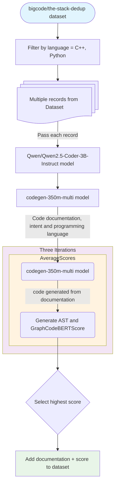
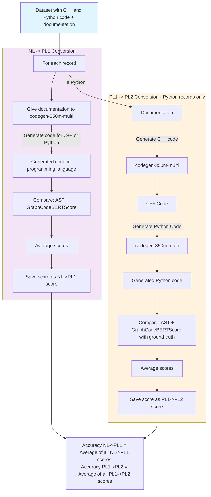
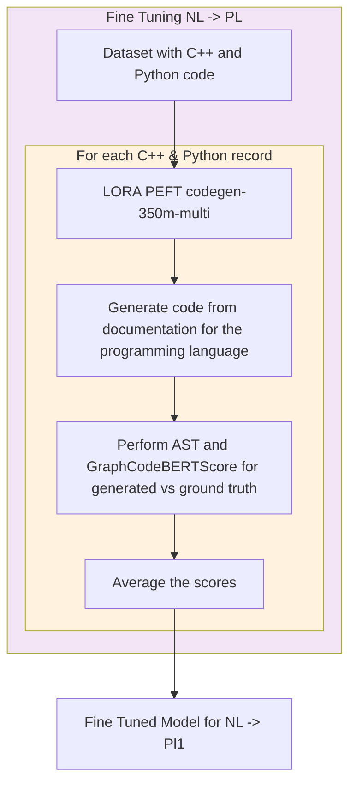
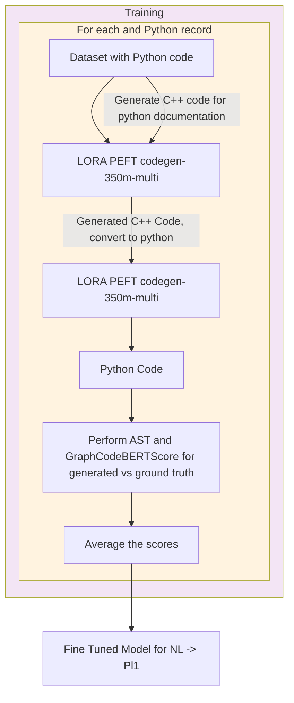

# **Table Of Contents**

- [Document Generation Fidelity Diagram](#document-generation-fidelity-diagram)
- [Baseline Accuracy Computation](#baseline-accuracy-computation)
- [Phase 1: NL -> PL1](#phase-1-nl---pl1)
- [Phase 2: PL1 -> PL2](#Phase-2--PL1----PL2)

---

## Document Generation Fidelity Diagram
The diagram below shows the steps to generate documentation for the programs (C++ and python); and the steps to ensure fidelity of the documentation generated.

---

## Baseline Accuracy Computation

The diagram below shows the baseline accuracy computation for NL->PL1 and PL1->PL2 conversions.

---

## Phase 1: NL -> PL1
The diagram below shows the LORA fine tuning of the codegen-350m-multi to create programs from C++ and python documentation, where the documentation serve as prompt to generate code

---

## Phase 2: PL1 -> PL2
The phase 2 of the fine tuning is where in the dataset, for the python programming language, the documentation is taken and passed to the PEFT codegen-350m-multi to create C++ program. This is different from Phase 1 since in phase 1, the output generated was same programming language as in the dataset. The generated C++ code is then given to the PEFT codegen-350m-multi to create python program. The generated python program is then AST and GraphCodeBERTScore compared with the ground truth python program.
