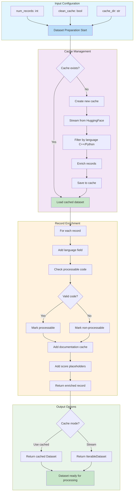
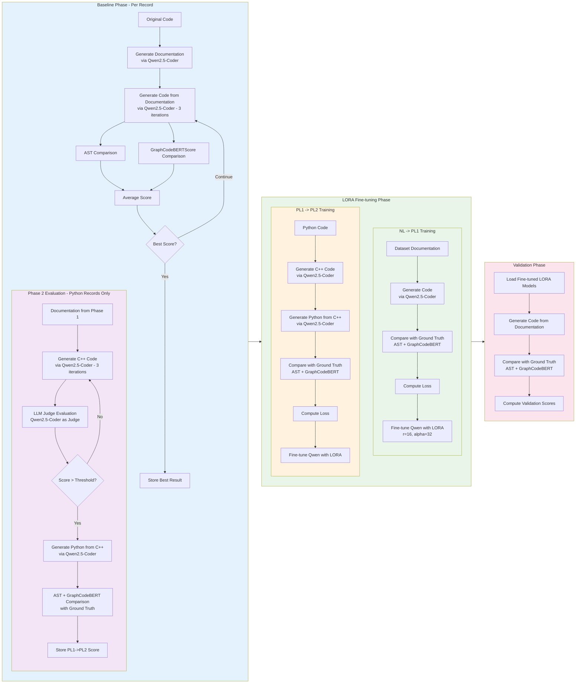
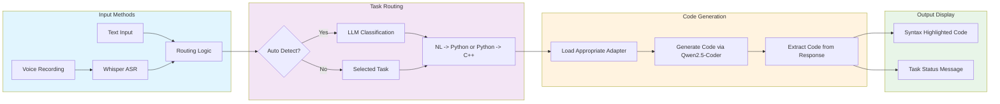
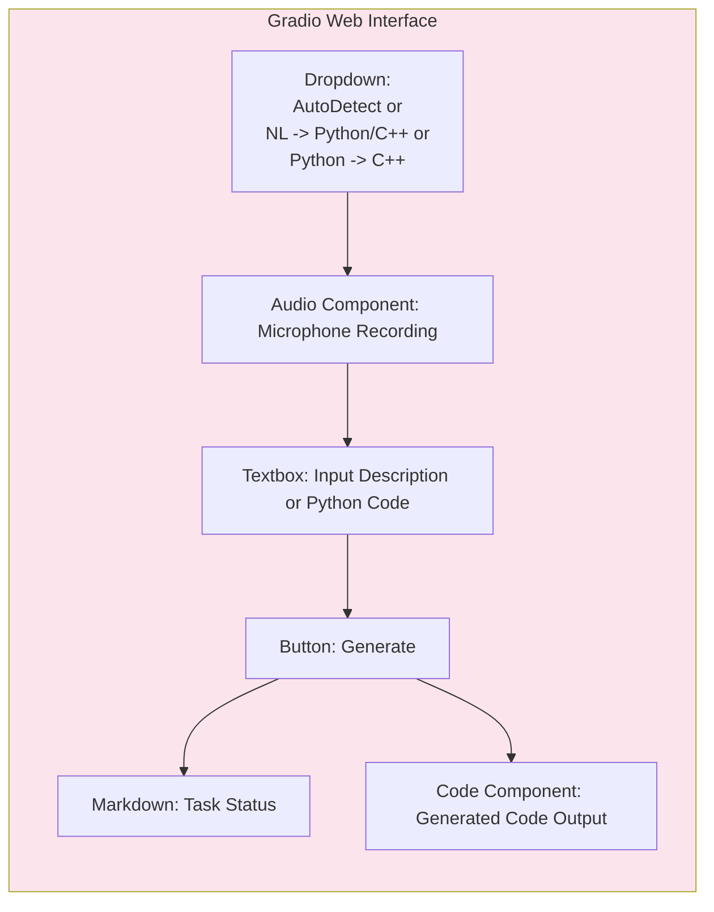
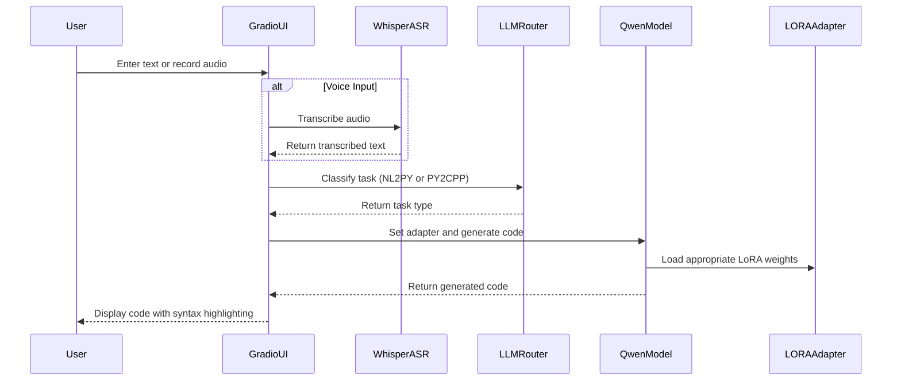
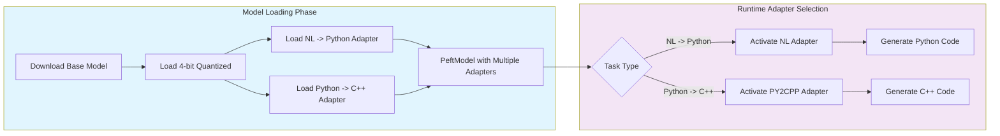

# **Table Of Contents**

- [Class Diagrams](#class-diagrams)
- [Dataset Preparation](#dataset-preparation)
- [Models Used](#models-used)
- [Workflow Diagram: Baseline, Fine-tuning, and Validation Phases](#workflow-diagram-baseline-fine-tuning-and-validation-phases)
- [User Interface](#user-interface)

---

## Class Diagrams

The diagram below shows the class structure and relationships in codegen_30.py. All major classes use the SingletonMeta metaclass to ensure single instances, and the BaselineData class orchestrates the entire workflow.

```mermaid
classDiagram
    class SingletonMeta {
        <<metaclass>>
        -_instances: dict
        +__call__(cls, *args, **kwargs)
    }

    class QwenModelBase {
        <<singleton>>
        -_initialized_qwen: bool
        -_model: AutoModelForCausalLM
        -_tokenizer: AutoTokenizer
        -_model_name: str
        -device: str
        +__init__()
        -_load_qwen_model()
    }

    class CodeDocumentationGenerator {
        <<singleton>>
        -_initialized: bool
        -device: str
        +generate_documentation(code, max_length, num_return_sequences, prompt) list
    }

    class QwenCodeGenerator {
        <<singleton>>
        -_initialized: bool
        -device: str
        -_model: AutoModelForCausalLM
        -_tokenizer: AutoTokenizer
        +_generate_code_from_model(input_text, target_lang, is_py_to_cpp) str
    }

    class AST {
        <<singleton>>
        -_initialized: bool
        -_ast_cpp_parser: Parser
        -_ast_python_parser: Parser
        +generate_ast(code, language_name) Tree
        +compare_ast(ast1, ast2) float
        +generate_ast_documentation(code, language_name) str
        +to_str(tree) str
        +print_ast_tree(tree, indent)
    }

    class GraphCodeBERTScorer {
        <<singleton>>
        -_initialized: bool
        -device: str
        -model: SentenceTransformer
        +score(code_1, code_2) float
    }

    class LLMJudge {
        <<singleton>>
        -_initialized: bool
        -device: str
        -_print_once: bool
        +qwen_code_judge(documentation, generated_code, reference_code) float
    }

    class FilteredDataset {
        <<singleton>>
        -_initialized: bool
        -_local_documentation_cache: dict
        -_local_scores_cache: dict
        -_python_dataset_stream: IterableDataset
        -_cpp_dataset_stream: IterableDataset
        -_python_iter: Iterator
        -_cpp_iter: Iterator
        -_cached_dataset: Dataset
        -_use_cached: bool
        +__init__(num_samples)
        +__iter__() Iterator~Dict~
        +get_python_stream_iterator() Iterator~Dict~
        +get_cpp_stream_iterator() Iterator~Dict~
        +update_documentation(record_identifier, new_documentation)
        +update_scores(record_identifier, ast_score, graphcodebert_score, average_score, ...)
        +reset_iterator()
        +load_cached_dataset(cache_dir, num_samples)
    }

    class BaselineData {
        <<singleton>>
        -_initialized: bool
        -_preferred_device: str
        -_num_samples: int
        -_documentation_generator: CodeDocumentationGenerator
        -_qwen_code_generator: QwenCodeGenerator
        -_ast_processor: AST
        -_graphcodebert_scorer: GraphCodeBERTScorer
        -_llm_judge: LLMJudge
        -_filtered_dataset: FilteredDataset
        -_cached_dataset: Dataset
        +__init__(num_samples, load_all_models)
        +_load_all_models()
        +load_models_for_lora_training()
        +unload_model(model_name)
        +clear_memory()
        +compute_baseline(num_records, num_tries, start_index, update_cache, language_filter) list
        +compute_validation(num_records, num_tries, start_index) list
        +compute_summary(results) dict
    }

    SingletonMeta <|-- QwenModelBase : uses metaclass
    SingletonMeta <|-- CodeDocumentationGenerator : uses metaclass
    SingletonMeta <|-- QwenCodeGenerator : uses metaclass
    SingletonMeta <|-- AST : uses metaclass
    SingletonMeta <|-- GraphCodeBERTScorer : uses metaclass
    SingletonMeta <|-- LLMJudge : uses metaclass
    SingletonMeta <|-- FilteredDataset : uses metaclass
    SingletonMeta <|-- BaselineData : uses metaclass

    QwenModelBase <|-- CodeDocumentationGenerator : inherits
    QwenModelBase <|-- QwenCodeGenerator : inherits
    QwenModelBase <|-- LLMJudge : inherits

    BaselineData --> CodeDocumentationGenerator : uses
    BaselineData --> QwenCodeGenerator : uses
    BaselineData --> AST : uses
    BaselineData --> GraphCodeBERTScorer : uses
    BaselineData --> LLMJudge : uses
    BaselineData --> FilteredDataset : uses

    style SingletonMeta fill:#e3f2fd
    style QwenModelBase fill:#f3e5f5
    style CodeDocumentationGenerator fill:#e8f5e8
    style QwenCodeGenerator fill:#fff3e0
    style AST fill:#fce4ec
    style GraphCodeBERTScorer fill:#f1f8e9
    style LLMJudge fill:#fff8e1
    style FilteredDataset fill:#e0f2f1
    style BaselineData fill:#ffebee
```

---

## Dataset Preparation

The diagram below shows the dataset preparation workflow including configurable records, clean option, caching, and enrichment processes.

### Data Source

The dataset is sourced from **bigcode/the-stack-dedup** on HuggingFace, which is a deduplicated version of The Stack dataset. This dataset contains:
- **Python code**: Located in `data/python` directory
- **C++ code**: Located in `data/cpp` directory
- Each record contains: `hexsha` (unique identifier), `content` (source code), `lang` (programming language), and `max_stars_count`

### Why Cache is Needed

The cache is essential for several reasons:

1. **Performance**: Streaming from HuggingFace for every iteration is slow and bandwidth-intensive. Caching allows instant dataset loading.

2. **Iteration Efficiency**: The baseline computation requires multiple passes over the same records. Without caching, each pass would re-stream from HuggingFace.

3. **Offline Access**: Once cached, the dataset can be used without internet connectivity or HuggingFace API rate limits.

4. **Consistency**: Ensures the same records are used across different runs and experiments.

5. **Memory Efficiency**: The cached dataset can be loaded partially or filtered without re-streaming the entire dataset.

### Processable Code

A record is marked as **processable** when it meets the following criteria:

1. **Valid content**: The `content` field must be a non-empty string
2. **Valid language**: The `lang` field must be present and correspond to Python or C++
3. **Code length**: The code should be within reasonable bounds (currently not enforced but can be configured)

Non-processable records are:
- Records with missing or empty code content
- Records with unrecognized programming languages
- Records that fail syntax validation

### Documentation Cache

The **documentation cache** is a local dictionary (`_local_documentation_cache`) that stores:

1. **Purpose**: Stores generated documentation for each record identified by its `hexsha`
2. **Usage Priority**: When iterating records, the cache is checked first before generating new documentation
3. **Update Mechanism**: Documentation can be updated via `update_documentation(hexsha, new_documentation)` method
4. **Persistence**: The cache is maintained in memory during the session and can be saved to the cached dataset

This allows:
- Reusing previously generated documentation without regeneration
- Manual override of documentation for specific records
- Incremental improvement of documentation without full regeneration

---

## Models Used

The system uses several pre-trained models for different purposes. Each model serves a specific role in the code generation and evaluation pipeline.

### Qwen/Qwen2.5-Coder-7B-Instruct

**Type**: Large Language Model (7B parameters)
**Primary Purpose**: Code generation and understanding

**Uses**:
1. **Documentation Generation** (CodeDocumentationGenerator class): Converts source code into semantic specifications/documentation that capture the intent and structure of the code
2. **Code Generation** (QwenCodeGenerator class): Generates code from documentation in the target programming language (Python or C++)
3. **LLM Judge** (LLMJudge class): Evaluates the quality of generated code by comparing it against documentation and reference code
4. **LORA Fine-tuning Base**: The model is fine-tuned using Low-Rank Adaptation (LORA) for both NL→PL and PL1→PL2 translation tasks

**Key Features**:
- Supports both Python and C++ code generation
- Uses chat template format with system and user messages
- Temperature=0.2 for documentation generation (more deterministic), 0.7 for LORA training
- Handles code-to-code translation (Python to C++)

### microsoft/graphcodebert-base (via sentence-transformers)

**Type**: Code Embedding Model
**Primary Purpose**: Semantic similarity scoring

**Uses**:
1. **GraphCodeBERTScore** (GraphCodeBERTScorer class): Generates semantic embeddings for code snippets and computes cosine similarity between them

**Key Features**:
- Captures semantic equivalence beyond syntactic structure
- Useful when AST comparison might miss semantic similarity due to structural differences
- Works with both Python and C++ code

### tree-sitter (C++ and Python parsers)

**Type**: Parser Library
**Primary Purpose**: Abstract Syntax Tree (AST) generation and comparison

**Uses**:
1. **AST Generation** (AST class): Parses source code into tree-sitter AST structures
2. **AST Comparison**: Compares generated code ASTs with original code ASTs to measure structural similarity

**Key Features**:
- Language-specific parsers for accurate AST generation
- Provides structural similarity metrics independent of code formatting

---

## Workflow Diagram: Baseline, Fine-tuning, and Validation Phases

The diagram below illustrates the complete workflow across all three phases. The core transformations are: **Code → Documentation**, **Documentation → Language**, and **Language → Language conversion**. Each record undergoes multiple iterations to find the best results.

### Key Highlights

1. **Dataset Record Distribution**:
   - **Total records**: Defined by `num_records` in Dataset Preparation
   - **Baseline**: First 1/3 of records used for baseline computation
   - **LORA Training**: Middle 1/3 of records used for LORA fine-tuning
   - **Validation**: Last 1/3 of records used for validation (separate from baseline and LORA training)

2. **Iterations**:
   - Baseline: 3 iterations per record for code generation (num_tries=3)
   - Phase 2 Evaluation: 3 iterations with LLM Judge for Python records (part of baseline)
   - LORA Training: Multiple epochs over the training dataset

3. **LLM as Judge**:
   - The Qwen2.5-Coder model acts as a judge in Phase 2 Evaluation to evaluate generated code quality
   - Provides a score between 0 and 1 indicating how well the generated code matches the documentation
   - Threshold of 0.3 is used to identify poor quality generations

4. **Transformations**:
   - **Code → Documentation**: Single iteration (one documentation generated per code)
   - **Documentation → Language**: 3 iterations to find best code generation
   - **Language → Language**: Python → C++ → Python for PL1→PL2 conversion (in Phase 2 Evaluation and LORA Training)

5. **Scoring Methods**:
   - **AST Similarity**: Structural comparison using tree-sitter parsers
   - **GraphCodeBERTScore**: Semantic similarity using embeddings
   - **Average Score**: Mean of AST and semantic similarity scores

6. **Phase Structure**:
   - **Baseline Phase**: Includes Phase 2 Evaluation for Python records
   - **LORA Fine-tuning Phase**: Separate phase for training the model
   - **Validation Phase**: Independent evaluation using fine-tuned models

---

## User Interface

The `app.ipynb` notebook provides a web-based user interface for the CodeGen system using Gradio. It enables users to interact with the fine-tuned Qwen2.5-Coder-7B model through both text and voice inputs.

### Overview

The application provides a voice-enabled web interface that:
- Accepts natural language descriptions to generate Python code
- Converts Python code to C++ code
- Supports both text input and voice recording
- Automatically routes tasks to the appropriate adapter

### Key Components

### User Interface Layout

### Data Flow

### Adapter Management

The application manages two LoRA adapters on a shared Qwen2.5-Coder-7B base model:

### Key Functions

| Function | Purpose | Input | Output |
|----------|---------|-------|--------|
| `build_prompt(task, text)` | Constructs chat template prompt | Task type, text input | Formatted prompt string |
| `extract_code(text)` | Extracts code from markdown blocks | Generated text | Clean code string |
| `generate(task, text)` | Main code generation function | Task, input text | Generated code |
| `classify_task(text)` | LLM-based task classification | Input text | Task label (NL->Python or Python->C++) |
| `transcribe(audio_path)` | Speech-to-text conversion | Audio file path | Transcribed text |

### External Dependencies

- **Gradio**: Web UI framework for interactive interfaces
- **Transformers**: HuggingFace library for model loading
- **PEFT**: Parameter-Efficient Fine-Tuning for LoRA adapters
- **Whisper**: OpenAI speech recognition model
- **BitsAndBytes**: 4-bit quantization for memory efficiency

### Deployment

The application is designed to run on Google Colab with GPU acceleration:
- Uses T4 or L4 GPU runtime
- Downloads adapters from GitHub LFS storage
- Provides public shareable URL via Gradio

---
