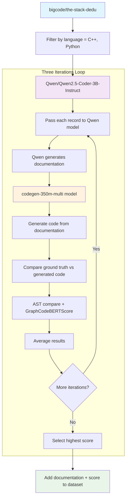

The actions items and discussions between the group members and mentors are documented here.

- [06/13/2026](#06122026)
- [06/07/2026](#06072026)

***
**Detailed Notes**
---
---
> # 06/13/2026
> ## Notes:
> 1. Code was updated to run the code-> To determine the best documentation, generate documentation three times and for each iteration compute AST match and GraphCodeBERTScore (both averaged) between ground truth program and program generated using the documentation.
> 1. ASTs were compared using node similarity.
> 1. The Python's documentation (NL) to PL1 (C++). The current approach is flawed. There is no check or guarantees that the generated C++ Code is of some quality. The measure of quality is not defined. With this undefined input, the generated python code can be anything. To get around, find a dataset, that has C++ and python code for the same intent, better if it has the documentation for the two too. But there needs to be python and its C++ code for the ground truth. Alternatively, generate test cases for the C++ and Python code and then execute both to check that the output is same. The limitation could be how complex the code output is.
>
> ## Actions
> 1. Find a dataset that has python and C++ for the same intent.
> 1. create diagram for easy reference in discussions. Closed, added [Diagrams](#Architecture/Diagrams.md)

---
---
> # 06/07/2026
> ## Notes:
> 1. Baseline data needs to be created for the model to convert NL->PL1 and PL1->PL2. use the same dataset and generate metrics, use AST similarity too.
>
> 1. NL tp PL approach: to use the [bigcode/the-stack-dedu](https://huggingface.co/datasets/bigcode/the-stack-dedup/viewer) dataset of C++ and Python code, generate documentation for it and then use this documentation as in put to the model to generate the code. There needs to be a mechanism to evaluate if the documentation for the code was generated that reduces error in code generation. The approach should be modified to :
    1. Data Set Code -> Model to Generate documentation -> Documentation to mode -> Generated code.
       Data Set Code compared to Generated code for code similarity and AST. Perform this three times, and keep the documentation for the code that generates the highest similarity.
    1. Need AST comparison models from Nayan (@nayanjha16)
    1. Approach: [NL->PL Approach](MentoringNotes/06-07-2026/1.png)
>
> 1. For PL1-> PL2 approach [PL1->PL2 Approach](MentoringNotes/06-07-2026/2.png)
    1. There needs to be a mechanism to have NL-> PL1 correctness before having Pl1-> PL2 conversion. Use 3 iterations logic. Else find a dataset which has for the same documentation for NL->PL1 and NL->PL2 or PL1-> PL2 conversion.
>
> ## Actions:
> 1. Team to follow suggested approach of three iterations from generated > documentation for code generation. [ Closed on 06/12/2026 ]
> 2. Nayan(@nayanjha16) to provide AST comparator models. [ Obsolete by use of node similarity for AST comparison ]: Closed

## Document Generation Fidelity Diagram

