# CodeGen

**Evaluating and Fine-Tuning Small Code Language Models on a Three-Stage Database Query Pipeline**

---

A modular, reproducible research pipeline for evaluating and fine-tuning small code language models on a **three-stage database query workflow**, plus a capstone **AI Database Agent** that orchestrates schema retrieval, Cloud Run CodeGen inference, and live database execution.

```
Natural language  →  SQL  →  MongoDB  →  Documentation
                              ↓
                    AI Agent (LangGraph + MCP + Web UI)
```

**Base model:** [Salesforce/codegen-350M-multi](https://huggingface.co/Salesforce/codegen-350M-multi) (configure in `.env`)

**Repository:** [github.com/nayanjha16/CodeGen-Implementations-May_26](https://github.com/nayanjha16/CodeGen-Implementations-May_26.git) · branch **`Group-44`** · cohort **Codegen-11**

## Documentation

| Doc | Purpose |
| --- | --- |
| **[docs/project-demo/](docs/project-demo/)** | **AI-Powered Database Intelligence** — [presentation.html](docs/project-demo/presentation.html) (Group-44 · Codegen-11 · August 2026) |
| [docs/reference/](docs/reference/) | Runbooks, metrics, training, deployment ([version-tracker](docs/reference/version-tracker.md), [gold-set commands](docs/reference/gold-set-commands.md)) |
| [docs/README.md](docs/README.md) | Full documentation index |
| [agent/README.md](agent/README.md) | AI Database Agent — CLI, MCP, Web UI |
| [fastapi-deploy/README.md](fastapi-deploy/README.md) | CodeGen API on Cloud Run |

## Results snapshot (Spider gold validation)

### LoRA v3 — production (n=50)

**50 examples** · full TEND training (~8k rows / task) · **r=32 + FFN**, **10 epochs** (`configs/default.yaml`) · execution accuracy on TEND · adapters published to Cloud Run (`fastapi-deploy`)

| Task | Execution accuracy (baseline v3 → LoRA v3) |
| ---- | ---------------------------------------- |
| Text-to-SQL | 14% → **66%** |
| SQL-to-MongoDB | 22% → **86%** |
| Documentation (judge /10) | 8.33 → **8.82** |

| Output | Path |
| ------ | ---- |
| Baseline metrics | `results/spider_gold_validation_codegen-350M-multi_baseline-v3/` |
| LoRA metrics | `results/spider_gold_validation_codegen-350M-multi_lora-v3/` |
| Presentation | [docs/project-demo/presentation.html](docs/project-demo/presentation.html) · [PPTX](docs/reference/lora-v1-v3-vs-baseline-comparison.pptx) · project **AI-Powered Database Intelligence** |

### LoRA v2 (n=50)

**50 examples** · full TEND training (~8k rows / task) · **r=16**, attention only · **5 epochs** · AD-6 recipe

| Task | Execution accuracy (baseline v2 → LoRA v2) |
| ---- | ---------------------------------------- |
| Text-to-SQL | 12% → **60%** |
| SQL-to-MongoDB | 22% → **74%** |
| Documentation (judge /10) | 8.33 → **8.41** |

Report: [baseline-vs-lora-v2-comparison.md](results/spider_gold_validation_codegen-350M-multi_lora-v2/baseline-vs-lora-v2-comparison.md)

See [docs/reference/version-tracker.md](docs/reference/version-tracker.md) for v1–v3 hyperparameters and training commands.

### LoRA v1 — smoke (n=5)

**5 examples** · semantic judge `gemma3:4b` · smoke-trained v1 adapters (50 training rows, **10 epochs** per task)

| Task | Judge correct rate (baseline → LoRA v1) |
| ---- | --------------------------------------- |
| Text-to-SQL | 0% → **40%** |
| SQL-to-MongoDB | 40% → **100%** |
| Documentation | 20% → **100%** |

Report: [baseline-vs-lora-v1-comparison.md](results/spider_gold_validation_codegen-350M-multi_lora-v1/baseline-vs-lora-v1-comparison.md)

---

## Complete end-to-end flow

Run the training/eval pipeline in this order: **setup → pre-flight → baseline eval → LoRA training → fine-tuned eval → compare → (optional) publish & deploy → agent demo**.

For copy-paste **gold-set (n=50)** commands see [docs/reference/gold-set-commands.md](docs/reference/gold-set-commands.md). Full publish/deploy steps: [docs/reference/evaluation-and-deploy-runbook.md](docs/reference/evaluation-and-deploy-runbook.md).

```mermaid
flowchart LR
  subgraph setup [1. Setup]
    A[Install deps + .env]
    B[Cache base model]
  end
  subgraph preflight [2. Pre-flight]
    C[inspect_lora_modules]
    D[test_tend_loader]
    E[test_prompt_parity]
  end
  subgraph baseline [3. Baseline eval]
    F[run_baseline_eval\nno adapter]
    G[metrics.json + CSVs]
  end
  subgraph train [4. LoRA training]
    H[train_lora / train_all_lora\n--version v3]
    I[models/checkpoints/v3/]
  end
  subgraph lora_eval [5. Fine-tuned eval]
    J[run_baseline_eval\n--adapter-run v3]
    K[metrics.json + CSVs]
  end
  subgraph compare [6. Compare]
    L[metrics.json + PPTX]
  end
  subgraph deploy [7. Publish optional]
    M[publish adapters + Cloud Run]
  end
  subgraph agent [8. Agent demo]
    N[agent CLI / Web UI]
  end
  A --> B --> C --> D --> E --> F --> G
  G --> H --> I --> J --> K --> L
  L --> M --> N
```



### Pipeline stages (inference)

Each evaluation example flows through three tasks. At inference time, **one LoRA adapter is loaded per task** when using `--adapter-run`:

```
Question + SQL schema
        │
        ▼  text2sql          (adapter: models/checkpoints/<run>/text2sql/)
     SQL query
        │
        ▼  sql2nosql          (adapter: models/checkpoints/<run>/sql2nosql/)
  MongoDB query
        │
        ▼  nosql2doc           (adapter: models/checkpoints/<run>/nosql2doc/)
  Documentation
```

### Phase summary

| Phase | Goal | Key command / doc |
| ----- | ---- | ----------------- |
| **1. Setup** | Python env, deps, `.env`, `PYTHONPATH` | [Quick Start](#quick-start) |
| **2. Pre-flight** | Verify LoRA targets, dataset, prompts | `inspect_lora_modules.py`, `test_tend_loader.py`, `test_prompt_parity` |
| **3. Baseline eval** | Score **base model** (no adapter) | `run_baseline_eval.py --max-samples 50 --output ..._baseline-v3` |
| **4. LoRA training** | Fine-tune one adapter per task | `train_all_lora.py --version v3` |
| **5. Fine-tuned eval** | Score **base + adapters** on same set | `run_baseline_eval.py --max-samples 50 --adapter-run v3 --output ..._lora-v3` |
| **6. Compare** | Baseline vs LoRA metrics | `results/*/metrics.json`, [PPTX](docs/reference/lora-v1-v3-vs-baseline-comparison.pptx) |
| **7. Publish & deploy** | Hub + Cloud Run (production API) | [evaluation-and-deploy-runbook.md](docs/reference/evaluation-and-deploy-runbook.md) |
| **8. Agent demo** | Capstone orchestration over live API | [agent/README.md](agent/README.md) — `python -m agent.web` |

Use `--max-samples 5` and `--version v1` for **smoke** runs on CPU before full v3 training.

**Typical outputs (v3)**

```
results/spider_gold_validation_codegen-350M-multi_baseline-v3/
  metrics.json, text2sql_details.csv, sql2nosql_details.csv, documentation_details.csv

results/spider_gold_validation_codegen-350M-multi_lora-v3/
  metrics.json, *_details.csv
```

**Earlier runs (v1 smoke, v2)** — same layout under `results/spider_gold_validation_codegen-350M-multi_*`.

**Smoke-first on CPU:** use `--max-samples 5` before full 50-sample runs (~2–3 hours each with judge on CPU).

---

## Features

- **Natural Language → SQL** generation with greedy and beam search decoding
- **SQL → MongoDB** model-based conversion with gold references from TEND
- **NoSQL → Documentation** generation (nosql2doc)
- **LoRA fine-tuning** — one task-specific adapter per pipeline stage (text2sql, sql2nosql, nosql2doc); **v3** published to Cloud Run
- **AI Database Agent** — LangGraph + MCP + Web UI over Cloud Run CodeGen API ([agent/README.md](agent/README.md))
- **Cloud Run inference API** — `fastapi-deploy/codegen_api` with multi-adapter routing
- **Benchmark evaluation** on the [TEND silver dataset](https://huggingface.co/datasets/care2achieve/tend) (Spider + BIRD configs)
- **Metrics**: Exact Match, Execution Accuracy, BLEU, ROUGE-L, BERTScore, CodeBLEU, Ollama semantic judge
- **MLflow** experiment tracking
- **Local caching** — models and datasets download once, then reuse from disk

## Project Structure

```
CodeGen-Implementations-May_26/
├── src/
│   ├── text2sql/            # Prompt builder, generator, validator, executor
│   ├── sql2nosql/           # SQL to MongoDB generation + evaluation
│   ├── documentation/       # nosql2doc prompt builder
│   ├── models/              # HuggingFace model loader (base + LoRA adapters)
│   ├── datasets/            # TEND Hugging Face loader, preprocessing
│   ├── training/            # LoRA trainer, SFT dataset builder, collator
│   ├── evaluation/          # Metrics, benchmarks, MLflow, semantic judge
│   ├── llm/                 # Ollama client + Hugging Face judge fallback
│   └── utils/               # Config, paths, logging, seeds
├── agent/                   # AI Database Agent (LangGraph, MCP, Web UI)
├── fastapi-deploy/          # CodeGen API bundle for Cloud Run
├── ai-workflow/             # Research, planning, implementation logs
├── docs/                    # project-demo/ (demo) + reference/ (runbooks)
├── models/
│   ├── base/                # Downloaded HuggingFace base models (cached once)
│   └── checkpoints/         # LoRA runs: checkpoints/<run>/<task>/
├── data/
│   ├── spider_gold_validation.jsonl   # Frozen 50-example eval set
│   └── DATASETS.md
├── results/                 # Evaluation output (metrics.json, details.csv)
├── tests/training/          # Unit + smoke tests for LoRA pipeline
├── configs/default.yaml     # Generation, evaluation, training, LoRA settings
├── scripts/                 # Setup, training, evaluation, verification
├── .env.example
└── requirements.txt
```

### AI Database Agent (capstone)

The agent under `agent/` orchestrates three tools — schema extraction, CodeGen API calls, and read-only DB execution — with Ollama for intent and summarization. It does **not** generate SQL locally.

```powershell
$env:PYTHONPATH = (Get-Location).Path
python -m agent.main "How many customers are in the database?"
python -m agent.web          # http://127.0.0.1:8080
python -m agent.mcp.server     # MCP stdio
```

Full setup, demo questions, and tests: **[agent/README.md](agent/README.md)**. Config: copy `agent/.env.example` → `agent/.env`.

### Deployed inference API

LoRA **v3** adapters are served via `fastapi-deploy/codegen_api` on Cloud Run. See **[fastapi-deploy/README.md](fastapi-deploy/README.md)** for publish and redeploy steps.

## Quick Start

### 1. Install Dependencies

```bash
conda create -n ai python=3.11 -y
conda activate ai
pip install -r requirements.txt
export PYTHONPATH="$(pwd)"
```

```powershell
# Windows PowerShell (conda)
conda create -n ai python=3.11 -y
conda activate ai
pip install -r requirements.txt
$env:PYTHONPATH = (Get-Location).Path
```

```powershell
# Windows PowerShell (venv)
py -3.11 -m venv myvenv
.\myvenv\Scripts\Activate.ps1
pip install -r requirements.txt
$env:PYTHONPATH = (Get-Location).Path
```

Re-run `$env:PYTHONPATH = (Get-Location).Path` (or `export PYTHONPATH="$(pwd)"`) in every new terminal session.

### 2. Configure Environment

```bash
cp .env.example .env
```

Edit `.env` — at minimum set `MODEL_NAME` and `BERTSCORE_MODEL_NAME`:

```bash
# Required
MODEL_NAME=Salesforce/codegen-350M-multi
BERTSCORE_MODEL_NAME=distilbert-base-uncased

# LoRA adapter run folder (optional; used with --adapter-run v1 in eval)
MODEL_ADAPTER_RUN=v1

# Local storage paths (defaults shown)
MODELS_BASE_DIR=models/base
MODELS_CHECKPOINTS_DIR=models/checkpoints
TEND_DATASET_ID=care2achieve/tend
TEND_CACHE_DIR=data/cache/tend
RESULTS_DIR=results

# Semantic judge: Ollama when available, else Hugging Face fallback
OLLAMA_BASE_URL=http://localhost:11434
OLLAMA_JUDGE_MODEL=gemma3:4b
# JUDGE_HF_MODEL=google/gemma-3-4b-it   # optional explicit HF fallback
OLLAMA_TIMEOUT=120
```

| Variable | Description | Default |
| -------- | ----------- | ------- |
| `MODEL_NAME` | HuggingFace base model identifier (**required**) | — |
| `BERTSCORE_MODEL_NAME` | BERTScore metric model (**required**) | — |
| `MODEL_ADAPTER_RUN` | Default LoRA run name (e.g. `v1`) under `models/checkpoints/` | — |
| `MODELS_BASE_DIR` | Where base models are cached | `models/base` |
| `MODELS_CHECKPOINTS_DIR` | Root for LoRA runs (`<run>/<task>/`) | `models/checkpoints` |
| `TEND_DATASET_ID` | Hugging Face TEND dataset id | `care2achieve/tend` |
| `TEND_CACHE_DIR` | Local cache for TEND JSONL splits | `data/cache/tend` |
| `SPIDER_GOLD_VALIDATION_PATH` | Frozen Spider gold validation JSONL | `data/spider_gold_validation.jsonl` |
| `RESULTS_DIR` | Evaluation output directory | `results` |
| `OLLAMA_BASE_URL` | Ollama API URL for semantic judge | `http://localhost:11434` |
| `OLLAMA_JUDGE_MODEL` | Ollama judge model tag (maps to HF if Ollama unavailable) | `gemma3:4b` |
| `JUDGE_HF_MODEL` | Optional explicit Hugging Face judge model id | auto-mapped from `OLLAMA_JUDGE_MODEL` |

YAML settings in `configs/default.yaml` cover generation, evaluation limits, training hyperparameters, and LoRA config. Model name and storage paths always come from `.env`.

---

## Recommended Workflow

**Production path (v3, n=50):** see [docs/reference/gold-set-commands.md](docs/reference/gold-set-commands.md) for copy-paste commands and [docs/reference/evaluation-and-deploy-runbook.md](docs/reference/evaluation-and-deploy-runbook.md) for publish/deploy.

```powershell
# Activate env and set PYTHONPATH each session
.\myvenv\Scripts\Activate.ps1
$env:PYTHONPATH = (Get-Location).Path

# --- Phase 2: Pre-flight ---
python scripts/inspect_lora_modules.py
python scripts/test_tend_loader.py
python -m unittest tests.training.test_prompt_parity -v

# --- Phase 3: Baseline (v3, n=50) ---
python scripts/run_baseline_eval.py --max-samples 50 --output spider_gold_validation_codegen-350M-multi_baseline-v3

# --- Phase 4: LoRA training (v3) ---
python scripts/train_all_lora.py --no-mlflow --device cpu --version v3
python scripts/verify_lora_adapters.py --version v3

# --- Phase 5: LoRA eval (v3, n=50) ---
python scripts/run_baseline_eval.py --max-samples 50 --adapter-run v3 --output spider_gold_validation_codegen-350M-multi_lora-v3

# --- Phase 6–7: Compare + publish/deploy ---
# metrics.json under results/ above; then see docs/reference/evaluation-and-deploy-runbook.md

# --- Phase 8: Agent demo (after Cloud Run has v3) ---
pip install -r agent/requirements.txt
Copy-Item agent\.env.example agent\.env
python -m agent.web
```

**Smoke path (v1, n=5)** — faster CPU sanity check:

```powershell
python scripts/run_baseline_eval.py --max-samples 5 --output spider_gold_validation_codegen-350M-multi_baseline-v1
python scripts/train_lora.py --task text2sql --max-samples 50 --epochs 1 --no-mlflow --device cpu --version v1
python scripts/run_baseline_eval.py --max-samples 5 --adapter-run v1 --output spider_gold_validation_codegen-350M-multi_lora-v1
```

Use `--no-judge` to skip the semantic judge (faster; no Ollama required). Without Ollama, the judge falls back to a cached Hugging Face model (e.g. `google/gemma-3-4b-it` for `gemma3:4b`).

---

## Testing

### Unit and smoke tests

All training tests live under `tests/training/`:

| Test file | What it checks |
| --------- | -------------- |
| `test_prompt_parity.py` | Training prompts match runtime `PromptBuilder`s; dataset filters; token budget ≤ 2048 |
| `test_overfit_smoke.py` | LoRA trainer overfits 5 rows, writes `adapter_config.json` + weights |
| `test_adapter_load.py` | Trains tiny adapters per task; `load_model(adapter_path=...)` generates non-empty output |
| `test_adapter_verify.py` | Adapter verification helper reports missing files correctly |

```bash
# Run all training tests
python -m unittest discover -s tests/training -v

# Run a subset (fast sanity check)
python -m unittest tests.training.test_prompt_parity tests.training.test_overfit_smoke -v

# Single test
python -m unittest tests.training.test_overfit_smoke.OverfitSmokeTest -v
```

The overfit smoke test trains 5 Spider rows for 10 epochs and expects `train_loss < 1.5`. Adapter load tests train 3 rows per task and verify generation works.

### Dataset integration smoke test

```bash
python scripts/test_tend_loader.py
```

Loads Spider + BIRD train/test splits from Hugging Face (or cache) and validates required TEND fields. Also checks the 50-row frozen gold validation set.

### SFT dataset builder smoke test

```bash
python scripts/build_sft_dataset.py
```

Builds 50-row samples for each task (`text2sql`, `sql2nosql`, `nosql2doc`) from combined Spider + BIRD train data and prints filter/token statistics.

### LoRA pre-flight check

Before training, confirm `lora.target_modules` in `configs/default.yaml` match the base model architecture:

```bash
python scripts/inspect_lora_modules.py
python scripts/inspect_lora_modules.py --model Salesforce/codegen-350M-multi
```

Prints attention module suffixes and confirms trainable parameter count > 0. For CodeGen-350M the configured modules are `qkv_proj` and `out_proj`.

---

## Training (LoRA Fine-Tuning)

LoRA fine-tuning trains **one adapter per task** on the causal LM base model (`MODEL_NAME`). Base weights stay frozen in `models/base/`; adapter weights are saved under `models/checkpoints/<run>/<task>/` (e.g. `models/checkpoints/v1/text2sql/`).

### Supported tasks

| Task | Target field | Training prompt ends with |
| ---- | ------------ | ------------------------- |
| `text2sql` | `sql` | `\n\nSQL:` |
| `sql2nosql` | `nosql_query` | `\n\nMongoDB:` |
| `nosql2doc` | `documentation` | `\n\nDocumentation:` |

### Training data

By default, training loads **Spider + BIRD train** rows from Hugging Face TEND (`~10,697` combined rows). Held-out eval during training uses **Spider + BIRD test** splits. Override with `--train-csv` / `--eval-csv` (CSV or JSONL).

### Sequence budget

Configured in `configs/default.yaml`:

```yaml
training:
  max_length: 2048           # total sequence budget (matches model.max_length)
  max_target_tokens: 256     # reserve for completion; prompt budget ≈ 1791
```

Long prompts are truncated from the **start** (schema head dropped, question + tail kept) so the supervised target is never cut. Only ~0.02% of rows exceed the budget at 2048 tokens.

### Train a single task

```bash
# Full training — v3 production config (10 epochs, configs/default.yaml)
python scripts/train_lora.py --task text2sql --version v3

# v2-style full TEND run (AD-6: r=16, 5 epochs — see docs/reference/version-tracker.md)
python scripts/train_all_lora.py --version v2 --epochs 5

# Smoke / debug run
python scripts/train_lora.py --task text2sql --max-samples 50 --epochs 1 --no-mlflow --version v1

# Override device or custom output directory
python scripts/train_lora.py --task sql2nosql --device mps --version v1
python scripts/train_lora.py --task sql2nosql --output-dir models/checkpoints/custom_run/sql2nosql

# Custom training data
python scripts/train_lora.py --task nosql2doc --train-csv data/my_train.jsonl --eval-csv data/my_eval.jsonl
```

| Flag | Default | Description |
| ---- | ------- | ----------- |
| `--task` | *(required)* | `text2sql`, `sql2nosql`, or `nosql2doc` |
| `--train-csv` | HF spider+bird train | Optional CSV/JSONL training rows |
| `--eval-csv` | HF spider+bird test | Optional CSV/JSONL eval rows |
| `--output-dir` | `models/checkpoints/<run>/<task>/` | Adapter output directory (overrides default path) |
| `--version`, `--name` | date-based `DDMM` | Run folder under `models/checkpoints/` (e.g. `v1`) |
| `--max-samples` | all rows | Limit rows for smoke/debug |
| `--epochs` | `10` (from config) | Override epoch count (v2 used **5**) |
| `--device` | `auto` | `auto`, `cuda`, `mps`, or `cpu` |
| `--config` | `configs/default.yaml` | Alternate YAML config |
| `--no-mlflow` | off | Disable MLflow logging |

### Train all tasks

```bash
# Train text2sql → sql2nosql → nosql2doc sequentially
python scripts/train_all_lora.py

# Smoke run
python scripts/train_all_lora.py --max-samples 50 --epochs 1 --no-mlflow --version v1

# Run baseline eval first, then train
python scripts/train_all_lora.py --run-baseline --baseline-max-samples 50

# Dry run (print planned tasks)
python scripts/train_all_lora.py --dry-run
```

After all tasks complete, `train_all_lora.py` verifies adapter artifacts and writes a timestamped summary JSON to `models/checkpoints/training_summary_<timestamp>.json`.

### Training hyperparameters

**Authoritative per-version table:** [docs/reference/version-tracker.md](docs/reference/version-tracker.md)

**Production v3** uses [`configs/default.yaml`](configs/default.yaml):

```yaml
training:
  datasets: [spider, bird]
  split: train
  eval_datasets: [spider, bird]
  eval_split: test
  max_length: 2048
  max_target_tokens: 256
  learning_rate: 2.0e-4
  weight_decay: 0.01
  epochs: 10
  per_device_train_batch_size: 8
  per_device_eval_batch_size: 8
  gradient_accumulation_steps: 4   # effective batch size = 32
  warmup_ratio: 0.05
  lr_scheduler_type: cosine
  max_grad_norm: 1.0
  fp16: false
  bf16: false

lora:
  r: 32
  lora_alpha: 64
  lora_dropout: 0.05
  bias: none
  target_modules:
    - qkv_proj
    - out_proj
    - fc_in
    - fc_out
```

**v1 / v2 (AD-6 smoke recipe):** r=16, alpha 32, attention projections only (`qkv_proj`, `out_proj`). v1 = 50 samples, 10 epochs; v2 = full TEND (~8k), **5 epochs**.

Training uses TRL `SFTTrainer` with **completion-only loss** (prompt tokens masked). Each run writes:

```
models/checkpoints/v1/text2sql/
├── adapter_config.json
├── adapter_model.safetensors
└── run_metadata.json          # train/eval loss, filter stats, token stats
```

### Verify trained adapters

```bash
python scripts/verify_lora_adapters.py
python scripts/verify_lora_adapters.py --version v1
python scripts/verify_lora_adapters.py --version v1 --no-require-metadata
```

Checks for `adapter_config.json`, `adapter_model.safetensors`, and optionally `run_metadata.json`.

### Training wall-clock notes

| Device | Approx. time per task (full TEND ~8k rows) |
| ------ | ------------------------------------------ |
| CUDA GPU | v3 (10 ep): hours · v2 (5 ep): ~half |
| Apple MPS | ~10–15+ hours per task |
| CPU | Very slow; use `--max-samples` for smoke tests |

Use `--max-samples 50 --epochs 1 --no-mlflow` to validate the pipeline before committing to a full run.

---

## Evaluation

### `run_baseline_eval.py` — Primary evaluation script

Evaluates the configured model (base or LoRA adapter) on all three tasks. By default uses the **frozen Spider gold validation set** (`data/spider_gold_validation.jsonl`, 50 examples).

```bash
# Default: 50 gold validation examples, all three tasks
python scripts/run_baseline_eval.py

# Limit samples
python scripts/run_baseline_eval.py --max-samples 20

# Log to MLflow
python scripts/run_baseline_eval.py --mlflow

# Named output folder under results/
python scripts/run_baseline_eval.py --output my_baseline_run

# Skip Ollama semantic judge (faster, no Ollama required)
python scripts/run_baseline_eval.py --no-judge

# Evaluate full Hugging Face TEND split instead of gold validation
python scripts/run_baseline_eval.py --full-split --split test --tend-config spider
```

| Flag | Default | Description |
| ---- | ------- | ----------- |
| `--tend-config` | `spider` | TEND subset: `spider` or `bird` |
| `--split` | `test` | TEND split when `--full-split` is set |
| `--full-split` | off | Use full HF split instead of gold validation |
| `--max-samples` | `50` | Number of examples |
| `--mlflow` | off | Log metrics to MLflow |
| `--output` | auto-generated | Run folder name under `results/` |
| `--adapter-run` | off | Load per-task LoRA adapters from `models/checkpoints/<run>/` |
| `--no-judge` | off | Skip semantic judge (Ollama or HF fallback) |

**Metrics computed:** Exact Match, Execution Accuracy, Syntax Validity, BLEU, ROUGE-L, BERTScore, CodeBLEU, Ollama judge correct rate.

Output per run:

```
results/<run_name>/
├── metrics.json
├── text2sql_details.csv
├── sql2nosql_details.csv
└── documentation_details.csv
```

#### Evaluate with LoRA adapters (all three tasks)

Use `--adapter-run` to load **per-task adapters** from `models/checkpoints/<run>/`:

```powershell
# v1 smoke eval (n=5)
python scripts/run_baseline_eval.py --max-samples 5 --adapter-run v1 --output spider_gold_validation_codegen-350M-multi_lora-v1

# v2 full eval (n=50)
python scripts/run_baseline_eval.py --max-samples 50 --adapter-run v2 --output spider_gold_validation_codegen-350M-multi_lora-v2
```

The benchmark loads `models/checkpoints/v1/text2sql/`, `.../sql2nosql/`, and `.../nosql2doc/` on top of the cached base model in `models/base/`.

### `run_all_baseline_eval.py` — Multi-model comparison

Runs baseline eval across a hardcoded list of models on the gold validation set:

```bash
python scripts/run_all_baseline_eval.py
python scripts/run_all_baseline_eval.py --max-samples 50
python scripts/run_all_baseline_eval.py --dry-run
python scripts/run_all_baseline_eval.py --list-models
python scripts/run_all_baseline_eval.py --no-judge
```

Output folder format: `spider_gold_validation_<model>_<DDMM>_<HHMM>/`

---

## Local Caching

### Base models

```
models/base/Salesforce__codegen-350M-multi/
├── config.json
├── model.safetensors
├── tokenizer files
└── .downloaded          # cache marker
```

Checked before every load. Downloaded from HuggingFace only when missing. Configured by `MODEL_NAME` in `.env`.

### LoRA adapters (training output)

```
models/checkpoints/
└── v1/                         # run name (--version v1 or MODEL_ADAPTER_RUN)
    ├── text2sql/
    │   ├── adapter_config.json
    │   ├── adapter_model.safetensors
    │   └── run_metadata.json
    ├── sql2nosql/
    └── nosql2doc/
```

Use `--adapter-run v1` in `run_baseline_eval.py` to evaluate with all three adapters.

### TEND dataset (Hugging Face)

- Loaded via `src/datasets/tend_loader.py` from `TEND_DATASET_ID`
- Cached as standardized JSONL under `TEND_CACHE_DIR`
- Configurations: `spider`, `bird`
- Splits: `train`, `test` (`test` = source validation/dev)

```
data/cache/tend/care2achieve__tend/spider/train.jsonl
data/cache/tend/care2achieve__tend/spider/test.jsonl
```

```python
from src.datasets.tend_loader import TENDLoader

loader = TENDLoader(config="spider")
examples = loader.load_split("test")
print(examples[0]["question"], examples[0]["sql"])
```

---

## Configuration

### Environment (`.env`) — models, adapters, datasets, paths

All model names, adapter selection, dataset URLs, and storage paths are configured here.

### YAML (`configs/default.yaml`) — runtime behavior

```yaml
model:
  max_length: 2048
  device: "auto"       # auto (cuda > mps > cpu), cuda, mps, cpu

generation:
  max_new_tokens: 256
  documentation_max_new_tokens: 96
  temperature: 0.7
  decoding_strategy: "greedy"

evaluation:
  batch_size: 8
  max_samples: 50
  mlflow_tracking_uri: "sqlite:///mlflow.db"
  experiment_name: "codegen-text2sql"

training:
  max_length: 2048
  max_target_tokens: 256
  epochs: 10
  learning_rate: 2.0e-4
  # ... see full file for LoRA and batch settings

lora:
  target_modules: [qkv_proj, out_proj, fc_in, fc_out]
  r: 32
  lora_alpha: 64
```

To use a different HuggingFace base model, change `MODEL_NAME` in `.env`, run `inspect_lora_modules.py` to verify LoRA target modules, and update `lora.target_modules` in the YAML if needed.

---

## Datasets

See [data/DATASETS.md](data/DATASETS.md) for TEND field definitions, split naming, and loading examples.

| Dataset | Use |
| ------- | --- |
| TEND (HF `care2achieve/tend`) | LoRA training (spider + bird train/test) |
| `data/spider_gold_validation.jsonl` | Frozen 50-example baseline evaluation |

Gold-set eval commands: [docs/reference/gold-set-commands.md](docs/reference/gold-set-commands.md)

---

## Evaluation Metrics

| Metric | Description |
| ------ | ----------- |
| Exact Match | Normalized string equality (text2sql: case-insensitive identifiers via sqlparse) |
| Execution Accuracy | SQLite result-set match (requires Spider DB files + `db_resolver`; not wired by default) |
| Syntax Validity | Valid SQL / MongoDB / doc structure rate |
| BLEU | N-gram overlap |
| ROUGE-L | Longest common subsequence |
| BERTScore | Contextual embedding similarity |
| CodeBLEU | n-gram + syntax + semantic match |
| Judge Correct Rate | Semantic equivalence via Ollama (`OLLAMA_JUDGE_MODEL`) or Hugging Face fallback |

**Semantic judge:** If Ollama is running and has the configured model (e.g. `gemma3:4b`), the judge uses Ollama. Otherwise it downloads and runs the mapped Hugging Face model (e.g. `google/gemma-3-4b-it`). Use `--no-judge` to skip entirely.

---

## MLflow Tracking

Training and evaluation runs can log to MLflow when enabled:

```bash
python scripts/train_lora.py --task text2sql          # MLflow on by default
python scripts/run_baseline_eval.py --mlflow

mlflow ui --backend-store-uri sqlite:///mlflow.db
```

Tracked per run: model name, task, hyperparameters, train/eval loss, all evaluation metrics.

---

## Reproducibility

Seeds are set in `configs/default.yaml` for `random`, `numpy`, and `torch`. All evaluation and training scripts call `set_seeds(config)` before running.

---

## Troubleshooting

| Issue | Fix |
| ----- | --- |
| `MODEL_NAME is not set` | Copy `.env.example` to `.env` and set `MODEL_NAME` |
| `BERTSCORE_MODEL_NAME is not set` | Add `BERTSCORE_MODEL_NAME=distilbert-base-uncased` to `.env` |
| `ModuleNotFoundError: src` | Set `$env:PYTHONPATH = (Get-Location).Path` from project root |
| `MODELS_CHECKPOINTS_DIR==...` (double `=`) | Use single `=` in `.env`: `MODELS_CHECKPOINTS_DIR=models/checkpoints` |
| Adapter verify FAIL for `v1` | Ensure adapters live at `models/checkpoints/v1/<task>/`, then `verify_lora_adapters.py --version v1` |
| Model re-downloads every run | Check `models/base/<slug>/.downloaded` exists; ensure write permissions |
| Out of memory on GPU/MPS | Reduce `--max-samples`, set `--device cpu`, or lower `per_device_train_batch_size` in config |
| Zero trainable LoRA params | Run `inspect_lora_modules.py`; fix `lora.target_modules` in config |
| Execution accuracy always 0 | Expected until Spider SQLite DBs are wired via `db_resolver` in benchmark |
| Ollama judge fails | Start Ollama + pull judge model, or rely on HF fallback, or use `--no-judge` |
| Eval appears hung at startup | MLflow import can take 1–2 min on first run; wait for `Baseline Evaluation:` line |
| Training tests very slow on CPU | Run `test_prompt_parity` only; skip `test_adapter_load` / full `discover` until GPU or overnight |
| Token length warnings during training | Prompts truncated to 2048 before SFT tokenization |
| Training very slow on CPU | Use smoke runs (`--max-samples 50 --epochs 1 --device cpu`) before full training |

---

## License

Research and academic use. See individual dataset and model licenses for Spider, BIRD, and CodeGen.
