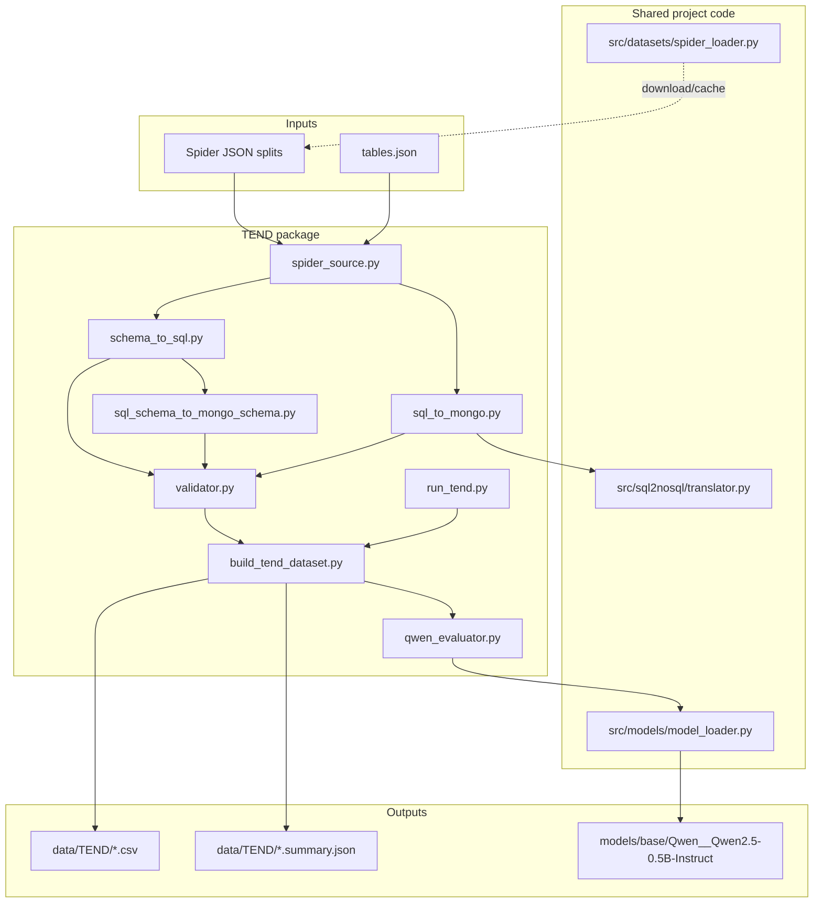

# TEND — SQL-to-NoSQL Dataset Generation & Evaluation

TEND builds **TEND-style training/evaluation datasets** from text-to-SQL benchmarks (Spider today, BIRD planned). For each source example it produces:

- SQL schema and query (from Spider)
- Equivalent MongoDB schema and shell query (via rule-based converters)
- Structural validation flags
- Optional semantic evaluation via **Qwen2.5-0.5B-Instruct**

Outputs are timestamped CSV files under `data/TEND/`.

---

## Architecture Overview



---

## End-to-End Flow

For each Spider sample, `TENDDatasetBuilder.build_row()` runs the following pipeline:

| Step | Module | What happens |
|------|--------|--------------|
| 1 | `spider_source.py` | Load `question`, `sql`, `db_id` from a split JSON file (`train_spider.json`, `dev.json`, etc.) |
| 2 | `schema_to_sql.py` | Build SQL DDL from `tables.json` for the sample's `db_id` |
| 3 | `sql_schema_to_mongo_schema.py` | Parse DDL → MongoDB collection schema JSON (`_id: ObjectId` + typed fields) |
| 4 | `sql_to_mongo.py` | Call `SQLToNoSQLTranslator` (`sql-mongo-converter`) → Mongo shell `find()` / `aggregate()` |
| 5 | `validator.py` | Rule-based checks: CREATE TABLE count, SELECT shape, JSON schema, `db.*` query pattern |
| 6 | `build_tend_dataset.py` | Assemble row + metadata (joins, aggregations, validation flags) |
| 7 | `qwen_evaluator.py` *(optional)* | Qwen judges semantic equivalence of schema and query pairs |
| 8 | `build_tend_dataset.py` | Write CSV row; `run_tend.py` writes companion `.summary.json` |

```text
Spider sample (question, sql, db_id)
        │
        ▼
  tables.json ──► SQL DDL (sql_schema)
        │                    │
        │                    ├──► Mongo schema JSON (nosql_schema)
        │                    │
  sample.sql ────────────────┴──► Mongo shell query (nosql_query)
        │
        ▼
  validator (structural checks)
        │
        ▼
  Qwen evaluator (semantic judge, optional)
        │
        ▼
  data/TEND/spider_<split>_<timestamp>.csv
```

---

## Package Layout

| File | Role |
|------|------|
| `run_tend.py` | CLI entry point — parse args, run builder, print summary |
| `build_tend_dataset.py` | `TENDDatasetBuilder` — orchestrates conversion, validation, evaluation, CSV export |
| `spider_source.py` | Read Spider splits and `tables.json` from local cache (no network) |
| `schema_to_sql.py` | Spider `tables.json` entry → `CREATE TABLE` DDL |
| `sql_schema_to_mongo_schema.py` | SQL DDL → per-collection Mongo type map |
| `sql_to_mongo.py` | Thin wrapper around `sql-mongo-converter` via `SQLToNoSQLTranslator` |
| `validator.py` | Lightweight structural validation helpers |
| `qwen_evaluator.py` | Qwen chat prompt, generation, JSON parsing, equivalence scores |
| `paths.py` | `data/TEND` output paths and timestamped CSV naming |
| `explore_tend_datasets.ipynb` | Jupyter notebook to inspect CSV outputs, quality metrics, and conversion issues |
| `TEND.md` | Original design plan and milestones |

---

## Setup

### 1. Install dependencies

From the **project root** (not the `TEND/` folder):

```bash
conda create -n ai python=3.11 -y
conda activate ai
pip install -r requirements.txt
export PYTHONPATH="$(pwd)"
```

Windows PowerShell:

```powershell
conda create -n ai python=3.11 -y
conda activate ai
pip install -r requirements.txt
$env:PYTHONPATH = (Get-Location).Path
```

### 2. Configure environment (optional)

Copy `.env.example` to `.env` if you want custom storage paths:

```bash
cp .env.example .env
```

Relevant variables:

| Variable | Default | Used for |
|----------|---------|----------|
| `DATA_DIR` | `data` | Root data directory |
| `SPIDER_DATA_DIR` | `data/spider` | Spider dataset cache |
| `MODELS_BASE_DIR` | `models/base` | HuggingFace model cache (including Qwen) |

### 3. Download Spider dataset

TEND reads Spider from disk. Download once via the shared loader:

```bash
python -c "from src.datasets.spider_loader import SpiderLoader; SpiderLoader().download()"
```

This downloads the Spider archive to `data/spider/`, extracts it, and writes a `.downloaded` marker. `SpiderSource` then locates `dev.json`, `train_spider.json`, `tables.json`, etc. under that tree.

If Spider is missing, TEND fails with:

```text
Spider data not found under data/spider. Download Spider first via SpiderLoader().
```

---

## Model Download (Qwen evaluator)

When evaluation is enabled (`--no-eval` not passed), the first run downloads **Qwen/Qwen2.5-0.5B-Instruct** through the shared model cache in `src/models/model_loader.py`:

1. `QwenTENDEvaluator.load()` calls `ensure_model_cached("Qwen/Qwen2.5-0.5B-Instruct")`
2. If `models/base/Qwen__Qwen2.5-0.5B-Instruct/` lacks weights + `.downloaded` marker, HuggingFace downloads tokenizer and model weights
3. Subsequent runs load from disk with `local_files_only=True`

Cache path pattern:

```text
models/base/<model_slug>/
  config.json
  model.safetensors (or pytorch_model.bin)
  tokenizer files
  .downloaded          # cache-complete marker
```

Override the evaluator model with `--model <huggingface_id>`.

**Hardware:** `device="auto"` resolves to CUDA when available, otherwise CPU. A 0.5B instruct model is small but full-split evaluation is still slow on CPU.

---

## How to Run

All commands assume project root and `PYTHONPATH` set as above.

### Full pipeline (convert + Qwen evaluate)

```bash
python -m TEND.run_tend --dataset spider --split validation --max-samples 10
```

### Conversion only (skip Qwen — faster, no GPU/model needed)

```bash
python -m TEND.run_tend --dataset spider --split train --no-eval
```

### Custom output path and model

```bash
python -m TEND.run_tend \
  --dataset spider \
  --split validation \
  --max-samples 50 \
  --model Qwen/Qwen2.5-0.5B-Instruct \
  --output data/TEND/my_run.csv \
  --verbose
```

### CLI options

| Flag | Default | Description |
|------|---------|-------------|
| `--dataset` | `spider` | Source dataset (`spider` only today) |
| `--split` | `train` | `train`, `validation`, `dev`, or `test` (`dev` maps to `validation`) |
| `--max-samples` | all | Limit rows processed |
| `--no-eval` | off | Skip Qwen semantic evaluation |
| `--model` | `Qwen/Qwen2.5-0.5B-Instruct` | HuggingFace model for evaluation |
| `--output` | auto timestamp | Explicit CSV path |
| `--verbose` | off | Debug logging |

### Programmatic use

```python
from TEND.build_tend_dataset import TENDDatasetBuilder

builder = TENDDatasetBuilder(
    dataset="spider",
    split="validation",
    max_samples=5,
    evaluate=True,
)
csv_path = builder.build()
summary = TENDDatasetBuilder.summarize_csv(csv_path)
```

### Explore datasets (Jupyter)

Use `explore_tend_datasets.ipynb` to browse generated CSVs under `data/TEND/`, compare train vs validation splits, inspect SQL/Mongo pairs, and surface conversion or evaluation failures.

**1. Install Jupyter** (one-time; `pandas` is already in `requirements.txt`):

```bash
conda activate ai
pip install jupyter matplotlib ipykernel
```

`matplotlib` is optional but enables the summary charts in the notebook.

**2. Launch from the project root** with `PYTHONPATH` set:

```bash
conda activate ai
export PYTHONPATH="$(pwd)"
jupyter notebook TEND/explore_tend_datasets.ipynb
```

Other launch options:

```bash
# JupyterLab
jupyter lab TEND/explore_tend_datasets.ipynb

# VS Code / Cursor — open TEND/explore_tend_datasets.ipynb and select the "ai" kernel
```

Windows PowerShell:

```powershell
conda activate ai
$env:PYTHONPATH = (Get-Location).Path
jupyter notebook TEND/explore_tend_datasets.ipynb
```

**3. In the notebook**, run cells top-to-bottom. Useful knobs:

| Variable | Purpose |
|----------|---------|
| `SELECTED_SPLIT` | `"train"` or `"validation"` — picks the latest CSV for that split |
| `SAMPLE_INDEX` | Row index for side-by-side SQL vs Mongo inspection |
| `SAMPLE_DB` | Filter playground to one Spider `db_id` |
| `ONLY_FAILURES` | Show only rows where conversion failed |
| `SEARCH_TEXT` | Substring search in `question` or `sql_query` |

The notebook auto-discovers timestamped files such as `spider_train_0614_1752.csv` and their `.summary.json` companions. Generate data first if `data/TEND/` is empty:

```bash
python -m TEND.run_tend --dataset spider --split train --no-eval
```

---

## Output Format

### CSV (`data/TEND/spider_<split>_<MMDD_HHMM>.csv`)

| Column | Description |
|--------|-------------|
| `source` | Dataset name (`spider`) |
| `db_id` | Spider database id |
| `question` | Natural language question |
| `sql_schema` | Generated SQL DDL |
| `sql_query` | Gold SQL from Spider |
| `nosql_schema` | Mongo collection schema (JSON string) |
| `nosql_query` | Mongo shell query |
| `metadata` | JSON blob: index, joins, aggregations, structural validation flags |
| `conversion_success` | SQL→Mongo conversion produced a valid shell query |
| `schema_correct` | Qwen judgment on schema equivalence *(if `--no-eval` not set)* |
| `query_correct` | Qwen judgment on query equivalence |
| `overall_correct` | Both schema and query judged correct |
| `schema_reason` | Short reason from Qwen |
| `query_reason` | Short reason from Qwen |
| `evaluation_response` | Raw Qwen assistant output (JSON text only, not the input prompt) |

### Summary JSON (same basename + `.summary.json`)

```json
{
  "total_rows": 5,
  "conversion_success_rate": 1.0,
  "schema_correct_rate": 1.0,
  "query_correct_rate": 1.0,
  "overall_correct_rate": 1.0
}
```

---

## Validation Layers

TEND uses two complementary checks:

### Structural (`validator.py`)

Fast, rule-based gates — no ML:

- SQL schema contains `CREATE TABLE` statements
- SQL query starts with `SELECT`
- Mongo schema is non-empty JSON object
- Mongo query matches `db.<collection>.(find|aggregate|distinct)(`
- `conversion_success` combines translator success + query shape check

### Semantic (`qwen_evaluator.py`)

Qwen receives SQL and Mongo schema/query pairs and returns JSON:

```json
{
  "schema_correct": true,
  "query_correct": true,
  "schema_reason": "...",
  "query_reason": "..."
}
```

The evaluator:

1. Builds a user message via chat template
2. Generates with greedy decoding (new tokens only — prompt is not echoed back)
3. Parses the assistant JSON (handles chat-template prefixes robustly)

Use structural flags for pipeline health; use Qwen scores for semantic quality sampling and dataset curation.

---

## SQL → Mongo Conversion Notes

Query translation delegates to `src/sql2nosql/translator.py`, a thin wrapper around the [`sql-mongo-converter`](https://pypi.org/project/sql-mongo-converter/) PyPI package (`sql_to_mongo`).

**Supported patterns:** `SELECT`, `WHERE` (including `BETWEEN`, `IN`, `LIKE`, `OR`), `ORDER BY`, `LIMIT`, `GROUP BY`, `HAVING`, aggregates, `DISTINCT`, and `JOIN` (via aggregation `$lookup`)

**Limited / warned:** `UNION` and non-SELECT statements (mutations are disabled for TEND dataset generation)

Schema conversion (`sql_schema_to_mongo_schema.py`) maps each SQL table to a Mongo collection with `_id: ObjectId` and typed fields. It does not embed relationships (no automatic nesting for FKs); see `TEND.md` for planned heuristics.

---

## Troubleshooting

| Issue | Fix |
|-------|-----|
| `Spider data not found` | Run `SpiderLoader().download()` |
| `ModuleNotFoundError` for `src` or `TEND` | Set `PYTHONPATH` to project root |
| Slow first run | Qwen downloads ~1GB; subsequent runs use cache |
| Low `conversion_success_rate` | Expected for complex SQL (joins, subqueries); inspect `metadata.conversion_warnings` |
| Qwen scores disagree with gold SQL | 0.5B model is a weak judge; use for screening, not ground truth |

---

## Roadmap

- **BIRD dataset** support in `TENDDatasetBuilder` (planned; Spider is MVP)
- Richer schema mapping (relationship embedding per `TEND.md`)
- Execution-based equivalence checks against mirrored databases
- Batch / GPU inference for Qwen evaluation

For the original design document and milestone plan, see [`TEND.md`](TEND.md).
