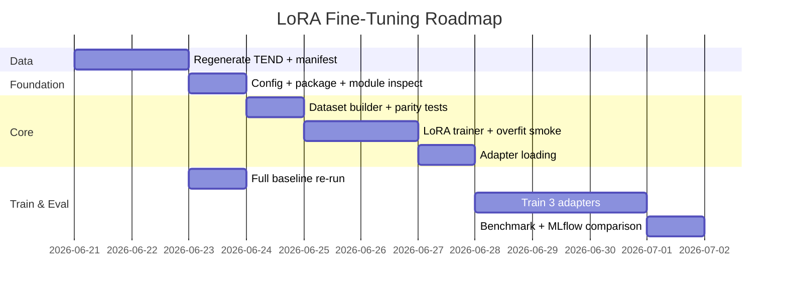

# Implementation Roadmap — LoRA Fine-Tuning

> **Feature:** `lora-finetuning`  
> **Date:** 2026-06-21  
> **Approval required before Stage 1 code:** `approvals/lora-finetuning-approval.md`

---

## Milestone Overview



---

## Implementation Order

| Order | Milestone | Stage | Key outputs |
|-------|-----------|-------|-------------|
| 1 | **M0 — Training data ready** | 0 | Full TEND CSVs, `manifest.json`, filter stats |
| 2 | **M1 — Scaffold + config** | 1 | `configs/default.yaml` training block, `src/training/` skeleton, verified LoRA modules |
| 3 | **M2 — Dataset pipeline** | 2 | `tend_dataset.py`, prompt parity tests green |
| 4 | **M3 — Train loop** | 3 | `lora_trainer.py`, `train_lora.py`, overfit smoke green |
| 5 | **M4 — Inference integration** | 4 | PEFT-aware `CodeGenModel`, adapter load tests green |
| 6 | **M5 — Baseline refresh** | 5 (partial) | Full-validation baseline in `results/` + MLflow |
| 7 | **M6 — Adapter training** | 5 | Three adapters in `models/checkpoints/` |
| 8 | **M7 — LoRA evaluation** | 6 | Per-task metrics JSON, MLflow comparison, validation report |

---

## Testing Checkpoints

Each milestone has explicit gates. Do not advance if a gate fails.

### CP-0 — Data gate (after M0)

- [ ] Train CSV row count ≥ 500 after `overall_correct` filter (target ≥ 1k)
- [ ] Validation CSV row count ≥ 100
- [ ] `manifest.json` points to frozen paths
- [ ] No duplicate `question`+`db_id` rows across train and validation

**Command:**

```bash
python -c "
import pandas as pd, json
from pathlib import Path
m = json.loads(Path('data/TEND/manifest.json').read_text())
for split in ('train', 'validation'):
    df = pd.read_csv(m[split])
    kept = df[df['overall_correct'] == True]
    print(split, len(df), '->', len(kept), 'after filter')
"
```

### CP-1 — Module inspection gate (after M1)

- [ ] `qkv_proj` and `out_proj` exist in codegen-350M attention layers
- [ ] Test LoRA wrap reports > 0 trainable parameters

**Command:**

```bash
python scripts/inspect_lora_modules.py
```

### CP-2 — Prompt parity gate (after M2)

- [ ] `pytest tests/training/test_prompt_parity.py -v` — all pass

### CP-3 — Overfit smoke gate (after M3)

- [ ] `pytest tests/training/test_overfit_smoke.py -v` — loss drops on 5 examples
- [ ] Adapter files written to temp dir

**Command:**

```bash
pytest tests/training/test_overfit_smoke.py -v -m slow
```

### CP-4 — Adapter load gate (after M4)

- [ ] `pytest tests/training/test_adapter_load.py -v` — generate non-empty output

### CP-5 — Training run gate (after M6, per adapter)

- [ ] `adapter_config.json` + `adapter_model.safetensors` present
- [ ] MLflow run logged with task tag
- [ ] Eval loss finite on validation split

**Command (per task):**

```bash
python scripts/train_lora.py \
  --task text2sql \
  --train-csv data/TEND/spider_train_<frozen>.csv \
  --eval-csv data/TEND/spider_validation_<frozen>.csv
# default output: models/checkpoints/text2sql/
```

### CP-6 — Evaluation gate (after M7)

- [ ] LoRA `qwen_correct_rate` logged per task
- [ ] Same validation CSV and decoding config as baseline
- [ ] Lift meets AD-8 threshold OR documented failure analysis

**Command:**

```bash
python scripts/run_baseline_eval.py \
  --dataset tend \
  --tend-csv data/TEND/spider_validation_<frozen>.csv \
  --adapter text2sql \
  --mlflow
```

---

## Rollout Strategy

### Phase A — Internal validation (recommended first)

1. `--max-samples 100` on TEND generation and training.
2. Complete CP-0 through CP-4 on the 100-row subset.
3. Confirm end-to-end pipeline before committing to full runs.

### Phase B — Full corpus

1. Regenerate full TEND (M0).
2. Re-run CP-0.
3. Full adapter training (M6) — expect long wall-clock on MPS/CPU.

### Phase C — Production artifacts

1. All adapters stored **only** under `models/checkpoints/<task>/` (via `get_models_checkpoints_dir()`).
2. Document regen commands in validation report (not README unless requested).
3. Optional: export adapters to shared storage outside git.

---

## Risk Mitigations by Milestone

| Milestone | Top risk | Mitigation |
|-----------|----------|------------|
| M0 | Empty/tiny dataset | Check filter survival before M2 |
| M2 | Prompt drift | CP-2 parity tests |
| M3 | Wrong target_modules | CP-1 + CP-3 |
| M3 | MPS OOM / slowness | Reduce batch to 2–4; increase grad accum |
| M4 | Breaks existing checkpoint load | Keep full-model path; adapter is additive |
| M6 | Doc task low quality | Fallback to ReferenceDocumentationBuilder targets |
| M7 | Optimistic eval | Frozen validation CSV; same decoding as baseline |

---

## Post-Implementation (Validation Phase)

After M7, hand off to the **validation skill**:

- Write report to `ai-workflow/validation/lora-finetuning-report.md`
- Compare primary metrics vs baseline
- File any open issues back to `ai-workflow/research/open-questions/questions.md`

---

## File Index

| Document | Path |
|----------|------|
| Feature plan | `ai-workflow/planning/feature-plans/lora-finetuning-plan.md` |
| Task breakdown | `ai-workflow/planning/task-breakdowns/lora-finetuning-tasks.md` |
| Dependencies | `ai-workflow/planning/dependency-analysis/lora-finetuning-dependencies.md` |
| Approval | `ai-workflow/planning/approvals/lora-finetuning-approval.md` |
