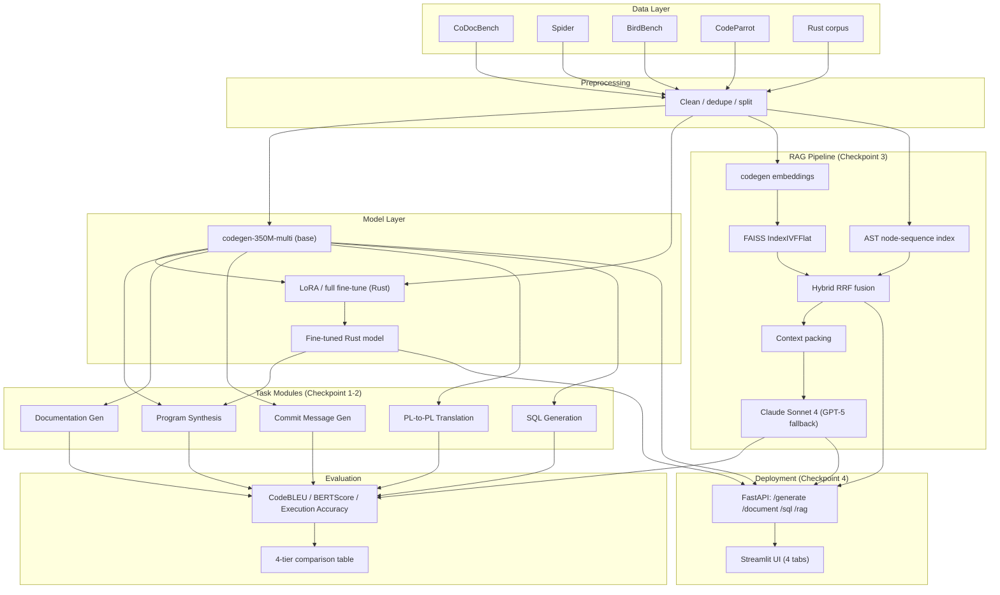
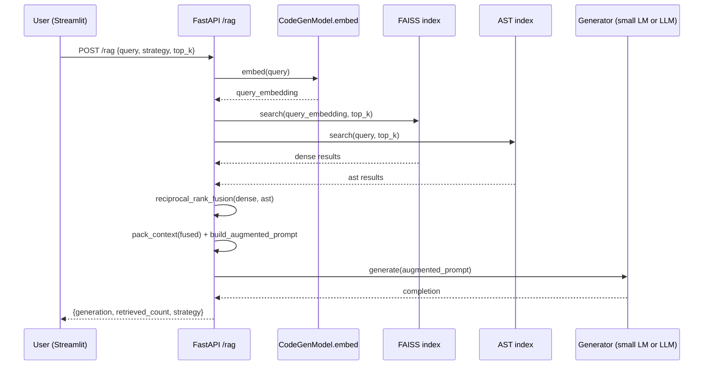

# Architecture

## System overview

## Component responsibilities

The **data layer** downloads and normalizes five sources (CoDocBench for code/doc/commit
triples, Spider and BirdBench for text-to-SQL, CodeParrot as the RAG corpus and fine-tuning
source, and a filtered Rust subset of CodeParrot for the language-extension task). Every
downloader is idempotent and every preprocessor is a pure function, so the pipeline can be
re-run from any point without re-fetching or re-cleaning data that's already on disk.

The **model layer** wraps `Salesforce/codegen-350M-multi` behind a single class
(`CodeGenModel`) that handles generation, embedding extraction (mean-pooled hidden states,
used both for task prompts and RAG retrieval), and LoRA adapter loading — so every other layer
talks to one consistent interface regardless of whether it's the base model or a fine-tuned
checkpoint.

**Task modules** (Checkpoint 1-2) are thin `BaseTask` subclasses: build a prompt, generate,
postprocess. SQL generation additionally injects schema (table/column names + sample rows)
ahead of the question, per the proposal's schema-injection requirement.

The **RAG pipeline** (Checkpoint 3) embeds the corpus once into a FAISS `IndexIVFFlat` (falling
back to exact search for small corpora), separately indexes AST node-type sequences for
structural retrieval, and fuses both via Reciprocal Rank Fusion for the hybrid strategy. Top-K
is either fixed (swept across 1/3/5/10) or dynamic (score-threshold-based, bounded to a
min/max range). Retrieved context is packed into a token-budget-aware prompt prefix and handed
to either the small LM, the fine-tuned Rust model, or the upper-bound LLM (Claude Sonnet 4,
falling back automatically to GPT-5 / GPT-4o / Claude 3.5 Sonnet).

**Evaluation** is centralized in one `Evaluator` class so every task — including SQL's
execution-accuracy path, which actually runs generated queries against SQLite — writes
predictions, a 20-sample manual-review file, and metrics in the same shape, which is what lets
`build_comparison_table()` merge results across all four model tiers into one CSV.

**Deployment** (Checkpoint 4) exposes the same task modules and RAG pipeline through FastAPI
(`/generate`, `/document`, `/sql`, `/rag`), with a Streamlit UI as a thin HTTP client on top —
both are containerized and wired together via `docker-compose.yml`.

## Data flow for a single RAG request

