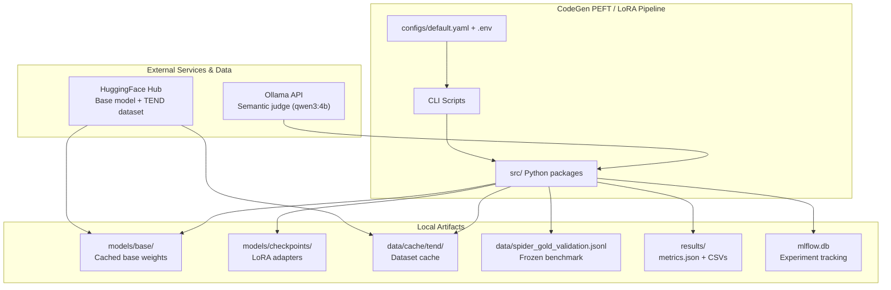
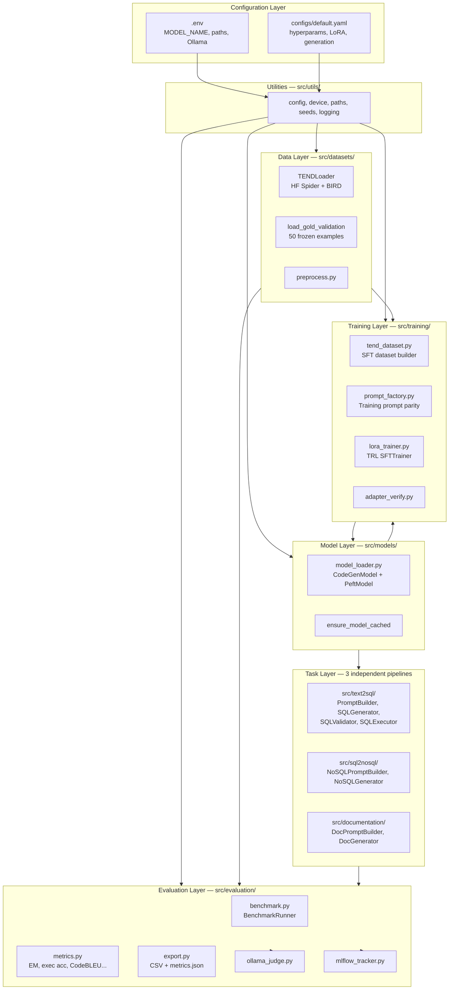
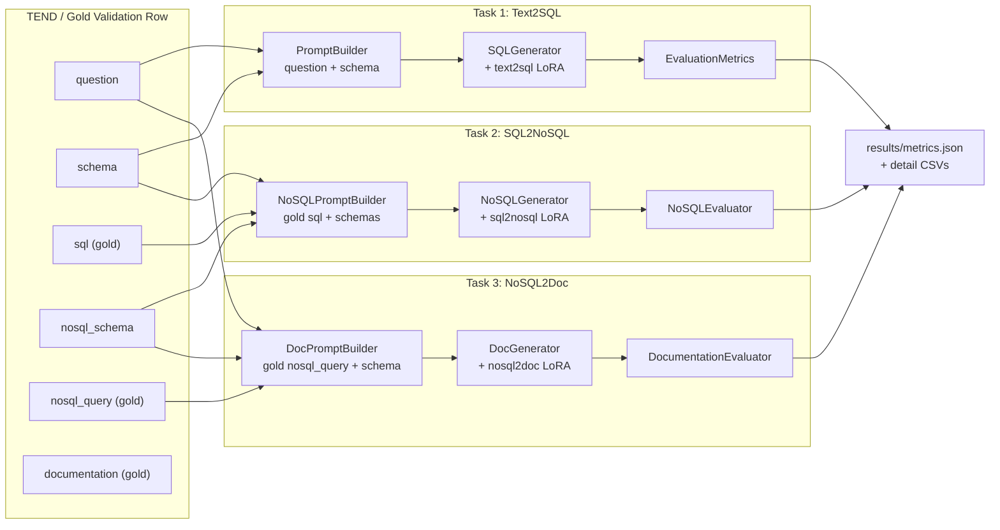
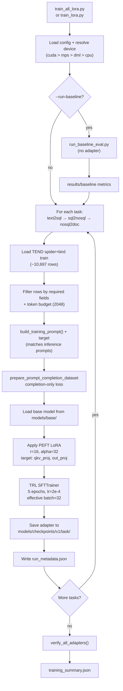
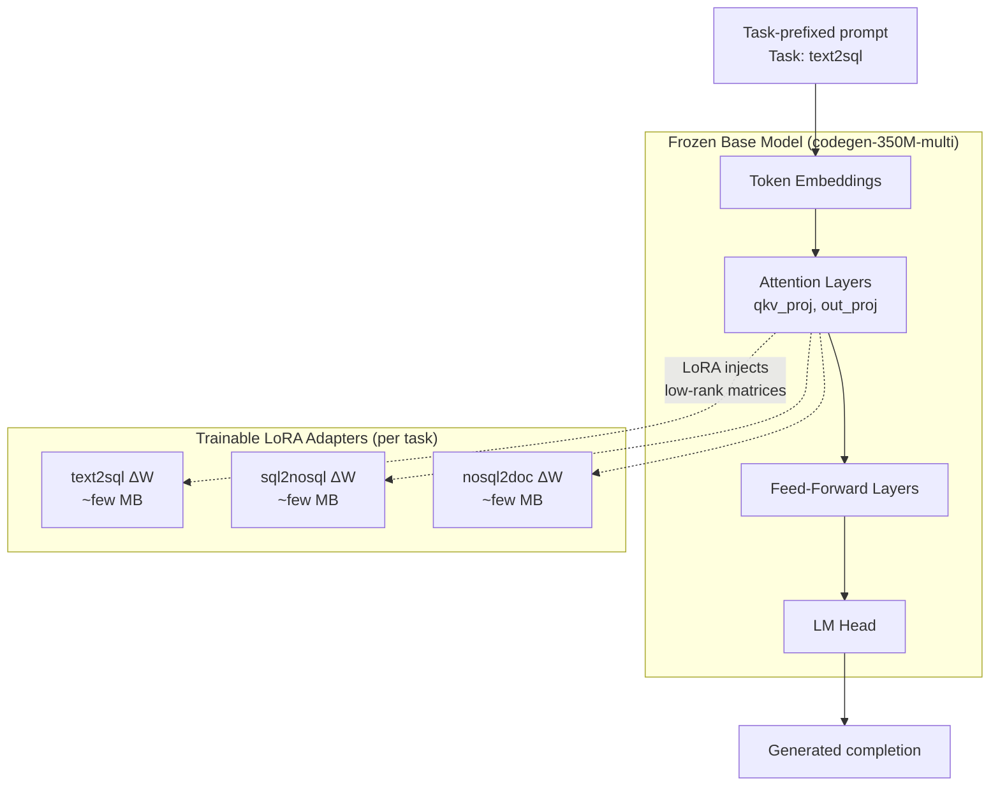
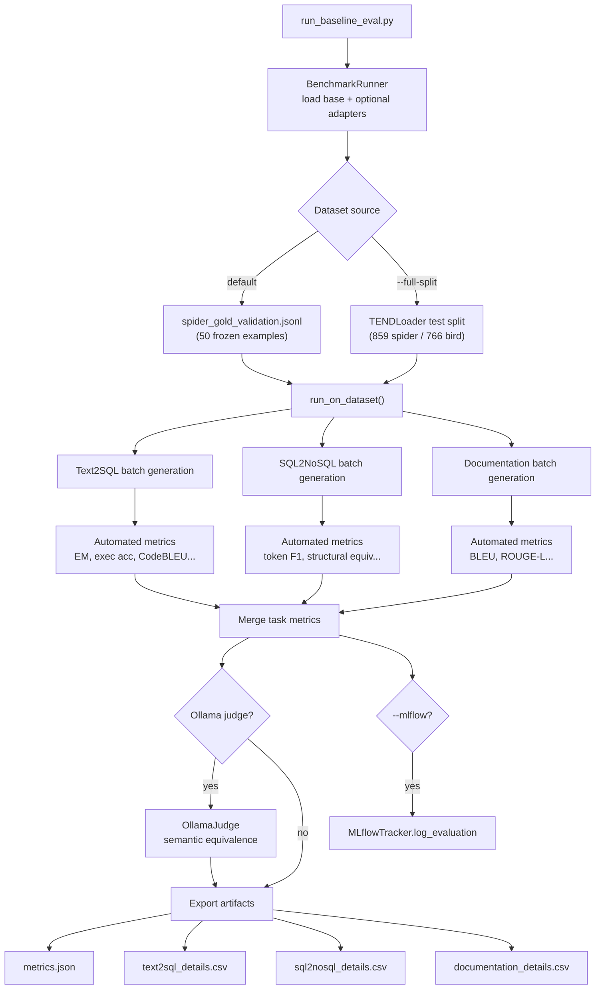
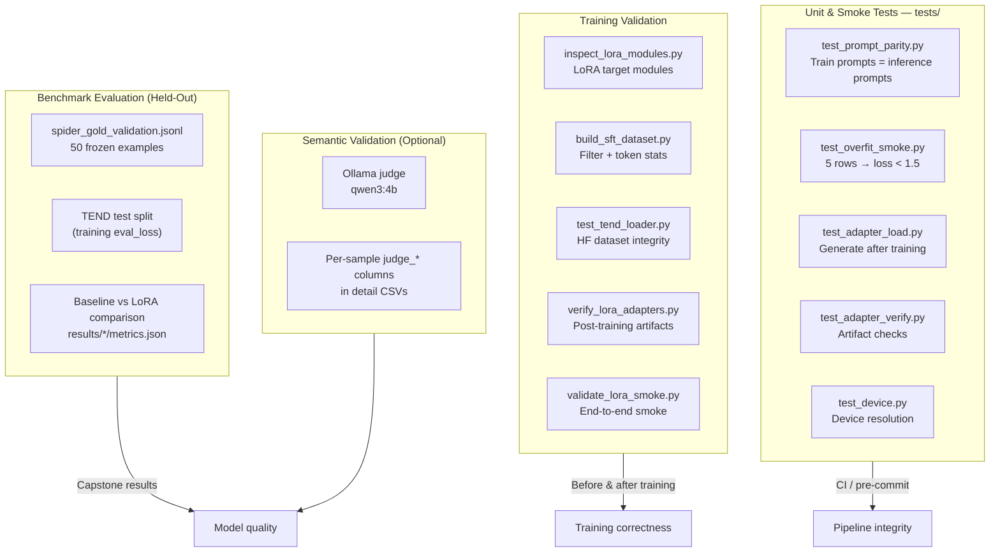
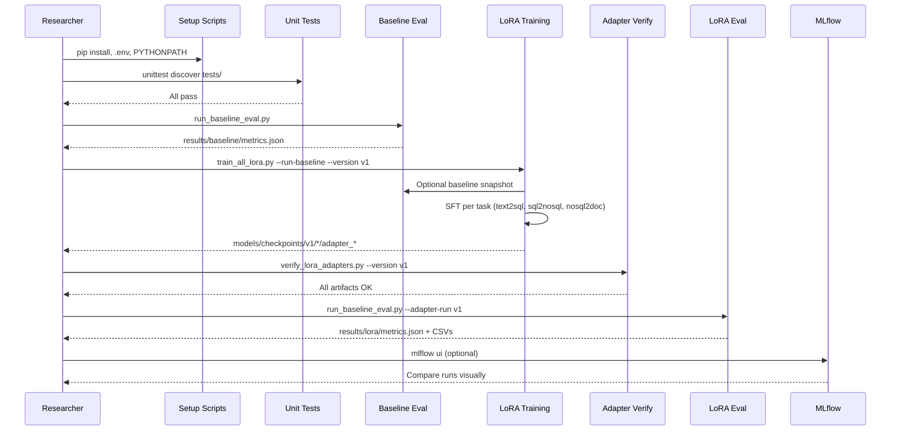
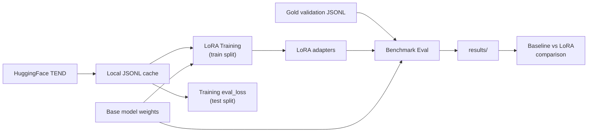

# System Architecture

High-level architecture diagrams for the CodeGen Fine-Tuning with PEFT & LoRA capstone project: system overview, training, evaluation, validation, and testing.

---

## 1. System Context (Level 0)

Shows the project boundary and external dependencies.



---

## 2. High-Level Component Architecture (Level 1)



---

## 3. Three-Task Pipeline Architecture

Each task is **independent** at both training and evaluation time. Gold fields from the same dataset row are used — outputs are never chained.



---

## 4. Training Architecture



### LoRA Model Architecture



---

## 5. Evaluation Architecture



---

## 6. Validation & Testing Architecture

Three distinct layers: **unit/smoke tests**, **training validation**, and **benchmark evaluation**.



### Validation vs Testing vs Evaluation

| Layer | What | When | Dataset | Pass criteria |
|-------|------|------|---------|---------------|
| **Unit tests** | Code correctness | Every commit | Synthetic (5 rows) | All tests pass |
| **Training validation** | Pipeline smoke | Before full train | 50 samples | Adapters saved, loss decreases |
| **Training eval** | Held-out loss | During training | TEND test (~1,625 rows) | eval_loss tracked per epoch |
| **Benchmark eval** | Model quality | After training | Gold validation (50) | Metrics vs baseline |
| **Semantic judge** | Human-like correctness | Optional post-eval | Same 50 examples | judge_correct_rate |

---

## 7. End-to-End Lifecycle

Complete capstone workflow from setup to results.



---

## 8. Directory Structure Map

```
CodeGen-Implementations-May_26/
├── configs/default.yaml          ← Runtime hyperparameters
├── .env                          ← Model name, paths, secrets
├── scripts/
│   ├── train_lora.py             ← Single-task training
│   ├── train_all_lora.py         ← Multi-task orchestration
│   ├── run_baseline_eval.py      ← Primary evaluation
│   └── verify_lora_adapters.py   ← Post-training checks
├── src/
│   ├── text2sql/                 ← Task 1
│   ├── sql2nosql/                ← Task 2
│   ├── documentation/            ← Task 3
│   ├── models/                   ← HF model loader + LoRA
│   ├── datasets/                 ← TEND loader
│   ├── training/                 ← LoRA trainer + SFT builder
│   ├── evaluation/               ← Metrics + benchmark
│   └── utils/                    ← Config, device, paths
├── models/
│   ├── base/                     ← Cached HuggingFace weights
│   └── checkpoints/v1/           ← LoRA adapter outputs
├── data/
│   ├── spider_gold_validation.jsonl  ← Frozen benchmark
│   └── cache/tend/               ← HF dataset cache
├── results/                      ← Evaluation outputs
└── tests/                        ← Unit + smoke tests
```

---

## 9. Data Flow Summary


