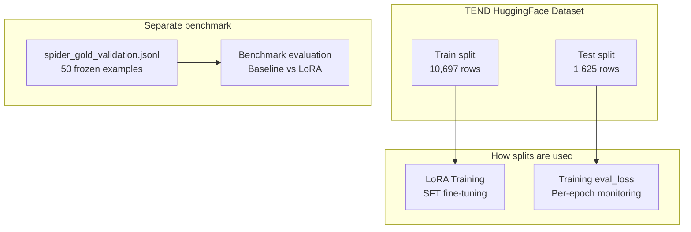
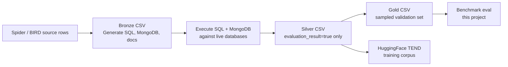

# Data & Datasets

Data sources, schema, splits, and how data flows through training vs evaluation.

---

## 1. Primary Dataset: TEND (Hugging Face)

**Source:** [care2achieve/tend](https://huggingface.co/datasets/care2achieve/tend)

TEND is a **silver dataset** with aligned supervision for all three pipeline tasks. Each row contains natural-language questions, SQL schemas, SQL queries, MongoDB schemas, MongoDB queries, and documentation.

### 1.1 Configurations

| Config | Train rows | Test rows | Origin |
|--------|------------|-----------|--------|
| `spider` | 6,730 | 859 | Spider benchmark |
| `bird` | 3,967 | 766 | BIRD benchmark |
| **Combined** | **10,697** | **1,625** | Used for LoRA training |

> **Naming note:** TEND `test` split = source dataset validation/dev split. TEND `train` = source training split.

### 1.2 Record Schema

| Field | Alias | Used in task | Role |
|-------|-------|--------------|------|
| `question` | — | text2sql, nosql2doc | Natural language input |
| `schema` | `sql_schema` | text2sql, sql2nosql | SQL DDL schema |
| `sql` | `sql_query` | text2sql (target), sql2nosql (input) | SQL query |
| `nosql_schema` | — | sql2nosql, nosql2doc | MongoDB JSON schema |
| `nosql_query` | — | sql2nosql (target), nosql2doc (input) | MongoDB shell query |
| `documentation` | — | nosql2doc (target) | Plain-English explanation |
| `db_id` | — | metadata | Database identifier |
| `id` | — | metadata | Stable example ID |

### 1.3 Example Row (Conceptual)

```json
{
  "question": "How many singers do we have?",
  "schema": "CREATE TABLE singer (...); CREATE TABLE ...",
  "sql": "SELECT count(*) FROM singer",
  "nosql_schema": "{\"singer\": {\"_id\": \"ObjectId\", ...}}",
  "nosql_query": "db.singer.count()",
  "documentation": "This query counts the total number of singers in the database.",
  "db_id": "concert_singer"
}
```

---

## 2. Benchmark Dataset: Spider Gold Validation

**File:** `data/spider_gold_validation.jsonl`  
**Size:** 50 examples (frozen)  
**Purpose:** Reproducible before/after comparison for capstone results

| Property | Value |
|----------|-------|
| Source | Curated subset from TEND Spider |
| Committed to repo | Yes (version-controlled) |
| Used by | `run_baseline_eval.py` (default) |
| Fields | Same schema as TEND |

### Why a separate frozen set?

- **Reproducibility:** Same 50 examples for baseline and every LoRA run
- **Speed:** Full evaluation in minutes, not hours
- **Fair comparison:** No data leakage between training eval and benchmark

---

## 3. Data Split Strategy



| Data | Split | Used for | NOT used for |
|------|-------|----------|--------------|
| TEND train | spider+bird train | LoRA weight updates | Benchmark eval |
| TEND test | spider+bird test | Training `eval_loss` | Final capstone numbers* |
| Gold validation | 50 frozen | Capstone benchmark | Training |

*Full TEND test eval available via `--full-split` for extended analysis.

---

## 4. Execution-Verified Gold Data (TEND Project)

The HuggingFace TEND corpus used for LoRA training is **silver-tier** supervision. A companion project at `/Volumes/Work/TEND` builds **execution-verified gold datasets** for higher-quality training and validation:



| Tier | How produced | Used for |
|------|--------------|----------|
| Bronze | LLM + rule-based translation; queries executed and compared | Raw generation output |
| Silver | Rows where SQL and MongoDB execution results match | LoRA training (current TEND HF dataset) |
| Gold | Random sample from silver (default 50 rows) | Frozen benchmark / validation |

This project's `spider_gold_validation.jsonl` is a frozen 50-example subset. The next phase uses TEND's full silver train split for LoRA training and refreshed gold sets for validation.

**Evaluation direction:** Generated query validation currently uses an Ollama LLM judge (`judge_correct_rate`). This will be replaced by **query execution** — run predicted SQL and MongoDB queries against live databases and compare result sets, matching the TEND execution pipeline.

---

## 5. Per-Task Data Requirements

Rows missing required fields are **filtered out** during training and evaluation.

| Task | Required input fields | Target field |
|------|----------------------|--------------|
| `text2sql` | `question`, `schema` | `sql` |
| `sql2nosql` | `sql`, `schema`, `nosql_schema` | `nosql_query` |
| `nosql2doc` | `nosql_query`, `nosql_schema`, `documentation` | `documentation` |

---

## 6. Token Budget & Truncation

| Setting | Value | Source |
|---------|-------|--------|
| Max sequence length | 2048 tokens | `configs/default.yaml` |
| Max target (completion) | 256 tokens | Reserved for output |
| Prompt budget | ~1792 tokens | 2048 − 256 |

**Truncation policy:** If prompt + target exceeds 2048 tokens, truncate from the **start** of the prompt (drop schema head). The target completion is **never truncated**.

Only ~0.02% of training rows exceed the budget at 2048 tokens.

---

## 7. Local Caching

```
data/cache/tend/care2achieve__tend/
├── spider/
│   ├── train.jsonl
│   └── test.jsonl
└── bird/
    ├── train.jsonl
    └── test.jsonl
```

- Downloaded once from HuggingFace, then reused
- Configured via `TEND_CACHE_DIR` in `.env`
- Loader: `src/datasets/tend_loader.py`

---

## 8. Loading Data (Code Examples)

```python
from src.datasets.tend_loader import TENDLoader, load_gold_validation

# Training data
train_rows = []
for config in ("spider", "bird"):
    loader = TENDLoader(config=config)
    train_rows.extend(loader.load_split("train"))

# Benchmark data
gold_examples = load_gold_validation()  # 50 frozen examples
```

---

## 9. Data Provenance for Capstone

| Claim | Evidence |
|-------|----------|
| Training on standard benchmarks | TEND derived from Spider + BIRD |
| No benchmark leakage in training labels | Gold validation is a separate frozen file |
| Reproducible eval | Same 50 examples, seeds fixed at 42 |
| Public dataset | [care2achieve/tend](https://huggingface.co/datasets/care2achieve/tend) on HuggingFace |

See also: [data/DATASETS.md](../../data/DATASETS.md)
