# Results & Analysis

Baseline vs LoRA v1 comparison on the Spider gold validation benchmark (50 examples).

---

## 1. Experimental Setup

| Parameter | Value |
|-----------|-------|
| Base model | `Salesforce/codegen-350M-multi` |
| Fine-tuning | LoRA (r=16, alpha=32) |
| LoRA training scale | 50 samples, 10 epochs (smoke run) |
| Evaluation dataset | `spider_gold_validation` (50 examples) |
| Semantic judge | Ollama `qwen3:4b` |
| Decoding | Greedy (temperature=0.7, max 256 tokens) |

### Compared runs

| Run | Results path |
|-----|--------------|
| Baseline (no adapter) | `results/spider_gold_validation_codegen-350M-multi_2506_2029/` |
| LoRA v1 | `results/spider_gold_validation_codegen-350M-multi_lora-v1_2506_2343/` |

---

## 2. Summary

LoRA v1 improves **every task** on similarity and validity metrics. The clearest win is **Text2SQL judge accuracy** (4% → 14%). SQL2NoSQL and Documentation show large gains in output quality and parseability.

---

## 3. Text2SQL Results

**Strongest overall improvement — 3.5× judge accuracy.**

| Metric | Baseline | LoRA v1 | Change |
|--------|----------|---------|--------|
| **Judge correct rate** | 4% | **14%** | **+10 pp (+250%)** |
| CodeBLEU | 0.548 | 0.629 | +15% |
| ROUGE-L | 0.415 | 0.580 | +40% |
| BLEU | 0.044 | 0.113 | +157% |
| Syntax validity | 98% | **100%** | +2 pp |
| Translation success | 92% | **100%** | +8 pp |
| Exact match | 0% | 0% | — |
| Execution accuracy | 0% | 0% | — |

**Interpretation:** LoRA dramatically improves semantic similarity and output validity. Exact match and execution accuracy remain 0% because generated SQL differs structurally from gold even when semantically close (judge catches this at 14%).

---

## 4. SQL2NoSQL Results

**Large metric gains; judge rate unchanged.**

| Metric | Baseline | LoRA v1 | Change |
|--------|----------|---------|--------|
| **Judge correct rate** | 8% | 8% | 0 |
| CodeBLEU | 0.202 | 0.514 | +154% |
| Token F1 | 0.241 | 0.547 | +127% |
| Structural equivalence | 44% | **76%** | +32 pp |
| Syntax validity | 26% | **98%** | +72 pp |
| Translation success | 26% | **98%** | +72 pp |
| Exact match | 4% | 0% | −4 pp |

**Interpretation:** LoRA transforms output from mostly invalid (26% syntax) to nearly always valid (98%). Structural equivalence jumps from 44% to 76%. Judge rate flat — automated metrics capture improvements the judge may miss at this scale.

---

## 5. Documentation Results

**Biggest relative metric gains; judge still 0%.**

| Metric | Baseline | LoRA v1 | Change |
|--------|----------|---------|--------|
| **Judge correct rate** | 0% | 0% | 0 |
| CodeBLEU | 0.030 | 0.244 | +705% |
| Token F1 | 0.049 | 0.336 | +587% |
| ROUGE-L | 0.051 | 0.306 | +496% |
| Structural equivalence | 12% | **40%** | +28 pp |
| Syntax validity | 28% | **76%** | +48 pp |
| Translation success | 28% | **76%** | +48 pp |

**Interpretation:** Baseline documentation output is near-random; LoRA produces structured, partially correct docs. Judge at 0% suggests either strict judging criteria or need for longer/more diverse training.

---

## 6. Visual Comparison

```mermaid
xychart-beta
    title "Judge Correct Rate by Task"
    x-axis ["Text2SQL", "SQL2NoSQL", "Documentation"]
    y-axis "Rate (%)" 0 --> 20
    bar "Baseline" [4, 8, 0]
    bar "LoRA v1" [14, 8, 0]
```

```mermaid
xychart-beta
    title "Syntax Validity by Task"
    x-axis ["Text2SQL", "SQL2NoSQL", "Documentation"]
    y-axis "Rate (%)" 0 --> 100
    bar "Baseline" [98, 26, 28]
    bar "LoRA v1" [100, 98, 76]
```

---

## 7. Key Findings

### What worked

1. **LoRA fine-tuning helps even at smoke scale** — 50 training samples produced measurable gains
2. **Syntax validity dramatically improved** for sql2nosql (26% → 98%) and documentation (28% → 76%)
3. **Text2SQL judge accuracy tripled** — strongest evidence that fine-tuning aligns model outputs with task intent
4. **Independent task design validated** — each adapter improves its task without affecting others

### What did not improve (yet)

1. **Execution accuracy: 0% everywhere** — SQLite databases not bundled with examples
2. **Exact match: 0% for text2sql and documentation** — models generate valid but structurally different outputs
3. **Documentation judge: 0%** — semantic judge may be too strict or training too limited
4. **SQL2NoSQL judge flat at 8%** — despite 72 pp syntax improvement

---

## 8. Limitations

| Limitation | Impact | Mitigation |
|------------|--------|------------|
| Smoke-scale training (50 samples) | Underfits full dataset | Full ~10k LoRA training (next step) |
| Small base model (350M) | Ceiling on complex queries | Acceptable for capstone scope; LoRA still shows gains |
| No local execution databases | Execution accuracy always 0% | Use TEND execution pipeline for gold data |
| Judge calibration | Judge may not reflect metric gains | Replace with execution-based validation (TEND approach) |

---

## 9. Future Work

1. **Execution-verified gold datasets** — continue TEND pipeline (`/Volumes/Work/TEND`): execute generated SQL and MongoDB queries, filter to silver, sample gold for validation
2. **Replace LLM judge with query execution** — swap Ollama semantic judging for execution-based validation: run predicted SQL/MongoDB queries against live databases and compare result sets to gold (same pattern as TEND's `accuracy_runner`)
3. **Full-scale LoRA training** — train all three adapters on complete TEND train split (~10,697 rows)
4. **Full validation** — evaluate on TEND test split (~1,625 rows) and refreshed gold validation sets
5. **Execution accuracy metrics** — report result-set match rates once execution validation replaces the LLM judge

See also: [LoRA v1 vs Baseline comparison](../lora-v1-vs-baseline-comparison.md)

---

## 10. Artifact References

| Artifact | Location |
|----------|----------|
| Baseline metrics | `results/spider_gold_validation_codegen-350M-multi_2506_2029/metrics.json` |
| LoRA v1 metrics | `results/spider_gold_validation_codegen-350M-multi_lora-v1_2506_2343/metrics.json` |
| Comparison write-up | `docs/lora-v1-vs-baseline-comparison.md` |
| Per-sample details | `results/.../text2sql_details.csv`, `sql2nosql_details.csv`, `documentation_details.csv` |
