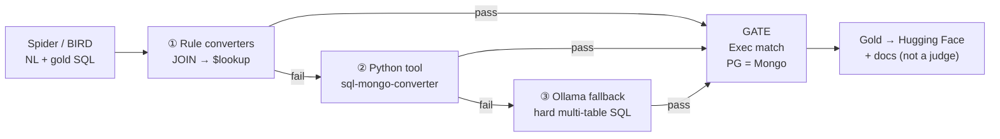
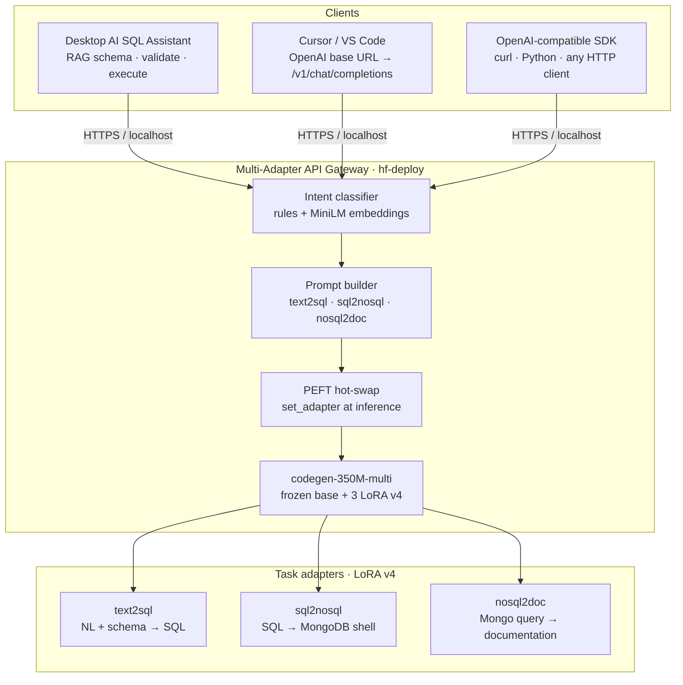
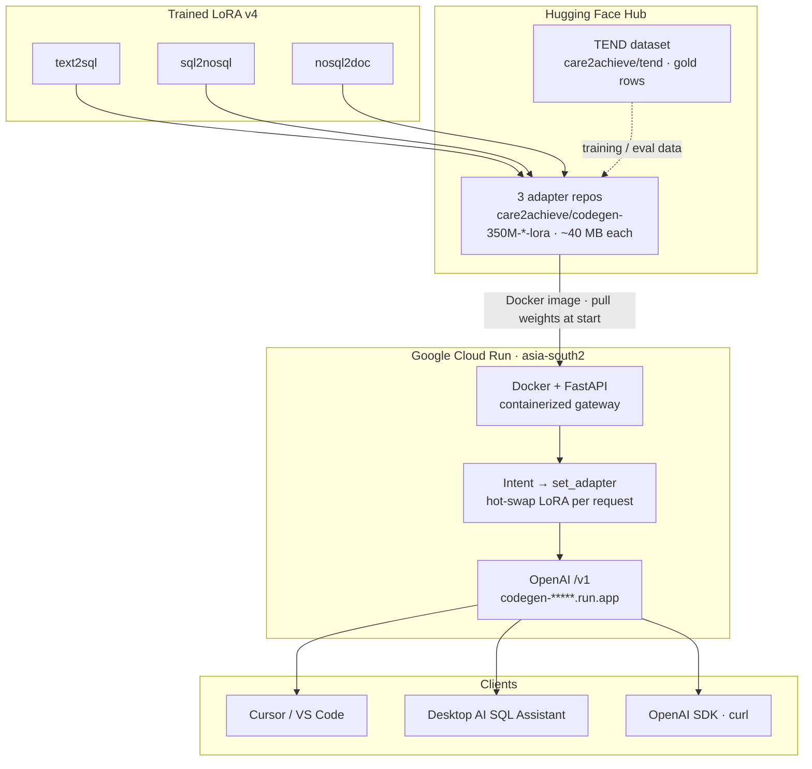
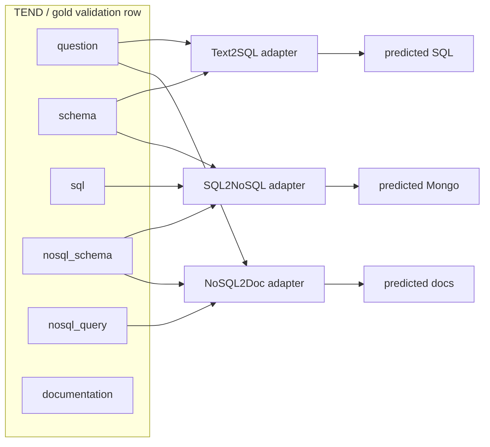
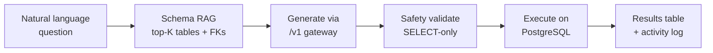

# Capstone Reviewer Submission Guide

**Project:** Interactive Database Querying Using Small Code Language Models  
**Also known as:** CodeGen Fine-Tuning with PEFT & LoRA  
**Group:** Capstone Group 43 · CodeGen 10  
**Institution:** International Institute of Information Technology Hyderabad (IIITH)  
**Program:** PG Certification in Artificial Intelligence and Machine Learning  
**Presentation dates:** 8–9 August 2026  
**Current production adapters:** LoRA **v4**  
**Live deck:** [final-presentation.html](final-presentation.html)

This document is written for **capstone reviewers**. It explains the team, the datasets, what each repository folder contains, and the features implemented end-to-end so the whole project can be understood without reading every source file.

---


## Table of contents

1. [Team details](#1-team-details)
2. [Project at a glance](#2-project-at-a-glance)
3. [Dataset details](#3-dataset-details)
4. [System architecture (what we built)](#4-system-architecture-what-we-built)
5. [Training versions and key results](#5-training-versions-and-key-results)
6. [Repository folder guide](#6-repository-folder-guide)
7. [Public artifacts and demos](#7-public-artifacts-and-demos)
8. [How to verify the work](#8-how-to-verify-the-work)
9. [Related documentation](#9-related-documentation)

---


## 1. Team details


| Field                | Value                                     |
| -------------------- | ----------------------------------------- |
| Capstone group       | **Group 43**                              |
| Track / cohort label | **CodeGen 10**                            |
| Institution          | IIITH                                     |
| Program              | PG Certification in AI & Machine Learning |
| Defense window       | **8–9 August 2026**                       |


### Team members

All members contributed across dataset construction, LoRA training, evaluation, deployment, desktop tool, and presentation (as stated in the final deck).


| Name                         | Notes       |
| ---------------------------- | ----------- |
| **Naresh Reddy Yadulla**     | Team member |
| **Mohana K Kishore Dwadasi** | Team member |
| **Sivakrishna Andraju**      | Team member |


### One-line project pitch (from the title slide)

CodeGen fine-tuning with **PEFT & LoRA** — three adapters on one **350M** base model, an **execution-validated** multi-task dataset (**TEND**), an **OpenAI-compatible** multi-adapter API, and a **desktop SQL assistant** with RAG schema injection.

---


## 2. Project at a glance


### Problem

- Full fine-tunes of large LMs are impractical on research / student hardware.
- Zero-shot `codegen-350M-multi` is weak on structured DB tasks.
- Public benchmarks (Spider, BIRD) stop at NL→SQL; they do not provide aligned SQL↔Mongo↔docs with **execution proof**.
- IDE clients need a deployable **OpenAI-compatible** endpoint.


### Solution


| Component   | What it is                                                            |
| ----------- | --------------------------------------------------------------------- |
| Base model  | `Salesforce/codegen-350M-multi` (frozen)                              |
| Fine-tuning | PEFT LoRA — **one adapter per task**                                  |
| Tasks       | Text→SQL · SQL→MongoDB · NoSQL→Documentation                          |
| Dataset     | **TEND** — aligned, execution-validated rows from Spider + BIRD       |
| Serving     | FastAPI gateway with intent classification + PEFT hot-swap            |
| Client      | Desktop AI SQL Assistant (schema RAG → generate → validate → execute) |


### Headline results (LoRA v4, frozen gold set, n=50, greedy)


| Task        | Metric             | Baseline | LoRA v4 |
| ----------- | ------------------ | -------- | ------- |
| Text→SQL    | Execution accuracy | 12%      | **60%** |
| SQL→MongoDB | Execution accuracy | 22%      | **88%** |
| NoSQL→Docs  | Judge score (0–10) | 0.1      | **7.8** |


Adapters are ~**40 MB** each at v4. Published on Hugging Face under `care2achieve/codegen-350M-*-lora`.

---


## 3. Dataset details


### 3.1 Why we built TEND

**TEND** = **T**ranslation · **E**valuation · **N**atural language · **D**ocument (NoSQL).

Spider and BIRD provide NL + gold SQL only. Training three LoRA adapters required **one aligned gold row** per example covering question, SQL, MongoDB, and documentation — filtered by **execution match** (PostgreSQL vs MongoDB), not an LLM judge.


| Item                     | Value                                                                                                                   |
| ------------------------ | ----------------------------------------------------------------------------------------------------------------------- |
| Public repo              | [care2achieve/tend](https://huggingface.co/datasets/care2achieve/tend) [Gitrepo](https://github.com/nareshyadulla/TEND) |
| License                  | CC BY 4.0 (see HF dataset card; cite Spider & BIRD)                                                                     |
| Gold rows (presentation) | **9,075** execution-validated gold rows                                                                                 |
| Bronze → gold yield      | **43.9%**                                                                                                               |
| Local reference doc      | `[data/DATASETS.md](../../data/DATASETS.md)`                                                                            |


### 3.2 How TEND is built (conversion cascade)



Failed rows stay failed. BIRD yield is much lower than Spider. No LLM “rescue” of queries that fail execution.

### 3.3 Hugging Face configurations and splits


| Config       | Train rows  | Test rows  | Origin                                   |
| ------------ | ----------- | ---------- | ---------------------------------------- |
| `spider`     | 6,730       | 859        | Spider-derived                           |
| `bird`       | 3,967       | 766        | BIRD-derived                             |
| **Combined** | **~10,697** | **~1,625** | Used for LoRA training / train-eval loss |


> **Naming:** TEND `test` = source validation/dev (Spider/BIRD `dev`). TEND `train` = source training split.


### 3.4 Record schema (one row = three tasks)


| Field           | Alias        | Role                                      |
| --------------- | ------------ | ----------------------------------------- |
| `question`      | —            | NL input (text2sql / context)             |
| `schema`        | `sql_schema` | SQL DDL for prompts                       |
| `sql`           | `sql_query`  | text2sql **target**; sql2nosql **input**  |
| `nosql_schema`  | —            | Mongo schema for prompts                  |
| `nosql_query`   | —            | sql2nosql **target**; nosql2doc **input** |
| `documentation` | —            | nosql2doc **target**                      |
| `db_id`         | —            | Database id metadata                      |
| `id`            | —            | Stable example id                         |


### 3.5 Benchmark set used for capstone numbers


| Property            | Value                                           |
| ------------------- | ----------------------------------------------- |
| File                | `data/spider_gold_validation.jsonl`             |
| Size                | **50** frozen examples                          |
| Purpose             | Apples-to-apples baseline vs every LoRA version |
| Committed           | Yes (version-controlled)                        |
| Default eval script | `scripts/run_baseline_eval.py`                  |


| Data                           | Used for                  | Not used for                |
| ------------------------------ | ------------------------- | --------------------------- |
| TEND train (spider+bird)       | LoRA weight updates       | Final reported gold metrics |
| TEND test (spider+bird)        | Training `eval_loss`      | Primary slide numbers*      |
| `spider_gold_validation.jsonl` | Capstone benchmark tables | Training                    |


Full TEND test eval is available via `--full-split` for extended analysis.

### 3.6 Demo database (desktop tool)


| Item           | Detail                                                         |
| -------------- | -------------------------------------------------------------- |
| Schema         | Pagila / DVD rental (`actor`, `film`, `customer`, `rental`, …) |
| Dump           | `tool/test.sql`                                                |
| Setup          | `tool/scripts/setup_dvd_database.sh` → PostgreSQL DB `dvd`     |
| Optional Mongo | `tool/scripts/setup_dvd_mongodb.py`                            |


---


## 4. System architecture (what we built)

**Design choice:** schema RAG and database execution stay on the **client**. The gateway stays **stateless** and OpenAI-compatible (`/v1/chat/completions`).

### 4.1 End-to-end product architecture

Clients call one OpenAI-compatible gateway; the gateway classifies intent, builds a task prompt, and hot-swaps the matching LoRA adapter on a frozen CodeGen base.



### 4.2 Deployment path (Hub → Cloud Run → clients)



### 4.3 Research / training view (three independent tasks)

Tasks are **trained and evaluated independently** with **gold** fields from the same TEND row — predicted outputs are never chained during benchmarking.



| Task | Input | Output | Adapter |
|------|-------|--------|---------|
| **Text2SQL** | Question + SQL schema | SQL | `text2sql` |
| **SQL2NoSQL** | Gold SQL + schemas | MongoDB shell | `sql2nosql` |
| **NoSQL2Doc** | Gold Mongo + schema | Documentation | `nosql2doc` |

### 4.4 Desktop tool closed loop (client-side)



---


## 5. Training versions and key results


### 5.1 Version ladder


| Version          | Train samples | Epochs     | LoRA                 | Targets      | Device      | Role                   |
| ---------------- | ------------- | ---------- | -------------------- | ------------ | ----------- | ---------------------- |
| Baseline         | —             | —          | none                 | —            | —           | Zero-shot              |
| v1               | 50            | 10         | r16 α32              | attn         | MPS         | Smoke                  |
| v2               | 500           | 5          | r16 α32              | attn         | MPS         | Mid-scale              |
| v3               | ~8k           | 5*         | r16 α32              | attn         | MPS         | Full TEND              |
| **v4 (current)** | ~8k           | 5          | **r32 α64**          | **attn+FFN** | Kaggle CUDA | Production             |
| v5               | ~8k           | early stop | same as v4; lower LR | attn+FFN     | Kaggle      | text2sql ablation only |


v3 text2sql best at epoch 2. v4 ~7h 34m wall clock on CUDA.

### 5.2 Gold validation progression (execution / judge)


| Version  | Text2SQL exec | SQL2NoSQL exec | Doc judge (0–10) |
| -------- | ------------- | -------------- | ---------------- |
| Baseline | 12%           | 22%            | 0.1              |
| v1       | 20%           | 4%             | 1.5              |
| v2       | 34%           | 32%            | 3.1              |
| v3       | 54%           | 74%            | 6.4              |
| **v4**   | **60%**       | **88%**        | **7.8**          |


Why v4 won: same full TEND data as v3; bottleneck was capacity → wider LoRA (r/α doubled) and FFN targets (`fc_in`, `fc_out`); adapter size ~7.5 MB → ~40 MB.

Full tracker: `[docs/version-tracker.md](../version-tracker.md)`.

---


## 6. Repository folder guide

Top-level layout:

```
CodeGen-Implementations-May_26/
├── src/              # Core ML library (tasks, training, evaluation)
├── scripts/          # CLI entry points (train, eval, verify)
├── configs/          # YAML hyperparameters
├── data/             # Gold validation set + dataset docs + cache
├── models/           # Cached base models + LoRA checkpoints
├── results/          # Evaluation metrics.json + detail CSVs
├── tests/            # Unit / smoke tests for the ML pipeline
├── tool/             # Desktop AI SQL Assistant
├── hf-deploy/        # OpenAI-compatible multi-adapter FastAPI + deploy
├── docs/             # Capstone + comparison reports
├── notebooks/        # Kaggle training notebook
├── agent/            # Agent design notes
├── ai-workflow/      # Research → plan → implement → validate traces
├── requirements.txt  # Python deps
└── README.md         # Setup & CLI reference
```

Below: **summary**, **features implemented**, and a **file table** for each major folder.

---


### 6.1 `src/` — Core ML library

**Summary:** Reusable Python package for the three tasks, TEND loading, LoRA training, model loading, and multi-metric evaluation. Scripts call into this package; it does not own the desktop UI or the cloud gateway.

**Features implemented**

- Prompt builders for text2sql, sql2nosql, nosql2doc with **training/inference prompt parity**
- Hugging Face model loader with optional LoRA adapter attach
- TEND download/cache + preprocessing
- LoRA / SFT training (TRL `SFTTrainer`, completion-only loss, filters, token stats)
- Metrics: Exact Match, Execution Accuracy, BLEU/ROUGE/BERTScore/CodeBLEU, structural similarity, Ollama judge
- Device helpers: CUDA, MPS, DirectML, CPU
- MLflow helpers for experiment tracking


#### `src/text2sql/`


| File                | Purpose                                    |
| ------------------- | ------------------------------------------ |
| `prompt_builder.py` | Builds NL + schema → SQL prompts           |
| `sql_generator.py`  | Runs model generation for SQL              |
| `sql_validator.py`  | Syntax / structure checks on generated SQL |
| `sql_executor.py`   | Executes SQL for evaluation / validation   |


#### `src/sql2nosql/`


| File                 | Purpose                          |
| -------------------- | -------------------------------- |
| `prompt_builder.py`  | Builds SQL → MongoDB prompts     |
| `nosql_generator.py` | Generates MongoDB shell queries  |
| `evaluator.py`       | Task-specific evaluation helpers |


#### `src/documentation/`


| File                   | Purpose                              |
| ---------------------- | ------------------------------------ |
| `prompt_builder.py`    | Builds Mongo → documentation prompts |
| `doc_generator.py`     | Generates natural-language docs      |
| `reference_builder.py` | Builds reference documentation text  |
| `evaluator.py`         | Documentation scoring helpers        |


#### `src/datasets/`


| File             | Purpose                                                       |
| ---------------- | ------------------------------------------------------------- |
| `tend_loader.py` | Loads/caches HF `care2achieve/tend` (spider/bird, train/test) |
| `preprocess.py`  | Normalizes fields for training/eval                           |


#### `src/models/`


| File              | Purpose                                          |
| ----------------- | ------------------------------------------------ |
| `model_loader.py` | Loads base LM from cache; attaches LoRA adapters |


#### `src/training/`


| File                | Purpose                              |
| ------------------- | ------------------------------------ |
| `lora_config.py`    | Builds PEFT LoRA config from YAML    |
| `lora_trainer.py`   | SFTTrainer orchestration             |
| `tend_dataset.py`   | Builds supervised datasets from TEND |
| `prompt_factory.py` | Task → prompt builder mapping        |
| `tasks.py`          | Task definitions / target fields     |
| `filters.py`        | Drops invalid / overlong rows        |
| `collator.py`       | Completion-only loss collator        |
| `token_stats.py`    | Prompt/target length statistics      |
| `adapter_verify.py` | Checks adapter artifacts exist       |
| `mlflow_utils.py`   | Training-side MLflow logging         |


#### `src/evaluation/`


| File                        | Purpose                                 |
| --------------------------- | --------------------------------------- |
| `benchmark.py`              | Orchestrates multi-task evaluation runs |
| `metrics.py`                | Aggregate metric computation            |
| `database_execution.py`     | Execution-accuracy against databases    |
| `gold_output_comparison.py` | Compares predictions to gold            |
| `structural_similarity.py`  | Structural SQL/Mongo similarity         |
| `embedding_similarity.py`   | Embedding-based similarity (docs)       |
| `ollama_judge.py`           | Optional LLM-as-judge via Ollama        |
| `qwen_evaluator.py`         | Qwen-based evaluation helper            |
| `export.py`                 | Writes `metrics.json` / detail CSVs     |
| `mlflow_tracker.py`         | Eval-side MLflow logging                |


#### `src/llm/`


| File                    | Purpose                        |
| ----------------------- | ------------------------------ |
| `factory.py`            | Provider factory (HF / Ollama) |
| `huggingface_client.py` | Hugging Face generation client |
| `ollama_client.py`      | Ollama HTTP client             |


#### `src/utils/`


| File                   | Purpose                               |
| ---------------------- | ------------------------------------- |
| `config.py`            | Loads YAML + `.env` settings          |
| `paths.py`             | Model/checkpoint/data path resolution |
| `device.py`            | Auto device selection                 |
| `seeds.py`             | Reproducibility seeds                 |
| `logging.py`           | Logging setup                         |
| `schema_conversion.py` | Schema format helpers                 |


---


### 6.2 `scripts/` — CLI entry points

**Summary:** Operator-facing commands for setup, training, evaluation, and verification. Prefer these over calling library modules directly.

**Features implemented**

- Single-task and all-task LoRA training
- Baseline / LoRA evaluation on gold-50 or full TEND splits
- Adapter download from Hugging Face
- LoRA module inspection and artifact verification
- Dataset smoke tests


| File                           | Purpose                                                     |
| ------------------------------ | ----------------------------------------------------------- |
| `train_lora.py`                | Train one task (`text2sql` / `sql2nosql` / `nosql2doc`)     |
| `train_all_lora.py`            | Train all three tasks + write training summary              |
| `run_baseline_eval.py`         | Primary eval (gold-50 by default; LoRA via `--adapter-run`) |
| `run_all_baseline_eval.py`     | Multi-model baseline comparison                             |
| `build_sft_dataset.py`         | Smoke-build SFT rows and print filter/token stats           |
| `test_tend_loader.py`          | Smoke-test TEND + gold validation loading                   |
| `pull_tend_data.py`            | Prefetch / refresh TEND cache                               |
| `inspect_lora_modules.py`      | Verify LoRA target modules on the base model                |
| `verify_lora_adapters.py`      | Check adapter files for a version                           |
| `validate_lora_smoke.py`       | End-to-end LoRA smoke validation                            |
| `download_adapters_from_hf.py` | Pull published adapters into local checkpoints              |
| `setup_env.ps1`                | Windows PowerShell env helper                               |


---


### 6.3 `configs/` — Hyperparameters

**Summary:** YAML configs for generation, evaluation, training, and LoRA. Model names and paths stay in `.env`; behavior lives here.


| File               | Purpose                                                       |
| ------------------ | ------------------------------------------------------------- |
| `default.yaml`     | Main config (generation, eval, training, LoRA defaults)       |
| `v1.yaml`          | Version-tagged config snapshot for early runs                 |
| `v5-text2sql.yaml` | v5 ablation: lower LR, stronger regularization, text2sql only |


**Notable defaults (v4 production story):** base max length 2048; LoRA v4 uses `r=32`, `α=64`, targets `qkv_proj`, `out_proj`, `fc_in`, `fc_out` (Kaggle notebook may override batch sizes).

---


### 6.4 `data/` — Datasets and cache

**Summary:** Local dataset documentation, the frozen evaluation set, and on-disk TEND cache.

**Features implemented**

- Frozen 50-example Spider gold validation JSONL for reproducible slides
- Documented TEND field map and loading examples
- Local cache directory for HF downloads


| Path                           | Purpose                                                |
| ------------------------------ | ------------------------------------------------------ |
| `DATASETS.md`                  | Dataset reference (configs, schema, env vars)          |
| `spider_gold_validation.jsonl` | **Capstone benchmark** (50 rows)                       |
| `cache/tend/`                  | Cached standardized JSONL splits + `pull_summary.json` |
| `.gitkeep`                     | Keeps empty data tree in git                           |


---


### 6.5 `models/` — Weights and checkpoints

**Summary:** Local cache of Hugging Face **base** models and trained **LoRA** adapters. Base weights stay frozen; only adapters are trained and published.

**Features implemented**

- One-time base model download with `.downloaded` marker
- Versioned checkpoint tree: `v1` … `v5` under CodeGen-350M
- Per-task adapters: `text2sql`, `sql2nosql`, `nosql2doc`
- Training logs and `training_summary_*.json` per run


| Path                                                    | Purpose                                                        |
| ------------------------------------------------------- | -------------------------------------------------------------- |
| `base/<slug>/`                                          | Cached base models (CodeGen-350M, metrics models, experiments) |
| `checkpoints/Salesforce__codegen-350M-multi/vN/<task>/` | LoRA adapters + `run_metadata.json`                            |
| `checkpoints/.../vN/train_all_lora.log`                 | Full training log                                              |
| `checkpoints/.../vN/training_summary_*.json`            | Aggregate train summary                                        |


Typical adapter artifacts per task: `adapter_config.json`, `adapter_model.safetensors`, optional intermediate `checkpoint-*` folders.

---


### 6.6 `results/` — Evaluation outputs

**Summary:** Immutable-ish run folders produced by `run_baseline_eval.py`. These are the source numbers behind version-comparison docs and the presentation charts.

**Features implemented**

- Per-run `metrics.json` (aggregate scores)
- Per-task detail CSVs (example-level predictions and scores)


| Run folder (examples)                 | Meaning                                |
| ------------------------------------- | -------------------------------------- |
| `..._codegen-350M-multi_0607_1841`    | Baseline (no LoRA)                     |
| `..._lora-v1_...` … `..._lora-v4_...` | LoRA version evals                     |
| `..._lora-v4_1807_2149`               | v4 **greedy** (slide headline numbers) |
| `..._lora-v4_1807_2248`               | v4 **beam** re-eval                    |
| `..._lora-v5_...`                     | text2sql-only ablation                 |
| `..._codegen2-1B_P_baseline`          | Alternate base model baseline          |


| File in each run            | Purpose                           |
| --------------------------- | --------------------------------- |
| `metrics.json`              | Aggregate metrics for all tasks   |
| `text2sql_details.csv`      | Per-example Text→SQL results      |
| `sql2nosql_details.csv`     | Per-example SQL→Mongo results     |
| `documentation_details.csv` | Per-example documentation results |


---


### 6.7 `tests/` — ML pipeline tests

**Summary:** Automated tests for training correctness, metrics, device helpers, and prompt parity.

**Features implemented**

- Prompt parity (train prompts == runtime builders)
- Overfit smoke (1 row, 1 epoch → adapter files)
- Adapter load + generate smoke
- Metric / judge / structural similarity unit tests


| Path                              | Purpose                               |
| --------------------------------- | ------------------------------------- |
| `training/test_prompt_parity.py`  | Training vs inference prompt match    |
| `training/test_overfit_smoke.py`  | Tiny LoRA train writes adapters       |
| `training/test_adapter_load.py`   | Load adapters and generate            |
| `training/test_adapter_verify.py` | Verification helper behavior          |
| `evaluation/test_*.py`            | Metrics, judge, structural similarity |
| `utils/test_*.py`                 | Paths, device, schema conversion      |
| `llm/test_factory.py`             | LLM factory wiring                    |
| `documentation/test_evaluator.py` | Doc evaluator tests                   |
| `conftest.py`                     | Shared pytest/unittest fixtures       |


---


### 6.8 `tool/` — Desktop AI SQL Assistant

**Summary:** Native desktop app (CustomTkinter) that owns **schema RAG**, **safety validation**, and **PostgreSQL execution**. Inference is delegated to `hf-deploy` (local or Cloud Run). This is the shipped product path after Cursor custom models proved insufficient for DDL injection.

**Features implemented**

- Ask in English → generate SQL via FastAPI
- Schema RAG: embed tables, retrieve top-K (+ FKs), inject only that DDL
- Closed loop: generate → SELECT-only validate → execute → results table
- Activity log (which tables were chosen)
- Settings UI for DB connections, API endpoint, RAG knobs
- Stub / pipeline support for SQL→NoSQL and Documentation tabs
- macOS app launcher branding (`CodeGen.app`)
- DVD sample DB setup scripts + Docker Compose


#### Root / launch


| File                        | Purpose                                   |
| --------------------------- | ----------------------------------------- |
| `app.py`                    | Application entry point                   |
| `run.sh`                    | Preferred launcher (macOS Dock name)      |
| `config.py` / `config.yaml` | Tool configuration                        |
| `.env.example`              | Template for `DATABASE_URL` + FastAPI URL |
| `requirements.txt`          | Desktop dependencies                      |
| `docker-compose.yml`        | Optional local PostgreSQL                 |
| `test.sql`                  | Pagila DVD rental dump                    |
| `README.md`                 | Tool setup and usage                      |
| `qestions.txt`              | Sample NL questions for demos             |


#### `tool/core/` — business logic


| File                                      | Purpose                                    |
| ----------------------------------------- | ------------------------------------------ |
| `schema_loader.py`                        | Load DB schema metadata                    |
| `schema_selector.py`                      | RAG table selection (embeddings, top-K)    |
| `embedding_cache.py`                      | Cache schema embeddings                    |
| `safety_validator.py`                     | Block non-SELECT / unsafe SQL              |
| `executor.py`                             | Run validated SQL on PostgreSQL            |
| `database.py`                             | SQLAlchemy / connection helpers            |
| `sql_extractor.py`                        | Extract SQL from model output              |
| `nosql_extractor.py` / `doc_extractor.py` | Extract Mongo / docs from output           |
| `mongo_*.py`                              | Mongo connection, execute, shell parse     |
| `connection_tester.py`                    | Test DB / API connectivity                 |
| `settings_store.py`                       | Persist settings to `.local/settings.json` |
| `activity_logger.py`                      | Structured activity events                 |
| `inference/fastapi_client.py`             | OpenAI-compatible chat client              |
| `inference/base.py`                       | Inference client interface                 |


#### `tool/pipeline/` · `tool/adapters/` · `tool/desktop/`


| Path                             | Purpose                                     |
| -------------------------------- | ------------------------------------------- |
| `pipeline/text2sql_pipeline.py`  | End-to-end Text→SQL orchestration           |
| `pipeline/sql2nosql_pipeline.py` | SQL→NoSQL orchestration                     |
| `adapters/text2sql_adapter.py`   | Adapter for text2sql tab                    |
| `adapters/sql2nosql_adapter.py`  | Adapter for sql2nosql tab                   |
| `adapters/base.py`               | Shared adapter interface                    |
| `desktop/main_window.py`         | Main UI window                              |
| `desktop/settings_window.py`     | Settings dialog                             |
| `desktop/app_state.py`           | Shared UI state                             |
| `desktop/registry.py`            | Tab / feature registry                      |
| `desktop/widgets/*`              | Activity log, results table, table selector |


#### `tool/scripts/` · `tool/tests/` · `tool/docs/`


| Path                            | Purpose                                         |
| ------------------------------- | ----------------------------------------------- |
| `scripts/setup_dvd_database.sh` | Create/load PostgreSQL `dvd` DB                 |
| `scripts/setup_dvd_mongodb.py`  | Optional Mongo sample setup                     |
| `tests/test_*.py`               | Unit tests (safety, RAG, pipelines, API client) |
| `docs/*.md`                     | UI specs, VS Code extension ADR, requirements   |


---


### 6.9 `hf-deploy/` — Multi-adapter API & deployment

**Summary:** OpenAI-compatible FastAPI gateway that classifies intent, hot-swaps the matching LoRA adapter, and serves `/v1/chat/completions`. Deployable locally, on Hugging Face Space (Docker), or Google Cloud Run (`asia-south2`, scale-to-zero).

**Features implemented**

- Intent routing: NL→SQL / SQL→Mongo / Mongo→docs (or clarify)
- PEFT `set_adapter` hot-swap on one frozen base
- Adapter source: local checkpoints **or** Hugging Face Hub
- Publish scripts for adapters and Space
- Cloud Run Dockerfiles + deploy scripts; optional Ansible/Caddy remote host
- API tests for classifier, resolve, endpoints


| Path                                 | Purpose                               |
| ------------------------------------ | ------------------------------------- |
| `hf_deploy/api/app.py`               | FastAPI app (`/health`, `/v1/...`)    |
| `hf_deploy/api/schemas.py`           | Request/response models               |
| `hf_deploy/classifier/classifier.py` | Rules + MiniLM intent classifier      |
| `hf_deploy/prompt/builder.py`        | Task prompt construction for serving  |
| `hf_deploy/adapters/resolve.py`      | Resolve local vs Hub adapter paths    |
| `hf_deploy/adapters/router.py`       | Adapter load / switch                 |
| `hf_deploy/config.py`                | Deploy config from env / manifest     |
| `manifest.yaml`                      | Adapter versions and model id mapping |
| `Dockerfile` / `Dockerfile.cloudrun` | Container images                      |
| `cloudbuild.yaml`                    | GCP Cloud Build                       |
| `entrypoint.sh`                      | Container entry                       |
| `publish/push_adapters.py`           | Push LoRA weights to HF Hub           |
| `publish/push_space.py`              | Push Space definition                 |
| `space/`                             | HF Space packaging                    |
| `infra/cloudrun/*`                   | Cloud Run deploy helpers              |
| `infra/ansible/*`                    | Optional VM + Caddy deployment        |
| `tests/test_*.py`                    | API / classifier / resolve tests      |
| `README.md`                          | Serving and Cursor base-URL guide     |


**Cursor / SDK usage:** base URL `…/v1`, model id `codegen-multi-adapter`.

---


### 6.10 `docs/` — Documentation and reports

**Summary:** Capstone package, version comparisons, methodology notes, and presentation assets.


| Path                                      | Purpose                                        |
| ----------------------------------------- | ---------------------------------------------- |
| `capstone/final-presentation.html`        | Interactive final slide deck                   |
| `capstone/01`–`08-*.md`                   | Executive summary through detailed slide guide |
| `capstone/09-reviewer-submission.md`      | **This reviewer document**                     |
| `version-tracker.md`                      | Canonical LoRA version + metrics ledger        |
| `lora-v*-vs-all-versions-comparison.md`   | Per-version comparison writeups                |
| `lora-v4-beam-decoding-comparison.md`     | Greedy vs beam on v4                           |
| `evaluation-and-training.md`              | Detailed train/eval flows                      |
| `codegen-350M-multi.md`                   | Base model notes                               |
| `Multi_Adapter_Cursor_Deployment_Plan.md` | Cursor / multi-adapter plan                    |
| `images/*.png`                            | Metric charts for reports                      |
| `CodeGen - 5_6 - checkpoint.pptx`         | Earlier checkpoint slides                      |


---


### 6.11 `notebooks/` — Cloud training

**Summary:** Kaggle notebook used for full-scale v4/v5 CUDA training with batch-size overrides and zip packaging of adapters.


| File                      | Purpose                               |
| ------------------------- | ------------------------------------- |
| `kaggle_train_lora.ipynb` | Full TEND LoRA training on Kaggle GPU |


---


### 6.12 `agent/` — Agent design notes

**Summary:** Design documentation for a future execute-checked multi-step agent (NL→SQL→Mongo→docs with DB checks between steps). Not the primary shipped deliverable.


| File           | Purpose                           |
| -------------- | --------------------------------- |
| `doc/agent.md` | Agent architecture / design notes |


---


### 6.13 `ai-workflow/` — Traceable research & implementation logs

**Summary:** Internal workflow artifacts from research → planning → implementation → validation. Useful for reviewers who want process evidence (plans, approvals, stage logs), not runtime code.


| Subfolder         | Purpose                                                           |
| ----------------- | ----------------------------------------------------------------- |
| `research/`       | Requirements, architecture map, risks, open questions, summaries  |
| `planning/`       | Feature plans, task breakdowns, roadmaps, dependencies, approvals |
| `implementation/` | Stage logs, change summaries, generated-code reports              |
| `validation/`     | Validation reports (e.g. LoRA v1 smoke)                           |
| `context/`        | Current-state snapshots for agents                                |


Covered initiatives include LoRA fine-tuning, TEND v2 chunked/Ollama pipelines, and the Text-to-SQL UI tool.

---


### 6.14 Root config & environment files


| File                       | Purpose                                           |
| -------------------------- | ------------------------------------------------- |
| `README.md`                | Full setup, training, evaluation, troubleshooting |
| `requirements.txt`         | Primary Python dependencies                       |
| `requirements-windows.txt` | Windows / DirectML-oriented deps                  |
| `environment.yml`          | Conda environment hint                            |
| `.env.example`             | Template for `MODEL_NAME`, paths, TEND id, Ollama |
| `.gitignore`               | Ignores weights, local settings, caches           |
| `logo.png`                 | Project branding asset                            |
| `mlflow.db`                | Local MLflow tracking store (when used)           |


---


## 7. Public artifacts and demos


| Artifact                       | Link / location                                                                                                                    |
| ------------------------------ | ---------------------------------------------------------------------------------------------------------------------------------- |
| TEND dataset                   | [https://huggingface.co/datasets/care2achieve/tend](https://huggingface.co/datasets/care2achieve/tend)                             |
| text2sql LoRA                  | [https://huggingface.co/care2achieve/codegen-350M-text2sql-lora](https://huggingface.co/care2achieve/codegen-350M-text2sql-lora)   |
| sql2nosql LoRA                 | [https://huggingface.co/care2achieve/codegen-350M-sql2nosql-lora](https://huggingface.co/care2achieve/codegen-350M-sql2nosql-lora) |
| nosql2doc LoRA                 | [https://huggingface.co/care2achieve/codegen-350M-nosql2doc-lora](https://huggingface.co/care2achieve/codegen-350M-nosql2doc-lora) |
| Multi-adapter Space (optional) | `care2achieve/codegen-multi-adapter`                                                                                               |
| Desktop demo video             | [https://www.youtube.com/watch?v=pcQ7tf6djOs](https://www.youtube.com/watch?v=pcQ7tf6djOs)                                         |
| Final presentation (HTML)      | `docs/capstone/final-presentation.html`                                                                                            |


---


## 8. How to verify the work

Minimal path for a reviewer with the repo and Python 3.11:

```bash
# 1. Environment
conda create -n ai python=3.11 -y && conda activate ai
pip install -r requirements.txt
export PYTHONPATH="$(pwd)"
cp .env.example .env   # set MODEL_NAME, BERTSCORE_MODEL_NAME

# 2. Dataset smoke
python scripts/test_tend_loader.py

# 3. Training unit/smoke tests (fast)
python -m unittest discover -s tests/training -v

# 4. Evaluate published / local v4 adapters on gold-50
python scripts/run_baseline_eval.py --adapter-run v4 --max-samples 50

# 5. Desktop tool (needs DB + API)
./tool/scripts/setup_dvd_database.sh
PYTHONPATH=hf-deploy uvicorn hf_deploy.api.app:app --host 0.0.0.0 --port 8000
python tool/app.py   # or ./tool/run.sh on macOS
```

Expected v4 greedy ballpark on gold-50: Text2SQL exec ≈ **0.60**, SQL2NoSQL exec ≈ **0.88**, doc judge ≈ **7.8** (see `results/..._lora-v4_1807_2149/metrics.json`).

---


## 9. Related documentation


| Document                                                               | Use when                       |
| ---------------------------------------------------------------------- | ------------------------------ |
| [final-presentation.html](final-presentation.html)                     | Live slides                    |
| [01-executive-summary.md](01-executive-summary.md)                     | Short problem/goals overview   |
| [02-system-architecture.md](02-system-architecture.md)                 | Diagrams                       |
| [03-methodology.md](03-methodology.md)                                 | Train / test / validate design |
| [04-data-and-datasets.md](04-data-and-datasets.md)                     | Deeper dataset methodology     |
| [05-results-and-analysis.md](05-results-and-analysis.md)               | Results narrative              |
| [06-tech-stack-reproducibility.md](06-tech-stack-reproducibility.md)   | Stack & hardware               |
| [08-final-presentation-detailed.md](08-final-presentation-detailed.md) | Speaker notes / Q&A depth      |
| [../../README.md](../../README.md)                                     | Install & CLI reference        |
| [../version-tracker.md](../version-tracker.md)                         | Exact metrics per LoRA version |
| [../../tool/README.md](../../tool/README.md)                           | Desktop tool ops               |
| [../../hf-deploy/README.md](../../hf-deploy/README.md)                 | API serving & Cursor setup     |


---


## Reviewer checklist (quick)

- [ ] Understand the **three tasks** and why one frozen base + three LoRAs
- [ ] Understand **TEND**: aligned NL/SQL/Mongo/docs + execution gate
- [ ] Know **gold-50** is the official comparison set; TEND train is for training
- [ ] See progression **baseline → v4** and why v4 is the submitted model
- [ ] Locate code: `src/` (ML), `hf-deploy/` (API), `tool/` (desktop)
- [ ] Locate evidence: `results/`, `docs/version-tracker.md`, HF links
- [ ] Optional demo: desktop tool video or local Text→SQL loop

---

*End of reviewer submission guide — Capstone Group 43 · CodeGen 10 · IIITH PG Certificate in AI & ML · August 2026*