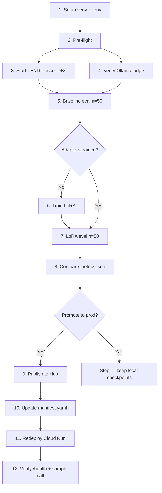

# Evaluation & Deploy Runbook

Complete step-by-step flow for running **baseline → LoRA evaluation → compare → publish → Cloud Run redeploy** on the CodeGen three-stage pipeline.

Use this document whenever you start a new eval cycle (e.g. v3, v4) or need to promote adapters to production.

**Related docs**

| Doc | Purpose |
| --- | --- |
| [gold-set-commands.md](gold-set-commands.md) | Copy-paste eval → publish → deploy commands |
| [lora-v1-v3-vs-baseline-comparison.pptx](lora-v1-v3-vs-baseline-comparison.pptx) | LoRA v1–v3 vs baseline metrics (presentation) |
| [../results/spider_gold_validation_codegen-350M-multi_lora-v3/metrics.json](../results/spider_gold_validation_codegen-350M-multi_lora-v3/metrics.json) | Latest LoRA v3 eval metrics |
| [../fastapi-deploy/README.md](../fastapi-deploy/README.md) | API details, Cloud Run deploy, publish script reference |
| [../data/DATASETS.md](../data/DATASETS.md) | TEND dataset fields and loading |
| [../README.md](../README.md) | Full project setup, training flags, test suite |
| [../agent/README.md](../agent/README.md) | AI Database Agent setup and demo |

---

## End-to-end flow (overview)



**Golden rule:** Run baseline and LoRA eval on the **same 50-example frozen set** (`data/spider_gold_validation.jsonl`) before publishing.

---

## Phase 0 — One-time setup

### 0.1 Clone repos

| Repo | Path (example) | Role |
| --- | --- | --- |
| CodeGen (this project) | `C:\Users\Bhavani\Documents\Codegen\Latest\CodeGen-Implementations-May_26` | Training, eval, deploy bundle |
| TEND | `C:\Users\Bhavani\Documents\Codegen\TEND` | Live Postgres + Mongo for execution accuracy |

### 0.2 Python environment

**Windows PowerShell:**

```powershell
cd C:\Users\Bhavani\Documents\Codegen\Latest\CodeGen-Implementations-May_26
py -3.11 -m venv venv
.\venv\Scripts\Activate.ps1
pip install -r requirements.txt
$env:PYTHONPATH = (Get-Location).Path
```

Re-run `$env:PYTHONPATH = (Get-Location).Path` in **every new terminal session**.

**macOS / Linux:**

```bash
cd /path/to/CodeGen-Implementations-May_26
python3.11 -m venv venv
source venv/bin/activate
pip install -r requirements.txt
export PYTHONPATH="$(pwd)"
```

### 0.3 Configure `.env`

Copy from `.env.example` if needed, then set at minimum:

```bash
MODEL_NAME=Salesforce/codegen-350M-multi
BERTSCORE_MODEL_NAME=distilbert-base-uncased

# TEND Docker repo (required for execution accuracy on Windows)
TEND_REPO_PATH=C:/Users/Bhavani/Documents/Codegen/TEND

# Ollama semantic judge (documentation task)
OLLAMA_BASE_URL=http://localhost:11434
OLLAMA_JUDGE_MODEL=gemma3:4b
OLLAMA_TIMEOUT=120

# Optional defaults
TEND_CACHE_DIR=data/cache/tend
RESULTS_DIR=results
MODELS_CHECKPOINTS_DIR=models/checkpoints
```

### 0.4 Cache base model (first run only)

The first eval downloads `Salesforce/codegen-350M-multi` into `models/base/`. Later runs reuse the cache automatically.

---

## Phase 1 — Pre-flight checks

Run from the CodeGen repo root with venv active and `PYTHONPATH` set.

### 1.1 Code checks

```powershell
python scripts/inspect_lora_modules.py
python scripts/test_tend_loader.py
python -m unittest tests.training.test_prompt_parity -v
```

Expected: LoRA trainable params > 0; gold validation loads **50 rows**; prompt parity tests pass.

### 1.2 Verify LoRA checkpoints (before LoRA eval)

Replace `v3` with your version:

```powershell
python scripts/verify_lora_adapters.py --version v3
```

Each task folder must contain `adapter_config.json` and adapter weights:

```text
models/checkpoints/v3/text2sql/
models/checkpoints/v3/sql2nosql/
models/checkpoints/v3/nosql2doc/
```

---

## Phase 2 — TEND database (execution accuracy)

Execution accuracy requires live Postgres and Mongo from the **TEND** repo. You only need to **re-import data** after `docker compose down -v` or empty tables — not on every eval run.

### 2.1 Start Docker services

```powershell
cd C:\Users\Bhavani\Documents\Codegen\TEND
docker compose up -d postgres mongo
```

Confirm containers are healthy (`tend-postgres-1`, `tend-mongo-1`).

### 2.2 Import gold validation subset (first time or after volume wipe)

From the TEND repo, import the same Spider schemas used by `data/spider_gold_validation.jsonl` (`concert_singer`, `pets_1`):

```bash
# Git Bash or WSL from TEND repo root
./scripts/import_jsonl_tables.sh
```

Use the JSONL paths documented in the TEND repo for the gold validation subset.

### 2.3 Quick sanity query

```powershell
docker exec tend-postgres-1 psql -U tend -d tend_spider -tAc "SELECT COUNT(*) FROM concert_singer.singer;"
# Expect: 6

docker exec tend-mongo-1 mongosh --quiet --eval "db.getSiblingDB('spider_concert_singer').singer.countDocuments()"
# Expect: 6
```

### 2.4 Confirm eval sees TEND

When you start eval, this line must be `True`:

```text
Database execution available: True
```

If `False`, check `TEND_REPO_PATH` in `.env` and that Docker containers are running.

---

## Phase 3 — Ollama judge

The documentation task uses an Ollama LLM judge (`OLLAMA_JUDGE_MODEL`). Text2SQL and SQL2NoSQL use deterministic metrics only (no Ollama calls).

### 3.1 Start Ollama and pull model

```powershell
ollama serve
# In another terminal:
ollama pull gemma3:4b
ollama list
```

### 3.2 Skip judge (optional, faster)

Add `--no-judge` to eval commands. Metrics will omit `judge_score`; documentation uses embedding similarity only.

---

## Phase 4 — Baseline evaluation (no LoRA)

Evaluates the **base model only** on the frozen 50-example Spider gold validation set.

### 4.1 Command

```powershell
cd C:\Users\Bhavani\Documents\Codegen\Latest\CodeGen-Implementations-May_26
.\venv\Scripts\Activate.ps1
$env:PYTHONPATH = (Get-Location).Path

python scripts/run_baseline_eval.py `
  --max-samples 50 `
  --output spider_gold_validation_codegen-350M-multi_baseline-v3
```

Replace `baseline-v3` with your version tag (e.g. `baseline-v4`).

**Do not pass** `--adapter-run` for baseline.

### 4.2 Confirm startup banner

All three lines must appear before generation starts:

```text
Baseline Evaluation: Salesforce/codegen-350M-multi
Documentation judge (ollama): gemma3:4b
Database execution available: True
```

Also expect:

```text
Dataset: spider_gold_validation (50 examples) | Max samples: 50
Evaluation set: data/spider_gold_validation.jsonl
```

### 4.3 Metrics collected

| Task | Metrics in `metrics.json` | Judge |
| --- | --- | --- |
| **text2sql** | `execution_accuracy`, `exact_match`, `structural_similarity` | No |
| **sql2nosql** | `execution_accuracy`, `exact_match`, `structural_similarity` | No |
| **documentation** | `embedding_similarity`, `judge_score` | Yes (Ollama, ~50 calls) |

Top-level fields: `judge_model`, `database_execution`, `run_type: "baseline"`.

### 4.4 Output files

```text
results/spider_gold_validation_codegen-350M-multi_baseline-v3/
├── metrics.json
├── text2sql_details.csv
├── sql2nosql_details.csv
└── documentation_details.csv
```

### 4.5 Expected runtime

| Hardware | Approximate time |
| --- | --- |
| CPU (no GPU) | 2–3 hours |
| With `--no-judge` | ~30–60 min less |

Leave the terminal open. Keep TEND Docker and Ollama running until completion.

### 4.6 Smoke run (optional)

Quick 5-sample check before the full 50:

```powershell
python scripts/run_baseline_eval.py --max-samples 5 --output spider_gold_validation_codegen-350M-multi_baseline-v3_smoke
```

---

## Phase 5 — LoRA training (if adapters do not exist)

Skip this phase if checkpoints already exist under `models/checkpoints/<version>/`.

### 5.1 Train all three tasks

```powershell
python scripts/train_all_lora.py --no-mlflow --device cpu --version v3
```

Or train one task at a time:

```powershell
python scripts/train_lora.py --task text2sql --version v3
python scripts/train_lora.py --task sql2nosql --version v3
python scripts/train_lora.py --task nosql2doc --version v3
```

### 5.2 Verify adapters

```powershell
python scripts/verify_lora_adapters.py --version v3
```

---

## Phase 6 — LoRA evaluation

Same script as baseline; pass `--adapter-run` (alias: `--version`).

```powershell
python scripts/run_baseline_eval.py `
  --adapter-run v3 `
  --max-samples 50 `
  --output spider_gold_validation_codegen-350M-multi_lora-v3
```

Startup should show:

```text
LoRA Evaluation: Salesforce/codegen-350M-multi
Adapter run: v3
  text2sql: models/checkpoints/v3/text2sql
  sql2nosql: models/checkpoints/v3/sql2nosql
  nosql2doc: models/checkpoints/v3/nosql2doc
Documentation judge (ollama): gemma3:4b
Database execution available: True
```

Output: `results/spider_gold_validation_codegen-350M-multi_lora-v3/metrics.json` with `"run_type": "lora"`.

---

## Phase 7 — Compare results

Open both `metrics.json` files side by side:

```text
results/spider_gold_validation_codegen-350M-multi_baseline-v3/metrics.json
results/spider_gold_validation_codegen-350M-multi_lora-v3/metrics.json
```

### Primary comparison table

| Task | Metric | Baseline | LoRA v3 | Notes |
| --- | --- | --- | --- | --- |
| text2sql | execution_accuracy | | | Live DB match |
| text2sql | exact_match | | | Normalized string match |
| text2sql | structural_similarity | | | SQL structure |
| sql2nosql | execution_accuracy | | | SQL vs Mongo on DB |
| sql2nosql | exact_match | | | |
| sql2nosql | structural_similarity | | | |
| documentation | judge_score | | | Ollama 0–10 scale |
| documentation | embedding_similarity | | | |

Optional: write a comparison report under the LoRA results folder (see `results/.../baseline-vs-lora-v2-comparison.md` for format).

**Only publish to Hub when LoRA metrics beat baseline** (or meet your promotion bar).

---

## Phase 8 — Publish adapters to Hugging Face Hub

Cloud Run loads adapters from **`codegenstudio/codegen-350M-*-lora`**. Publishing **overwrites** the weights in those repos.

### 8.1 Authenticate

```powershell
hf auth login
# Or set HF_TOKEN in the environment
```

### 8.2 Dry-run (no upload)

```powershell
cd C:\Users\Bhavani\Documents\Codegen\Latest\CodeGen-Implementations-May_26
$env:PYTHONPATH = "fastapi-deploy"
python fastapi-deploy/publish/push_adapters.py --version v3 --dry-run
```

Expected mapping:

| Local | Hub repo |
| --- | --- |
| `models/checkpoints/v3/text2sql/` | `codegenstudio/codegen-350M-text2sql-lora` |
| `models/checkpoints/v3/sql2nosql/` | `codegenstudio/codegen-350M-sql2nosql-lora` |
| `models/checkpoints/v3/nosql2doc/` | `codegenstudio/codegen-350M-nosql2doc-lora` |

### 8.3 Publish

```powershell
python fastapi-deploy/publish/push_adapters.py --version v3
```

---

## Phase 9 — Update manifest & redeploy Cloud Run

### 9.1 Set checkpoint version

Edit `fastapi-deploy/manifest.yaml`:

```yaml
checkpoint_version: v3   # was v2
```

For Cloud Run, `adapter_source` is overridden to `hub` at deploy time.

### 9.2 Deploy

```powershell
python fastapi-deploy/infra/cloudrun/deploy.py
```

One-time prerequisites: `gcloud auth login`, APIs enabled, `fastapi-deploy/infra/cloudrun/deploy.env` configured (copy from `env.example`).

Save the printed HTTPS URL to `deploy.env` as `CLOUD_RUN_SERVICE_URL`.

### 9.3 Cold start

After idle, the first request may take **1–3+ minutes**. Poll health until ready:

```powershell
curl.exe -s "https://codegen-api-161349047936.asia-south2.run.app/health"
```

Wait for `"status":"ok"` and `"loaded": true`.

---

## Phase 10 — Verify production API

### 10.1 Health check

Confirm `"checkpoint_version": "v3"` and Hub adapter ids in the response.

### 10.2 Sample inference

Open `<url>/docs` or POST to `/v1/chat/completions`:

```powershell
curl.exe -X POST "https://codegen-api-161349047936.asia-south2.run.app/v1/chat/completions" `
  -H "Content-Type: application/json" `
  -d '{\"model\":\"codegen-text2sql\",\"intent\":\"text2sql\",\"messages\":[{\"role\":\"user\",\"content\":\"Schema:\nCREATE TABLE singer (singer_id REAL PRIMARY KEY, name TEXT);\n\nQuestion: How many singers do we have?\"}]}'
```

Pass `"intent": "text2sql"` (or `"sql2nosql"`, `"nosql2doc"`) for deterministic routing.

---

## Quick reference — copy-paste checklist

Replace `v3` / output names as needed.

```powershell
# --- Session setup (every terminal) ---
cd C:\Users\Bhavani\Documents\Codegen\Latest\CodeGen-Implementations-May_26
.\venv\Scripts\Activate.ps1
$env:PYTHONPATH = (Get-Location).Path

# --- TEND Docker ---
cd C:\Users\Bhavani\Documents\Codegen\TEND
docker compose up -d postgres mongo
cd C:\Users\Bhavani\Documents\Codegen\Latest\CodeGen-Implementations-May_26

# --- Ollama (separate terminal if not running) ---
ollama serve
ollama pull gemma3:4b

# --- Baseline eval (50 samples, with judge + DB execution) ---
python scripts/run_baseline_eval.py --max-samples 50 --output spider_gold_validation_codegen-350M-multi_baseline-v3

# --- LoRA eval (after training / verify adapters) ---
python scripts/run_baseline_eval.py --adapter-run v3 --max-samples 50 --output spider_gold_validation_codegen-350M-multi_lora-v3

# --- Publish + deploy (after metrics look good) ---
$env:PYTHONPATH = "fastapi-deploy"
python fastapi-deploy/publish/push_adapters.py --version v3 --dry-run
python fastapi-deploy/publish/push_adapters.py --version v3
# Edit fastapi-deploy/manifest.yaml → checkpoint_version: v3
python fastapi-deploy/infra/cloudrun/deploy.py
curl.exe "<your-cloud-run-url>/health"
```

---

## Troubleshooting

| Symptom | Likely cause | Fix |
| --- | --- | --- |
| `Database execution available: False` | Wrong `TEND_REPO_PATH` or Docker stopped | Set path in `.env`; `docker compose up -d postgres mongo` |
| Execution accuracy always 0 | DB empty or wrong schema | Re-run TEND import script; verify row counts |
| Judge errors / timeouts | Ollama not running | `ollama serve`; increase `OLLAMA_TIMEOUT` (e.g. 180) |
| `ModuleNotFoundError: src.database...` | TEND path invalid | Point `TEND_REPO_PATH` at TEND repo root |
| Eval very slow on CPU | Expected for 350M × 150 generations | Use GPU via `--device cuda` if available; or `--no-judge` for faster doc metrics |
| Cloud Run cold start fails | Hub auth or memory | Check deploy logs; hit `/health` repeatedly |
| LoRA eval loads wrong adapters | Missing `--adapter-run` | Pass `--adapter-run v3` explicitly |

---

## Eval script flags (reference)

| Flag | Default | Description |
| --- | --- | --- |
| `--max-samples` | 50 | Number of gold validation examples |
| `--output` | auto-generated | Folder name under `results/` |
| `--adapter-run` / `--version` | none | LoRA checkpoint under `models/checkpoints/<run>/` |
| `--no-judge` | off | Skip Ollama judge for documentation |
| `--device` | from config | `cpu`, `cuda`, `mps`, etc. |
| `--mlflow` | off | Log to MLflow |
| `--full-split` | off | Use full HF TEND split instead of gold validation |
| `--tend-config` | spider | TEND config when using `--full-split` |

---

## What to run next time (minimal path)

If setup is already done and Docker data is loaded:

1. `docker compose up -d postgres mongo` (TEND repo)
2. Confirm Ollama + `gemma3:4b`
3. Baseline: `python scripts/run_baseline_eval.py --max-samples 50 --output ..._baseline-vN`
4. LoRA: `python scripts/run_baseline_eval.py --adapter-run vN --max-samples 50 --output ..._lora-vN`
5. Compare `metrics.json`
6. Publish → update `manifest.yaml` → `deploy.py` → verify `/health`
