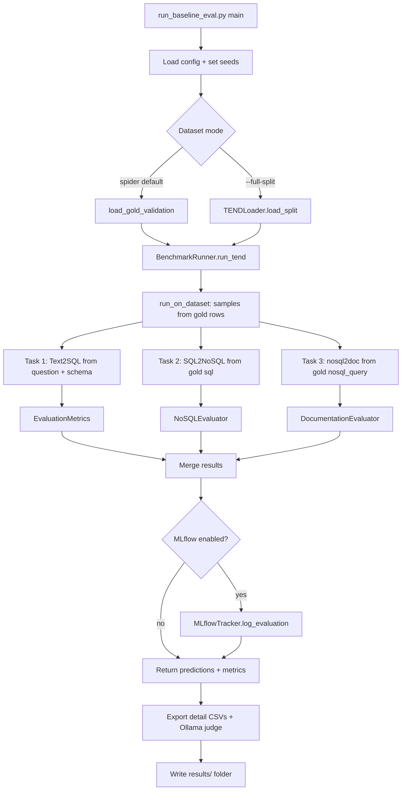
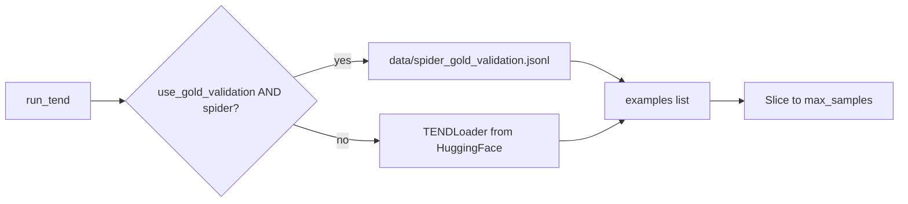
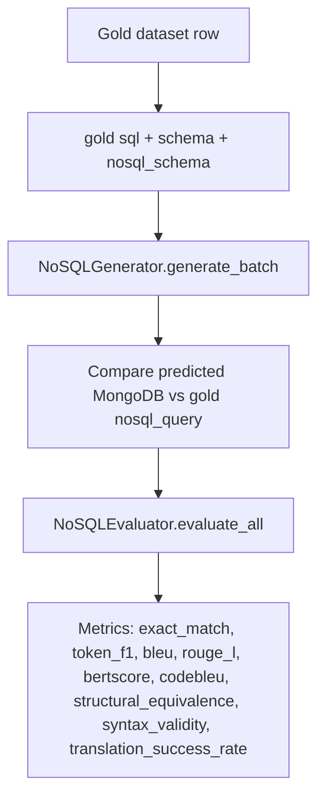
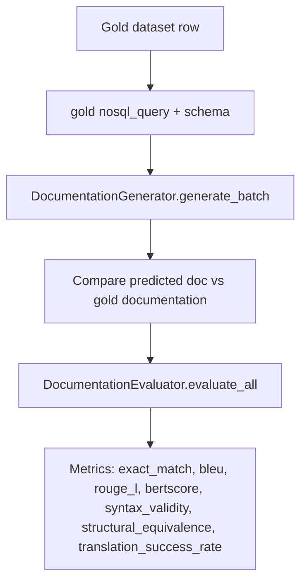
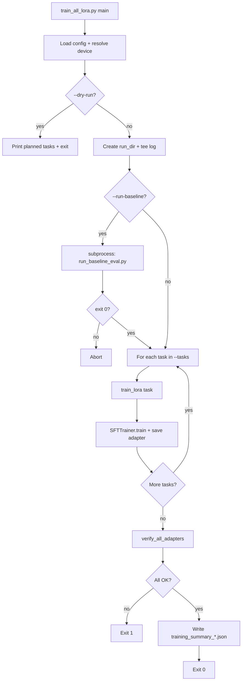
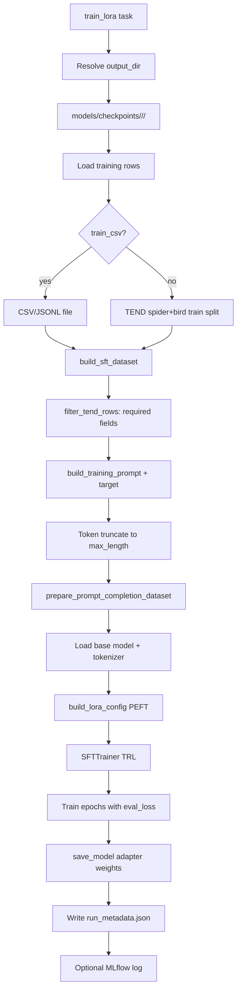
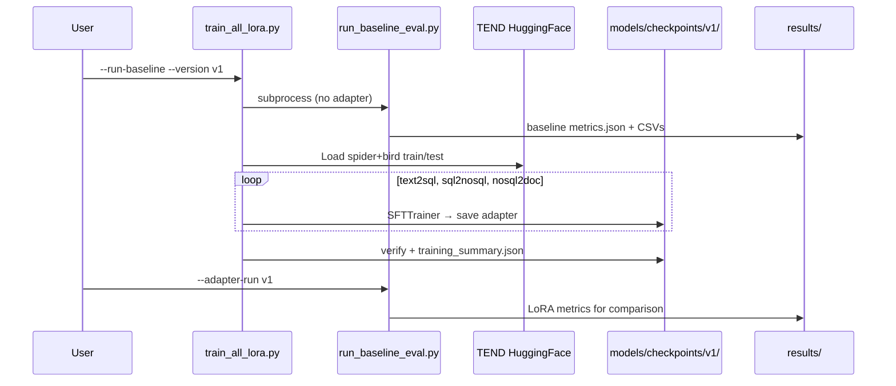

# Model Evaluation & LoRA Training

Detailed reference for the two main orchestration scripts:

- **Baseline / LoRA evaluation** — `scripts/run_baseline_eval.py`
- **Multi-task LoRA training** — `scripts/train_all_lora.py`

Both orchestrate **three independent tasks** on the same gold dataset rows:

| Task | Gold input (from dataset) | Model output | Adapter |
|------|---------------------------|--------------|---------|
| `text2sql` | `question` + `schema` | SQL | `text2sql/` |
| `sql2nosql` | **gold `sql`** + schemas | MongoDB query | `sql2nosql/` |
| `nosql2doc` | **gold `nosql_query`** + schema | Documentation | `nosql2doc/` |

Tasks do **not** feed each other's predictions. Each adapter is trained and evaluated in isolation using gold supervision from TEND / `spider_gold_validation.jsonl`.

---

## Table of Contents

1. [Shared Concepts](#1-shared-concepts)
2. [Baseline / LoRA Evaluation](#2-baseline--lora-evaluation--run_baseline_evalpy)
3. [LoRA Training](#3-lora-training--train_all_lorapy)
4. [Key Design Decisions](#4-key-design-decisions)
5. [Module Map](#5-module-map)

---

## 1. Shared Concepts

### 1.1 Three Tasks

| Task | Input | Output | Adapter path |
|------|-------|--------|--------------|
| `text2sql` | Question + SQL schema | SQL query | `models/checkpoints/<run>/text2sql/` |
| `sql2nosql` | SQL + schemas | MongoDB shell query | `models/checkpoints/<run>/sql2nosql/` |
| `nosql2doc` | MongoDB query + schema | Natural-language documentation | `models/checkpoints/<run>/nosql2doc/` |

Each prompt is prefixed with a task identifier so one base model can serve all three:

```
Task: text2sql

Translate the question into SQL.
...
```

### 1.2 Configuration

Both scripts load `configs/default.yaml` merged with `.env` variables:

| Setting | Source | Default |
|---------|--------|---------|
| Base model | `MODEL_NAME` | e.g. `Salesforce/codegen-350M-multi` |
| Device | `model.device` | `auto` (cuda → mps → cpu) |
| Eval samples | `evaluation.max_samples` | 50 |
| Ollama judge | `OLLAMA_JUDGE_MODEL` | `qwen3:4b` |
| LoRA rank/alpha | `lora.r`, `lora.lora_alpha` | 16 / 32 |

### 1.3 Evaluation Dataset (Default)

Spider baseline eval uses a **frozen gold validation set**:

- **File:** `data/spider_gold_validation.jsonl` (~50 examples)
- **Name:** `spider_gold_validation`
- **Fields per row:** `question`, `schema`, `sql`, `nosql_query`, `documentation`, `db_id`

Training uses the live **TEND** corpus from Hugging Face (`care2achieve/tend`): Spider + Bird, `train` split for training and `test` split for held-out eval during fine-tuning.

---

## 2. Baseline / LoRA Evaluation — `run_baseline_eval.py`

### 2.1 Purpose

Run all three tasks independently on a fixed benchmark, compute automated metrics per task, optionally score outputs with an **Ollama semantic judge**, and write results under `results/<run_name>/`.

Supports:

- **Baseline** — base model only (no adapter)
- **LoRA eval** — per-task adapters via `--adapter-run` / `--version`

### 2.2 CLI Reference

```bash
python scripts/run_baseline_eval.py [options]
```

| Flag | Default | Description |
|------|---------|-------------|
| `--tend-config` | `spider` | TEND subset (`spider` or `bird`) |
| `--split` | `test` | HF split when using `--full-split` |
| `--full-split` | off | Use full HF split instead of gold validation |
| `--max-samples` | 50 | Cap number of examples evaluated |
| `--output` | auto | Results folder name under `results/` |
| `--mlflow` | off | Log metrics to MLflow |
| `--no-judge` | off | Skip Ollama judge (faster) |
| `--adapter-run` / `--version` | none | LoRA checkpoint run (e.g. `v1`) |

Auto-generated output name pattern:

```
<dataset>_<model>_<DDMM>_<HHMM>
# e.g. spider_gold_validation_codegen-350M-multi_2506_2343
```

### 2.3 High-Level Flow



### 2.4 Detailed Evaluation Pipeline

#### Step 1 — Initialization

```python
config = load_config()
set_seeds(config)
runner = BenchmarkRunner(config, enable_mlflow, adapter_run)
```

`BenchmarkRunner` wires up:

- **Text2SQL:** `SQLGenerator` (base model or `text2sql` adapter)
- **SQL2NoSQL:** `NoSQLGenerator` (base model or `sql2nosql` adapter) — separate model load
- **Documentation:** `DocumentationGenerator` (base model or `nosql2doc` adapter) — separate model load
- **Metrics:** `EvaluationMetrics`, `NoSQLEvaluator`, `DocumentationEvaluator`
- **MLflow** (optional): `MLflowTracker`

When `adapter_run=v1` is set, each task loads its own LoRA adapter from `models/checkpoints/v1/<task>/`.

#### Step 2 — Dataset Loading



#### Step 3 — Text-to-SQL Generation & Metrics

For each example:

1. Build prompt via `PromptBuilder` (question + schema → `Task: text2sql\n\n...`)
2. Generate SQL with configured decoding (`greedy` or `beam` from `configs/default.yaml`)
3. Parse and validate output (`SQLValidator`: syntax + completeness)
4. Compare prediction vs gold SQL

**Automated Text2SQL metrics** (`EvaluationMetrics.evaluate_all`):

| Metric | Description |
|--------|-------------|
| `exact_match` | Normalized string equality (sqlparse) |
| `syntax_validity` | Fraction of syntactically valid SQL |
| `execution_accuracy` | Result-set match on SQLite DB (when `db_path` available) |
| `bleu` | Corpus BLEU |
| `rouge_l` | Average ROUGE-L F1 |
| `bertscore` | BERTScore F1 (model from `BERTSCORE_MODEL_NAME`) |
| `codebleu` | CodeBLEU + n-gram / syntax / semantic sub-scores |
| `translation_success_rate` | Complete `SELECT ... FROM` + valid syntax (computed in script) |

#### Step 4 — SQL-to-MongoDB (Independent)

Uses **gold SQL** from each dataset row (`example["sql"]`), not text2sql predictions:



#### Step 5 — Documentation (Independent)

Uses **gold MongoDB query** from each row (`example["nosql_query"]`), not sql2nosql predictions:



#### Step 6 — Ollama Semantic Judge (Post-Processing)

After generation, `main()` writes per-sample CSVs and runs the judge **unless `--no-judge`**:

| Task | Judge field | Question |
|------|-------------|----------|
| Text2SQL | `judge_sql_correct` | Are predicted and gold SQL semantically equivalent? |
| SQL2NoSQL | `judge_query_correct` | Would both MongoDB queries return the same output? |
| Documentation | `judge_doc_correct` | Does generated doc correctly explain the query? |

Judge model defaults to `qwen3:4b` via Ollama at `OLLAMA_BASE_URL` (default `http://localhost:11434`).

Aggregate judge metrics merged into `metrics.json`:

- `judge_correct_rate`
- `judge_overall_correct_rate`
- `judge_count`

#### Step 7 — Output Artifacts

All written to `results/<output_name>/`:

```
results/spider_gold_validation_codegen-350M-multi_2506_2343/
├── metrics.json                  # Aggregate metrics (all 3 tasks)
├── text2sql_details.csv          # Per-sample SQL generation + judge
├── sql2nosql_details.csv         # Per-sample MongoDB translation + judge
└── documentation_details.csv     # Per-sample documentation + judge
```

`metrics.json` structure:

```json
{
  "model": "Salesforce/codegen-350M-multi",
  "adapter_run": "v1",
  "run_type": "lora",
  "judge_model": "qwen3:4b",
  "dataset": "spider_gold_validation",
  "text2sql": { "exact_match": 0.12, "judge_correct_rate": 0.28 },
  "sql2nosql": {},
  "documentation": {},
  "mlflow_run_id": "..."
}
```

**Detail CSV columns:**

| File | Key columns |
|------|-------------|
| `text2sql_details.csv` | `question`, `prompt`, `predicted_sql`, `ground_truth`, `judge_sql_correct`, `judge_reason` |
| `sql2nosql_details.csv` | `reference_sql` (gold), `predicted_mongodb_query`, `reference_mongodb_query`, `judge_query_correct` |
| `documentation_details.csv` | `mongodb_query` (gold input), `judge_doc_correct` |

### 2.5 LoRA Evaluation Mode

```bash
python scripts/run_baseline_eval.py \
  --adapter-run v1 \
  --output spider_gold_validation_codegen-350M-multi_lora-v1_2506_2343
```

Each task loads its **own adapter** (or its own base-model instance when no adapter is set):

```
models/checkpoints/v1/text2sql/    → Text2SQL (question + schema)
models/checkpoints/v1/sql2nosql/   → SQL→MongoDB (gold sql input)
models/checkpoints/v1/nosql2doc/   → Documentation (gold nosql_query input)
```

The base weights stay frozen; only LoRA deltas are applied per task. Downstream tasks never consume upstream model outputs.

---

## 3. LoRA Training — `train_all_lora.py`

### 3.1 Purpose

Train LoRA adapters for one or more tasks **sequentially**, optionally run baseline eval first, verify adapter artifacts, and write a training summary JSON.

### 3.2 CLI Reference

```bash
python scripts/train_all_lora.py [options]
```

| Flag | Default | Description |
|------|---------|-------------|
| `--tasks` | all three | Subset: `text2sql`, `sql2nosql`, `nosql2doc` |
| `--train-csv` | none | Override training data (CSV/JSONL) |
| `--eval-csv` | none | Override eval data (CSV/JSONL) |
| `--max-samples` | none | Limit rows per task |
| `--epochs` | from YAML (5) | Training epochs |
| `--device` | auto | Force `cuda`, `mps`, or `cpu` |
| `--config` | `configs/default.yaml` | Config path |
| `--no-mlflow` | off | Disable MLflow logging |
| `--checkpoint-suite` | none | Alternate checkpoint parent dir |
| `--run-baseline` | off | Run baseline eval before training |
| `--baseline-max-samples` | full gold set | Sample limit for baseline |
| `--baseline-no-judge` | off | Skip judge in baseline |
| `--dry-run` | off | Print plan without training |
| `--version` / `--name` | `DDMM` | Checkpoint run folder (e.g. `v1`) |

### 3.3 High-Level Flow



### 3.4 Per-Task Training Pipeline (`train_lora`)

Implemented in `src/training/lora_trainer.py` and invoked once per task from `train_all_lora.py`.



#### Data Loading (Default)

| Split | Source | Configs |
|-------|--------|---------|
| Train | TEND HF `train` | `spider`, `bird` |
| Eval (during training) | TEND HF `test` | `spider`, `bird` |

Rows are standardized via `TENDLoader.standardize()` to a common schema.

#### Row Filtering (per task)

| Task | Required fields |
|------|-----------------|
| `text2sql` | `question`, `schema`, `sql` |
| `sql2nosql` | `sql`, `schema`, `nosql_schema`, `nosql_query` |
| `nosql2doc` | `nosql_query`, `nosql_schema`, `documentation` |

Rows missing fields or exceeding token budget (`max_length=2048`, `max_target_tokens=256`) are skipped.

#### Prompt / Target Construction

Training prompts match **inference prompts** via `prompt_factory.build_training_prompt()`. Each task uses **gold supervision fields only**:

- **Text2SQL:** prompt from `question` + `schema` → target `sql`
- **SQL2NoSQL:** prompt from **gold `sql`** + schemas → target `nosql_query`
- **NoSQL2Doc:** prompt from **gold `nosql_query`** + schema → target `documentation`

No task trains on another task's model output.

TRL receives `{prompt, completion}` pairs with **completion-only loss** (`completion_only_loss=True`, `loss_type=chunked_nll`).

#### LoRA Configuration

From `configs/default.yaml`:

```yaml
lora:
  r: 16
  lora_alpha: 32
  lora_dropout: 0.05
  target_modules: [qkv_proj, out_proj]
```

#### SFTTrainer Hyperparameters

| Parameter | Value |
|-----------|-------|
| Epochs | 5 (override with `--epochs`) |
| Batch size | 8 per device × 4 grad accumulation = **effective 32** |
| Learning rate | 2e-4, cosine schedule, 5% warmup |
| Eval strategy | Every epoch (`eval_loss`) |
| Save strategy | Best epoch by `eval_loss`, keep 1 checkpoint |
| Precision | fp32 (`fp16: false`, `bf16: false`) |

#### Output Per Task

```
models/checkpoints/v1/text2sql/
├── adapter_config.json
├── adapter_model.safetensors
├── run_metadata.json       # losses, row counts, filter/token stats
└── logs/                   # TensorBoard-style logs
```

`run_metadata.json` includes: `train_loss`, `eval_loss`, `best_eval_loss`, `train_runtime_seconds`, `filter_stats`, `token_stats`, `log_history`.

### 3.5 Post-Training Verification

`verify_all_adapters()` checks each task directory for:

- `adapter_config.json`
- `adapter_model.safetensors`
- `run_metadata.json`

Failure on any task → exit code 1.

### 3.6 Training Summary & Logging

Console output is tee'd to:

```
models/checkpoints/<run>/train_all_lora.log
```

Summary JSON written to:

```
models/checkpoints/<run>/training_summary_<timestamp>.json
```

Example payload:

```json
{
  "checkpoint_run": "v1",
  "model_name": "Salesforce/codegen-350M-multi",
  "started_at": "...",
  "completed_at": "...",
  "baseline_results_run": "spider_gold_validation_codegen-350M-multi_2506_2029",
  "tasks": [
    {
      "task": "text2sql",
      "train_rows": 1234,
      "eval_rows": 567,
      "train_loss": 0.45,
      "best_eval_loss": 0.38,
      "adapter_path": "models/checkpoints/v1/text2sql"
    }
  ]
}
```

### 3.7 Typical End-to-End Workflow



Example commands:

```bash
# 1. Train all adapters (with baseline snapshot first)
python scripts/train_all_lora.py --run-baseline --version v1

# 2. Evaluate LoRA adapters on gold validation
python scripts/run_baseline_eval.py --adapter-run v1 --max-samples 50

# 3. Compare results/spider_gold_validation_*_lora-v1_* vs baseline run
```

---

## 4. Key Design Decisions

### 4.1 Independent Task Evaluation & Training

All three adapters are **fully independent**:

- **Evaluation:** each task reads gold fields from the same dataset row (`sql`, `nosql_query`, `documentation`). Predictions from text2sql or sql2nosql are never passed as inputs to later tasks.
- **Training:** each task fine-tunes on gold `(prompt → target)` pairs from TEND. Supervision always comes from dataset labels, not from other adapters.

This isolates per-task quality: sql2nosql metrics measure SQL→MongoDB translation only; nosql2doc metrics measure documentation generation only.

### 4.2 Training vs Evaluation Data

| Phase | Dataset | Purpose |
|-------|---------|---------|
| LoRA training | TEND spider+bird (large) | Learn task-specific adapters |
| Benchmark eval | `spider_gold_validation.jsonl` (50, frozen) | Reproducible before/after comparison |

### 4.3 One Base Model, Three Independent Adapters

A single causal LM (`codegen-350M-multi`) is shared. Task routing uses:

1. Prompt prefix: `Task: <task_name>`
2. Task-specific LoRA weights at inference

### 4.4 Dual Metric Layers

1. **Automated metrics** (exact match, BLEU, CodeBLEU, execution) — fast, deterministic
2. **Ollama judge** — semantic equivalence; slower, requires local Ollama

Use `--no-judge` / `--baseline-no-judge` when Ollama is unavailable.

---

## 5. Module Map

| Script / Module | Role |
|-----------------|------|
| `scripts/run_baseline_eval.py` | CLI entry for evaluation |
| `scripts/train_all_lora.py` | CLI entry for multi-task training |
| `src/evaluation/benchmark.py` | `BenchmarkRunner` — three independent task evaluators |
| `src/evaluation/metrics.py` | Text2SQL metric suite |
| `src/evaluation/export.py` | CSV export + judge merge |
| `src/evaluation/ollama_judge.py` | Semantic scoring via Ollama |
| `src/training/lora_trainer.py` | `train_lora()` — TRL SFTTrainer |
| `src/training/tend_dataset.py` | HF → HuggingFace Dataset |
| `src/training/prompt_factory.py` | Training prompts aligned with inference |
| `src/training/adapter_verify.py` | Post-training artifact checks |
| `src/datasets/tend_loader.py` | Gold validation + TEND HF loader |
| `configs/default.yaml` | Shared hyperparameters |
