# LoRA v1–v3 vs Baseline — Spider Gold Validation Comparison

> **Project:** CodeGen Fine-Tuning with PEFT & LoRA  
> **Generated:** 2026-07-25  
> **Model:** `Salesforce/codegen-350M-multi`  
> **Judge model:** `gemma3:4b` (Ollama)  
> **Dataset:** `data/spider_gold_validation.jsonl`  
> **Primary metrics:** execution accuracy, exact match, structural similarity (text2sql / sql2nosql); embedding similarity + judge score (documentation)

See also: [version-tracker.md](version-tracker.md) · [lora-v4-vs-all-versions-comparison.md](lora-v4-vs-all-versions-comparison.md)

---

## Presentation guide (v1–v3 capstone)

**Yes — this document is complete** for presenting baseline vs LoRA v1/v2/v3 on Spider gold validation (50 examples, 3 tasks). Use it as your single comparison deck source.

| Slide | Content in this doc | PNG to insert |
| --- | --- | --- |
| 1 — Setup | Training context + compared runs | — |
| 2 — Main result | Executive summary table (Baseline → v1 → v2 → v3) | `00_improvement_execution_*.png` |
| 3 — Exact match | Improvement table + lift summary | `00_improvement_exact_match_*.png` |
| 4 — Documentation | Doc judge progression | `00_improvement_doc_judge_*.png` |
| 5 — Best model | v3 capstone headline | `07_v3_baseline_vs_lora_summary.png` |
| 6 — v2 detail (optional) | Pair v2 table | `01`–`03` baseline vs LoRA charts |
| 7 — Pipeline smoke (optional) | Pair v1 table | `06_v1_smoke_judge_correct_rate.png` |

**Chart colors (presentation palette):**

| Color | Hex | Use |
| --- | --- | --- |
| Dark blue | `#1e40af` | LoRA / Text2SQL / best result |
| Light blue | `#93c5fd` | SQL2NoSQL / secondary series |
| Pale blue | `#dbeafe` | Baseline bars |
| Slate gray | `#64748b` / `#cbd5e1` | Baseline / neutral |

**Caveats to mention verbally:** v1 = n=5 smoke only; v2/v3 = n=50 with DB execution; v4 comparison is in a separate doc if needed.

---

## Training context

| Version | Adapter | Train samples | Epochs | LoRA | Checkpoint path |
| --- | --- | --- | --- | --- | --- |
| **Baseline** | — | — | — | — | `models/base/Salesforce__codegen-350M-multi` |
| **LoRA v1** | `v1` | 50 | 10 | `r=16`, attn only | `models/checkpoints/v1/` |
| **LoRA v2** | `v2` | 500 | 5 | `r=16`, attn only | `models/checkpoints/v2/` |
| **LoRA v3** | `v3` | ~8,040 | 5* | `r=16`, attn only | `models/checkpoints/v3/` |

\*v3 text2sql best checkpoint at epoch 2; sql2nosql / nosql2doc completed 5 epochs.

---

## Compared runs (your results folders)

| Version | Baseline | LoRA |
| --- | --- | --- |
| **v1** (smoke) | `results/spider_gold_validation_codegen-350M-multi_baseline-v1/` | `results/spider_gold_validation_codegen-350M-multi_lora-v1/` |
| **v2** (n=50) | `results/spider_gold_validation_codegen-350M-multi_baseline-v2/` | `results/spider_gold_validation_codegen-350M-multi_lora-v2/` |
| **v3** (n=50) | `results/spider_gold_validation_codegen-350M-multi_baseline-v3/` | `results/spider_gold_validation_codegen-350M-multi_lora-v3/` |

| Version | Samples | DB execution in metrics |
| --- | --- | --- |
| v1 | **5** per task | No (`execution_accuracy: 0` in JSON) |
| v2 | **50** | LoRA yes; baseline EX from paired eval / CSV† |
| v3 | **50** | **Yes** on both baseline and LoRA (`database_execution: true`) |

† Baseline v2 `metrics.json` uses an older export shape (`execution_accuracy: 0`). Execution accuracy for baseline v2 below matches the paired run documented in `results/.../lora-v2/baseline-vs-lora-v2-comparison.md` (12% text2sql, 22.2% sql2nosql). **v3 baseline/lora numbers are from fresh `metrics.json` (2026-07-25).**

---

## Executive summary — improvement Baseline → v1 → v2 → v3

Training scale increases left to right; **LoRA improves on every code metric** at n=50. Baseline uses the same zero-shot model (v3 eval, n=50).

| Run | Training data | Eval n | Text2SQL EX | SQL2NoSQL EX | Text2SQL EM | SQL2NoSQL EM | Doc judge |
| --- | --- | --- | --- | --- | --- | --- | --- |
| **Baseline** | — | 50 | 14% | 22% | 0% | 4% | 8.33 |
| **LoRA v1** | 50 samples | 5* | 0% | 0% | 0% | 0% | smoke† |
| **LoRA v2** | 500 samples | 50 | **60%** | **74%** | **40%** | **62%** | **8.41** |
| **LoRA v3** | ~8,040 samples | 50 | **66%** | **86%** | **48%** | **78%** | **8.82** |

\*v1 = pipeline smoke test only — too small for execution accuracy.  
†v1 doc = 100% judge *correct rate* at n=5, not comparable to 0–10 judge score at n=50.

**Improvement vs baseline (n=50):**

| Step | Text2SQL EX | SQL2NoSQL EX | Doc judge |
| --- | --- | --- | --- |
| Baseline → **LoRA v2** | 14% → **60%** (+46 pp) | 22% → **74%** (+52 pp) | 8.33 → **8.41** |
| Baseline → **LoRA v3** | 14% → **66%** (+52 pp) | 22% → **86%** (+64 pp) | 8.33 → **8.82** |
| **LoRA v2 → v3** | 60% → **66%** (+6 pp) | 74% → **86%** (+12 pp) | 8.41 → **8.82** |

**Recommendation:** Promote **LoRA v3** to Hugging Face Hub and Cloud Run (`manifest.yaml` → `checkpoint_version: v3`).

---

## Visual overview — Baseline → v1 → v2 → v3 improvement

Static PNG charts live in [docs/images/lora-v1-v3/](images/lora-v1-v3/). Regenerate with:

```powershell
python scripts/generate_v1_v3_comparison_charts.py
```

### Primary — improvement progression

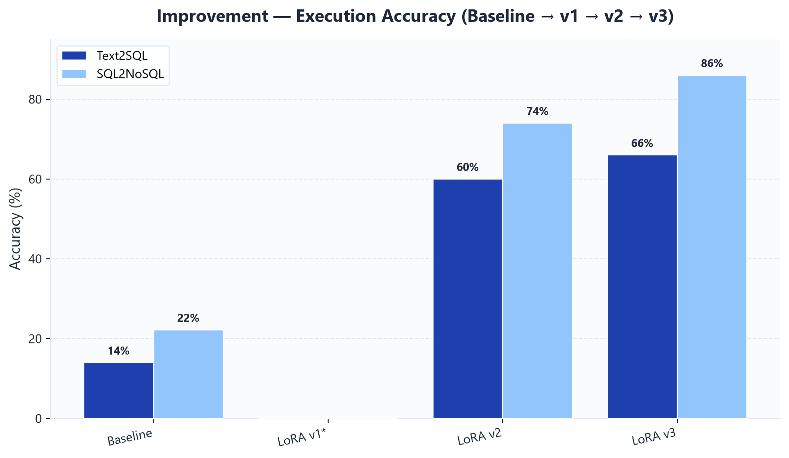

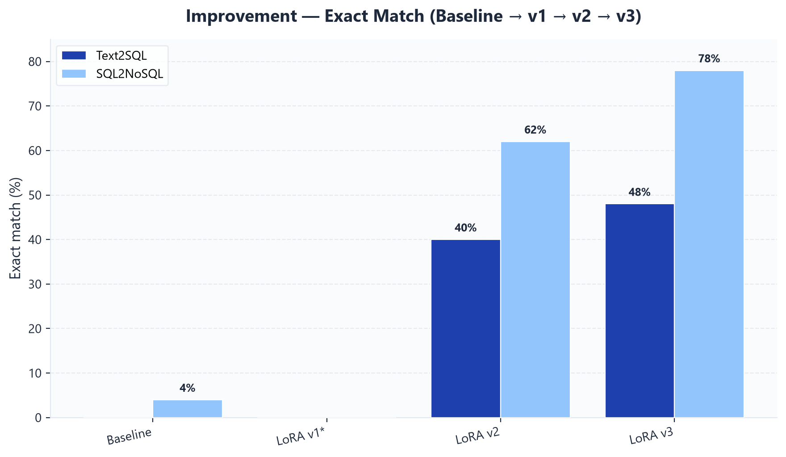

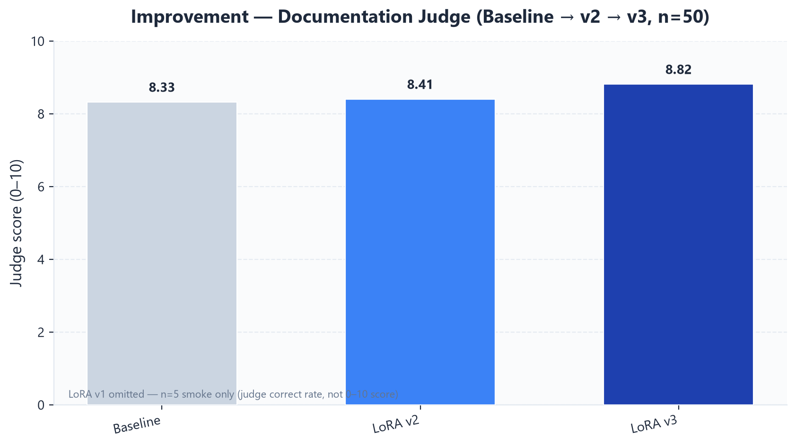

```mermaid
---
config:
  xyChart:
    showLegend: true
    width: 900
    height: 420
  themeVariables:
    xyChart:
      plotColorPalette: "#1e40af, #93c5fd"
---
xychart-beta
    title "Improvement — Execution Accuracy (Baseline → v1 → v2 → v3)"
    x-axis ["Baseline", "LoRA v1", "LoRA v2", "LoRA v3"]
    y-axis "Accuracy" 0 --> 95
    bar "Text2SQL" [14, 0, 60, 66]
    bar "SQL2NoSQL" [22, 0, 74, 86]
```

\*LoRA v1 = n=5 smoke (EX not meaningful). Baseline / v2 / v3 = n=50 gold set.

### Per-version baseline vs LoRA (v2 & v3 detail)

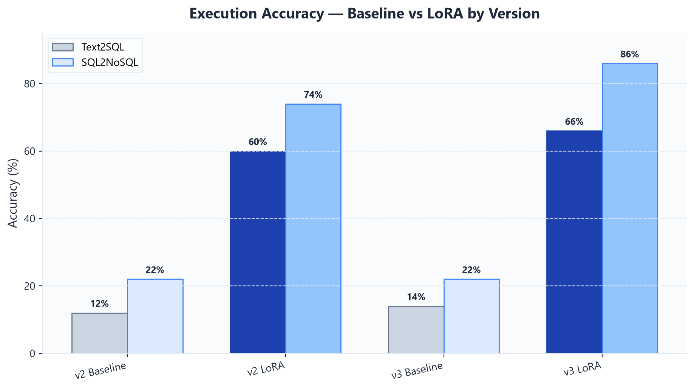

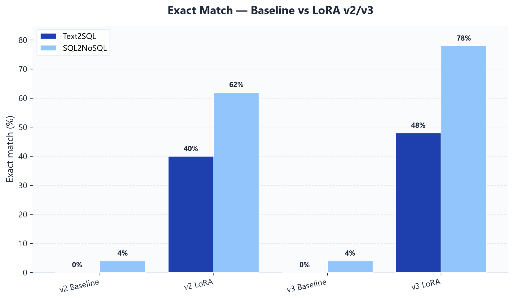

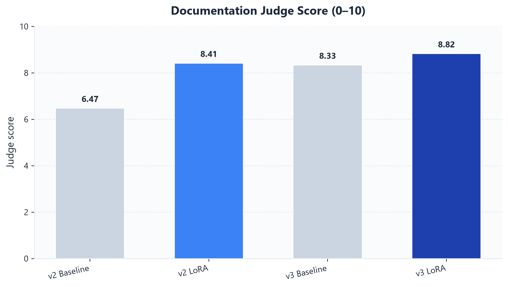

### v1 smoke — baseline vs LoRA (n=5)

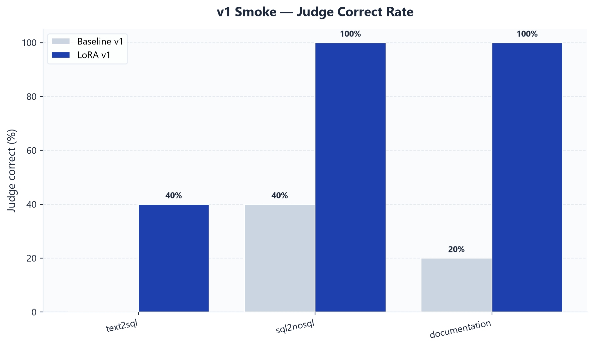

### v3 capstone slide

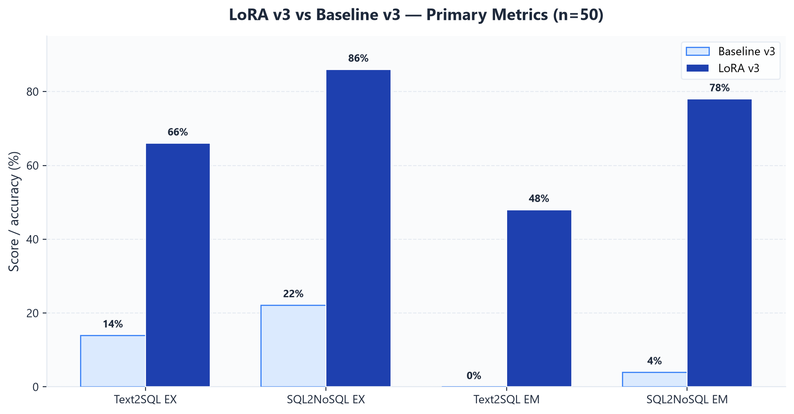

---

## Visual overview — Mermaid (interactive preview)

### LoRA progression (n=50, execution accuracy)

```mermaid
---
config:
  xyChart:
    showLegend: true
    width: 900
    height: 420
  themeVariables:
    xyChart:
      plotColorPalette: "#1e40af, #93c5fd"
---
xychart-beta
    title "Execution Accuracy — Baseline vs LoRA by Version (%)"
    x-axis ["v2 Baseline", "v2 LoRA", "v3 Baseline", "v3 LoRA"]
    y-axis "Accuracy" 0 --> 95
    bar "Text2SQL" [12, 60, 14, 66]
    bar "SQL2NoSQL" [22, 74, 22, 86]
```

```mermaid
---
config:
  xyChart:
    showLegend: true
    width: 900
    height: 420
  themeVariables:
    xyChart:
      plotColorPalette: "#1e40af, #93c5fd"
---
xychart-beta
    title "Exact Match — Baseline vs LoRA v2/v3 (%)"
    x-axis ["v2 Baseline", "v2 LoRA", "v3 Baseline", "v3 LoRA"]
    y-axis "Exact match" 0 --> 85
    bar "Text2SQL" [0, 40, 0, 48]
    bar "SQL2NoSQL" [4, 62, 4, 78]
```

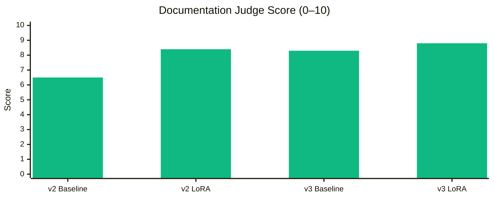

---

## Visual overview — training scale effect (LoRA only, Mermaid)

```mermaid
---
config:
  xyChart:
    showLegend: true
    width: 900
    height: 420
  themeVariables:
    xyChart:
      plotColorPalette: "#1e40af, #93c5fd"
---
xychart-beta
    title "LoRA Execution Accuracy by Training Version (%)"
    x-axis ["v1 (n=5)", "v2 (n=50)", "v3 (n=50)"]
    y-axis "Accuracy" 0 --> 95
    bar "Text2SQL" [0, 60, 66]
    bar "SQL2NoSQL" [0, 74, 86]
```

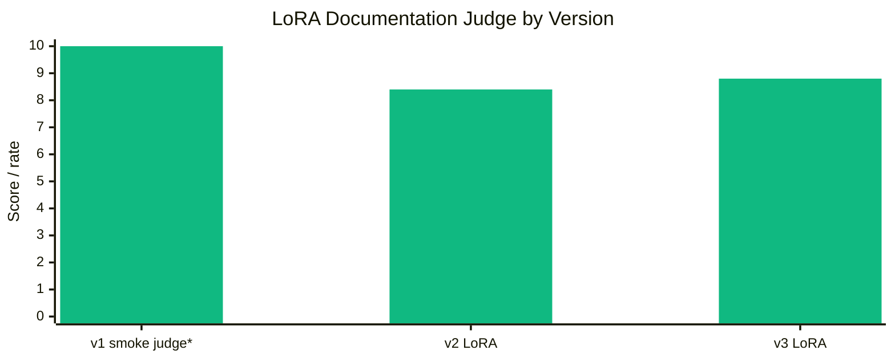

\*v1 smoke chart uses **judge correct rate × 10** (100% → 10.0) for visual scale only — not comparable to 0–10 judge score at n=50.

---

## Pair v1 — smoke eval (n=5)

Judge-based comparison (no live DB execution in saved metrics).

```mermaid
---
config:
  xyChart:
    showLegend: true
    width: 900
    height: 360
  themeVariables:
    xyChart:
      plotColorPalette: "#ef4444, #22c55e"
---
xychart-beta
    title "v1 Smoke — Judge Correct Rate (%)"
    x-axis ["text2sql", "sql2nosql", "documentation"]
    y-axis "Judge correct" 0 --> 105
    bar "Baseline v1" [0, 40, 20]
    bar "LoRA v1" [40, 100, 100]
```

| Task | Metric | Baseline v1 | LoRA v1 | Change |
| --- | --- | --- | --- | --- |
| **text2sql** | Judge correct rate | 0% | **40%** | **+40 pp** |
| | CodeBLEU / BERTScore | 0.719 | **0.776** | +0.057 |
| | Execution accuracy | 0% | 0% | — |
| **sql2nosql** | Judge correct rate | 40% | **100%** | **+60 pp** |
| | Structural equivalence | 0.60 | **1.00** | +0.40 |
| **documentation** | Judge correct rate | 20% | **100%** | **+80 pp** |

**Takeaway:** v1 smoke shows LoRA helps semantic validity quickly, but **n=5 is too small** for execution accuracy conclusions.

---

## Pair v2 — full gold set (n=50)

| Task | Metric | Baseline v2 | LoRA v2 | Change |
| --- | --- | --- | --- | --- |
| **text2sql** | **Execution accuracy** | 12% | **60%** | **+48 pp** |
| | **Exact match** | 0% | **40%** | **+40 pp** |
| | Structural similarity | 0.704 | **0.935** | +0.231 |
| **sql2nosql** | **Execution accuracy** | 22.2% | **74%** | **+51.8 pp** |
| | **Exact match** | 4% | **62%** | **+58 pp** |
| | Structural similarity | 0.163 | **0.933** | +0.770 |
| **documentation** | **Judge score** | 6.47 | **8.41** | **+1.94** |
| | Embedding similarity | 0.718 | **0.959** | +0.241 |
| | Exact match | 0% | **2%** | +2 pp |

---

## Pair v3 — full gold set (n=50, latest)

From `metrics.json` with `database_execution: true` and `judge_model: gemma3:4b`.

| Task | Metric | Baseline v3 | LoRA v3 | Change |
| --- | --- | --- | --- | --- |
| **text2sql** | **Execution accuracy** | **14%** | **66%** | **+52 pp** |
| | **Exact match** | **0%** | **48%** | **+48 pp** |
| | Structural similarity | 0.719 | **0.947** | +0.228 |
| **sql2nosql** | **Execution accuracy** | **22.2%** | **86%** | **+63.8 pp** |
| | **Exact match** | **4%** | **78%** | **+74 pp** |
| | Structural similarity | 0.163 | **0.984** | +0.821 |
| **documentation** | **Judge score** | **8.33** | **8.82** | **+0.49** |
| | Embedding similarity | 0.746 | **0.959** | +0.213 |
| | Exact match | — | — | — |

**Takeaway:** v3 LoRA is the best adapter in this comparison. Baseline v3 EX (14%) is slightly higher than v2 baseline (12%) on the same 50 examples — both are far below LoRA v3 (66%).

---

## Cross-version progression — Baseline → LoRA v1 → v2 → v3

| Run | Text2SQL EX | Text2SQL EM | SQL2NoSQL EX | SQL2NoSQL EM | Doc judge | Training scale | Eval n |
| --- | --- | --- | --- | --- | --- | --- | --- |
| **Baseline** | 14% | 0% | 22% | 4% | 8.33 | — | 50 |
| **LoRA v1** | 0%† | 0%† | 0%† | 0%† | — | 50 × 10 ep | 5 |
| **LoRA v2** | **60%** | **40%** | **74%** | **62%** | **8.41** | 500 × 5 ep | 50 |
| **LoRA v3** | **66%** | **48%** | **86%** | **78%** | **8.82** | ~8k × 5 ep | 50 |

†v1 smoke — execution accuracy not meaningful at n=5.

Baseline EX/EM from `baseline-v3/metrics.json` (n=50, `database_execution: true`). LoRA v2/v3 from their `metrics.json`. LoRA v2 baseline pair also documented in `baseline-vs-lora-v2-comparison.md` (12% text2sql EX — minor run-to-run variance vs v3 baseline 14%).

---

## v2 vs v3 (LoRA head-to-head, n=50)

| Metric | LoRA v2 | LoRA v3 | v3 − v2 |
| --- | --- | --- | --- |
| text2sql execution accuracy | 60% | **66%** | **+6 pp** |
| text2sql exact match | 40% | **48%** | **+8 pp** |
| text2sql structural similarity | 0.935 | **0.947** | +0.012 |
| sql2nosql execution accuracy | 74% | **86%** | **+12 pp** |
| sql2nosql exact match | 62% | **78%** | **+16 pp** |
| sql2nosql structural similarity | 0.933 | **0.984** | +0.051 |
| documentation judge | 8.41 | **8.82** | +0.41 |
| documentation embedding | 0.959 | **0.959** | ≈ tie |

**Recommendation:** Promote **v3** adapters to Hugging Face Hub and Cloud Run (`manifest.yaml` → `checkpoint_version: v3`).

---

## Baseline vs LoRA lift summary (n=50)

| Pair | Text2SQL EX lift | SQL2NoSQL EX lift | Doc judge lift |
| --- | --- | --- | --- |
| v2 | +48 pp (12→60) | +52 pp (22→74) | +1.9 (6.5→8.4) |
| **v3** | **+52 pp (14→66)** | **+64 pp (22→86)** | **+0.5 (8.3→8.8)** |

---

## Reproduce

```powershell
cd C:\Users\Bhavani\Documents\Codegen\Latest\CodeGen-Implementations-May_26
.\venv\Scripts\Activate.ps1
$env:PYTHONPATH = (Get-Location).Path

# v3 (latest — completed 2026-07-25)
python scripts/run_baseline_eval.py --max-samples 50 --output spider_gold_validation_codegen-350M-multi_baseline-v3
python scripts/run_baseline_eval.py --adapter-run v3 --max-samples 50 --output spider_gold_validation_codegen-350M-multi_lora-v3

# v2
python scripts/run_baseline_eval.py --max-samples 50 --output spider_gold_validation_codegen-350M-multi_baseline-v2
python scripts/run_baseline_eval.py --adapter-run v2 --max-samples 50 --output spider_gold_validation_codegen-350M-multi_lora-v2

# v1 smoke (5 samples)
python scripts/run_baseline_eval.py --max-samples 5 --output spider_gold_validation_codegen-350M-multi_baseline-v1
python scripts/run_baseline_eval.py --max-samples 5 --adapter-run v1 --output spider_gold_validation_codegen-350M-multi_lora-v1
```

Requires TEND Docker + Ollama (`gemma3:4b`) for execution accuracy and documentation judge.

---

## Artifact paths

| Artifact | Path |
| --- | --- |
| Baseline v3 metrics | `results/spider_gold_validation_codegen-350M-multi_baseline-v3/metrics.json` |
| LoRA v3 metrics | `results/spider_gold_validation_codegen-350M-multi_lora-v3/metrics.json` |
| Baseline v2 metrics | `results/spider_gold_validation_codegen-350M-multi_baseline-v2/metrics.json` |
| LoRA v2 metrics | `results/spider_gold_validation_codegen-350M-multi_lora-v2/metrics.json` |
| v2 paired report | `results/spider_gold_validation_codegen-350M-multi_lora-v2/baseline-vs-lora-v2-comparison.md` |
| v1 paired report | `results/spider_gold_validation_codegen-350M-multi_lora-v1/baseline-vs-lora-v1-comparison.md` |
| This report | `docs/lora-v1-v3-vs-baseline-comparison.md` |
| Static charts | `docs/images/lora-v1-v3/*.png` |
| Chart generator | `scripts/generate_v1_v3_comparison_charts.py` |

---

## Takeaways

1. **Clear improvement path:** Baseline (14% text2sql EX) → LoRA v2 (60%) → LoRA v3 (**66%**) on the same 50-example gold set.
2. **v1** validates the pipeline at smoke scale (n=5); **v2/v3** are the capstone numbers.
3. **Largest gains** are on sql2nosql (22% → 86%) and exact match (4% → 78% EM).
4. **Documentation** improves modestly (8.33 → 8.82); code generation tasks benefit most from LoRA.
5. **Promote v3** for Hugging Face Hub + Cloud Run.
