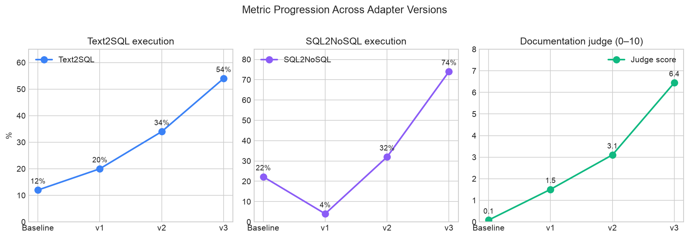
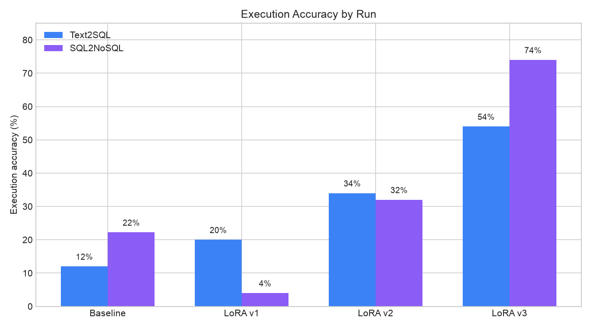
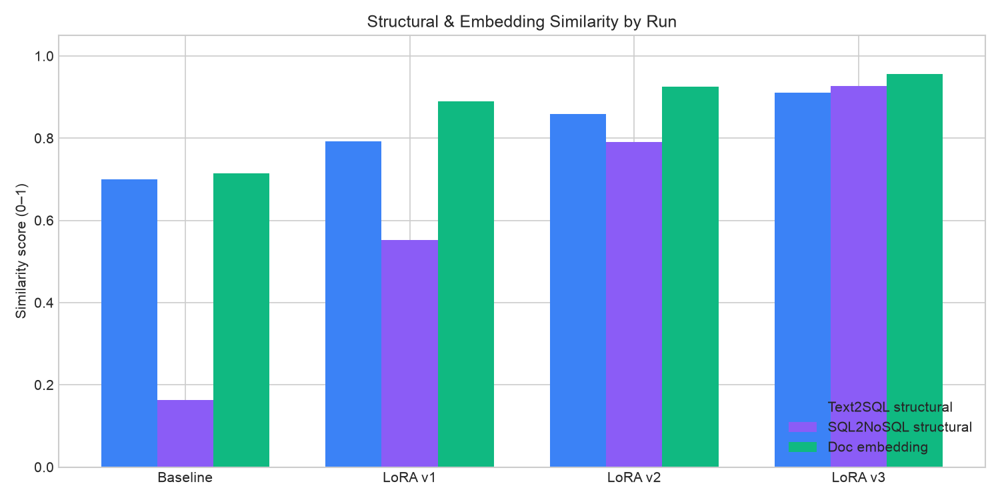
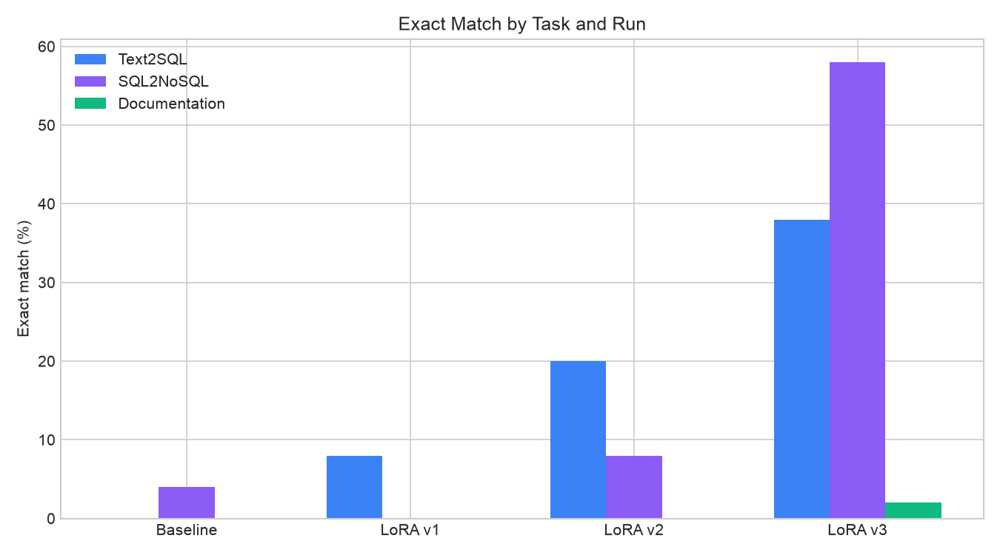
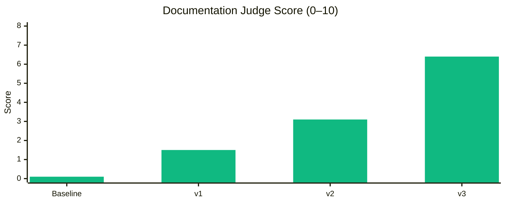

# LoRA v3 vs All Versions — Spider Gold Validation Comparison

> **Project:** CodeGen Fine-Tuning with PEFT & LoRA  
> **Date:** 2026-07-09  
> **Model:** `Salesforce/codegen-350M-multi`  
> **Judge model:** `qwen3:8b`  
> **Dataset:** `spider_gold_validation` (50 examples per task)  
> **Execution eval:** PostgreSQL result-set comparison enabled (all runs below)

See also: [all-results-comparison.md](all-results-comparison.md) (baseline through v2 only).

## Training context

| Run      | Adapter | Training samples | Epochs | Scale          | Where trained |
| -------- | ------- | ---------------- | ------ | -------------- | ------------- |
| Baseline | —       | —                | —      | No fine-tuning | —             |
| LoRA v1  | `v1`    | 50               | 10     | Smoke-scale    | Local         |
| LoRA v2  | `v2`    | 500              | 5      | Mid-scale      | Local         |
| LoRA v3  | `v3`    | ~10k (full TEND) | 5      | Full-scale     | Local         |

LoRA v1 validated the pipeline on a tiny subset. LoRA v2 scaled training 10× to 500 samples. **LoRA v3** is the first **full TEND** run (Spider + BIRD combined, no `max_samples` cap) trained on Kaggle and evaluated locally after Hub download.

## Compared runs

| Run                   | Path                                                                               |
| --------------------- | ---------------------------------------------------------------------------------- |
| Baseline (no adapter) | `results/spider_gold_validation_codegen-350M-multi_0607_1841/metrics.json`         |
| LoRA v1               | `results/spider_gold_validation_codegen-350M-multi_lora-v1_0607_2108/metrics.json` |
| LoRA v2               | `results/spider_gold_validation_codegen-350M-multi_lora-v2_0607_2226/metrics.json` |
| LoRA v3               | `results/spider_gold_validation_codegen-350M-multi_lora-v3_0907_1321/metrics.json` |

## Summary

**LoRA v3 is the strongest run across all three tasks.** Compared to LoRA v2, it lifts **text2sql execution accuracy** from 34% to **54%** (+20 pp), **sql2nosql execution accuracy** from 32% to **74%** (+42 pp), and **documentation judge score** from 3.1 to **6.4** (+3.3 on a 0–10 scale). Exact match also jumps sharply on code-generation tasks (text2sql 20% → 38%, sql2nosql 8% → 58%).

Against baseline, v3 more than **quadruples** text2sql execution accuracy (12% → 54%) and more than **triples** sql2nosql execution accuracy (22% → 74%). Documentation reaches the first non-zero exact match (2%) and the highest embedding similarity (0.96).

The progression baseline → v1 → v2 → v3 is monotonic on nearly every metric, confirming that scaling training data from smoke (50) through mid (500) to full TEND (~10k) yields consistent gains.

---

## Visual overview

### Execution accuracy & judge progression

### Execution accuracy by run

### Structural & embedding similarity

### Exact match by task

### Mermaid — execution accuracy by version

```mermaid
---
config:
  xyChart:
    showLegend: true
    width: 900
    height: 420
  themeVariables:
    xyChart:
      plotColorPalette: "#3b82f6, #8b5cf6"
---
xychart-beta
    title "Execution Accuracy by Version (%)"
    x-axis ["Baseline", "v1", "v2", "v3"]
    y-axis "Accuracy" 0 --> 80
    bar "Text2SQL" [12, 20, 34, 54]
    bar "SQL2NoSQL" [22, 4, 32, 74]
```

### Mermaid — documentation judge by version

### Mermaid — exact match by version

```mermaid
---
config:
  xyChart:
    showLegend: true
    width: 900
    height: 420
  themeVariables:
    xyChart:
      plotColorPalette: "#3b82f6, #8b5cf6, #10b981"
---
xychart-beta
    title "Exact Match by Version (%)"
    x-axis ["Baseline", "v1", "v2", "v3"]
    y-axis "Exact match" 0 --> 65
    bar "Text2SQL" [0, 8, 20, 38]
    bar "SQL2NoSQL" [4, 0, 8, 58]
    bar "Documentation" [0, 0, 0, 2]
```

---

## Text2SQL — v3 leads on every metric

| Metric                    | Baseline | LoRA v1 | LoRA v2 | LoRA v3   | v3 vs base          | v3 vs v2           |
| ------------------------- | -------- | ------- | ------- | --------- | ------------------- | ------------------ |
| **Execution accuracy**    | 12%      | 20%     | 34%     | **54%**   | **+42 pp**          | **+20 pp**         |
| **Structural similarity** | 0.700    | 0.792   | 0.859   | **0.910** | **+0.210 (+30.0%)** | **+0.051 (+5.9%)** |
| **Exact match**           | 0%       | 8%      | 20%     | **38%**   | **+38 pp**          | **+18 pp**         |

Text2sql improves at every scale-up. LoRA v3 nearly doubles v2 execution accuracy and nearly doubles exact match again (20% → 38%). Structural similarity crosses 0.91, indicating generated SQL is very close in form to gold references.

---

## SQL2NoSQL — largest v3 gains

| Metric                    | Baseline | LoRA v1 | LoRA v2 | LoRA v3   | v3 vs base         | v3 vs v2            |
| ------------------------- | -------- | ------- | ------- | --------- | ------------------ | ------------------- |
| **Execution accuracy**    | 22%      | 4%      | 32%     | **74%**   | **+52 pp**         | **+42 pp**          |
| **Structural similarity** | 0.163    | 0.553   | 0.791   | **0.926** | **+0.763 (+468%)** | **+0.135 (+17.1%)** |
| **Exact match**           | 4%       | 0%      | 8%      | **58%**   | **+54 pp**         | **+50 pp**          |

SQL2NoSQL shows the largest absolute jump under v3. Execution accuracy climbs from 32% (v2) to **74%** — more than double — and exact match rises from 8% to **58%**. The v1 execution regression (22% → 4%) is fully resolved by v2 and far exceeded by v3.

---

## Documentation — first exact matches, strongest judge scores

| Metric                   | Baseline | LoRA v1 | LoRA v2 | LoRA v3   | v3 vs base          | v3 vs v2           |
| ------------------------ | -------- | ------- | ------- | --------- | ------------------- | ------------------ |
| **Embedding similarity** | 0.714    | 0.889   | 0.926   | **0.957** | **+0.243 (+34.0%)** | **+0.031 (+3.3%)** |
| **Judge score (0–10)**   | 0.1      | 1.5     | 3.1     | **6.4**   | **+6.3**            | **+3.3**           |
| **Exact match**          | 0%       | 0%      | 0%      | **2%**    | **+2 pp**           | **+2 pp**          |

Documentation quality improves steadily with training scale. LoRA v3 is the first run to achieve any exact-match documentation (2%) and reaches a judge score of **6.4** — roughly double v2 and two orders of magnitude above baseline (0.1). Embedding similarity nears 0.96.

---

## Cross-task overview

| Task          | Best run | Key metric         | Value   | Runner-up (v2) |
| ------------- | -------- | ------------------ | ------- | -------------- |
| Text2SQL      | LoRA v3  | Execution accuracy | **54%** | 34%            |
| SQL2NoSQL     | LoRA v3  | Execution accuracy | **74%** | 32%            |
| Documentation | LoRA v3  | Judge score        | **6.4** | 3.1            |

---

## Progression table (key metrics only)

| Version     | Text2SQL exec | SQL2NoSQL exec | Doc judge | Training scale  |
| ----------- | ------------- | -------------- | --------- | --------------- |
| Baseline    | 12%           | 22%            | 0.1       | —               |
| LoRA v1     | 20%           | 4%             | 1.5       | 50 × 10 epochs  |
| LoRA v2     | 34%           | 32%            | 3.1       | 500 × 5 epochs  |
| **LoRA v3** | **54%**       | **74%**        | **6.4**   | ~10k × 5 epochs |

---

## Takeaways

- **Training scale matters:** Each adapter version trains on more data — 50 → 500 → ~10k samples — and evaluation metrics improve monotonically on almost every axis.
- **Text2SQL:** Execution accuracy follows a clear ladder: **12% → 20% → 34% → 54%**. Exact match accelerates under v3 (38%), suggesting full-dataset training helps the model memorize query patterns, not just structure.
- **SQL2NoSQL:** v3 is the breakout run. Execution accuracy **74%** and exact match **58%** show that structural learning (0.93 similarity) now reliably translates to correct MongoDB result sets.
- **Documentation:** Judge scores remain the most human-interpretable signal; v3’s **6.4** indicates generated docs are approaching acceptable quality, though there is still headroom below a perfect 10.
- **v3 workflow:** Adapters were trained on Kaggle (`notebooks/kaggle_train_lora.ipynb`), pushed to Hugging Face Hub, downloaded locally, and evaluated with `run_baseline_eval.py --version v3`. This validates the cloud-train / local-eval pipeline for production-scale LoRA runs.

