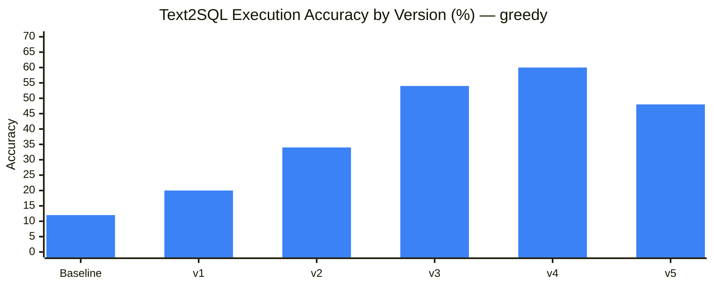
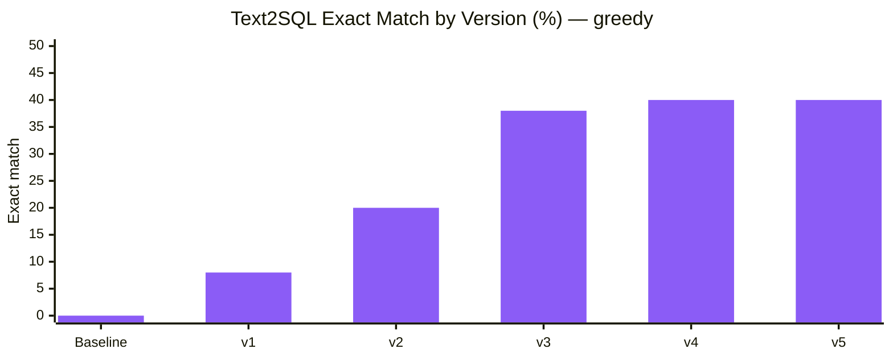

# LoRA v5 vs All Versions — Spider Gold Validation Comparison

> **Project:** CodeGen Fine-Tuning with PEFT & LoRA  
> **Date:** 2026-07-24  
> **Model:** `Salesforce/codegen-350M-multi`  
> **Dataset:** `spider_gold_validation` (50 examples)  
> **Execution eval:** PostgreSQL result-set comparison enabled  
> **Scope:** **text2sql only** (v5 did not train sql2nosql / nosql2doc)

See also: [lora-v4-vs-all-versions-comparison.md](lora-v4-vs-all-versions-comparison.md) · [lora-v4-beam-decoding-comparison.md](lora-v4-beam-decoding-comparison.md) · [version-tracker.md](version-tracker.md).

## Training context

| Run | Adapter | Training samples | Epochs | LoRA config | Where trained |
| --- | ------- | ---------------- | ------ | ----------- | ------------- |
| Baseline | — | — | — | — | — |
| LoRA v1 | `v1` | 50 | 10 | `r=16`, `α=32`, attn only | Local |
| LoRA v2 | `v2` | 500 | 5 | same as v1 | Local |
| LoRA v3 | `v3` | ~8k (full TEND) | 5* | same as v1 | Local (MPS) |
| LoRA v4 | `v4` | ~8k (full TEND) | 5 | **`r=32`, `α=64`, + `fc_in` / `fc_out`** | Kaggle (CUDA) |
| **LoRA v5** | `v5` | ~8k (full TEND) | 5† | same capacity as v4; **lower LR + stronger reg** | Kaggle (CUDA) |

\*v3 text2sql best checkpoint is epoch 2 only.  
†v5 early-stopped after epoch 4 (`early_stopping_patience=2`); best checkpoint is epoch **2**.

**LoRA v5** is a **text2sql-only ablation**. Goal (from [`configs/v5-text2sql.yaml`](../configs/v5-text2sql.yaml)): fix v4 text2sql overfitting (best @ epoch 1) by lowering learning rate and increasing regularization, while keeping v4 LoRA capacity (`r=32`, `α=64`, attn + FFN targets).

Config used for training:

```bash
python scripts/train_all_lora.py --config configs/v5-text2sql.yaml \
  --tasks text2sql --version v5 --no-mlflow
```

[`notebooks/kaggle_train_lora.ipynb`](../notebooks/kaggle_train_lora.ipynb) patches the working copy of `v5-text2sql.yaml` for Kaggle GPU memory (repo file unchanged):

| Setting | Repo `v5-text2sql.yaml` | Kaggle notebook (v5 actual) |
| ------- | ----------------------- | --------------------------- |
| `per_device_train_batch_size` | 4 | **2** |
| `per_device_eval_batch_size` | 4 | **2** |
| `gradient_accumulation_steps` | 8 | **16** |
| Effective batch (1× GPU) | 32 | **32** |

## Compared runs

| Run | Path |
| --- | ---- |
| Baseline (no adapter) | `results/spider_gold_validation_codegen-350M-multi_0607_1841/metrics.json` |
| LoRA v1 | `results/spider_gold_validation_codegen-350M-multi_lora-v1_0607_2108/metrics.json` |
| LoRA v2 | `results/spider_gold_validation_codegen-350M-multi_lora-v2_0607_2226/metrics.json` |
| LoRA v3 | `results/spider_gold_validation_codegen-350M-multi_lora-v3_0907_1321/metrics.json` |
| LoRA v4 (greedy) | `results/spider_gold_validation_codegen-350M-multi_lora-v4_1807_2149/metrics.json` |
| LoRA v4 (beam) | `results/spider_gold_validation_codegen-350M-multi_lora-v4_1807_2248/metrics.json` |
| **LoRA v5 (greedy)** | `results/spider_gold_validation_codegen-350M-multi_lora-v5_2407_greedy/metrics.json` |

All version-line numbers below use **greedy** decoding unless noted. v5 has no beam re-eval yet.

## Summary

**The v5 regularization ablation did not improve Spider gold text2sql execution accuracy.** Under greedy decoding, v5 reaches **48%** execution accuracy — **−12 pp vs v4 (60%)** and **−6 pp vs v3 (54%)**. Exact match holds at **40%** (tied with v4 greedy); structural similarity edges up slightly to **0.920** (v4 greedy 0.916).

Training-side, the ablation partially met its overfitting goal: best checkpoint moved from v4’s epoch **1** to v5’s epoch **2**, and the train/eval loss gap narrowed (v4 train 0.089 / best eval 0.247 → v5 train 0.180 / best eval 0.251). That healthier loss curve did **not** translate to better gold execution.

sql2nosql and documentation are unchanged from v4 — v5 did not retrain those adapters.

---

## Visual overview

### Mermaid — text2sql execution accuracy by version (greedy)



### Mermaid — text2sql exact match by version (greedy)



---

## Text2SQL — v5 vs prior versions (greedy)

| Metric | Baseline | LoRA v1 | LoRA v2 | LoRA v3 | LoRA v4 | **LoRA v5** | v5 vs v4 | v5 vs v3 |
| ------ | -------- | ------- | ------- | ------- | ------- | ----------- | -------- | -------- |
| **Execution accuracy** | 12% | 20% | 34% | 54% | **60%** | 48% | **−12 pp** | **−6 pp** |
| **Exact match** | 0% | 8% | 20% | 38% | **40%** | **40%** | **0 pp** | **+2 pp** |
| **Structural similarity** | 0.700 | 0.792 | 0.859 | 0.910 | 0.916 | **0.920** | **+0.004** | **+0.010** |

v5 sits between v2 and v3 on execution accuracy while matching v4 on exact match. Structural similarity is the one metric where v5 slightly leads the greedy series — generated SQL remains close in form to gold, but fewer predictions execute correctly on PostgreSQL.

### Optional reference — v4 beam (same v4 adapters)

| Metric | v4 greedy | v4 beam | v5 greedy |
| ------ | --------- | ------- | --------- |
| Execution accuracy | 60% | **64%** | 48% |
| Exact match | 40% | **44%** | 40% |
| Structural similarity | 0.916 | **0.945** | 0.920 |

Beam decoding is a separate lever on v4 adapters; it is not a fair training comparison against v5.

---

## Training dynamics — overfitting ablation

| Signal | LoRA v4 text2sql | LoRA v5 text2sql |
| ------ | ---------------- | ---------------- |
| Best checkpoint | epoch **1** (step 503) | epoch **2** (step 504) |
| Best eval loss | **0.247** | 0.251 |
| Final train loss | 0.089 | 0.180 |
| Epochs completed | 5 (no early stop) | **4** (early stop; patience 2) |
| Train runtime | ~8,002 s (~2h 13m) | ~6,530 s (~1h 49m) |
| Effective batch | **16** (Kaggle 2 × 8) | **32** (Kaggle 2 × 16) |
| Eval loss @ ep1 | **0.247** | 0.284 |
| Eval loss @ ep2 | 0.249 | **0.251** |
| Eval loss @ ep3 | 0.273 | 0.261 |
| Eval loss @ ep4 | 0.336 | 0.286 |
| Eval loss @ ep5 | 0.360 | — (stopped) |

v4’s eval loss is best at epoch 1 and degrades steadily afterward (classic overfit signature). v5 delays the best checkpoint to epoch 2 and keeps later eval losses flatter, but the absolute best eval loss is slightly worse than v4, and gold execution falls.

---

## v4 vs v5 — what changed

| Setting | LoRA v4 | LoRA v5 |
| ------- | ------- | ------- |
| Tasks trained | text2sql, sql2nosql, nosql2doc | **text2sql only** |
| Train samples | ~8,040 | same |
| Epochs | 5 complete | 5 planned; **early stop @ 4** |
| Learning rate | `2e-4` | **`8e-5`** |
| Weight decay | `0.01` | **`0.05`** |
| LoRA dropout | `0.05` | **`0.10`** |
| Warmup ratio | `0.05` | **`0.10`** |
| Early stopping patience | 3 | **2** |
| LoRA rank / alpha | 32 / 64 | same |
| Target modules | `qkv_proj`, `out_proj`, `fc_in`, `fc_out` | same |
| Effective batch (Kaggle) | 16 | **32** |
| Config | `configs/default.yaml` (+ notebook batch patch) | [`configs/v5-text2sql.yaml`](../configs/v5-text2sql.yaml) (+ notebook batch patch) |
| Device | CUDA (Kaggle) | CUDA (Kaggle) |

---

## Progression table (text2sql key metrics)

| Version | Text2SQL exec | Exact match | Struct sim | Training change |
| ------- | ------------- | ----------- | ---------- | --------------- |
| Baseline | 12% | 0% | 0.700 | — |
| LoRA v1 | 20% | 8% | 0.792 | 50 × 10 epochs, `r=16` |
| LoRA v2 | 34% | 20% | 0.859 | 500 × 5 epochs, `r=16` |
| LoRA v3 | 54% | 38% | 0.910 | ~8k × 5 epochs, `r=16` |
| LoRA v4 | **60%** | **40%** | 0.916 | ~8k × 5, **`r=32` + FFN**, LR `2e-4` |
| **LoRA v5** | 48% | **40%** | **0.920** | ~8k, same LoRA, **LR `8e-5` + stronger reg** |

---

## Cross-task status after v5

| Task | Best overall (still) | Value | Note |
| ---- | -------------------- | ----- | ---- |
| Text2SQL | LoRA v4 (beam) / v4 (greedy) | 64% / 60% exec | v5 does **not** improve |
| SQL2NoSQL | LoRA v4 (greedy) | 88% exec | unchanged (not retrained) |
| Documentation | LoRA v4 (beam) | 8.5 judge | unchanged (not retrained) |

---

## Takeaways

- **Regularization fixed the epoch-1 overfit signature, not gold execution.** Best checkpoint moved to epoch 2 and train loss stayed higher, but Spider gold execution dropped 60% → **48%**.
- **Exact match held; execution did not.** Matching v4’s 40% exact match with lower execution suggests v5 still copies surface form well but produces more queries that fail result-set checks.
- **Lower LR + higher WD/dropout was too conservative (or the wrong mix) for this capacity.** Best eval loss (0.251) is slightly worse than v4 (0.247); the model under-adapted relative to the v4 peak.
- **Keep v4 text2sql for deployment** until a follow-up beats 60% greedy / 64% beam. v5 adapters are useful as a negative ablation result, not as a replacement.
- **Next levers (if continuing text2sql):** milder LR cut (e.g. `1e-4`), keep one of WD/dropout at v4 levels, restore patience 3, or evaluate v5 with beam before discarding the checkpoint.
