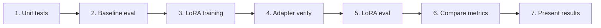

# Methodology — Training, Testing, Validation & Evaluation

This document explains the **methodological design** of the capstone project: how training, testing, validation, and evaluation differ, and why each design decision was made.

---

## 1. Research Questions

1. Can a **350M-parameter code LM** perform database query generation tasks zero-shot?
2. Does **LoRA fine-tuning** improve task-specific quality over the baseline?
3. How do **automated metrics** compare to an **LLM semantic judge**?
4. Can the pipeline be **reproducible** across hardware (CUDA, MPS, CPU)?

---

## 2. Task Definitions

| Task ID | Name | Input | Output | Supervision field |
|---------|------|-------|--------|-------------------|
| `text2sql` | Natural Language → SQL | Question + SQL schema | SQL query | `sql` |
| `sql2nosql` | SQL → MongoDB | Gold SQL + schemas | MongoDB shell query | `nosql_query` |
| `nosql2doc` | Query → Documentation | Gold MongoDB query + schema | Plain-English doc | `documentation` |

Each prompt is prefixed with `Task: <task_name>` so one base model serves all three tasks with task-specific LoRA weights.

---

## 3. Training Methodology

### 3.1 Fine-Tuning Approach: LoRA (PEFT)

**Why LoRA instead of full fine-tuning?**

| Aspect | Full fine-tuning | LoRA |
|--------|------------------|------|
| Trainable params | ~350M (all) | ~0.1–1% (adapter only) |
| Storage | Full model copy per task | ~few MB per adapter |
| Training time | Hours–days | Minutes–hours |
| Risk of catastrophic forgetting | High | Low (base frozen) |

**LoRA configuration** — see [version-tracker.md](../reference/version-tracker.md):

| Version | r / alpha | Targets | Epochs | Train scale |
|---------|-----------|---------|--------|-------------|
| v1 (smoke) | 16 / 32 | attn only | 10 | 50 rows/task |
| v2 | 16 / 32 | attn only | **5** | full TEND (~8k) |
| **v3 (prod)** | **32 / 64** | **attn + FFN** | **10** | full TEND (~8k) |

Production values come from `configs/default.yaml`.

### 3.2 Training Data

| Split | Source | Size | Purpose |
|-------|--------|------|---------|
| Train | TEND spider + bird `train` | ~10,697 rows | Supervised fine-tuning |
| Eval (during training) | TEND spider + bird `test` | ~1,625 rows | Held-out `eval_loss` per epoch |

Rows are filtered per task by required fields. Prompts exceeding 2048 tokens are truncated from the **start** (schema head dropped) so the target completion is never cut.

### 3.3 Loss Function

TRL `SFTTrainer` with **completion-only loss**:

- Input: `{prompt, completion}` pairs
- Prompt tokens masked in labels (`-100`)
- Only completion tokens contribute to loss
- Ensures the model learns to generate targets, not memorize prompts

### 3.4 Hyperparameters

| Parameter | Value (v3 default) |
|-----------|-------------------|
| Epochs | **10** (v2: **5** with `--epochs 5`) |
| Learning rate | 2e-4 (cosine schedule) |
| Batch size | 8 × 4 grad accumulation = **32 effective** |
| Warmup | 5% of steps |
| Max sequence length | 2048 tokens |
| Max target tokens | 256 (prompt budget ≈ 1792) |
| Precision | fp32 (cross-device compatibility) |

### 3.5 Training Commands

```bash
# Smoke (v1)
python scripts/train_all_lora.py --version v1 --max-samples 50

# Full TEND v2 (r=16, 5 epochs)
python scripts/train_all_lora.py --version v2 --epochs 5

# Production v3 (configs/default.yaml, 10 epochs)
python scripts/train_all_lora.py --version v3
```

---

## 4. Testing Methodology (Software Quality)

Testing verifies **code correctness**, not model quality.

### 4.1 Unit & Smoke Tests

Location: `tests/training/`, `tests/utils/`

| Test | Validates |
|------|-----------|
| `test_prompt_parity.py` | Training prompts identical to inference prompts |
| `test_overfit_smoke.py` | 5 rows overfit → `train_loss < 1.5` |
| `test_adapter_load.py` | Trained adapter loads and generates output |
| `test_adapter_verify.py` | Missing artifact detection |
| `test_device.py` | Device resolution (cuda/mps/dml/cpu) |

```bash
python -m unittest discover -s tests -v
```

### 4.2 Integration Smoke Tests

| Script | Validates |
|--------|-----------|
| `scripts/test_tend_loader.py` | HF dataset download + field integrity |
| `scripts/build_sft_dataset.py` | SFT builder filter/token stats |
| `scripts/inspect_lora_modules.py` | LoRA target modules match model |
| `scripts/validate_lora_smoke.py` | End-to-end train + eval smoke |

---

## 5. Validation Methodology (Pipeline Correctness)

Validation confirms the **training and inference pipelines work correctly** before committing to full runs.

### 5.1 Pre-Training Validation

| Step | Command | Pass criteria |
|------|---------|---------------|
| LoRA modules | `inspect_lora_modules.py` | Trainable params > 0 |
| Dataset load | `test_tend_loader.py` | All required fields present |
| SFT builder | `build_sft_dataset.py` | Filter stats reasonable, tokens ≤ 2048 |
| Unit tests | `unittest discover` | All pass |

### 5.2 During-Training Validation

| Signal | Source | Expected |
|--------|--------|----------|
| `train_loss` | SFTTrainer logs | Decreasing over epochs |
| `eval_loss` | Held-out TEND test | Tracked per epoch; best checkpoint saved |
| Token stats | `run_metadata.json` | < 0.02% rows truncated |

### 5.3 Post-Training Validation

```bash
python scripts/verify_lora_adapters.py --version v1
```

Checks each task directory for:
- `adapter_config.json`
- `adapter_model.safetensors`
- `run_metadata.json` (optional)

---

## 6. Evaluation Methodology (Model Quality)

Evaluation measures **how well the model performs** on held-out benchmark data.

### 6.1 Benchmark Dataset

**Primary:** `data/spider_gold_validation.jsonl` — **50 frozen examples**

| Property | Rationale |
|----------|-----------|
| Fixed size (50) | Fast iteration, reproducible comparison |
| Frozen file | Same examples for baseline and all LoRA runs |
| Gold supervision for all 3 tasks | Each task evaluated with gold inputs |

**Secondary:** Full TEND test split (859 spider + 766 bird) via `--full-split`.

### 6.2 Evaluation Protocol

1. Load base model (or base + task-specific LoRA adapter)
2. For each of 50 examples, run all 3 tasks **independently**
3. Compare predictions vs gold references
4. Compute automated metrics per task
5. Optionally run Ollama semantic judge on each prediction
6. Write `metrics.json` + per-task detail CSVs

```bash
# Baseline
python scripts/run_baseline_eval.py --max-samples 50 --output spider_gold_validation_codegen-350M-multi_baseline-v3

# LoRA v3 (production)
python scripts/run_baseline_eval.py --adapter-run v3 --max-samples 50 --output spider_gold_validation_codegen-350M-multi_lora-v3
```

### 6.3 Metrics

#### Text2SQL

| Metric | Type | Description |
|--------|------|-------------|
| Exact Match | Structural | Normalized SQL string equality |
| Execution Accuracy | Functional | Result-set match on **TEND Postgres** (text2sql) / **Mongo** (sql2nosql) |
| Structural similarity | Structural | Clause-level SQL / Mongo overlap |
| Syntax Validity | Structural | Valid SQL parse tree |
| CodeBLEU | Similarity | n-gram + syntax + semantic |
| BERTScore / ROUGE-L / BLEU | Similarity | Text overlap |
| Judge score / Judge correct rate | Semantic | Ollama **`gemma3:4b`** — doc score 0–10; SQL/NoSQL boolean equivalence |

#### SQL2NoSQL

| Metric | Type | Description |
|--------|------|-------------|
| Exact Match | Structural | String equality |
| Token F1 | Similarity | Token-level overlap |
| Structural Equivalence | Structural | Parsed query structure match |
| Syntax Validity | Structural | Valid MongoDB shell syntax |
| CodeBLEU / BERTScore | Similarity | Text overlap |
| Judge Correct Rate | Semantic | Same-result judgment |

#### Documentation

| Metric | Type | Description |
|--------|------|-------------|
| Exact Match | Structural | String equality |
| Token F1 / BLEU / ROUGE-L | Similarity | Text overlap |
| Structural Equivalence | Structural | Doc structure match |
| Syntax Validity | Structural | Well-formed output |
| Judge Correct Rate | Semantic | Correct explanation judgment |

### 6.4 Dual Metric Layers

```
Layer 1: Automated metrics (fast, deterministic, reproducible)
    ↓
Layer 2: Ollama LLM judge (semantic, slower, requires Ollama)
```

Use `--no-judge` when Ollama is unavailable; automated metrics still run.

---

## 7. Key Design Decisions

### 7.1 Independent Task Evaluation

**Decision:** Tasks do not chain predictions during evaluation.

**Rationale:** Isolates per-task quality. If text2sql fails, sql2nosql metrics still reflect SQL→MongoDB capability using gold SQL.

### 7.2 Separate Training vs Evaluation Datasets

| Phase | Dataset | Why different |
|-------|---------|---------------|
| Training | TEND train (~10k) | Maximize supervision |
| Training eval | TEND test (~1.6k) | Monitor overfitting |
| Benchmark | Gold validation (50) | Fixed, reproducible comparison |

### 7.3 Prompt Parity

Training prompts are built by the **same `PromptBuilder` classes** used at inference. Unit tests enforce this (`test_prompt_parity.py`).

### 7.4 One Base Model, Three Adapters

Instead of three separate models, one shared base with swappable LoRA adapters reduces storage and enables fair comparison.

---

## 8. Reproducibility Checklist

| Control | Mechanism |
|---------|-----------|
| Random seeds | `random=42`, `numpy=42`, `torch=42` in config |
| Frozen benchmark | `spider_gold_validation.jsonl` committed to repo |
| Config-driven | All hyperparams in `configs/default.yaml` |
| Versioned adapters | `models/checkpoints/<version>/<task>/` |
| Timestamped results | `results/<dataset>_<model>_<DDMM>_<HHMM>/` |
| MLflow tracking | Optional SQLite-backed experiment log |

---

## 9. Workflow Summary



| Step | Type | Output |
|------|------|--------|
| 1 | Testing | Test pass/fail |
| 2 | Evaluation | Baseline `metrics.json` |
| 3 | Training | LoRA adapters |
| 4 | Validation | Artifact verification |
| 5 | Evaluation | LoRA `metrics.json` |
| 6 | Analysis | Comparison tables |
| 7 | Presentation | Project demo — [presentation.html](presentation.html) |
