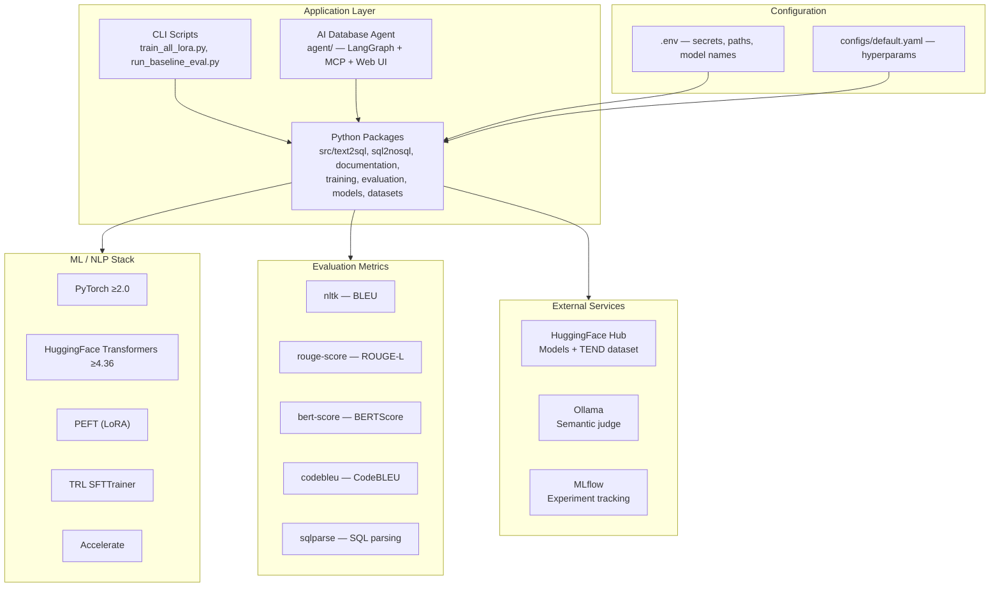

# Tech Stack & Reproducibility

Technology choices, dependencies, configuration, and steps to reproduce all capstone results.

---

## 1. Technology Stack



---

## 2. Core Dependencies

| Package | Purpose | Version constraint |
|---------|---------|-------------------|
| Python | Runtime | 3.11 |
| torch | Deep learning | ≥2.0 |
| transformers | Model loading, generation | ≥4.36 |
| peft | LoRA adapters | latest |
| trl | SFTTrainer | latest |
| accelerate | Multi-device training | latest |
| datasets | HuggingFace dataset loading | latest |
| bert-score | BERTScore metric | latest |
| codebleu | CodeBLEU metric | latest |
| rouge-score | ROUGE-L metric | latest |
| nltk | BLEU metric | latest |
| sqlparse | SQL parsing/validation | latest |
| mlflow | Experiment tracking | ≥2.9 |
| pyyaml | Config loading | latest |

Full list: [requirements.txt](../../requirements.txt)

Agent demo adds [agent/requirements.txt](../../agent/requirements.txt) (LangGraph, MCP, FastAPI Web UI). Install from repo root:

```bash
pip install -r agent/requirements.txt
```

---

## 3. Hardware Support

| Device | Config value | Training | Inference/Eval |
|--------|-------------|----------|----------------|
| NVIDIA CUDA | `cuda` or `auto` | ✅ Fastest | ✅ |
| Apple MPS | `mps` or `auto` | ✅ ~10–15h/task | ✅ |
| Windows DirectML | `dml` or `auto` | ⚠️ Experimental | ✅ |
| CPU | `cpu` | ⚠️ Very slow | ✅ |

Device resolution (`src/utils/device.py`): `auto` → cuda > mps > dml > cpu

---

## 4. Configuration

### 4.1 Environment Variables (`.env`)

| Variable | Required | Description |
|----------|----------|-------------|
| `MODEL_NAME` | Yes | HuggingFace model ID |
| `BERTSCORE_MODEL_NAME` | Yes | BERTScore model |
| `MODEL_ADAPTER` | No | Task adapter to load at inference |
| `MODEL_ADAPTER_RUN` | No | Checkpoint run folder |
| `MODELS_BASE_DIR` | No | Base model cache (default: `models/base`) |
| `MODELS_CHECKPOINTS_DIR` | No | LoRA output (default: `models/checkpoints`) |
| `TEND_DATASET_ID` | No | HF dataset ID |
| `TEND_CACHE_DIR` | No | Dataset cache path |
| `RESULTS_DIR` | No | Evaluation output |
| `OLLAMA_BASE_URL` | No | Ollama API URL |
| `OLLAMA_JUDGE_MODEL` | No | Judge model name |

### 4.2 YAML Config (`configs/default.yaml`)

Key sections:
- `model` — max_length, device
- `generation` — decoding strategy, max_new_tokens
- `evaluation` — batch_size, max_samples, MLflow URI
- `training` — epochs, lr, batch size, sequence budget
- `lora` — rank, alpha, dropout, target_modules
- `seeds` — random, numpy, torch (all 42)

### 4.3 Agent config (`agent/.env`)

Copy [agent/.env.example](../../agent/.env.example) → `agent/.env`. Key variables:

| Variable | Purpose |
|----------|---------|
| `CODEGEN_API_URL` | Cloud Run LoRA v3 gateway (`/v1/chat/completions`) |
| `AGENT_DEMO_DB_ID` | Standalone demo DB (`chinook` default; `northwind` optional) |
| `OLLAMA_BASE_URL` | Local Ollama for orchestrator routing (`gemma3:4b`) |
| `POSTGRES_*` / `MONGO_*` | Demo DB connections (Chinook/Northwind Postgres + Mongo) |

The agent uses **standalone demo databases** for live execution. TEND Docker Postgres/Mongo is for **gold-set evaluation execution accuracy**, not the agent UI.

See [../../agent/README.md](../../agent/README.md).

---

## 5. Reproducibility Guide

### 5.1 Environment Setup

```bash
git clone --branch Group-44 https://github.com/nayanjha16/CodeGen-Implementations-May_26.git
cd CodeGen-Implementations-May_26

conda create -n ai python=3.11 -y
conda activate ai
pip install -r requirements.txt
export PYTHONPATH="$(pwd)"

cp .env.example .env
# Edit .env: set MODEL_NAME and BERTSCORE_MODEL_NAME
```

### 5.2 Verify Installation

```bash
python scripts/inspect_lora_modules.py
python scripts/test_tend_loader.py
python -m unittest discover -s tests -v
```

### 5.3 Reproduce Baseline Evaluation

```bash
python scripts/run_baseline_eval.py --max-samples 50 --no-judge
# Output: results/spider_gold_validation_<model>_<timestamp>/
```

### 5.4 Reproduce LoRA v3 (production)

```bash
python scripts/train_all_lora.py --version v3
python scripts/run_baseline_eval.py --adapter-run v3 --max-samples 50 \
  --output spider_gold_validation_codegen-350M-multi_lora-v3
```

### 5.5 Publish and deploy

```bash
$env:PYTHONPATH = "fastapi-deploy"
python fastapi-deploy/publish/push_adapters.py --version v3
python fastapi-deploy/infra/cloudrun/deploy.py
```

See [../reference/evaluation-and-deploy-runbook.md](../reference/evaluation-and-deploy-runbook.md).

### 5.6 Run AI Database Agent demo

Prerequisites: Cloud Run API reachable (`/health` shows `checkpoint_version: v3`), Ollama running locally, demo DBs set up.

```bash
# Agent deps (if not already installed)
pip install -r agent/requirements.txt

# Config
cp agent/.env.example agent/.env
# Set CODEGEN_API_URL to your Cloud Run URL (see agent/.env.example)

# Load Chinook demo DB into local Postgres/Mongo
python agent/scripts/verify_demo_databases.py

# CLI (single question)
python -m agent.main "How many tracks are in each genre?"

# Web UI (capstone demo)
python -m agent.web
# → http://127.0.0.1:8080

# MCP stdio server (Cursor)
python -m agent.mcp.server

# Agent tests
python -m pytest agent/tests -q
```

| Entry point | Command | Use when |
|-------------|---------|----------|
| CLI | `python -m agent.main "<question>"` | Scriptable smoke test |
| Web UI | `python -m agent.web` | Live project demo |
| MCP | `python -m agent.mcp.server` | Cursor / IDE integration |

Full examples and Northwind switch: [../../agent/README.md](../../agent/README.md).

### 5.7 Compare Results

```bash
# View metrics
cat results/spider_gold_validation_*/metrics.json | python -m json.tool

# Optional: MLflow UI
mlflow ui --backend-store-uri sqlite:///mlflow.db
```

---

## 6. Artifact Layout

```
models/
├── base/Salesforce__codegen-350M-multi/    # Cached base weights
└── checkpoints/v3/
    ├── text2sql/adapter_model.safetensors
    ├── sql2nosql/adapter_model.safetensors
    ├── nosql2doc/adapter_model.safetensors
    └── training_summary_*.json

data/
├── spider_gold_validation.jsonl            # Frozen benchmark
└── cache/tend/                             # HF dataset cache

results/
└── spider_gold_validation_<model>_<date>/
    ├── metrics.json
    ├── text2sql_details.csv
    ├── sql2nosql_details.csv
    └── documentation_details.csv

agent/
├── .env                              # Agent + Cloud Run + demo DB config
├── data/standalone/chinook/          # SQL dump for demo DB
├── orchestration/                    # LangGraph graph
├── tools/                            # schema_tool, execution_tool
└── tests/                            # Unit + integration (88 tests)
```

---

## 7. MLflow Experiment Tracking

| Setting | Value |
|---------|-------|
| Backend | SQLite (`sqlite:///mlflow.db`) |
| Experiment | `codegen-text2sql` |
| Logged fields | Model, task, hyperparams, losses, all eval metrics |

Enable with `--mlflow` flag on eval or omit `--no-mlflow` on training.

---

## 8. Seed Control

All randomness controlled via `configs/default.yaml`:

```yaml
seeds:
  random: 42
  numpy: 42
  torch: 42
```

Called by `set_seeds(config)` at the start of every training and evaluation script.

---

## 9. Model Caching

Base models download once to `models/base/<slug>/` with a `.downloaded` marker file. Subsequent runs skip HuggingFace download.

LoRA adapters are small (~few MB) and saved locally under `models/checkpoints/`.

TEND dataset cached as JSONL under `data/cache/tend/` after first HuggingFace fetch.
