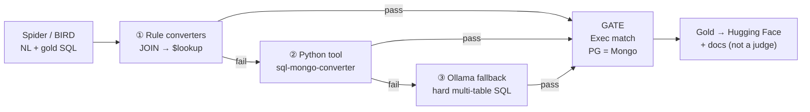
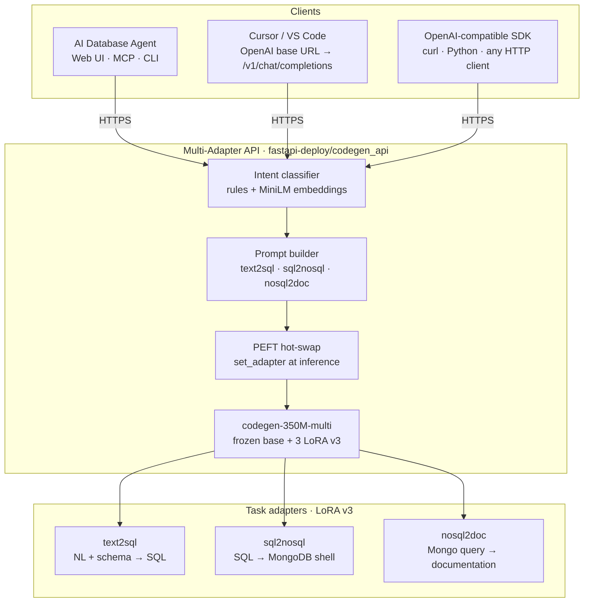
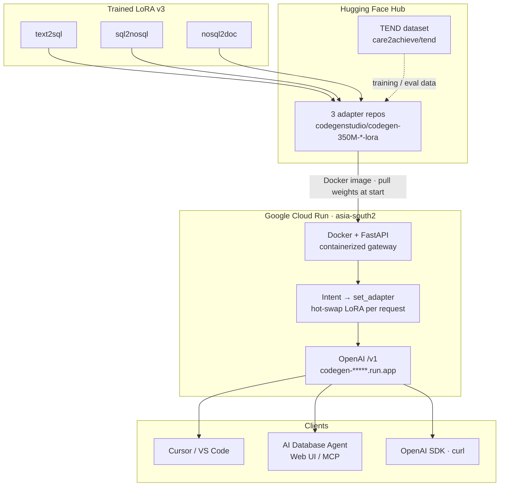
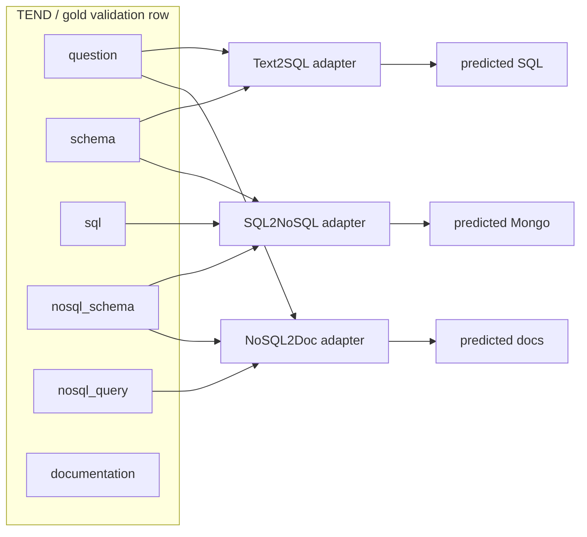
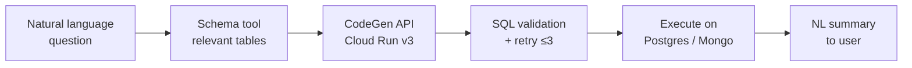

# Capstone Reviewer Submission Guide

**Project:** AI-Powered Database Intelligence  
**Subtitle:** Bridging Natural Language, SQL, NoSQL & AI Agents using PEFT & LoRA  
**Group:** Capstone Group-44 · Codegen-11  
**Repository:** [github.com/nayanjha16/CodeGen-Implementations-May_26](https://github.com/nayanjha16/CodeGen-Implementations-May_26.git) · branch **`Group-44`**
**Institution:** International Institute of Information Technology Hyderabad (IIITH)  
**Program:** PG Certification in Artificial Intelligence and Machine Learning  
**Presentation:** Project demo · **August 2026**  
**Current production adapters:** LoRA **v3** (`fastapi-deploy/manifest.yaml` → `checkpoint_version: v3`)  
**Live deck:** [presentation.html](presentation.html)

This document is written for **capstone reviewers**. It explains the team, the datasets, what each repository folder contains, and the features implemented end-to-end so the whole project can be understood without reading every source file.

---


## Table of contents

1. [Team details](#1-team-details)
2. [Project at a glance](#2-project-at-a-glance)
3. [Dataset details](#3-dataset-details)
4. [System architecture (what we built)](#4-system-architecture-what-we-built)
5. [Training versions and key results](#5-training-versions-and-key-results)
6. [Repository folder guide](#6-repository-folder-guide)
7. [Public artifacts and demos](#7-public-artifacts-and-demos)
8. [How to verify the work](#8-how-to-verify-the-work)
9. [Related documentation](#9-related-documentation)

---


## 1. Team details


| Field                | Value                                     |
| -------------------- | ----------------------------------------- |
| Capstone group       | **Group-44**                              |
| Track / cohort label | **Codegen-11**                            |
| Repository           | [nayanjha16/CodeGen-Implementations-May_26](https://github.com/nayanjha16/CodeGen-Implementations-May_26.git) |
| Branch               | **`Group-44`**                            |
| Institution          | IIITH                                     |
| Program              | PG Certification in AI & Machine Learning |
| Project demo         | Live presentation · **August 2026**     |


### Team members

All members contributed across dataset construction, LoRA training, evaluation, Cloud Run deployment, AI Database Agent, and presentation.


| Name          | Notes       |
| ------------- | ----------- |
| **K.Bhavani** | Team member |
| **Sai Hemanta** | Team member |
| **Narayanan** | Team member |


### One-line project pitch (from the title slide)

Fine-tuned **CodeGen-350M** with **three LoRA adapters**, a **Cloud Run API**, and an **AI agent** that turns plain English into live SQL and MongoDB answers — built on the **TEND** execution-validated dataset.

---


## 2. Project at a glance


### Problem

- Full fine-tunes of large LMs are impractical on research / student hardware.
- Zero-shot `codegen-350M-multi` is weak on structured DB tasks.
- Public benchmarks (Spider, BIRD) stop at NL→SQL; they do not provide aligned SQL↔Mongo↔docs with **execution proof**.
- IDE clients need a deployable **OpenAI-compatible** endpoint.


### Solution


| Component   | What it is                                                            |
| ----------- | --------------------------------------------------------------------- |
| Base model  | `Salesforce/codegen-350M-multi` (frozen)                              |
| Fine-tuning | PEFT LoRA — **one adapter per task**                                  |
| Tasks       | Text→SQL · SQL→MongoDB · NoSQL→Documentation                          |
| Dataset     | **TEND** — aligned, execution-validated rows from Spider + BIRD       |
| Serving     | FastAPI gateway with intent classification + PEFT hot-swap            |
| Client      | **AI Database Agent** (`agent/`) — LangGraph + MCP + Web UI → Cloud Run → execute |


### Headline results (LoRA v3, frozen gold set, n=50, greedy, TEND execution)

| Task        | Metric             | Baseline v3 | LoRA v3 |
| ----------- | ------------------ | ----------- | ------- |
| Text→SQL    | Execution accuracy | 14%         | **66%** |
| SQL→MongoDB | Execution accuracy | 22%         | **86%** |
| NoSQL→Docs  | Judge score (0–10) | 8.33        | **8.82** |

Published on Hugging Face under **`codegenstudio/codegen-350M-*-lora`**. Full metrics: [../reference/version-tracker.md](../reference/version-tracker.md).

---


## 3. Dataset details


### 3.1 Why we built TEND

**TEND** = **T**ranslation · **E**valuation · **N**atural language · **D**ocument (NoSQL).

Spider and BIRD provide NL + gold SQL only. Training three LoRA adapters required **one aligned gold row** per example covering question, SQL, MongoDB, and documentation — filtered by **execution match** (PostgreSQL vs MongoDB), not an LLM judge.


| Item                     | Value                                                                                                                   |
| ------------------------ | ----------------------------------------------------------------------------------------------------------------------- |
| Public repo              | [care2achieve/tend](https://huggingface.co/datasets/care2achieve/tend) |
| License                  | CC BY 4.0 (see HF dataset card; cite Spider & BIRD)                                                                     |
| HF train rows            | **10,697** (Spider + BIRD train splits)                                                                                 |
| Gold eval benchmark      | **50** frozen examples — `data/spider_gold_validation.jsonl`                                                            |
| Local reference doc      | `[data/DATASETS.md](../../data/DATASETS.md)`                                                                            |


### 3.2 How TEND is built (conversion cascade)




Failed rows stay failed. BIRD yield is much lower than Spider. No LLM “rescue” of queries that fail execution.

### 3.3 Hugging Face configurations and splits


| Config       | Train rows  | Test rows  | Origin                                   |
| ------------ | ----------- | ---------- | ---------------------------------------- |
| `spider`     | 6,730       | 859        | Spider-derived                           |
| `bird`       | 3,967       | 766        | BIRD-derived                             |
| **Combined** | **~10,697** | **~1,625** | Used for LoRA training / train-eval loss |


> **Naming:** TEND `test` = source validation/dev (Spider/BIRD `dev`). TEND `train` = source training split.


### 3.4 Record schema (one row = three tasks)


| Field           | Alias        | Role                                      |
| --------------- | ------------ | ----------------------------------------- |
| `question`      | —            | NL input (text2sql / context)             |
| `schema`        | `sql_schema` | SQL DDL for prompts                       |
| `sql`           | `sql_query`  | text2sql **target**; sql2nosql **input**  |
| `nosql_schema`  | —            | Mongo schema for prompts                  |
| `nosql_query`   | —            | sql2nosql **target**; nosql2doc **input** |
| `documentation` | —            | nosql2doc **target**                      |
| `db_id`         | —            | Database id metadata                      |
| `id`            | —            | Stable example id                         |


### 3.5 Benchmark set used for capstone numbers


| Property            | Value                                           |
| ------------------- | ----------------------------------------------- |
| File                | `data/spider_gold_validation.jsonl`             |
| Size                | **50** frozen examples                          |
| Purpose             | Apples-to-apples baseline vs every LoRA version |
| Committed           | Yes (version-controlled)                        |
| Default eval script | `scripts/run_baseline_eval.py`                  |


| Data                           | Used for                  | Not used for                |
| ------------------------------ | ------------------------- | --------------------------- |
| TEND train (spider+bird)       | LoRA weight updates       | Final reported gold metrics |
| TEND test (spider+bird)        | Training `eval_loss`      | Primary slide numbers*      |
| `spider_gold_validation.jsonl` | Capstone benchmark tables | Training                    |


Full TEND test eval is available via `--full-split` for extended analysis.

### 3.6 Demo databases (AI Database Agent)

| Item | Detail |
| ---- | ------ |
| Profiles | Chinook, Northwind (standalone Postgres) |
| Config | `agent/.env` — `AGENT_DEMO_DB_ID=chinook` |
| Verify | `python agent/scripts/verify_demo_databases.py` |
| Web UI | `python -m agent.web` → http://127.0.0.1:8080 |

Full setup (deps, `.env`, CLI/MCP, tests): [06-tech-stack-reproducibility.md §5.6](06-tech-stack-reproducibility.md#56-run-ai-database-agent-demo).

TEND Docker (Spider gold subset) is used for **evaluation execution accuracy**, not the agent demo DBs.


---


## 4. System architecture (what we built)

**Design choice:** schema subset (`agent/tools/schema_tool.py`) and database execution stay on the **client**. The gateway stays **stateless** and OpenAI-compatible (`/v1/chat/completions`).

### 4.1 End-to-end product architecture

Clients call one OpenAI-compatible gateway; the gateway classifies intent, builds a task prompt, and hot-swaps the matching LoRA adapter on a frozen CodeGen base.




### 4.2 Deployment path (Hub → Cloud Run → clients)




### 4.3 Research / training view (three independent tasks)

Tasks are **trained and evaluated independently** with **gold** fields from the same TEND row — predicted outputs are never chained during benchmarking.




| Task          | Input                 | Output        | Adapter     |
| ------------- | --------------------- | ------------- | ----------- |
| **Text2SQL**  | Question + SQL schema | SQL           | `text2sql`  |
| **SQL2NoSQL** | Gold SQL + schemas    | MongoDB shell | `sql2nosql` |
| **NoSQL2Doc** | Gold Mongo + schema   | Documentation | `nosql2doc` |


### 4.4 Agent closed loop (client-side)




---


## 5. Training versions and key results


### 5.1 Version ladder


| Version          | Train samples | Epochs | LoRA                 | Targets      | Role                   |
| ---------------- | ------------- | ------ | -------------------- | ------------ | ---------------------- |
| Baseline         | —             | —      | none                 | —            | Zero-shot              |
| v1               | 50            | 10     | r16 α32              | attn         | Smoke                  |
| v2               | ~8,040        | **5**  | r16 α32              | attn         | Full TEND              |
| **v3 (current)** | ~8,040        | **10** | **r32 α64**          | **attn+FFN** | **Production**         |

Full tracker: [../reference/version-tracker.md](../reference/version-tracker.md).

### 5.2 Gold validation progression (execution / judge)

| Version  | Text2SQL exec | SQL2NoSQL exec | Doc judge (0–10) |
| -------- | ------------- | -------------- | ---------------- |
| Baseline v3 | 14%        | 22%            | 8.33             |
| v2       | 60%           | 74%            | 8.41             |
| **v3**   | **66%**       | **86%**        | **8.82**         |

Why v3 won: same full TEND scale as v2; wider LoRA (r/α doubled) + FFN targets (`fc_in`, `fc_out`) + **10 epochs** vs v2’s 5.

---


## 6. Repository folder guide

Top-level layout:

```
CodeGen-Implementations-May_26/
├── src/              # Core ML library (tasks, training, evaluation)
├── scripts/          # CLI entry points (train, eval, verify)
├── configs/          # YAML hyperparameters
├── data/             # Gold validation set + dataset docs + cache
├── models/           # Cached base models + LoRA checkpoints
├── results/          # Evaluation metrics.json + detail CSVs
├── tests/            # Unit / smoke tests for the ML pipeline
├── fastapi-deploy/   # OpenAI-compatible multi-adapter FastAPI + Cloud Run deploy
├── agent/            # AI Database Agent (LangGraph, MCP, Web UI) — COMPLETE
├── docs/             # Capstone + runbooks + version-tracker
├── notebooks/        # Kaggle training notebooks (v2, v3)
├── ai-workflow/      # Research → plan → implement → validate traces
├── requirements.txt  # Python deps
└── README.md         # Setup & CLI reference
```

Below: **summary**, **features implemented**, and a **file table** for each major folder.

---


### 6.1 `src/` — Core ML library

**Summary:** Reusable Python package for the three tasks, TEND loading, LoRA training, model loading, and multi-metric evaluation. Scripts call into this package; it does not own the agent UI or the cloud gateway.

**Features implemented**

- Prompt builders for text2sql, sql2nosql, nosql2doc with **training/inference prompt parity**
- Hugging Face model loader with optional LoRA adapter attach
- TEND download/cache + preprocessing
- LoRA / SFT training (TRL `SFTTrainer`, completion-only loss, filters, token stats)
- Metrics: Exact Match, Execution Accuracy, BLEU/ROUGE/BERTScore/CodeBLEU, structural similarity, Ollama judge
- Device helpers: CUDA, MPS, DirectML, CPU
- MLflow helpers for experiment tracking


#### `src/text2sql/`


| File                | Purpose                                    |
| ------------------- | ------------------------------------------ |
| `prompt_builder.py` | Builds NL + schema → SQL prompts           |
| `sql_generator.py`  | Runs model generation for SQL              |
| `sql_validator.py`  | Syntax / structure checks on generated SQL |
| `sql_executor.py`   | Executes SQL for evaluation / validation   |


#### `src/sql2nosql/`


| File                 | Purpose                          |
| -------------------- | -------------------------------- |
| `prompt_builder.py`  | Builds SQL → MongoDB prompts     |
| `nosql_generator.py` | Generates MongoDB shell queries  |
| `evaluator.py`       | Task-specific evaluation helpers |


#### `src/documentation/`


| File                   | Purpose                              |
| ---------------------- | ------------------------------------ |
| `prompt_builder.py`    | Builds Mongo → documentation prompts |
| `doc_generator.py`     | Generates natural-language docs      |
| `reference_builder.py` | Builds reference documentation text  |
| `evaluator.py`         | Documentation scoring helpers        |


#### `src/datasets/`


| File             | Purpose                                                       |
| ---------------- | ------------------------------------------------------------- |
| `tend_loader.py` | Loads/caches HF `care2achieve/tend` (spider/bird, train/test) |
| `preprocess.py`  | Normalizes fields for training/eval                           |


#### `src/models/`


| File              | Purpose                                          |
| ----------------- | ------------------------------------------------ |
| `model_loader.py` | Loads base LM from cache; attaches LoRA adapters |


#### `src/training/`


| File                | Purpose                              |
| ------------------- | ------------------------------------ |
| `lora_config.py`    | Builds PEFT LoRA config from YAML    |
| `lora_trainer.py`   | SFTTrainer orchestration             |
| `tend_dataset.py`   | Builds supervised datasets from TEND |
| `prompt_factory.py` | Task → prompt builder mapping        |
| `tasks.py`          | Task definitions / target fields     |
| `filters.py`        | Drops invalid / overlong rows        |
| `collator.py`       | Completion-only loss collator        |
| `token_stats.py`    | Prompt/target length statistics      |
| `adapter_verify.py` | Checks adapter artifacts exist       |
| `mlflow_utils.py`   | Training-side MLflow logging         |


#### `src/evaluation/`


| File                        | Purpose                                 |
| --------------------------- | --------------------------------------- |
| `benchmark.py`              | Orchestrates multi-task evaluation runs |
| `metrics.py`                | Aggregate metric computation            |
| `database_execution.py`     | Execution-accuracy against databases    |
| `gold_output_comparison.py` | Compares predictions to gold            |
| `structural_similarity.py`  | Structural SQL/Mongo similarity         |
| `embedding_similarity.py`   | Embedding-based similarity (docs)       |
| `ollama_judge.py`           | Optional LLM-as-judge via Ollama        |
| `qwen_evaluator.py`         | Qwen-based evaluation helper            |
| `export.py`                 | Writes `metrics.json` / detail CSVs     |
| `mlflow_tracker.py`         | Eval-side MLflow logging                |


#### `src/llm/`


| File                    | Purpose                        |
| ----------------------- | ------------------------------ |
| `factory.py`            | Provider factory (HF / Ollama) |
| `huggingface_client.py` | Hugging Face generation client |
| `ollama_client.py`      | Ollama HTTP client             |


#### `src/utils/`


| File                   | Purpose                               |
| ---------------------- | ------------------------------------- |
| `config.py`            | Loads YAML + `.env` settings          |
| `paths.py`             | Model/checkpoint/data path resolution |
| `device.py`            | Auto device selection                 |
| `seeds.py`             | Reproducibility seeds                 |
| `logging.py`           | Logging setup                         |
| `schema_conversion.py` | Schema format helpers                 |


---


### 6.2 `scripts/` — CLI entry points

**Summary:** Operator-facing commands for setup, training, evaluation, and verification. Prefer these over calling library modules directly.

**Features implemented**

- Single-task and all-task LoRA training
- Baseline / LoRA evaluation on gold-50 or full TEND splits
- Adapter download from Hugging Face
- LoRA module inspection and artifact verification
- Dataset smoke tests


| File                           | Purpose                                                     |
| ------------------------------ | ----------------------------------------------------------- |
| `train_lora.py`                | Train one task (`text2sql` / `sql2nosql` / `nosql2doc`)     |
| `train_all_lora.py`            | Train all three tasks + write training summary              |
| `run_baseline_eval.py`         | Primary eval (gold-50 by default; LoRA via `--adapter-run`) |
| `run_all_baseline_eval.py`     | Multi-model baseline comparison                             |
| `build_sft_dataset.py`         | Smoke-build SFT rows and print filter/token stats           |
| `test_tend_loader.py`          | Smoke-test TEND + gold validation loading                   |
| `pull_tend_data.py`            | Prefetch / refresh TEND cache                               |
| `inspect_lora_modules.py`      | Verify LoRA target modules on the base model                |
| `verify_lora_adapters.py`      | Check adapter files for a version                           |
| `validate_lora_smoke.py`       | End-to-end LoRA smoke validation                            |
| `download_adapters_from_hf.py` | Pull published adapters into local checkpoints              |
| `setup_env.ps1`                | Windows PowerShell env helper                               |


---


### 6.3 `configs/` — Hyperparameters

**Summary:** YAML configs for generation, evaluation, training, and LoRA. Model names and paths stay in `.env`; behavior lives here.


| File           | Purpose                                  |
| -------------- | ---------------------------------------- |
| `default.yaml` | Main config (v3 production: r=32, 10 ep) |

**Production LoRA (v3):** `r=32`, `α=64`, targets `qkv_proj`, `out_proj`, `fc_in`, `fc_out` — see [../reference/version-tracker.md](../reference/version-tracker.md).

---


### 6.4 `data/` — Datasets and cache

**Summary:** Local dataset documentation, the frozen evaluation set, and on-disk TEND cache.

**Features implemented**

- Frozen 50-example Spider gold validation JSONL for reproducible slides
- Documented TEND field map and loading examples
- Local cache directory for HF downloads


| Path                           | Purpose                                                |
| ------------------------------ | ------------------------------------------------------ |
| `DATASETS.md`                  | Dataset reference (configs, schema, env vars)          |
| `spider_gold_validation.jsonl` | **Capstone benchmark** (50 rows)                       |
| `cache/tend/`                  | Cached standardized JSONL splits + `pull_summary.json` |
| `.gitkeep`                     | Keeps empty data tree in git                           |


---


### 6.5 `models/` — Weights and checkpoints

**Summary:** Local cache of Hugging Face **base** models and trained **LoRA** adapters. Base weights stay frozen; only adapters are trained and published.

**Features implemented**

- One-time base model download with `.downloaded` marker
- Versioned checkpoint tree: `v1`, `v2`, **`v3`** (production)
- Per-task adapters: `text2sql`, `sql2nosql`, `nosql2doc`
- Training logs and `training_summary_*.json` per run


| Path                                                    | Purpose                                                        |
| ------------------------------------------------------- | -------------------------------------------------------------- |
| `base/<slug>/`                                          | Cached base models (CodeGen-350M, metrics models, experiments) |
| `checkpoints/Salesforce__codegen-350M-multi/vN/<task>/` | LoRA adapters + `run_metadata.json`                            |
| `checkpoints/.../vN/train_all_lora.log`                 | Full training log                                              |
| `checkpoints/.../vN/training_summary_*.json`            | Aggregate train summary                                        |


Typical adapter artifacts per task: `adapter_config.json`, `adapter_model.safetensors`, optional intermediate `checkpoint-*` folders.

---


### 6.6 `results/` — Evaluation outputs

**Summary:** Immutable-ish run folders produced by `run_baseline_eval.py`. These are the source numbers behind version-comparison docs and the presentation charts.

**Features implemented**

- Per-run `metrics.json` (aggregate scores)
- Per-task detail CSVs (example-level predictions and scores)


| Run folder (examples)                 | Meaning                                |
| ------------------------------------- | -------------------------------------- |
| `..._codegen-350M-multi_0607_1841`    | Baseline (no LoRA)                     |
| `..._lora-v2` | Full TEND r=16 eval |
| `..._lora-v3` | **Production v3 eval** |
| `..._baseline-v3` | Baseline paired with v3 |
| `..._codegen2-1B_P_baseline`          | Alternate base model baseline          |


| File in each run            | Purpose                           |
| --------------------------- | --------------------------------- |
| `metrics.json`              | Aggregate metrics for all tasks   |
| `text2sql_details.csv`      | Per-example Text→SQL results      |
| `sql2nosql_details.csv`     | Per-example SQL→Mongo results     |
| `documentation_details.csv` | Per-example documentation results |


---


### 6.7 `tests/` — ML pipeline tests

**Summary:** Automated tests for training correctness, metrics, device helpers, and prompt parity.

**Features implemented**

- Prompt parity (train prompts == runtime builders)
- Overfit smoke (1 row, 1 epoch → adapter files)
- Adapter load + generate smoke
- Metric / judge / structural similarity unit tests


| Path                              | Purpose                               |
| --------------------------------- | ------------------------------------- |
| `training/test_prompt_parity.py`  | Training vs inference prompt match    |
| `training/test_overfit_smoke.py`  | Tiny LoRA train writes adapters       |
| `training/test_adapter_load.py`   | Load adapters and generate            |
| `training/test_adapter_verify.py` | Verification helper behavior          |
| `evaluation/test_*.py`            | Metrics, judge, structural similarity |
| `utils/test_*.py`                 | Paths, device, schema conversion      |
| `llm/test_factory.py`             | LLM factory wiring                    |
| `documentation/test_evaluator.py` | Doc evaluator tests                   |
| `conftest.py`                     | Shared pytest/unittest fixtures       |


---


### 6.8 `agent/` — AI Database Agent (capstone demo)

**Summary:** LangGraph orchestrator with three MCP tools — **never generates SQL directly**. Calls Cloud Run LoRA v3 API, executes queries on Postgres/Mongo, retries on failure (≤3). Entry points: CLI, MCP stdio, Web UI.

**Status:** Complete — 88 tests passed (see `agent/README.md`).

| Path | Purpose |
| ---- | ------- |
| `agent/main.py` | CLI entry |
| `agent/mcp/server.py` | MCP stdio server |
| `agent/web/` | FastAPI chat Web UI |
| `agent/orchestration/` | LangGraph graph + runner |
| `agent/tools/schema_tool.py` | Schema subset for prompts |
| `agent/clients/codegen_client.py` | HTTP → Cloud Run `/v1/chat/completions` |
| `agent/tools/execution_tool.py` | Postgres / Mongo execution |
| `agent/doc/agent.md` | Capstone spec |
| `agent/tests/` | Unit + integration tests |

**Run:** `python -m agent.web` → http://127.0.0.1:8080

---

### 6.9 `fastapi-deploy/` — Multi-adapter API & Cloud Run

**Summary:** OpenAI-compatible FastAPI gateway (`codegen_api` package) — intent classification, PEFT hot-swap, `/v1/chat/completions`. Production on Google Cloud Run (`asia-south2`).

| Path | Purpose |
| ---- | ------- |
| `codegen_api/api/app.py` | FastAPI app (`/health`, `/v1/...`) |
| `codegen_api/adapters/router.py` | Adapter load / hot-swap |
| `codegen_api/classifier/classifier.py` | Rules + MiniLM intent |
| `codegen_api/prompt/builder.py` | Task prompt prefix |
| `manifest.yaml` | `checkpoint_version: v3` |
| `publish/push_adapters.py` | Push LoRA to Hub (`codegenstudio`) |
| `infra/cloudrun/deploy.py` | Cloud Run deploy |
| `Dockerfile` / `entrypoint.sh` | Container |
| `tests/` | API tests |

**Cursor usage:** base URL `…/v1`, model `codegen-multi-adapter`.

---

### 6.10 `docs/` — Documentation and reports

| Path | Purpose |
| ---- | ------- |
| `project-demo/` | Presentation + reviewer docs |
| `version-tracker.md` | **Canonical LoRA v1–v3 metrics** |
| `evaluation-and-deploy-runbook.md` | Eval → publish → deploy |
| `evaluation-and-training.md` | Script reference |
| `codegen-350M-multi.md` | Base model reference |
| `Multi_Adapter_Deployment_Plan.md` | Cloud Run architecture |
| `lora-v1-v3-vs-baseline-comparison.pptx` | Results deck |
| `gold-set-commands.md` | Copy-paste eval commands |

---

### 6.11 `notebooks/` — Cloud training

| File | Purpose |
| ---- | ------- |
| `kaggle_train_lora_v2.ipynb` | Full TEND v2 (r=16, 5 ep) on Kaggle GPU |
| `kaggle_train_lora_v3.ipynb` | Full TEND v3 (r=32+FFN, 10 ep) on Kaggle GPU |

---

### 6.12 `ai-workflow/` — Traceable research & implementation logs

Internal workflow: research → planning → implementation → validation. Includes database-agent completion reports and LoRA planning artifacts.

---


### 6.14 Root config & environment files


| File                       | Purpose                                           |
| -------------------------- | ------------------------------------------------- |
| `README.md`                | Full setup, training, evaluation, troubleshooting |
| `requirements.txt`         | Primary Python dependencies                       |
| `requirements-windows.txt` | Windows / DirectML-oriented deps                  |
| `environment.yml`          | Conda environment hint                            |
| `.env.example`             | Template for `MODEL_NAME`, paths, TEND id, Ollama |
| `.gitignore`               | Ignores weights, local settings, caches           |
| `logo.png`                 | Project branding asset                            |
| `mlflow.db`                | Local MLflow tracking store (when used)           |


---


## 7. Public artifacts and demos


| Artifact                       | Link / location                                                                                                                    |
| ------------------------------ | ---------------------------------------------------------------------------------------------------------------------------------- |
| TEND dataset                   | [https://huggingface.co/datasets/care2achieve/tend](https://huggingface.co/datasets/care2achieve/tend)                             |
| text2sql LoRA | [codegenstudio/codegen-350M-text2sql-lora](https://huggingface.co/codegenstudio/codegen-350M-text2sql-lora) |
| sql2nosql LoRA | [codegenstudio/codegen-350M-sql2nosql-lora](https://huggingface.co/codegenstudio/codegen-350M-sql2nosql-lora) |
| nosql2doc LoRA | [codegenstudio/codegen-350M-nosql2doc-lora](https://huggingface.co/codegenstudio/codegen-350M-nosql2doc-lora) |
| Cloud Run API | `fastapi-deploy/codegen_api` — see [../../fastapi-deploy/README.md](../../fastapi-deploy/README.md) |
| Agent Web UI | `python -m agent.web` — see [../../agent/README.md](../../agent/README.md) |
| Live presentation (HTML) | [presentation.html](../project-demo/presentation.html) — **AI-Powered Database Intelligence** |


---


## 8. How to verify the work

Minimal path for a reviewer with the repo and Python 3.11:

```bash
# 1. Environment
conda create -n ai python=3.11 -y && conda activate ai
pip install -r requirements.txt
export PYTHONPATH="$(pwd)"
cp .env.example .env   # set MODEL_NAME, BERTSCORE_MODEL_NAME

# 2. Dataset smoke
python scripts/test_tend_loader.py

# 3. Training unit/smoke tests (fast)
python -m unittest discover -s tests/training -v

# 4. Evaluate LoRA v3 on gold-50 (start TEND Docker first — see gold-set-commands.md)
python scripts/run_baseline_eval.py --adapter-run v3 --max-samples 50 \
  --output spider_gold_validation_codegen-350M-multi_lora-v3

# 5. Agent demo — see 06-tech-stack-reproducibility.md §5.6 for full steps
cp agent/.env.example agent/.env   # set CODEGEN_API_URL
python agent/scripts/verify_demo_databases.py
python -m agent.web
```

Expected v3 on gold-50 with TEND execution: Text2SQL exec ≈ **66%**, SQL2NoSQL exec ≈ **86%**, doc judge ≈ **8.82** (see `results/..._lora-v3/metrics.json`).

---


## 9. Related documentation


| Document                                                               | Use when                       |
| ---------------------------------------------------------------------- | ------------------------------ |
| [presentation.html](presentation.html)     | Live slides                    |
| [01-executive-summary.md](01-executive-summary.md)                     | Short problem/goals overview   |
| [02-system-architecture.md](02-system-architecture.md)                 | Diagrams                       |
| [03-methodology.md](03-methodology.md)                                 | Train / test / validate design |
| [04-data-and-datasets.md](04-data-and-datasets.md)                     | Deeper dataset methodology     |
| [05-results-and-analysis.md](05-results-and-analysis.md)               | Results narrative              |
| [06-tech-stack-reproducibility.md](06-tech-stack-reproducibility.md)   | Stack, reproduce train/eval/deploy, **agent demo (§5.6)** |
| [README.md](README.md)                                                 | Capstone index                 |
| [../../README.md](../../README.md)                                     | Install & CLI reference        |
| [../reference/version-tracker.md](../reference/version-tracker.md)                         | Exact metrics per LoRA version |
| [../../agent/README.md](../../agent/README.md) | AI Database Agent |
| [../../fastapi-deploy/README.md](../../fastapi-deploy/README.md) | Cloud Run API |
| [../reference/evaluation-and-deploy-runbook.md](../reference/evaluation-and-deploy-runbook.md) | Publish & deploy |


---


## Reviewer checklist (quick)

- [ ] Understand the **three tasks** and why one frozen base + three LoRAs
- [ ] Understand **TEND**: aligned NL/SQL/Mongo/docs + execution gate
- [ ] Know **gold-50** is the official comparison set; TEND train is for training
- [ ] See progression **baseline → v2 → v3** and why **v3** is production
- [ ] Locate code: `src/` (ML), `fastapi-deploy/` (API), `agent/` (demo)
- [ ] Locate evidence: `results/`, `docs/reference/version-tracker.md`, HF links
- [ ] Optional demo: agent Web UI or Cloud Run `/health`

---

*End of reviewer submission guide — AI-Powered Database Intelligence · Capstone Group-44 · Codegen-11 · IIITH PG Certification in AI & ML · August 2026*